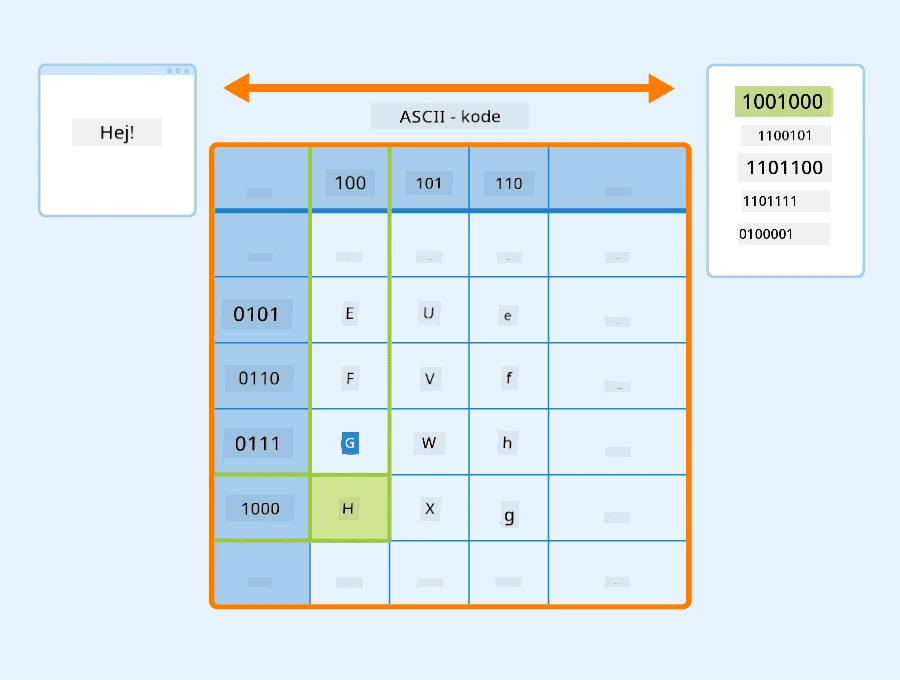
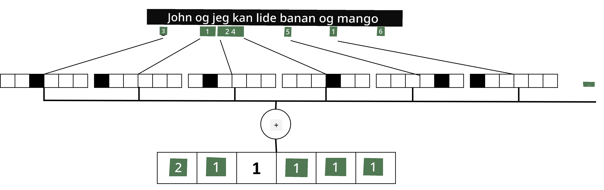

# Repræsentation af tekst som tensorer

## [Quiz før forelæsning](https://ff-quizzes.netlify.app/en/ai/quiz/25)

## Tekstklassifikation

I den første del af dette afsnit vil vi fokusere på opgaven **tekstklassifikation**. Vi vil bruge [AG News](https://www.kaggle.com/amananandrai/ag-news-classification-dataset)-datasættet, som indeholder nyhedsartikler som følgende:

* Kategori: Sci/Tech
* Titel: Ky. Firma vinder tilskud til at studere peptider (AP)
* Brødtekst: AP - Et firma grundlagt af en kemiforsker ved University of Louisville vandt et tilskud til at udvikle...

Vores mål vil være at klassificere nyhedsartiklen i en af kategorierne baseret på teksten.

## Repræsentation af tekst

Hvis vi vil løse opgaver inden for Natural Language Processing (NLP) med neurale netværk, skal vi finde en måde at repræsentere tekst som tensorer. Computere repræsenterer allerede teksttegn som tal, der kortlægges til skrifttyper på din skærm ved hjælp af kodninger som ASCII eller UTF-8.

> [Billedkilde](https://www.seobility.net/en/wiki/ASCII)

Som mennesker forstår vi, hvad hvert bogstav **repræsenterer**, og hvordan alle tegnene samles for at danne ordene i en sætning. Computere har dog ikke en sådan forståelse af sig selv, og det neurale netværk skal lære betydningen under træning.

Derfor kan vi bruge forskellige tilgange til at repræsentere tekst:

* **Tegnniveau-repræsentation**, hvor vi repræsenterer tekst ved at behandle hvert tegn som et tal. Givet at vi har *C* forskellige tegn i vores tekstkorpus, vil ordet *Hello* blive repræsenteret af en 5x*C* tensor. Hvert bogstav svarer til en tensorkolonne i one-hot encoding.
* **Ordniveau-repræsentation**, hvor vi opretter et **ordforråd** af alle ord i vores tekst og derefter repræsenterer ord ved hjælp af one-hot encoding. Denne tilgang er på en måde bedre, fordi hvert bogstav i sig selv ikke har meget betydning, og ved at bruge højere niveau semantiske begreber - ord - forenkler vi opgaven for det neurale netværk. Men på grund af den store ordbogsstørrelse skal vi håndtere højdimensionelle sparse tensorer.

Uanset repræsentationen skal vi først konvertere teksten til en sekvens af **tokens**, hvor en token enten er et tegn, et ord eller nogle gange endda en del af et ord. Derefter konverterer vi tokenen til et tal, typisk ved hjælp af **ordforråd**, og dette tal kan føres ind i et neuralt netværk ved hjælp af one-hot encoding.

## N-Grams

I naturligt sprog kan den præcise betydning af ord kun bestemmes i kontekst. For eksempel er betydningerne af *neural network* og *fishing network* helt forskellige. En af måderne at tage dette i betragtning er at bygge vores model på par af ord og betragte ordpar som separate tokens i ordforrådet. På denne måde vil sætningen *I like to go fishing* blive repræsenteret af følgende sekvens af tokens: *I like*, *like to*, *to go*, *go fishing*. Problemet med denne tilgang er, at ordbogsstørrelsen vokser betydeligt, og kombinationer som *go fishing* og *go shopping* præsenteres af forskellige tokens, som ikke deler nogen semantisk lighed på trods af det samme verbum.

I nogle tilfælde kan vi overveje at bruge tri-grams -- kombinationer af tre ord -- også. Derfor kaldes denne tilgang ofte **n-grams**. Det giver også mening at bruge n-grams med tegnniveau-repræsentation, hvor n-grams groft sagt svarer til forskellige stavelser.

## Bag-of-Words og TF/IDF

Når vi løser opgaver som tekstklassifikation, skal vi kunne repræsentere tekst med én vektor af fast størrelse, som vi vil bruge som input til den endelige tætte klassifikator. En af de enkleste måder at gøre dette på er at kombinere alle individuelle ordrepræsentationer, f.eks. ved at lægge dem sammen. Hvis vi lægger one-hot encodings af hvert ord sammen, ender vi med en vektor af frekvenser, der viser, hvor mange gange hvert ord optræder i teksten. En sådan repræsentation af tekst kaldes **bag of words** (BoW).

> Billede af forfatteren

En BoW repræsenterer i bund og grund, hvilke ord der optræder i teksten, og i hvilke mængder, hvilket kan være en god indikator for, hvad teksten handler om. For eksempel vil en nyhedsartikel om politik sandsynligvis indeholde ord som *præsident* og *land*, mens en videnskabelig publikation ville have noget som *collider*, *opdaget* osv. Så ordfrekvenser kan i mange tilfælde være en god indikator for tekstens indhold.

Problemet med BoW er, at visse almindelige ord, såsom *og*, *er* osv., optræder i de fleste tekster og har de højeste frekvenser, hvilket skygger for de ord, der virkelig er vigtige. Vi kan reducere betydningen af disse ord ved at tage højde for den frekvens, hvormed ord optræder i hele dokumentkollektionen. Dette er hovedideen bag TF/IDF-tilgangen, som er dækket mere detaljeret i de notebooks, der er knyttet til denne lektion.

Ingen af disse tilgange kan dog fuldt ud tage højde for tekstens **semantik**. Vi har brug for mere kraftfulde neurale netværksmodeller for at gøre dette, hvilket vi vil diskutere senere i dette afsnit.

## ✍️ Øvelser: Tekstrepræsentation

Fortsæt din læring i følgende notebooks:

* [Tekstrepræsentation med PyTorch](TextRepresentationPyTorch.ipynb)
* [Tekstrepræsentation med TensorFlow](TextRepresentationTF.ipynb)

## Konklusion

Indtil videre har vi studeret teknikker, der kan tilføje frekvensvægt til forskellige ord. De er dog ikke i stand til at repræsentere betydning eller rækkefølge. Som den berømte lingvist J. R. Firth sagde i 1935: "Den fulde betydning af et ord er altid kontekstuel, og ingen undersøgelse af betydning uden for kontekst kan tages seriøst." Senere i kurset vil vi lære, hvordan man fanger kontekstuel information fra tekst ved hjælp af sproglig modellering.

## 🚀 Udfordring

Prøv nogle andre øvelser med bag-of-words og forskellige datamodeller. Du kan finde inspiration i denne [konkurrence på Kaggle](https://www.kaggle.com/competitions/word2vec-nlp-tutorial/overview/part-1-for-beginners-bag-of-words)

## [Quiz efter forelæsning](https://ff-quizzes.netlify.app/en/ai/quiz/26)

## Gennemgang & Selvstudie

Øv dine færdigheder med tekstindlejring og bag-of-words-teknikker på [Microsoft Learn](https://docs.microsoft.com/learn/modules/intro-natural-language-processing-pytorch/?WT.mc_id=academic-77998-cacaste)

## [Opgave: Notebooks](assignment.md)

---

