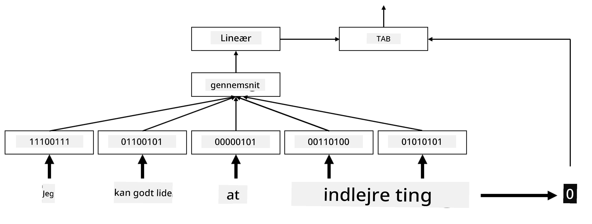

# Indlejring

## [Quiz før forelæsning](https://ff-quizzes.netlify.app/en/ai/quiz/27)

Når vi trænede klassifikatorer baseret på BoW eller TF/IDF, arbejdede vi med høj-dimensionelle bag-of-words vektorer med længden `vocab_size`, og vi konverterede eksplicit fra lav-dimensionelle positionsrepræsentationsvektorer til sparsomme one-hot repræsentationer. Denne one-hot repræsentation er dog ikke hukommelseseffektiv. Derudover behandles hvert ord uafhængigt af hinanden, dvs. one-hot kodede vektorer udtrykker ikke nogen semantisk lighed mellem ord.

Ideen med **indlejring** er at repræsentere ord med lav-dimensionelle tætte vektorer, som på en eller anden måde afspejler den semantiske betydning af et ord. Vi vil senere diskutere, hvordan man bygger meningsfulde ordindlejringer, men for nu kan vi blot tænke på indlejringer som en måde at reducere dimensionaliteten af en ordvektor.

Så indlejringslaget vil tage et ord som input og producere en outputvektor med en specificeret `embedding_size`. På en måde minder det meget om et `Linear` lag, men i stedet for at tage en one-hot kodet vektor, vil det kunne tage et ordnummer som input, hvilket gør det muligt at undgå at skabe store one-hot kodede vektorer.

Ved at bruge et indlejringslag som det første lag i vores klassifikationsnetværk kan vi skifte fra en bag-of-words til en **embedding bag** model, hvor vi først konverterer hvert ord i vores tekst til den tilsvarende indlejring og derefter beregner en aggregeringsfunktion over alle disse indlejringer, såsom `sum`, `average` eller `max`.

> Billede af forfatteren

## ✍️ Øvelser: Indlejringer

Fortsæt din læring i følgende notebooks:
* [Indlejringer med PyTorch](EmbeddingsPyTorch.ipynb)
* [Indlejringer med TensorFlow](EmbeddingsTF.ipynb)

## Semantiske indlejringer: Word2Vec

Mens indlejringslaget lærte at kortlægge ord til vektorrepræsentationer, havde denne repræsentation dog ikke nødvendigvis meget semantisk betydning. Det ville være rart at lære en vektorrepræsentation, hvor lignende ord eller synonymer svarer til vektorer, der er tæt på hinanden i forhold til en eller anden vektordistance (f.eks. Euklidisk distance).

For at gøre dette skal vi fortræne vores indlejringsmodel på en stor samling af tekst på en specifik måde. En metode til at træne semantiske indlejringer kaldes [Word2Vec](https://en.wikipedia.org/wiki/Word2vec). Det er baseret på to hovedarkitekturer, der bruges til at producere en distribueret repræsentation af ord:

 - **Continuous bag-of-words** (CBoW) — i denne arkitektur træner vi modellen til at forudsige et ord ud fra den omkringliggende kontekst. Givet ngrammet $(W_{-2},W_{-1},W_0,W_1,W_2)$ er målet for modellen at forudsige $W_0$ ud fra $(W_{-2},W_{-1},W_1,W_2)$.
 - **Continuous skip-gram** er det modsatte af CBoW. Modellen bruger det omkringliggende vindue af kontekstord til at forudsige det aktuelle ord.

CBoW er hurtigere, mens skip-gram er langsommere, men gør et bedre arbejde med at repræsentere sjældne ord.

> Billede fra [denne artikel](https://arxiv.org/pdf/1301.3781.pdf)

Fortrænede Word2Vec-indlejringer (såvel som andre lignende modeller, såsom GloVe) kan også bruges i stedet for indlejringslaget i neurale netværk. Vi skal dog håndtere ordforråd, fordi ordforrådet, der blev brugt til at fortræne Word2Vec/GloVe, sandsynligvis adskiller sig fra ordforrådet i vores tekstkorpus. Kig i de ovenstående notebooks for at se, hvordan dette problem kan løses.

## Kontekstuelle indlejringer

En vigtig begrænsning ved traditionelle fortrænede indlejringsrepræsentationer som Word2Vec er problemet med ords betydningsafklaring. Mens fortrænede indlejringer kan fange noget af betydningen af ord i kontekst, er hver mulig betydning af et ord kodet i den samme indlejring. Dette kan skabe problemer i efterfølgende modeller, da mange ord, såsom ordet 'play', har forskellige betydninger afhængigt af den kontekst, de bruges i.

For eksempel har ordet 'play' i disse to forskellige sætninger ret forskellige betydninger:

- Jeg gik til et **skuespil** på teatret.
- John vil gerne **lege** med sine venner.

De fortrænede indlejringer ovenfor repræsenterer begge disse betydninger af ordet 'play' i den samme indlejring. For at overvinde denne begrænsning skal vi bygge indlejringer baseret på **sproglaget**, som er trænet på en stor tekstkorpus og *ved*, hvordan ord kan sættes sammen i forskellige kontekster. Diskussionen om kontekstuelle indlejringer er uden for rammerne af denne tutorial, men vi vil vende tilbage til dem, når vi taler om sproglag senere i kurset.

## Konklusion

I denne lektion opdagede du, hvordan man bygger og bruger indlejringslag i TensorFlow og Pytorch for bedre at afspejle den semantiske betydning af ord.

## 🚀 Udfordring

Word2Vec er blevet brugt til nogle interessante anvendelser, herunder generering af sangtekster og poesi. Tag et kig på [denne artikel](https://www.politetype.com/blog/word2vec-color-poems), som gennemgår, hvordan forfatteren brugte Word2Vec til at generere poesi. Se også [denne video af Dan Shiffmann](https://www.youtube.com/watch?v=LSS_bos_TPI&ab_channel=TheCodingTrain) for at opdage en anden forklaring på denne teknik. Prøv derefter at anvende disse teknikker på din egen tekstkorpus, måske hentet fra Kaggle.

## [Quiz efter forelæsning](https://ff-quizzes.netlify.app/en/ai/quiz/28)

## Gennemgang & Selvstudie

Læs denne artikel om Word2Vec: [Efficient Estimation of Word Representations in Vector Space](https://arxiv.org/pdf/1301.3781.pdf)

## [Opgave: Notebooks](assignment.md)

---

