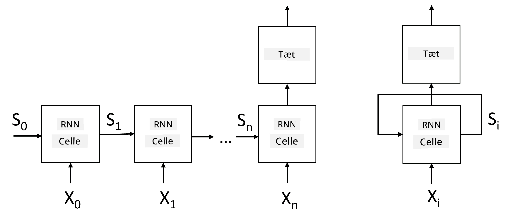

# Rekurrente Neurale Netværk

## [Quiz før forelæsning](https://ff-quizzes.netlify.app/en/ai/quiz/31)

I de tidligere afsnit har vi brugt rige semantiske repræsentationer af tekst og en simpel lineær klassifikator oven på embeddings. Denne arkitektur fanger den samlede betydning af ord i en sætning, men tager ikke højde for **rækkefølgen** af ord, da aggregeringsoperationen oven på embeddings fjerner denne information fra den oprindelige tekst. Fordi disse modeller ikke kan modellere ords rækkefølge, kan de ikke løse mere komplekse eller tvetydige opgaver som tekstgenerering eller spørgsmål-svar.

For at fange betydningen af tekstsekvenser skal vi bruge en anden neural netværksarkitektur, som kaldes et **rekurrent neuralt netværk**, eller RNN. I RNN sender vi vores sætning gennem netværket én symbol ad gangen, og netværket producerer en **tilstand**, som vi derefter sender tilbage til netværket sammen med det næste symbol.

> Billede af forfatteren

Givet inputsekvensen af tokens X0,...,Xn, skaber RNN en sekvens af neurale netværksblokke og træner denne sekvens end-to-end ved hjælp af backpropagation. Hver netværksblok tager et par (Xi,Si) som input og producerer Si+1 som resultat. Den endelige tilstand Sn eller (output Yn) sendes til en lineær klassifikator for at producere resultatet. Alle netværksblokke deler de samme vægte og trænes end-to-end med én backpropagation-pass.

Fordi tilstandsvektorerne S0,...,Sn sendes gennem netværket, er det i stand til at lære de sekventielle afhængigheder mellem ord. For eksempel, når ordet *ikke* optræder et sted i sekvensen, kan det lære at negere visse elementer inden for tilstandsvektoren, hvilket resulterer i negation.

> ✅ Da vægtene for alle RNN-blokke på billedet ovenfor er delt, kan det samme billede repræsenteres som én blok (til højre) med en rekurrent feedback-loop, der sender netværkets outputtilstand tilbage til input.

## Anatomi af en RNN-celle

Lad os se, hvordan en simpel RNN-celle er organiseret. Den accepterer den tidligere tilstand Si-1 og det aktuelle symbol Xi som input og skal producere outputtilstanden Si (og nogle gange er vi også interesserede i et andet output Yi, som i tilfældet med generative netværk).

En simpel RNN-celle har to vægtmatricer indeni: én transformerer et inputsymbol (lad os kalde den W), og en anden transformerer en inputtilstand (H). I dette tilfælde beregnes netværkets output som &sigma;(W&times;Xi+H&times;Si-1+b), hvor &sigma; er aktiveringsfunktionen, og b er en ekstra bias.

> Billede af forfatteren

I mange tilfælde sendes inputtokens gennem embedding-laget, før de går ind i RNN for at reducere dimensionaliteten. I dette tilfælde, hvis dimensionen af inputvektorerne er *emb_size*, og tilstandsvektoren er *hid_size* - er størrelsen af W *emb_size*&times;*hid_size*, og størrelsen af H er *hid_size*&times;*hid_size*.

## Long Short Term Memory (LSTM)

Et af de største problemer med klassiske RNN'er er det såkaldte **vanishing gradients**-problem. Fordi RNN'er trænes end-to-end i én backpropagation-pass, har de svært ved at propagere fejl til de første lag i netværket, og dermed kan netværket ikke lære relationer mellem fjerne tokens. En af måderne at undgå dette problem på er at introducere **eksplicit tilstandshåndtering** ved hjælp af såkaldte **gates**. Der er to velkendte arkitekturer af denne type: **Long Short Term Memory** (LSTM) og **Gated Relay Unit** (GRU).

> Billedkilde TBD

LSTM-netværket er organiseret på en måde, der ligner RNN, men der er to tilstande, der sendes fra lag til lag: den faktiske tilstand C og den skjulte vektor H. Ved hver enhed concateneres den skjulte vektor Hi med input Xi, og de styrer, hvad der sker med tilstanden C via **gates**. Hver gate er et neuralt netværk med sigmoid-aktivering (output i intervallet [0,1]), som kan betragtes som en bitmaske, når den multipliceres med tilstandsvektoren. Der er følgende gates (fra venstre til højre på billedet ovenfor):

* **Forget gate** tager en skjult vektor og bestemmer, hvilke komponenter af vektoren C vi skal glemme, og hvilke vi skal lade passere.
* **Input gate** tager noget information fra input- og skjulte vektorer og indsætter det i tilstanden.
* **Output gate** transformerer tilstanden via et lineært lag med *tanh*-aktivering og vælger derefter nogle af dens komponenter ved hjælp af en skjult vektor Hi for at producere en ny tilstand Ci+1.

Komponenterne i tilstanden C kan betragtes som nogle flag, der kan tændes og slukkes. For eksempel, når vi støder på navnet *Alice* i sekvensen, kan vi antage, at det refererer til en kvindelig karakter og sætte flaget i tilstanden, der angiver, at vi har et kvindeligt substantiv i sætningen. Når vi senere støder på sætningen *og Tom*, vil vi sætte flaget, der angiver, at vi har et flertal substantiv. Ved at manipulere tilstanden kan vi således holde styr på de grammatiske egenskaber ved sætningens dele.

> ✅ En fremragende ressource til at forstå LSTM's interne funktioner er denne fantastiske artikel [Understanding LSTM Networks](https://colah.github.io/posts/2015-08-Understanding-LSTMs/) af Christopher Olah.

## Bidirektionelle og flerlags RNN'er

Vi har diskuteret rekurrente netværk, der opererer i én retning, fra begyndelsen af en sekvens til slutningen. Det virker naturligt, fordi det minder om den måde, vi læser og lytter til tale. Men da vi i mange praktiske tilfælde har tilfældig adgang til inputsekvensen, kan det give mening at køre rekurrent beregning i begge retninger. Sådanne netværk kaldes **bidirektionelle** RNN'er. Når vi arbejder med et bidirektionelt netværk, har vi brug for to skjulte tilstandsvektorer, én for hver retning.

Et rekurrent netværk, enten én-retnings eller bidirektionelt, fanger visse mønstre inden for en sekvens og kan gemme dem i en tilstandsvektor eller sende dem til output. Ligesom med konvolutionelle netværk kan vi bygge et andet rekurrent lag oven på det første for at fange højere niveau mønstre og bygge videre på lav-niveau mønstre, der er udtrukket af det første lag. Dette fører os til begrebet **flerlags RNN**, som består af to eller flere rekurrente netværk, hvor output fra det foregående lag sendes til det næste lag som input.

*Billede fra [denne vidunderlige artikel](https://towardsdatascience.com/from-a-lstm-cell-to-a-multilayer-lstm-network-with-pytorch-2899eb5696f3) af Fernando López*

## ✍️ Øvelser: Embeddings

Fortsæt din læring i følgende notebooks:

* [RNN'er med PyTorch](RNNPyTorch.ipynb)
* [RNN'er med TensorFlow](RNNTF.ipynb)

## Konklusion

I denne enhed har vi set, at RNN'er kan bruges til sekvensklassifikation, men de kan faktisk håndtere mange flere opgaver, såsom tekstgenerering, maskinoversættelse og mere. Vi vil se nærmere på disse opgaver i den næste enhed.

## 🚀 Udfordring

Læs noget litteratur om LSTM'er og overvej deres anvendelser:

- [Grid Long Short-Term Memory](https://arxiv.org/pdf/1507.01526v1.pdf)
- [Show, Attend and Tell: Neural Image Caption
Generation with Visual Attention](https://arxiv.org/pdf/1502.03044v2.pdf)

## [Quiz efter forelæsning](https://ff-quizzes.netlify.app/en/ai/quiz/32)

## Gennemgang & Selvstudie

- [Understanding LSTM Networks](https://colah.github.io/posts/2015-08-Understanding-LSTMs/) af Christopher Olah.

## [Opgave: Notebooks](assignment.md)

---

