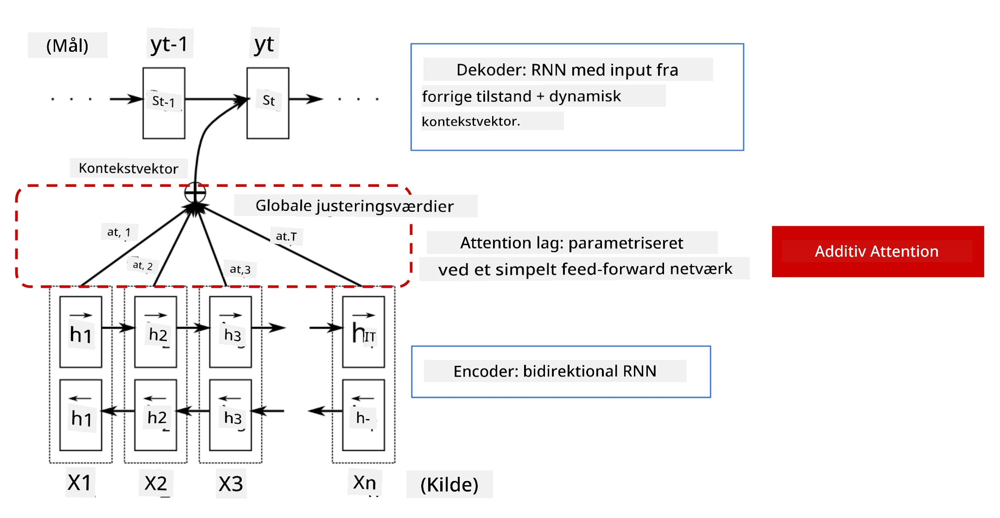
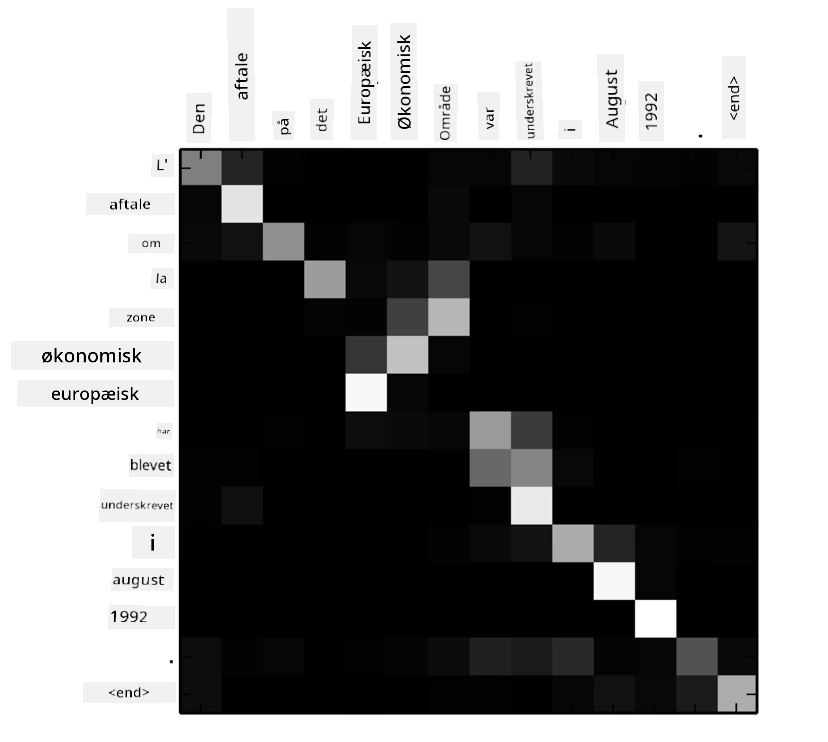
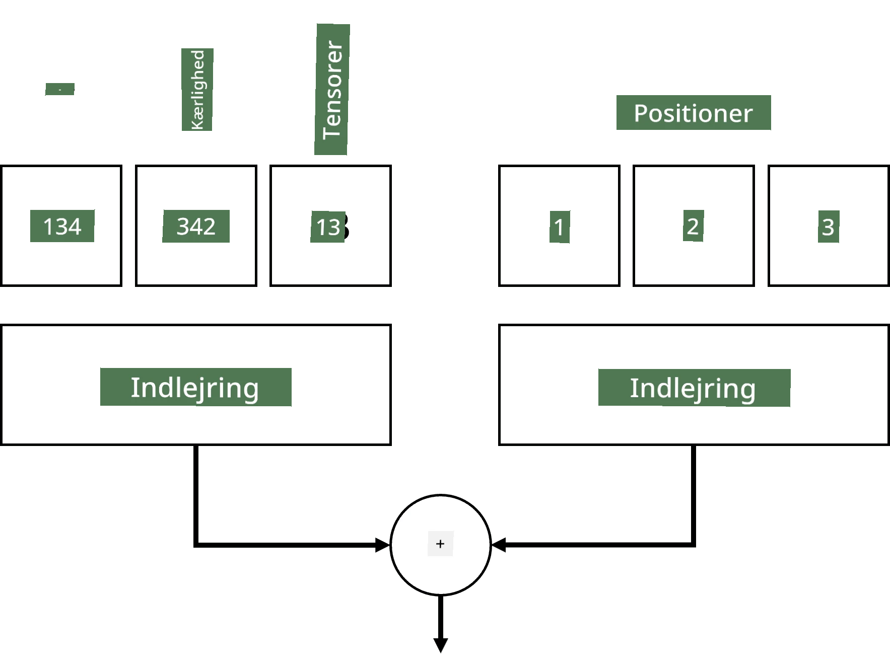
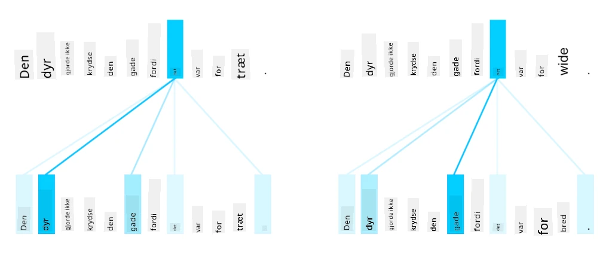
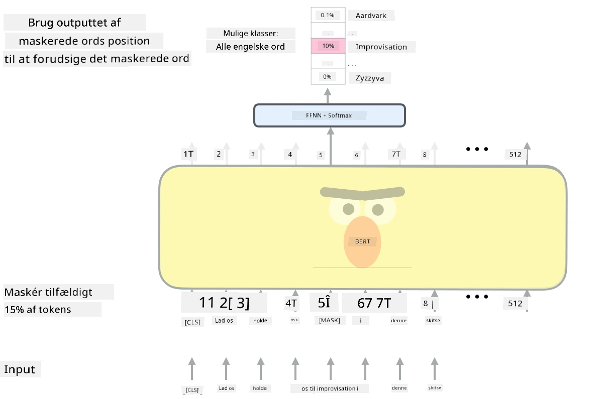

# Attention Mekanismer og Transformers

## [Pre-lecture quiz](https://ff-quizzes.netlify.app/en/ai/quiz/35)

Et af de vigtigste problemer inden for NLP er **maskinoversættelse**, en essentiel opgave, der ligger til grund for værktøjer som Google Translate. I denne sektion vil vi fokusere på maskinoversættelse, eller mere generelt på enhver *sekvens-til-sekvens* opgave (som også kaldes **sætningsomdannelse**).

Med RNN'er implementeres sekvens-til-sekvens med to rekurrente netværk, hvor det ene netværk, **encoder**, komprimerer en inputsekvens til en skjult tilstand, mens det andet netværk, **decoder**, udfolder denne skjulte tilstand til et oversat resultat. Der er dog nogle problemer med denne tilgang:

* Den endelige tilstand i encoder-netværket har svært ved at huske begyndelsen af en sætning, hvilket fører til dårlig modelkvalitet for lange sætninger.
* Alle ord i en sekvens har samme indflydelse på resultatet. I virkeligheden har specifikke ord i inputsekvensen ofte større indflydelse på sekventielle outputs end andre.

**Attention Mekanismer** giver en metode til at vægte den kontekstuelle indflydelse af hver inputvektor på hver outputforudsigelse i RNN. Dette implementeres ved at skabe genveje mellem de mellemliggende tilstande i input-RNN og output-RNN. På denne måde, når vi genererer outputsymbol yt, tager vi alle input skjulte tilstande hi i betragtning med forskellige vægtkoefficienter &alpha;t,i.

> Encoder-decoder modellen med additiv attention mekanisme i [Bahdanau et al., 2015](https://arxiv.org/pdf/1409.0473.pdf), citeret fra [denne blogpost](https://lilianweng.github.io/lil-log/2018/06/24/attention-attention.html)

Attention-matrixen {&alpha;i,j} repræsenterer graden af, hvor meget visse inputord spiller en rolle i genereringen af et givet ord i outputsekvensen. Nedenfor er et eksempel på en sådan matrix:

> Figur fra [Bahdanau et al., 2015](https://arxiv.org/pdf/1409.0473.pdf) (Fig.3)

Attention-mekanismer er ansvarlige for meget af den nuværende eller næsten nuværende state-of-the-art inden for NLP. Tilføjelse af attention øger dog kraftigt antallet af modelparametre, hvilket førte til skaleringsproblemer med RNN'er. En vigtig begrænsning ved skalering af RNN'er er, at modellernes rekursive natur gør det udfordrende at batch- og parallelisere træning. I en RNN skal hvert element i en sekvens behandles i sekventiel rækkefølge, hvilket betyder, at det ikke nemt kan paralleliseres.

> Figur fra [Googles Blog](https://research.googleblog.com/2016/09/a-neural-network-for-machine.html)

Adoptionen af attention-mekanismer kombineret med denne begrænsning førte til skabelsen af de nuværende state-of-the-art Transformer-modeller, som vi kender og bruger i dag, såsom BERT og Open-GPT3.

## Transformer-modeller

En af hovedidéerne bag transformers er at undgå den sekventielle natur af RNN'er og skabe en model, der kan paralleliseres under træning. Dette opnås ved at implementere to idéer:

* positionskodning
* brug af self-attention mekanisme til at fange mønstre i stedet for RNN'er (eller CNN'er) (det er derfor, papiret, der introducerer transformers, hedder *[Attention is all you need](https://arxiv.org/abs/1706.03762)*)

### Positionskodning/Embedding

Idéen med positionskodning er følgende:  
1. Når man bruger RNN'er, repræsenteres de relative positioner af tokens af antallet af trin og behøver derfor ikke at blive eksplicit repræsenteret.  
2. Når vi skifter til attention, skal vi dog kende de relative positioner af tokens inden for en sekvens.  
3. For at få positionskodning udvider vi vores sekvens af tokens med en sekvens af token-positioner i sekvensen (dvs. en sekvens af numre 0,1, ...).  
4. Vi blander derefter token-positionen med en token-embedding-vektor. For at transformere positionen (heltal) til en vektor kan vi bruge forskellige tilgange:

* Trænbar embedding, svarende til token-embedding. Dette er den tilgang, vi overvejer her. Vi anvender embedding-lag oven på både tokens og deres positioner, hvilket resulterer i embedding-vektorer af samme dimensioner, som vi derefter lægger sammen.
* Fast positionskodningsfunktion, som foreslået i det originale papir.

> Billede af forfatteren

Resultatet, vi får med positionskodning, embedder både det originale token og dets position inden for en sekvens.

### Multi-Head Self-Attention

Dernæst skal vi fange nogle mønstre inden for vores sekvens. For at gøre dette bruger transformers en **self-attention** mekanisme, som i bund og grund er attention anvendt på den samme sekvens som input og output. Ved at anvende self-attention kan vi tage **kontekst** inden for sætningen i betragtning og se, hvilke ord der er relaterede. For eksempel giver det os mulighed for at se, hvilke ord der refereres til af coreferencer, såsom *det*, og også tage konteksten i betragtning:

> Billede fra [Google Blog](https://research.googleblog.com/2017/08/transformer-novel-neural-network.html)

I transformers bruger vi **Multi-Head Attention** for at give netværket evnen til at fange flere forskellige typer afhængigheder, f.eks. langvarige vs. kortvarige ordrelationer, coreference vs. noget andet osv.

[TensorFlow Notebook](TransformersTF.ipynb) indeholder flere detaljer om implementeringen af transformer-lag.

### Encoder-Decoder Attention

I transformers bruges attention to steder:

* Til at fange mønstre inden for inputteksten ved hjælp af self-attention.
* Til at udføre sekvensoversættelse - det er attention-laget mellem encoder og decoder.

Encoder-decoder attention ligner meget den attention-mekanisme, der bruges i RNN'er, som beskrevet i begyndelsen af denne sektion. Denne animerede diagram forklarer rollen af encoder-decoder attention.

Da hver inputposition uafhængigt kortlægges til hver outputposition, kan transformers parallelisere bedre end RNN'er, hvilket muliggør meget større og mere udtryksfulde sprogmodeller. Hver attention-head kan bruges til at lære forskellige relationer mellem ord, hvilket forbedrer nedstrøms Natural Language Processing-opgaver.

## BERT

**BERT** (Bidirectional Encoder Representations from Transformers) er et meget stort multi-lags transformer-netværk med 12 lag for *BERT-base* og 24 for *BERT-large*. Modellen trænes først på en stor tekstkorpus (Wikipedia + bøger) ved hjælp af usuperviseret træning (forudsige maskerede ord i en sætning). Under pre-træning absorberer modellen betydelige niveauer af sprogforståelse, som derefter kan udnyttes med andre datasæt ved hjælp af finjustering. Denne proces kaldes **transfer learning**.

> Billede [kilde](http://jalammar.github.io/illustrated-bert/)

## ✍️ Øvelser: Transformers

Fortsæt din læring i følgende notebooks:

* [Transformers i PyTorch](TransformersPyTorch.ipynb)
* [Transformers i TensorFlow](TransformersTF.ipynb)

## Konklusion

I denne lektion lærte du om Transformers og Attention Mekanismer, alle essentielle værktøjer i NLP-værktøjskassen. Der findes mange variationer af Transformer-arkitekturer, herunder BERT, DistilBERT, BigBird, OpenGPT3 og flere, som kan finjusteres. [HuggingFace-pakken](https://github.com/huggingface/) tilbyder et repository til træning af mange af disse arkitekturer med både PyTorch og TensorFlow.

## 🚀 Udfordring

## [Post-lecture quiz](https://ff-quizzes.netlify.app/en/ai/quiz/36)

## Gennemgang & Selvstudie

* [Blogpost](https://mchromiak.github.io/articles/2017/Sep/12/Transformer-Attention-is-all-you-need/), der forklarer det klassiske [Attention is all you need](https://arxiv.org/abs/1706.03762)-papir om transformers.
* [En serie af blogposts](https://towardsdatascience.com/transformers-explained-visually-part-1-overview-of-functionality-95a6dd460452) om transformers, der forklarer arkitekturen i detaljer.

## [Opgave](assignment.md)

---

