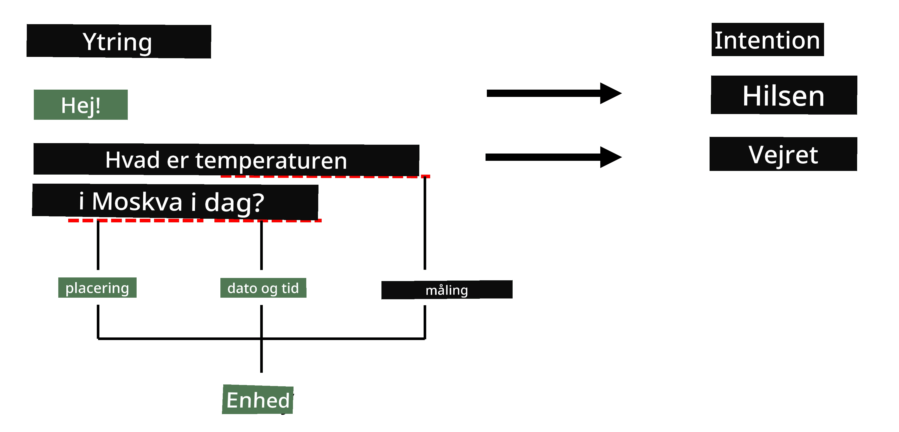

# Navngiven Enhedsgenkendelse

Indtil nu har vi primært fokuseret på én NLP-opgave - klassifikation. Men der findes også andre NLP-opgaver, som kan løses med neurale netværk. En af disse opgaver er **[Navngiven Enhedsgenkendelse](https://wikipedia.org/wiki/Named-entity_recognition)** (NER), som handler om at genkende specifikke enheder i tekst, såsom steder, personnavne, dato-tidsintervaller, kemiske formler og så videre.

## [Quiz før lektionen](https://ff-quizzes.netlify.app/en/ai/quiz/37)

## Eksempel på brug af NER

Forestil dig, at du vil udvikle en chatbot, der fungerer som Amazon Alexa eller Google Assistant. Intelligente chatbots arbejder ved at *forstå*, hvad brugeren ønsker, ved at udføre tekstklassifikation på den indtastede sætning. Resultatet af denne klassifikation kaldes **intent**, som afgør, hvad chatbotten skal gøre.

> Billede af forfatteren

Men en bruger kan også angive nogle parametre som en del af sætningen. For eksempel, når hun spørger om vejret, kan hun specificere en lokation eller dato. En bot skal kunne forstå disse enheder og udfylde parameterfelterne korrekt, før den udfører handlingen. Det er præcis her, NER kommer ind i billedet.

> ✅ Et andet eksempel kunne være [analyse af videnskabelige medicinske artikler](https://soshnikov.com/science/analyzing-medical-papers-with-azure-and-text-analytics-for-health/). En af de vigtigste ting, vi skal kigge efter, er specifikke medicinske termer, såsom sygdomme og medicinske stoffer. Mens et lille antal sygdomme sandsynligvis kan udtrækkes ved hjælp af substring-søgning, kræver mere komplekse enheder, såsom kemiske forbindelser og medicinnavne, en mere avanceret tilgang.

## NER som Tokenklassifikation

NER-modeller er i bund og grund **tokenklassifikationsmodeller**, fordi vi for hver af input-tokens skal afgøre, om den tilhører en enhed eller ej, og hvis den gør - hvilken enhedsklasse den tilhører.

Overvej følgende titel på en artikel:

**Tricuspidalklap-regurgitation** og **lithiumcarbonat** **toksicitet** hos et nyfødt spædbarn.

Enhederne her er:

* Tricuspidalklap-regurgitation er en sygdom (`DIS`)
* Lithiumcarbonat er et kemisk stof (`CHEM`)
* Toksicitet er også en sygdom (`DIS`)

Bemærk, at én enhed kan strække sig over flere tokens. Og som i dette tilfælde skal vi skelne mellem to på hinanden følgende enheder. Derfor er det almindeligt at bruge to klasser for hver enhed - én, der angiver det første token i enheden (ofte bruges præfikset `B-` for **b**egyndelse), og en anden for fortsættelsen af en enhed (`I-`, for **i**ndre token). Vi bruger også `O` som en klasse til at repræsentere alle **o**vrige tokens. Denne form for tokenmærkning kaldes [BIO-mærkning](https://en.wikipedia.org/wiki/Inside%E2%80%93outside%E2%80%93beginning_(tagging)) (eller IOB). Når det er mærket, vil vores titel se sådan ud:

Token | Tag
------|-----
Tricuspidalklap | B-DIS
regurgitation | I-DIS
og | O
lithium | B-CHEM
carbonat | I-CHEM
toksicitet | B-DIS
hos | O
et | O
nyfødt | O
spædbarn | O
. | O

Da vi skal opbygge en én-til-én-korrespondance mellem tokens og klasser, kan vi træne en højreorienteret **mange-til-mange** neuralt netværksmodel fra dette billede:

> *Billede fra [denne blogpost](http://karpathy.github.io/2015/05/21/rnn-effectiveness/) af [Andrej Karpathy](http://karpathy.github.io/). NER-tokenklassifikationsmodeller svarer til den højreorienterede netværksarkitektur på dette billede.*

## Træning af NER-modeller

Da en NER-model i bund og grund er en tokenklassifikationsmodel, kan vi bruge RNN'er, som vi allerede er bekendt med, til denne opgave. I dette tilfælde vil hver blok af det rekurrente netværk returnere token-ID'et. Den følgende eksempel-notebook viser, hvordan man træner LSTM til tokenklassifikation.

## ✍️ Eksempel-notebooks: NER

Fortsæt din læring i den følgende notebook:

* [NER med TensorFlow](NER-TF.ipynb)

## Konklusion

En NER-model er en **tokenklassifikationsmodel**, hvilket betyder, at den kan bruges til at udføre tokenklassifikation. Dette er en meget almindelig opgave inden for NLP, som hjælper med at genkende specifikke enheder i tekst, herunder steder, navne, datoer og mere.

## 🚀 Udfordring

Fuldfør opgaven, der er linket nedenfor, for at træne en model til navngiven enhedsgenkendelse af medicinske termer, og prøv den derefter på et andet datasæt.

## [Quiz efter lektionen](https://ff-quizzes.netlify.app/en/ai/quiz/38)

## Gennemgang & Selvstudie

Læs blogindlægget [The Unreasonable Effectiveness of Recurrent Neural Networks](http://karpathy.github.io/2015/05/21/rnn-effectiveness/) og følg med i afsnittet om yderligere læsning i den artikel for at uddybe din viden.

## [Opgave](lab/README.md)

I opgaven for denne lektion skal du træne en model til genkendelse af medicinske enheder. Du kan starte med at træne en LSTM-model som beskrevet i denne lektion og derefter fortsætte med at bruge BERT-transformermodel. Læs [instruktionerne](lab/README.md) for at få alle detaljer.

---

