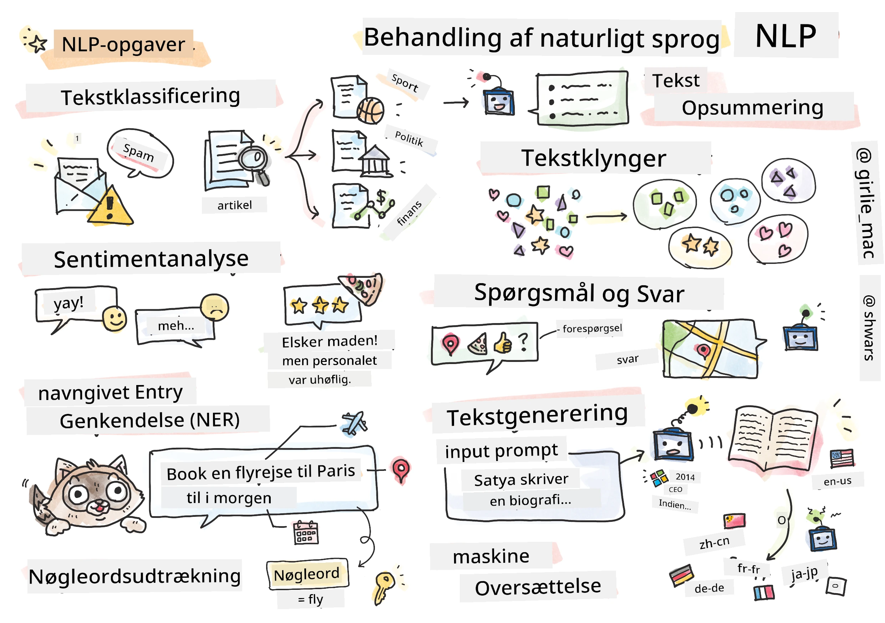

# Naturlig Sprogbearbejdning



I denne sektion vil vi fokusere på at bruge Neurale Netværk til at håndtere opgaver relateret til **Naturlig Sprogbearbejdning (NLP)**. Der er mange NLP-problemer, som vi ønsker, at computere skal kunne løse:

* **Tekstklassifikation** er et typisk klassifikationsproblem vedrørende tekstsekvenser. Eksempler inkluderer klassificering af e-mails som spam vs. ikke-spam eller kategorisering af artikler som sport, erhverv, politik osv. Også når vi udvikler chatbots, har vi ofte behov for at forstå, hvad en bruger ønskede at sige – i dette tilfælde arbejder vi med **intentionklassifikation**. Ofte er der i intentionklassifikation mange kategorier.
* **Følelsesanalyse** er et typisk regressionsproblem, hvor vi skal tildele et tal (en følelse) svarende til, hvor positiv/negativ meningen med en sætning er. En mere avanceret version af følelsesanalyse er **aspektbaseret følelsesanalyse** (ABSA), hvor vi tilskriver følelser ikke til hele sætningen, men til forskellige dele af den (aspekter), fx *På denne restaurant kunne jeg lide køkkenet, men atmosfæren var forfærdelig*.
* **Navngiven Entitetsgenkendelse** (NER) henviser til problemet med at udtrække bestemte enheder fra tekst. For eksempel skal vi måske forstå, at i sætningen *Jeg skal flyve til Paris i morgen* henviser ordet *i morgen* til DATO, og *Paris* er en LOKATION.  
* **Nøgleordsudtrækning** minder om NER, men vi skal automatisk udtrække ord, der er vigtige for meningen i sætningen, uden forudgående træning for specifikke entitetstyper.
* **Tekstklyngedannelse** kan være nyttigt, når vi vil gruppere lignende sætninger sammen, for eksempel lignende forespørgsler i teknisk support-samtaler.
* **Spørgsmålsbesvarelse** refererer til en models evne til at svare på et specifikt spørgsmål. Modellen modtager et tekstuddrag og et spørgsmål som input, og den skal angive et sted i teksten, hvor svaret på spørgsmålet findes (eller nogle gange generere svaret i tekst).
* **Tekstgenerering** er en models evne til at generere ny tekst. Det kan betragtes som en klassifikationsopgave, der forudsiger næste bogstav/ord baseret på en *tekstprompt*. Avancerede tekstgenereringsmodeller, som GPT-3, kan løse andre NLP-opgaver såsom klassifikation ved hjælp af en teknik kaldet [prompt programming](https://towardsdatascience.com/software-3-0-how-prompting-will-change-the-rules-of-the-game-a982fbfe1e0) eller [prompt engineering](https://medium.com/swlh/openai-gpt-3-and-prompt-engineering-dcdc2c5fcd29)
* **Tekstopsummering** er en teknik, hvor vi ønsker, at en computer "læser" lang tekst og sammenfatter den i et par sætninger.
* **Maskinoversættelse** kan ses som en kombination af tekstforståelse på et sprog og tekstgenerering på et andet.

Oprindeligt blev de fleste NLP-opgaver løst ved hjælp af traditionelle metoder såsom grammatikker. For eksempel blev parsere brugt i maskinoversættelse til at omdanne den oprindelige sætning til et syntakstræ, derefter blev højere niveau semantiske strukturer udtrukket for at repræsentere sætningens betydning, og baseret på denne betydning og målsprogets grammatik blev resultatet genereret. I dag bliver mange NLP-opgaver mere effektivt løst ved hjælp af neurale netværk.

> Mange klassiske NLP-metoder er implementeret i [Natural Language Processing Toolkit (NLTK)](https://www.nltk.org) Python-bibliotek. Der findes en fremragende [NLTK-bog](https://www.nltk.org/book/) online, som dækker, hvordan forskellige NLP-opgaver kan løses ved hjælp af NLTK.

I vores kursus vil vi primært fokusere på brugen af neurale netværk til NLP, og vi vil bruge NLTK hvor det er nødvendigt.

Vi har allerede lært om brug af neurale netværk til at håndtere tabeldata og billeder. Den største forskel mellem disse datatyper og tekst er, at tekst er en sekvens med variabel længde, mens inputstørrelsen i tilfælde af billeder er kendt på forhånd. Mens konvolutionsnetværk kan udtrække mønstre fra inputdata, er mønstrene i tekst mere komplekse. Fx kan negation være adskilt fra subjektet med et vilkårligt antal ord (fx *Jeg kan ikke lide appelsiner* vs. *Jeg kan ikke lide de store farverige lækre appelsiner*), og det skal stadig fortolkes som ét mønster. Derfor skal vi for at håndtere sprog introducere nye typer neurale netværk, såsom *recurrent networks* og *transformers*.

## Installer Biblioteker

Hvis du bruger en lokal Python-installation til at køre dette kursus, kan du have behov for at installere alle nødvendige biblioteker til NLP ved hjælp af følgende kommandoer:

**For PyTorch**
```bash
pip install -r requirements-pytorch.txt
```
**For TensorFlow**
```bash
pip install -r requirements-tf.txt
```

> Du kan prøve NLP med TensorFlow på [Microsoft Learn](https://docs.microsoft.com/learn/modules/intro-natural-language-processing-tensorflow/?WT.mc_id=academic-77998-cacaste)

## GPU-advarsel

I denne sektion vil vi i nogle af eksemplerne træne ret store modeller.
* **Brug en computer med GPU**: Det anbefales at køre dine notebooks på en computer med GPU for at reducere ventetider, når du arbejder med store modeller.
* **Begrænsninger i GPU-hukommelsen**: Kørsel på en GPU kan føre til situationer, hvor du løber tør for GPU-hukommelse, især ved træning af store modeller.
* **GPU-hukommelsesforbrug**: Mængden af GPU-hukommelse, der forbruges under træning, afhænger af forskellige faktorer, inklusive minibatch-størrelse.
* **Minimer minibatch-størrelse**: Hvis du oplever problemer med GPU-hukommelsen, kan du overveje at reducere minibatch-størrelsen i din kode som en mulig løsning.
* **TensorFlow GPU-hukommelsesfrigivelse**: Ældre versioner af TensorFlow frigiver muligvis ikke GPU-hukommelse korrekt, når flere modeller trænes inden for én Python-kerne. For at håndtere GPU-hukommelsesforbrug effektivt kan du konfigurere TensorFlow til kun at allokere GPU-hukommelse efter behov.
* **Kodeinklusion**: For at sætte TensorFlow til at øge GPU-hukommelsesallokering kun efter behov, inkluder følgende kode i dine notebooks:

```python
physical_devices = tf.config.list_physical_devices('GPU') 
if len(physical_devices)>0:
    tf.config.experimental.set_memory_growth(physical_devices[0], True) 
```

Hvis du er interesseret i at lære om NLP fra et klassisk ML-perspektiv, besøg [dette sæt af lektioner](https://github.com/microsoft/ML-For-Beginners/tree/main/6-NLP)

## I denne sektion
I denne sektion vil vi lære om:

* [At repræsentere tekst som tensors](13-TextRep/README.md)
* [Word Embeddings](14-Embeddings/README.md)
* [Sprogsmodellering](15-LanguageModeling/README.md)
* [Recurrent Neural Networks](16-RNN/README.md)
* [Generative Networks](17-GenerativeNetworks/README.md)
* [Transformers](18-Transformers/README.md)

---

<!-- CO-OP TRANSLATOR DISCLAIMER START -->
**Ansvarsfraskrivelse**:
Dette dokument er blevet oversat ved hjælp af AI-oversættelsestjenesten [Co-op Translator](https://github.com/Azure/co-op-translator). Selvom vi bestræber os på nøjagtighed, skal du være opmærksom på, at automatiserede oversættelser kan indeholde fejl eller unøjagtigheder. Det originale dokument på dets oprindelige sprog bør betragtes som den autoritative kilde. For kritisk information anbefales professionel menneskelig oversættelse. Vi påtager os intet ansvar for misforståelser eller fejltolkninger, der opstår som følge af brugen af denne oversættelse.
<!-- CO-OP TRANSLATOR DISCLAIMER END -->