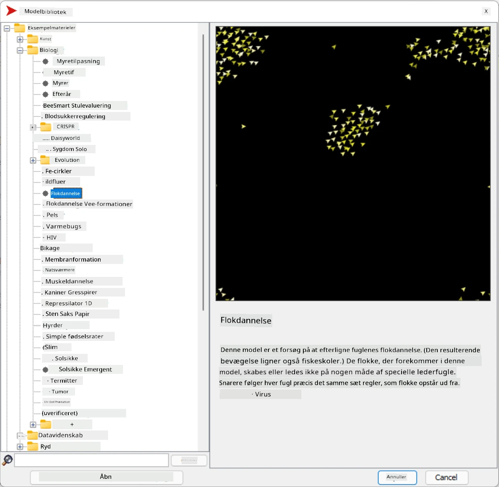
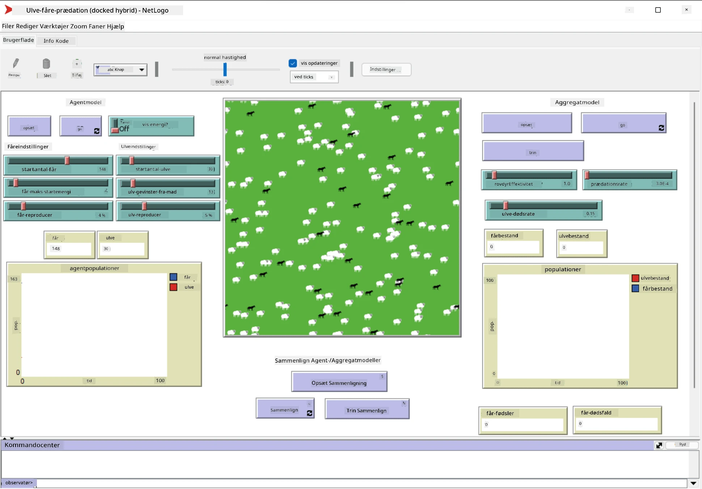

# Multi-Agent Systemer

En af de mulige måder at opnå intelligens på er den såkaldte **emergente** (eller **synergetiske**) tilgang, som er baseret på, at den samlede adfærd af mange relativt simple agenter kan resultere i en mere kompleks (eller intelligent) adfærd for systemet som helhed. Teoretisk set bygger dette på principperne om [Kollektiv Intelligens](https://en.wikipedia.org/wiki/Collective_intelligence), [Emergentisme](https://en.wikipedia.org/wiki/Global_brain) og [Evolutionær Kybernetik](https://en.wikipedia.org/wiki/Global_brain), som siger, at højere niveau-systemer opnår en form for merværdi, når de korrekt kombineres fra lavere niveau-systemer (det såkaldte *princip om metasystem-transition*).

## [Quiz før forelæsning](https://ff-quizzes.netlify.app/en/ai/quiz/45)

Retningen **Multi-Agent Systemer** opstod inden for AI i 1990'erne som en reaktion på væksten af internettet og distribuerede systemer. En af de klassiske AI-lærebøger, [Artificial Intelligence: A Modern Approach](https://en.wikipedia.org/wiki/Artificial_Intelligence:_A_Modern_Approach), fokuserer på klassisk AI set fra perspektivet af multi-agent systemer.

Centralt for multi-agent tilgangen er begrebet **Agent** - en enhed, der lever i et **miljø**, som den kan opfatte og handle på. Dette er en meget bred definition, og der kan være mange forskellige typer og klassifikationer af agenter:

* Efter deres evne til at ræsonnere:
   - **Reaktive** agenter har typisk en simpel anmodning-svar adfærd
   - **Deliberative** agenter anvender en form for logisk ræsonnement og/eller planlægningskapaciteter
* Efter stedet, hvor agentens kode eksekveres:
   - **Statiske** agenter arbejder på en dedikeret netværksnode
   - **Mobile** agenter kan flytte deres kode mellem netværksnoder
* Efter deres adfærd:
   - **Passive agenter** har ingen specifikke mål. Sådanne agenter kan reagere på eksterne stimuli, men vil ikke selv initiere handlinger.
   - **Aktive agenter** har nogle mål, som de forfølger
   - **Kognitive agenter** involverer kompleks planlægning og ræsonnement

Multi-agent systemer anvendes i dag i en række applikationer:

* I spil bruger mange ikke-spiller karakterer en form for AI og kan betragtes som intelligente agenter
* I videoproduktion udføres rendering af komplekse 3D-scener, der involverer folkemængder, typisk ved hjælp af multi-agent simulering
* I systemmodellering anvendes multi-agent tilgangen til at simulere adfærden af en kompleks model. For eksempel er multi-agent tilgangen blevet brugt med succes til at forudsige spredningen af COVID-19 globalt. En lignende tilgang kan bruges til at modellere trafik i en by og se, hvordan den reagerer på ændringer i trafikregler.
* I komplekse automatiseringssystemer kan hver enhed fungere som en uafhængig agent, hvilket gør hele systemet mindre monolitisk og mere robust.

Vi vil ikke bruge meget tid på at gå dybt ind i multi-agent systemer, men overveje et eksempel på **Multi-Agent Modellering**.

## NetLogo

[NetLogo](https://ccl.northwestern.edu/netlogo/) er et multi-agent modelleringsmiljø baseret på en modificeret version af programmeringssproget [Logo](https://en.wikipedia.org/wiki/Logo_(programming_language)). Dette sprog blev udviklet til at lære børn programmeringskoncepter og giver dig mulighed for at kontrollere en agent kaldet **turtle**, som kan bevæge sig og efterlade spor. Dette gør det muligt at skabe komplekse geometriske figurer, hvilket er en meget visuel måde at forstå en agents adfærd på.

I NetLogo kan vi oprette mange turtles ved hjælp af kommandoen `create-turtles`. Vi kan derefter få alle turtles til at udføre nogle handlinger (i eksemplet nedenfor - bevæge sig 10 punkter fremad):

```
create-turtles 10
ask turtles [
  forward 10
]
```

Selvfølgelig er det ikke interessant, når alle turtles gør det samme, så vi kan `ask` grupper af turtles, f.eks. dem, der befinder sig i nærheden af et bestemt punkt. Vi kan også oprette turtles af forskellige *breeds* ved hjælp af kommandoen `breed [cats cat]`. Her er `cat` navnet på en breed, og vi skal angive både ental og flertal, fordi forskellige kommandoer bruger forskellige former for klarhed.

> ✅ Vi vil ikke gå ind i at lære NetLogo-sproget i sig selv - du kan besøge den fremragende [Beginner's Interactive NetLogo Dictionary](https://ccl.northwestern.edu/netlogo/bind/) ressource, hvis du er interesseret i at lære mere.

Du kan [downloade](https://ccl.northwestern.edu/netlogo/download.shtml) og installere NetLogo for at prøve det.

### Modelbibliotek

En fantastisk ting ved NetLogo er, at det indeholder et bibliotek med fungerende modeller, som du kan prøve. Gå til **File &rightarrow; Models Library**, og du har mange kategorier af modeller at vælge imellem.



> Et skærmbillede af modelbiblioteket af Dmitry Soshnikov

Du kan åbne en af modellerne, for eksempel **Biology &rightarrow; Flocking**.

### Hovedprincipper

Efter åbning af modellen kommer du til NetLogos hovedskærm. Her er en eksempelmodel, der beskriver populationen af ulve og får, givet begrænsede ressourcer (græs).



> Skærmbillede af Dmitry Soshnikov

På denne skærm kan du se:

* **Interface**-sektionen, som indeholder:
  - Hovedfeltet, hvor alle agenter lever
  - Forskellige kontroller: knapper, skydeknapper osv.
  - Grafer, som du kan bruge til at vise parametre for simuleringen
* **Code**-fanen, som indeholder editoren, hvor du kan skrive NetLogo-programmet

I de fleste tilfælde vil interfacet have en **Setup**-knap, som initialiserer simuleringsstatus, og en **Go**-knap, der starter eksekveringen. Disse håndteres af tilsvarende handlers i koden, der ser sådan ud:

```
to go [
...
]
```

NetLogos verden består af følgende objekter:

* **Agenter** (turtles), der kan bevæge sig på tværs af feltet og udføre handlinger. Du kan give agenter kommandoer ved hjælp af syntaksen `ask turtles [...]`, og koden i parentes udføres af alle agenter i *turtle mode*.
* **Patches** er kvadratiske områder af feltet, hvor agenter lever. Du kan referere til alle agenter på samme patch, eller du kan ændre patch-farver og nogle andre egenskaber. Du kan også `ask patches` om at udføre handlinger.
* **Observer** er en unik agent, der kontrollerer verden. Alle knaphandlers udføres i *observer mode*.

> ✅ Skønheden ved et multi-agent miljø er, at koden, der kører i turtle mode eller patch mode, udføres samtidig af alle agenter parallelt. Således kan du ved at skrive lidt kode og programmere adfærden af en individuel agent skabe kompleks adfærd for simuleringssystemet som helhed.

### Flocking

Som et eksempel på multi-agent adfærd kan vi overveje **[Flocking](https://en.wikipedia.org/wiki/Flocking_(behavior))**. Flocking er et komplekst mønster, der minder meget om, hvordan fugleflokke flyver. Når man ser dem flyve, kan man tro, at de følger en form for kollektiv algoritme, eller at de besidder en form for *kollektiv intelligens*. Men denne komplekse adfærd opstår, når hver individuel agent (i dette tilfælde en *fugl*) kun observerer nogle andre agenter inden for en kort afstand og følger tre simple regler:

* **Alignment** - den styrer mod den gennemsnitlige retning af nærliggende agenter
* **Cohesion** - den forsøger at styre mod den gennemsnitlige position af naboer (*langdistance tiltrækning*)
* **Separation** - når den kommer for tæt på andre fugle, forsøger den at bevæge sig væk (*kortdistance frastødning*)

Du kan køre flocking-eksemplet og observere adfærden. Du kan også justere parametre, såsom *grad af separation* eller *synsvidde*, som definerer, hvor langt hver fugl kan se. Bemærk, at hvis du reducerer synsvidden til 0, bliver alle fugle blinde, og flocking stopper. Hvis du reducerer separation til 0, samles alle fugle i en lige linje.

> ✅ Skift til **Code**-fanen og se, hvor de tre regler for flocking (alignment, cohesion og separation) er implementeret i koden. Bemærk, hvordan vi kun refererer til de agenter, der er inden for synsvidde.

### Andre modeller at udforske

Der er nogle flere interessante modeller, som du kan eksperimentere med:

* **Art &rightarrow; Fireworks** viser, hvordan et fyrværkeri kan betragtes som en kollektiv adfærd af individuelle ildstrømme
* **Social Science &rightarrow; Traffic Basic** og **Social Science &rightarrow; Traffic Grid** viser en model af bytrafik i 1D og 2D Grid med eller uden trafiklys. Hver bil i simuleringen følger følgende regler:
   - Hvis pladsen foran er tom - accelerer (op til en vis maksimal hastighed)
   - Hvis den ser en forhindring foran - brems (og du kan justere, hvor langt en chauffør kan se)
* **Social Science &rightarrow; Party** viser, hvordan folk grupperer sig under en cocktailfest. Du kan finde kombinationen af parametre, der fører til den hurtigste stigning i gruppens lykke.

Som du kan se fra disse eksempler, kan multi-agent simuleringer være en nyttig måde at forstå adfærden af et komplekst system bestående af individer, der følger den samme eller lignende logik. Det kan også bruges til at kontrollere virtuelle agenter, såsom [NPC'er](https://en.wikipedia.org/wiki/NPC) i computerspil eller agenter i 3D-animerede verdener.

## Deliberative Agenter

De agenter, der er beskrevet ovenfor, er meget simple og reagerer på ændringer i miljøet ved hjælp af en form for algoritme. Som sådan er de **reaktive agenter**. Men nogle gange kan agenter ræsonnere og planlægge deres handlinger, i hvilket tilfælde de kaldes **deliberative**.

Et typisk eksempel kunne være en personlig agent, der modtager en instruktion fra et menneske om at booke en ferie. Antag, at der er mange agenter på internettet, som kan hjælpe den. Den skal derefter kontakte andre agenter for at se, hvilke fly der er tilgængelige, hvad hotelpriserne er for forskellige datoer, og forsøge at forhandle den bedste pris. Når ferieplanen er færdig og bekræftet af ejeren, kan den fortsætte med bookingen.

For at gøre dette skal agenter **kommunikere**. For at kommunikationen skal lykkes, har de brug for:

* Nogle **standardiserede sprog til at udveksle viden**, såsom [Knowledge Interchange Format](https://en.wikipedia.org/wiki/Knowledge_Interchange_Format) (KIF) og [Knowledge Query and Manipulation Language](https://en.wikipedia.org/wiki/Knowledge_Query_and_Manipulation_Language) (KQML). Disse sprog er designet baseret på [Speech Act Theory](https://en.wikipedia.org/wiki/Speech_act).
* Disse sprog bør også inkludere nogle **protokoller til forhandlinger**, baseret på forskellige **auktionstyper**.
* En **fælles ontologi** at bruge, så de refererer til de samme begreber og kender deres semantik
* En måde at **opdage**, hvad forskellige agenter kan gøre, også baseret på en form for ontologi

Deliberative agenter er meget mere komplekse end reaktive, fordi de ikke kun reagerer på ændringer i miljøet, men også skal kunne *initiere* handlinger. En af de foreslåede arkitekturer for deliberative agenter er den såkaldte Belief-Desire-Intention (BDI) agent:

* **Beliefs** udgør et sæt viden om agentens miljø. Det kan struktureres som en vidensbase eller et sæt regler, som en agent kan anvende på en specifik situation i miljøet.
* **Desires** definerer, hvad en agent ønsker at gøre, dvs. dens mål. For eksempel er målet for den personlige assistent-agent ovenfor at booke en ferie, og målet for en hotel-agent er at maksimere profit.
* **Intentions** er specifikke handlinger, som en agent planlægger for at opnå sine mål. Handlinger ændrer typisk miljøet og forårsager kommunikation med andre agenter.

Der findes nogle platforme til at bygge multi-agent systemer, såsom [JADE](https://jade.tilab.com/). [Denne artikel](https://arxiv.org/ftp/arxiv/papers/2007/2007.08961.pdf) indeholder en gennemgang af multi-agent platforme sammen med en kort historie om multi-agent systemer og deres forskellige anvendelsesscenarier.

## Konklusion

Multi-agent systemer kan tage mange forskellige former og bruges i mange forskellige applikationer. 
De fokuserer alle på den enklere adfærd af en individuel agent og opnår mere kompleks adfærd for det samlede system på grund af **synergetisk effekt**.

## 🚀 Udfordring

Tag denne lektion til den virkelige verden og prøv at konceptualisere et multi-agent system, der kan løse et problem. Hvad skulle et multi-agent system for eksempel gøre for at optimere en skolebusrute? Hvordan kunne det fungere i et bageri?

## [Quiz efter forelæsning](https://ff-quizzes.netlify.app/en/ai/quiz/46)

## Gennemgang & Selvstudie

Undersøg brugen af denne type systemer i industrien. Vælg et domæne, såsom fremstilling eller videospilindustrien, og opdag, hvordan multi-agent systemer kan bruges til at løse unikke problemer.

## [NetLogo Opgave](assignment.md)

---

