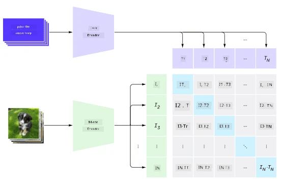

# Multi-Modal Netværk

Efter succesen med transformer-modeller til løsning af NLP-opgaver, er de samme eller lignende arkitekturer blevet anvendt til computer vision-opgaver. Der er en stigende interesse i at bygge modeller, der kan *kombinere* vision og naturlige sprogfunktioner. En af disse forsøg blev gjort af OpenAI, og det kaldes CLIP og DALL.E.

## Contrastive Image Pre-Training (CLIP)

Hovedideen med CLIP er at kunne sammenligne tekstprompter med et billede og afgøre, hvor godt billedet svarer til prompten.

> *Billede fra [denne blogpost](https://openai.com/blog/clip/)*

Modellen er trænet på billeder hentet fra internettet og deres billedtekster. For hver batch tager vi N par af (billede, tekst) og konverterer dem til nogle vektorrepræsentationer I, ..., I / T, ..., T. Disse repræsentationer matches derefter sammen. Tab-funktionen er defineret til at maksimere cosinus-similariteten mellem vektorer, der svarer til ét par (f.eks. I og T), og minimere cosinus-similariteten mellem alle andre par. Det er grunden til, at denne tilgang kaldes **contrastive**.

CLIP-model/bibliotek er tilgængelig fra [OpenAI GitHub](https://github.com/openai/CLIP). Tilgangen er beskrevet i [denne blogpost](https://openai.com/blog/clip/) og mere detaljeret i [denne artikel](https://arxiv.org/pdf/2103.00020.pdf).

Når denne model er fortrænet, kan vi give den en batch af billeder og en batch af tekstprompter, og den vil returnere en tensor med sandsynligheder. CLIP kan bruges til flere opgaver:

**Billedklassifikation**

Antag, at vi skal klassificere billeder mellem f.eks. katte, hunde og mennesker. I dette tilfælde kan vi give modellen et billede og en række tekstprompter: "*et billede af en kat*", "*et billede af en hund*", "*et billede af et menneske*". I den resulterende vektor med 3 sandsynligheder skal vi blot vælge det indeks med den højeste værdi.

> *Billede fra [denne blogpost](https://openai.com/blog/clip/)*

**Tekstbaseret Billedsøgning**

Vi kan også gøre det modsatte. Hvis vi har en samling af billeder, kan vi give denne samling til modellen og en tekstprompt - dette vil give os det billede, der er mest lig den givne prompt.

## ✍️ Eksempel: [Brug af CLIP til Billedklassifikation og Billedsøgning](Clip.ipynb)

Åbn [Clip.ipynb](Clip.ipynb) notebook for at se CLIP i aktion.

## Billedgenerering med VQGAN+CLIP

CLIP kan også bruges til **billedgenerering** fra en tekstprompt. For at gøre dette har vi brug for en **generator-model**, der kan generere billeder baseret på nogle vektorinput. En af disse modeller kaldes [VQGAN](https://compvis.github.io/taming-transformers/) (Vector-Quantized GAN).

Hovedideerne med VQGAN, der adskiller den fra almindelige [GAN](../../4-ComputerVision/10-GANs/README.md), er følgende:
* Brug af autoregressiv transformer-arkitektur til at generere en sekvens af kontekstrige visuelle dele, der udgør billedet. Disse visuelle dele læres igen af [CNN](../../4-ComputerVision/07-ConvNets/README.md).
* Brug af sub-billeddiskriminator, der opdager, om dele af billedet er "ægte" eller "falske" (i modsætning til "alt-eller-intet"-tilgangen i traditionelle GAN).

Lær mere om VQGAN på [Taming Transformers](https://compvis.github.io/taming-transformers/) webstedet.

En af de vigtige forskelle mellem VQGAN og traditionelle GAN er, at sidstnævnte kan producere et anstændigt billede fra enhver inputvektor, mens VQGAN sandsynligvis vil producere et billede, der ikke er sammenhængende. Derfor skal vi yderligere vejlede billedskabelsesprocessen, og det kan gøres ved hjælp af CLIP.

For at generere et billede, der svarer til en tekstprompt, starter vi med en tilfældig kodningsvektor, der sendes gennem VQGAN for at producere et billede. Derefter bruges CLIP til at producere en tab-funktion, der viser, hvor godt billedet svarer til tekstprompten. Målet er derefter at minimere denne tab ved hjælp af backpropagation for at justere inputvektorens parametre.

Et fantastisk bibliotek, der implementerer VQGAN+CLIP, er [Pixray](http://github.com/pixray/pixray).

 |   | 
----|----|----
Billede genereret fra prompten *et nærbillede akvarelportræt af en ung mandlig litteraturlærer med en bog* | Billede genereret fra prompten *et nærbillede oliemaleri af en ung kvindelig lærer i datalogi med en computer* | Billede genereret fra prompten *et nærbillede oliemaleri af en ældre mandlig matematiklærer foran en tavle*

> Billeder fra **Artificial Teachers**-samlingen af [Dmitry Soshnikov](http://soshnikov.com)

## DALL-E
### [DALL-E 1](https://openai.com/research/dall-e)
DALL-E er en version af GPT-3, der er trænet til at generere billeder fra prompter. Den er trænet med 12 milliarder parametre.

I modsætning til CLIP modtager DALL-E både tekst og billede som en enkelt strøm af tokens for både billeder og tekst. Derfor kan du fra flere prompter generere billeder baseret på teksten.

### [DALL-E 2](https://openai.com/dall-e-2)
Den største forskel mellem DALL-E 1 og 2 er, at den genererer mere realistiske billeder og kunst.

Eksempler på billedgenerering med DALL-E:
 |   | 
----|----|----
Billede genereret fra prompten *et nærbillede akvarelportræt af en ung mandlig litteraturlærer med en bog* | Billede genereret fra prompten *et nærbillede oliemaleri af en ung kvindelig lærer i datalogi med en computer* | Billede genereret fra prompten *et nærbillede oliemaleri af en ældre mandlig matematiklærer foran en tavle*

## Referencer

* VQGAN Artikel: [Taming Transformers for High-Resolution Image Synthesis](https://compvis.github.io/taming-transformers/paper/paper.pdf)
* CLIP Artikel: [Learning Transferable Visual Models From Natural Language Supervision](https://arxiv.org/pdf/2103.00020.pdf)

---

**Ansvarsfraskrivelse**:  
Dette dokument er blevet oversat ved hjælp af AI-oversættelsestjenesten [Co-op Translator](https://github.com/Azure/co-op-translator). Selvom vi bestræber os på at opnå nøjagtighed, skal du være opmærksom på, at automatiserede oversættelser kan indeholde fejl eller unøjagtigheder. Det originale dokument på dets oprindelige sprog bør betragtes som den autoritative kilde. For kritisk information anbefales professionel menneskelig oversættelse. Vi påtager os ikke ansvar for eventuelle misforståelser eller fejltolkninger, der måtte opstå som følge af brugen af denne oversættelse.