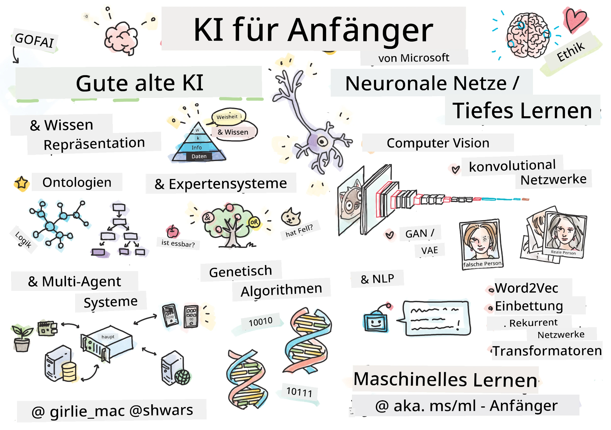

[](https://github.com/microsoft/AI-For-Beginners/blob/main/LICENSE)
[](https://GitHub.com/microsoft/AI-For-Beginners/graphs/contributors/)
[](https://GitHub.com/microsoft/AI-For-Beginners/issues/)
[](https://GitHub.com/microsoft/AI-For-Beginners/pulls/)
[](http://makeapullrequest.com)

[](https://GitHub.com/microsoft/AI-For-Beginners/watchers/)
[](https://GitHub.com/microsoft/AI-For-Beginners/network/)
[](https://GitHub.com/microsoft/AI-For-Beginners/stargazers/)
[](https://mybinder.org/v2/gh/microsoft/ai-for-beginners/HEAD)
[](https://gitter.im/Microsoft/ai-for-beginners?utm_source=badge&utm_medium=badge&utm_campaign=pr-badge)

[](https://discord.gg/nTYy5BXMWG)

# Künstliche Intelligenz für Anfänger - Ein Lehrplan

||
|:---:|
| KI für Anfänger - _Sketchnote von [@girlie_mac](https://twitter.com/girlie_mac)_ |

Entdecke die Welt der **Künstlichen Intelligenz** (KI) mit unserem 12-wöchigen Lehrplan mit 24 Lektionen! Er umfasst praktische Lektionen, Quizze und Laborübungen. Der Lehrplan ist anfängerfreundlich und behandelt Werkzeuge wie TensorFlow und PyTorch sowie Ethik in der KI.


### 🌐 Mehrsprachige Unterstützung

#### Unterstützt über GitHub Action (Automatisiert & stets aktuell)

<!-- CO-OP TRANSLATOR LANGUAGES TABLE START -->
[Arabisch](../ar/README.md) | [Bengalisch](../bn/README.md) | [Bulgarisch](../bg/README.md) | [Birmanisch (Myanmar)](../my/README.md) | [Chinesisch (vereinfacht)](../zh-CN/README.md) | [Chinesisch (Traditionell, Hongkong)](../zh-HK/README.md) | [Chinesisch (Traditionell, Macau)](../zh-MO/README.md) | [Chinesisch (Traditionell, Taiwan)](../zh-TW/README.md) | [Kroatisch](../hr/README.md) | [Tschechisch](../cs/README.md) | [Dänisch](../da/README.md) | [Niederländisch](../nl/README.md) | [Estnisch](../et/README.md) | [Finnisch](../fi/README.md) | [Französisch](../fr/README.md) | [Deutsch](./README.md) | [Griechisch](../el/README.md) | [Hebräisch](../he/README.md) | [Hindi](../hi/README.md) | [Ungarisch](../hu/README.md) | [Indonesisch](../id/README.md) | [Italienisch](../it/README.md) | [Japanisch](../ja/README.md) | [Kannada](../kn/README.md) | [Koreanisch](../ko/README.md) | [Litauisch](../lt/README.md) | [Malaiisch](../ms/README.md) | [Malayalam](../ml/README.md) | [Marathi](../mr/README.md) | [Nepalesisch](../ne/README.md) | [Nigerianisches Pidgin](../pcm/README.md) | [Norwegisch](../no/README.md) | [Persisch (Farsi)](../fa/README.md) | [Polnisch](../pl/README.md) | [Portugiesisch (Brasilien)](../pt-BR/README.md) | [Portugiesisch (Portugal)](../pt-PT/README.md) | [Punjabi (Gurmukhi)](../pa/README.md) | [Rumänisch](../ro/README.md) | [Russisch](../ru/README.md) | [Serbisch (Kyrillisch)](../sr/README.md) | [Slowakisch](../sk/README.md) | [Slowenisch](../sl/README.md) | [Spanisch](../es/README.md) | [Swahili](../sw/README.md) | [Schwedisch](../sv/README.md) | [Tagalog (Filipino)](../tl/README.md) | [Tamil](../ta/README.md) | [Telugu](../te/README.md) | [Thailändisch](../th/README.md) | [Türkisch](../tr/README.md) | [Ukrainisch](../uk/README.md) | [Urdu](../ur/README.md) | [Vietnamesisch](../vi/README.md)

> **Möchten Sie lieber lokal klonen?**

> Dieses Repository enthält über 50 Sprachübersetzungen, die die Downloadgröße erheblich vergrößern. Um ohne Übersetzungen zu klonen, verwenden Sie Sparse Checkout:
> ```bash
> git clone --filter=blob:none --sparse https://github.com/microsoft/AI-For-Beginners.git
> cd AI-For-Beginners
> git sparse-checkout set --no-cone '/*' '!translations' '!translated_images'
> ```
> Das gibt Ihnen alles, was Sie benötigen, um den Kurs mit viel schnellerem Download abzuschließen.
<!-- CO-OP TRANSLATOR LANGUAGES TABLE END -->

**Wenn Sie weitere unterstützte Übersetzungssprachen wünschen, sind diese [hier](https://github.com/Azure/co-op-translator/blob/main/getting_started/supported-languages.md) aufgelistet**

## Treten Sie der Community bei
[](https://discord.gg/nTYy5BXMWG)

## Was du lernen wirst

**[Mindmap des Kurses](http://soshnikov.com/courses/ai-for-beginners/mindmap.html)**

In diesem Lehrplan lernst du:

* Verschiedene Ansätze zur Künstlichen Intelligenz, einschließlich des „guten alten“ symbolischen Ansatzes mit **Wissensrepräsentation** und Schlussfolgerungen ([GOFAI](https://en.wikipedia.org/wiki/Symbolic_artificial_intelligence)).
* **Neuronale Netze** und **Deep Learning**, die Kernbereiche der modernen KI sind. Wir werden die Konzepte hinter diesen wichtigen Themen anhand von Code in zwei der beliebtesten Frameworks veranschaulichen - [TensorFlow](http://Tensorflow.org) und [PyTorch](http://pytorch.org).
* **Neuronale Architekturen** für die Arbeit mit Bildern und Texten. Wir behandeln aktuelle Modelle, können aber im Bereich des Stands der Technik etwas hinterherhinken.
* Weniger verbreitete KI-Ansätze wie **Genetische Algorithmen** und **Multi-Agenten-Systeme**.

Was wir in diesem Lehrplan nicht behandeln:

> [Finde alle zusätzlichen Ressourcen zu diesem Kurs in unserer Microsoft Learn-Sammlung](https://learn.microsoft.com/en-us/collections/7w28iy2xrqzdj0?WT.mc_id=academic-77998-bethanycheum)

* Anwendungsfälle für **KI im Geschäftsleben**. Ziehen Sie in Betracht, den Lernpfad [Einführung in KI für Geschäftsanwender](https://docs.microsoft.com/learn/paths/introduction-ai-for-business-users/?WT.mc_id=academic-77998-bethanycheum) auf Microsoft Learn zu belegen oder die [AI Business School](https://www.microsoft.com/ai/ai-business-school/?WT.mc_id=academic-77998-bethanycheum), entwickelt in Zusammenarbeit mit [INSEAD](https://www.insead.edu/).
* **Klassisches Machine Learning**, das in unserem [Machine Learning für Anfänger Lehrplan](http://github.com/Microsoft/ML-for-Beginners) gut beschrieben ist.
* Praktische KI-Anwendungen, die mit **[Cognitive Services](https://azure.microsoft.com/services/cognitive-services/?WT.mc_id=academic-77998-bethanycheum)** erstellt wurden. Wir empfehlen, mit Microsoft Learn-Modulen für [Vision](https://docs.microsoft.com/learn/paths/create-computer-vision-solutions-azure-cognitive-services/?WT.mc_id=academic-77998-bethanycheum), [Natürliche Sprachverarbeitung](https://docs.microsoft.com/learn/paths/explore-natural-language-processing/?WT.mc_id=academic-77998-bethanycheum), **[Generative KI mit Azure OpenAI Service](https://learn.microsoft.com/en-us/training/paths/develop-ai-solutions-azure-openai/?WT.mc_id=academic-77998-bethanycheum)** und andere zu beginnen.
* Spezifische ML-**Cloud-Frameworks**, wie [Azure Machine Learning](https://azure.microsoft.com/services/machine-learning/?WT.mc_id=academic-77998-bethanycheum), [Microsoft Fabric](https://learn.microsoft.com/en-us/training/paths/get-started-fabric/?WT.mc_id=academic-77998-bethanycheum) oder [Azure Databricks](https://docs.microsoft.com/learn/paths/data-engineer-azure-databricks?WT.mc_id=academic-77998-bethanycheum). Ziehen Sie die Lernpfade [Machine Learning-Lösungen mit Azure Machine Learning erstellen und betreiben](https://docs.microsoft.com/learn/paths/build-ai-solutions-with-azure-ml-service/?WT.mc_id=academic-77998-bethanycheum) und [Machine Learning-Lösungen mit Azure Databricks erstellen und betreiben](https://docs.microsoft.com/learn/paths/build-operate-machine-learning-solutions-azure-databricks/?WT.mc_id=academic-77998-bethanycheum) in Betracht.
* **Konversationelle KI** und **Chatbots**. Es gibt einen separaten Lernpfad [Konversationelle KI-Lösungen erstellen](https://docs.microsoft.com/learn/paths/create-conversational-ai-solutions/?WT.mc_id=academic-77998-bethanycheum), und Sie können auch diesen [Blogbeitrag](https://soshnikov.com/azure/hello-bot-conversational-ai-on-microsoft-platform/) für weitere Details nutzen.
* **Tiefe Mathematik** hinter Deep Learning. Wir empfehlen dafür das Buch [Deep Learning](https://www.amazon.com/Deep-Learning-Adaptive-Computation-Machine/dp/0262035618) von Ian Goodfellow, Yoshua Bengio und Aaron Courville, das auch online unter [https://www.deeplearningbook.org/](https://www.deeplearningbook.org/) verfügbar ist.

Für eine sanfte Einführung in _KI in der Cloud_ Themen können Sie den Lernpfad [Erste Schritte mit künstlicher Intelligenz auf Azure](https://docs.microsoft.com/learn/paths/get-started-with-artificial-intelligence-on-azure/?WT.mc_id=academic-77998-bethanycheum) in Betracht ziehen.

# Inhalt

|     |                                                                 Lektion Link                                                                  |                                           PyTorch/Keras/TensorFlow                                          | Labor                                                            |
| :-: | :------------------------------------------------------------------------------------------------------------------------------------------: | :---------------------------------------------------------------------------------------------: | ------------------------------------------------------------------------------ |
| 0  |                                 [Kurseinrichtung](./lessons/0-course-setup/setup.md)                                 |                      [Richte deine Entwicklungsumgebung ein](./lessons/0-course-setup/how-to-run.md)                       |   |
| I  |               [**Einführung in KI**](./lessons/1-Intro/README.md)      | | |
| 01  |       [Einführung und Geschichte der KI](./lessons/1-Intro/README.md)       |           -                            | -  |
| II |              **Symbolische KI**              |
| 02  |       [Wissensrepräsentation und Expertensysteme](./lessons/2-Symbolic/README.md)       |            [Expertensysteme](./lessons/2-Symbolic/Animals.ipynb) /  [Ontologie](./lessons/2-Symbolic/FamilyOntology.ipynb) /[Konzeptgraph](./lessons/2-Symbolic/MSConceptGraph.ipynb)                             |  |
| III |                        [**Einführung in neuronale Netzwerke**](./lessons/3-NeuralNetworks/README.md) |||
| 03  |                [Perzeptron](./lessons/3-NeuralNetworks/03-Perceptron/README.md)                 |                       [Notebook](./lessons/3-NeuralNetworks/03-Perceptron/Perceptron.ipynb)                      | [Lab](./lessons/3-NeuralNetworks/03-Perceptron/lab/README.md) |
| 04  |                   [Mehrschichtiges Perzeptron und Erstellung unseres eigenen Frameworks](./lessons/3-NeuralNetworks/04-OwnFramework/README.md)                   |        [Notebook](./lessons/3-NeuralNetworks/04-OwnFramework/OwnFramework.ipynb)        | [Lab](./lessons/3-NeuralNetworks/04-OwnFramework/lab/README.md) |
| 05  |            [Einführung in Frameworks (PyTorch/TensorFlow) und Überanpassung](./lessons/3-NeuralNetworks/05-Frameworks/README.md)             |           [PyTorch](./lessons/3-NeuralNetworks/05-Frameworks/IntroPyTorch.ipynb) / [Keras](./lessons/3-NeuralNetworks/05-Frameworks/IntroKeras.ipynb) / [TensorFlow](./lessons/3-NeuralNetworks/05-Frameworks/IntroKerasTF.ipynb)             | [Lab](./lessons/3-NeuralNetworks/05-Frameworks/lab/README.md) |
| IV  |            [**Computer Vision**](./lessons/4-ComputerVision/README.md)             | [PyTorch](https://docs.microsoft.com/learn/modules/intro-computer-vision-pytorch/?WT.mc_id=academic-77998-cacaste) / [TensorFlow](https://docs.microsoft.com/learn/modules/intro-computer-vision-TensorFlow/?WT.mc_id=academic-77998-cacaste)| [Erkunde Computer Vision auf Microsoft Azure](https://learn.microsoft.com/en-us/collections/7w28iy2xrqzdj0?WT.mc_id=academic-77998-bethanycheum) |
| 06  |            [Einführung in Computer Vision. OpenCV](./lessons/4-ComputerVision/06-IntroCV/README.md)             |           [Notebook](./lessons/4-ComputerVision/06-IntroCV/OpenCV.ipynb)         | [Lab](./lessons/4-ComputerVision/06-IntroCV/lab/README.md) |
| 07  |            [Faltungsneuronale Netze](./lessons/4-ComputerVision/07-ConvNets/README.md) &  [CNN Architekturen](./lessons/4-ComputerVision/07-ConvNets/CNN_Architectures.md)             |           [PyTorch](./lessons/4-ComputerVision/07-ConvNets/ConvNetsPyTorch.ipynb) /[TensorFlow](./lessons/4-ComputerVision/07-ConvNets/ConvNetsTF.ipynb)             | [Lab](./lessons/4-ComputerVision/07-ConvNets/lab/README.md) |
| 08  |            [Vortrainierte Netze und Transferlernen](./lessons/4-ComputerVision/08-TransferLearning/README.md) und [Trainingstricks](./lessons/4-ComputerVision/08-TransferLearning/TrainingTricks.md)             |           [PyTorch](./lessons/4-ComputerVision/08-TransferLearning/TransferLearningPyTorch.ipynb) / [TensorFlow](./lessons/3-NeuralNetworks/05-Frameworks/IntroKerasTF.ipynb)             | [Lab](./lessons/4-ComputerVision/08-TransferLearning/lab/README.md) |
| 09  |            [Autoencoder und VAEs](./lessons/4-ComputerVision/09-Autoencoders/README.md)             |           [PyTorch](./lessons/4-ComputerVision/09-Autoencoders/AutoEncodersPyTorch.ipynb) / [TensorFlow](./lessons/4-ComputerVision/09-Autoencoders/AutoencodersTF.ipynb)             |  |
| 10  |            [Generative Adversariale Netzwerke & künstlerischer Stiltransfer](./lessons/4-ComputerVision/10-GANs/README.md)             |           [PyTorch](./lessons/4-ComputerVision/10-GANs/GANPyTorch.ipynb) / [TensorFlow](./lessons/4-ComputerVision/10-GANs/GANTF.ipynb)             |  |
| 11  |            [Objekterkennung](./lessons/4-ComputerVision/11-ObjectDetection/README.md)             |         [TensorFlow](./lessons/4-ComputerVision/11-ObjectDetection/ObjectDetection.ipynb)             | [Lab](./lessons/4-ComputerVision/11-ObjectDetection/lab/README.md) |
| 12  |            [Semantische Segmentierung. U-Net](./lessons/4-ComputerVision/12-Segmentation/README.md)             |           [PyTorch](./lessons/4-ComputerVision/12-Segmentation/SemanticSegmentationPytorch.ipynb) / [TensorFlow](./lessons/4-ComputerVision/12-Segmentation/SemanticSegmentationTF.ipynb)             |  |
| V  |            [**Natürliche Sprachverarbeitung**](./lessons/5-NLP/README.md)             | [PyTorch](https://docs.microsoft.com/learn/modules/intro-natural-language-processing-pytorch/?WT.mc_id=academic-77998-cacaste) /[TensorFlow](https://docs.microsoft.com/learn/modules/intro-natural-language-processing-TensorFlow/?WT.mc_id=academic-77998-cacaste) | [Erkunde natürliche Sprachverarbeitung auf Microsoft Azure](https://learn.microsoft.com/en-us/collections/7w28iy2xrqzdj0?WT.mc_id=academic-77998-bethanycheum)|
| 13  |            [Textrepräsentation. BOW/TF-IDF](./lessons/5-NLP/13-TextRep/README.md)             |           [PyTorch](https://github.com/microsoft/AI-For-Beginners/blob/main/lessons/5-NLP/13-TextRep/TextRepresentationPyTorch.ipynb) / [TensorFlow](https://github.com/microsoft/AI-For-Beginners/blob/main/lessons/5-NLP/13-TextRep/TextRepresentationTF.ipynb)             | |
| 14  |            [Semantische Wort-Einbettungen. Word2Vec und GloVe](./lessons/5-NLP/14-Embeddings/README.md)             |           [PyTorch](https://github.com/microsoft/AI-For-Beginners/blob/main/lessons/5-NLP/14-Embeddings/EmbeddingsPyTorch.ipynb) / [TensorFlow](https://github.com/microsoft/AI-For-Beginners/blob/main/lessons/5-NLP/14-Embeddings/EmbeddingsTF.ipynb)             |  |
| 15  |            [Sprachmodellierung. Eigene Einbettungen trainieren](./lessons/5-NLP/15-LanguageModeling/README.md)             |           [PyTorch](https://github.com/microsoft/AI-For-Beginners/blob/main/lessons/5-NLP/15-LanguageModeling/CBoW-PyTorch.ipynb) / [TensorFlow](https://github.com/microsoft/AI-For-Beginners/blob/main/lessons/5-NLP/15-LanguageModeling/CBoW-TF.ipynb)             | [Lab](./lessons/5-NLP/15-LanguageModeling/lab/README.md) |
| 16  |            [Rekurrente neuronale Netze](./lessons/5-NLP/16-RNN/README.md)             |           [PyTorch](https://github.com/microsoft/AI-For-Beginners/blob/main/lessons/5-NLP/16-RNN/RNNPyTorch.ipynb) / [TensorFlow](https://github.com/microsoft/AI-For-Beginners/blob/main/lessons/5-NLP/16-RNN/RNNTF.ipynb)             |  |
| 17  |            [Generative rekurrente Netze](./lessons/5-NLP/17-GenerativeNetworks/README.md)             |           [PyTorch](https://github.com/microsoft/AI-For-Beginners/blob/main/lessons/5-NLP/17-GenerativeNetworks/GenerativePyTorch.ipynb) / [TensorFlow](https://github.com/microsoft/AI-For-Beginners/blob/main/lessons/5-NLP/17-GenerativeNetworks/GenerativeTF.ipynb)             | [Lab](./lessons/5-NLP/17-GenerativeNetworks/lab/README.md) |
| 18  |            [Transformers. BERT.](./lessons/5-NLP/18-Transformers/README.md)             |           [PyTorch](https://github.com/microsoft/AI-For-Beginners/blob/main/lessons/5-NLP/18-Transformers/TransformersPyTorch.ipynb) /[TensorFlow](https://github.com/microsoft/AI-For-Beginners/blob/main/lessons/5-NLP/18-Transformers/TransformersTF.ipynb)             |  |
| 19  |            [Named Entity Recognition](./lessons/5-NLP/19-NER/README.md)             |           [TensorFlow](https://microsoft.github.io/AI-For-Beginners/lessons/5-NLP/19-NER/NER-TF.ipynb)             | [Lab](./lessons/5-NLP/19-NER/lab/README.md) |
| 20  |            [Große Sprachmodelle, Prompt-Programmierung und Few-Shot-Aufgaben](./lessons/5-NLP/20-LangModels/README.md)             |           [PyTorch](https://microsoft.github.io/AI-For-Beginners/lessons/5-NLP/20-LangModels/GPT-PyTorch.ipynb) | |
| VI |            **Andere KI-Techniken** || |
| 21  |            [Genetische Algorithmen](./lessons/6-Other/21-GeneticAlgorithms/README.md)             |           [Notebook](./lessons/6-Other/21-GeneticAlgorithms/Genetic.ipynb) | |
| 22  |            [Deep Reinforcement Learning](./lessons/6-Other/22-DeepRL/README.md)             |           [PyTorch](./lessons/6-Other/22-DeepRL/CartPole-RL-PyTorch.ipynb) /[TensorFlow](./lessons/6-Other/22-DeepRL/CartPole-RL-TF.ipynb)             | [Lab](./lessons/6-Other/22-DeepRL/lab/README.md) |
| 23  |            [Multi-Agenten-Systeme](./lessons/6-Other/23-MultiagentSystems/README.md)             |  | |
| VII |            **KI-Ethik** | | |
| 24  |            [KI-Ethik und verantwortungsvolle KI](./lessons/7-Ethics/README.md)             |           [Microsoft Learn: Prinzipien für verantwortungsvolle KI](https://docs.microsoft.com/learn/paths/responsible-ai-business-principles/?WT.mc_id=academic-77998-cacaste) | |
| IX  |            **Extras** | | |
| 25  |            [Multimodale Netze, CLIP und VQGAN](./lessons/X-Extras/X1-MultiModal/README.md)             |           [Notebook](./lessons/X-Extras/X1-MultiModal/Clip.ipynb)    | |

## Jede Lektion enthält

* Vorab-Lesematerial
* Ausführbare Jupyter-Notebooks, die oft spezifisch für das Framework (**PyTorch** oder **TensorFlow**) sind. Das ausführbare Notebook enthält auch viel theoretisches Material, daher muss man mindestens eine Version des Notebooks durchgehen (entweder PyTorch oder TensorFlow), um das Thema zu verstehen.
* **Labs** sind zu einigen Themen verfügbar, die dir die Möglichkeit geben, das Gelernte an einem konkreten Problem auszuprobieren.
* Einige Abschnitte enthalten Links zu [**MS Learn**](https://learn.microsoft.com/en-us/collections/7w28iy2xrqzdj0?WT.mc_id=academic-77998-bethanycheum) Modulen, die verwandte Themen behandeln.

## Loslegen

### 🎯 Neu bei KI? Hier starten!

Wenn du komplett neu bei KI bist und schnelle, praktische Beispiele möchtest, schau dir unsere [**Einsteigerfreundlichen Beispiele**](./examples/README.md) an! Diese umfassen:

- 🌟 **Hallo KI Welt** - Dein erstes KI-Programm (Mustererkennung)
- 🧠 **Einfaches neuronales Netzwerk** - Baue ein neuronales Netzwerk von Grund auf auf  

- 🖼️ **Bildklassifikator** - Bilder mit detaillierten Kommentaren klassifizieren
- 💬 **Text-Stimmungsanalyse** - Positive/negative Texte analysieren

Diese Beispiele sollen Ihnen helfen, KI-Konzepte zu verstehen, bevor Sie in das vollständige Curriculum eintauchen.

### 📚 Vollständige Curriculum-Einrichtung

- Wir haben eine [Einrichtungslektion](./lessons/0-course-setup/setup.md) erstellt, die Ihnen beim Einrichten Ihrer Entwicklungsumgebung hilft. - Für Lehrkräfte haben wir ebenfalls eine [Curricula-Einrichtungslektion](./lessons/0-course-setup/for-teachers.md) erstellt!
- Wie man den Code in VSCode oder einem Codespace [ausführt](./lessons/0-course-setup/how-to-run.md)

Folgen Sie diesen Schritten:

Forken Sie das Repository: Klicken Sie auf die Schaltfläche „Fork“ oben rechts auf dieser Seite.

Klonen Sie das Repository: `git clone https://github.com/microsoft/AI-For-Beginners.git`

Vergessen Sie nicht, dieses Repo mit einem Stern (🌟) zu markieren, um es später leichter wiederzufinden.

## Andere Lernende treffen

Treten Sie unserem [offiziellen AI Discord-Server](https://aka.ms/genai-discord?WT.mc_id=academic-105485-bethanycheum) bei, um andere Lernende dieses Kurses zu treffen und sich zu vernetzen sowie Unterstützung zu erhalten.

Wenn Sie Produktfeedback oder Fragen während des Erstellens haben, besuchen Sie unser [Azure AI Foundry Developer Forum](https://aka.ms/foundry/forum)

## Quizze

> **Hinweis zu Quizzen**: Alle Quizze befinden sich im Quiz-App-Ordner unter etc\quiz-app oder [Online hier](https://ff-quizzes.netlify.app/). Sie sind in den Lektionen verlinkt, die Quiz-App kann lokal ausgeführt oder in Azure bereitgestellt werden; folgen Sie der Anleitung im Ordner `quiz-app`. Sie werden nach und nach lokalisiert.

## Hilfe erwünscht

Haben Sie Vorschläge oder Fehler in Rechtschreibung oder Code gefunden? Eröffnen Sie ein Issue oder erstellen Sie einen Pull Request.

## Besonderer Dank

* **✍️ Hauptautor:** [Dmitry Soshnikov](http://soshnikov.com), PhD
* **🔥 Herausgeberin:** [Jen Looper](https://twitter.com/jenlooper), PhD
* **🎨 Sketchnote-Illustratorin:** [Tomomi Imura](https://twitter.com/girlie_mac)
* **✅ Quiz-Erstellerin:** [Lateefah Bello](https://github.com/CinnamonXI), [MLSA](https://studentambassadors.microsoft.com/)
* **🙏 Hauptmitwirkende:** [Evgenii Pishchik](https://github.com/Pe4enIks)

## Weitere Curricula

Unser Team erstellt weitere Curricula! Schauen Sie sich an:

<!-- CO-OP TRANSLATOR OTHER COURSES START -->
### LangChain
[](https://aka.ms/langchain4j-for-beginners)
[](https://aka.ms/langchainjs-for-beginners?WT.mc_id=m365-94501-dwahlin)
[](https://github.com/microsoft/langchain-for-beginners?WT.mc_id=m365-94501-dwahlin)
---

### Azure / Edge / MCP / Agents
[](https://github.com/microsoft/AZD-for-beginners?WT.mc_id=academic-105485-koreyst)
[](https://github.com/microsoft/edgeai-for-beginners?WT.mc_id=academic-105485-koreyst)
[](https://github.com/microsoft/mcp-for-beginners?WT.mc_id=academic-105485-koreyst)
[](https://github.com/microsoft/ai-agents-for-beginners?WT.mc_id=academic-105485-koreyst)

---
 
### Generative AI Serie
[](https://github.com/microsoft/generative-ai-for-beginners?WT.mc_id=academic-105485-koreyst)
[-9333EA?style=for-the-badge&labelColor=E5E7EB&color=9333EA)](https://github.com/microsoft/Generative-AI-for-beginners-dotnet?WT.mc_id=academic-105485-koreyst)
[-C084FC?style=for-the-badge&labelColor=E5E7EB&color=C084FC)](https://github.com/microsoft/generative-ai-for-beginners-java?WT.mc_id=academic-105485-koreyst)
[-E879F9?style=for-the-badge&labelColor=E5E7EB&color=E879F9)](https://github.com/microsoft/generative-ai-with-javascript?WT.mc_id=academic-105485-koreyst)

---
 
### Kernlernen
[](https://aka.ms/ml-beginners?WT.mc_id=academic-105485-koreyst)
[](https://aka.ms/datascience-beginners?WT.mc_id=academic-105485-koreyst)
[](https://aka.ms/ai-beginners?WT.mc_id=academic-105485-koreyst)
[](https://github.com/microsoft/Security-101?WT.mc_id=academic-96948-sayoung)
[](https://aka.ms/webdev-beginners?WT.mc_id=academic-105485-koreyst)
[](https://aka.ms/iot-beginners?WT.mc_id=academic-105485-koreyst)
[](https://github.com/microsoft/xr-development-for-beginners?WT.mc_id=academic-105485-koreyst)

---
 
### Copilot Serie
[](https://aka.ms/GitHubCopilotAI?WT.mc_id=academic-105485-koreyst)
[](https://github.com/microsoft/mastering-github-copilot-for-dotnet-csharp-developers?WT.mc_id=academic-105485-koreyst)
[](https://github.com/microsoft/CopilotAdventures?WT.mc_id=academic-105485-koreyst)
<!-- CO-OP TRANSLATOR OTHER COURSES END -->

## Hilfe erhalten

Wenn Sie feststecken oder Fragen zum Erstellen von KI-Apps haben, schließen Sie sich anderen Lernenden und erfahrenen Entwicklern in Diskussionen über MCP an. Es ist eine unterstützende Gemeinschaft, in der Fragen willkommen sind und Wissen frei geteilt wird.

[](https://discord.gg/nTYy5BXMWG)

Wenn Sie Produktfeedback oder Fehler beim Erstellen haben, besuchen Sie:

[](https://aka.ms/foundry/forum)

---

<!-- CO-OP TRANSLATOR DISCLAIMER START -->
**Haftungsausschluss**:  
Dieses Dokument wurde mit dem KI-Übersetzungsdienst [Co-op Translator](https://github.com/Azure/co-op-translator) übersetzt. Obwohl wir um Genauigkeit bemüht sind, weisen wir darauf hin, dass automatisierte Übersetzungen Fehler oder Ungenauigkeiten enthalten können. Das Originaldokument in seiner Ursprungssprache gilt als maßgebliche Quelle. Für wichtige Informationen wird eine professionelle menschliche Übersetzung empfohlen. Wir übernehmen keine Haftung für Missverständnisse oder Fehlinterpretationen, die aus der Nutzung dieser Übersetzung entstehen.
<!-- CO-OP TRANSLATOR DISCLAIMER END -->