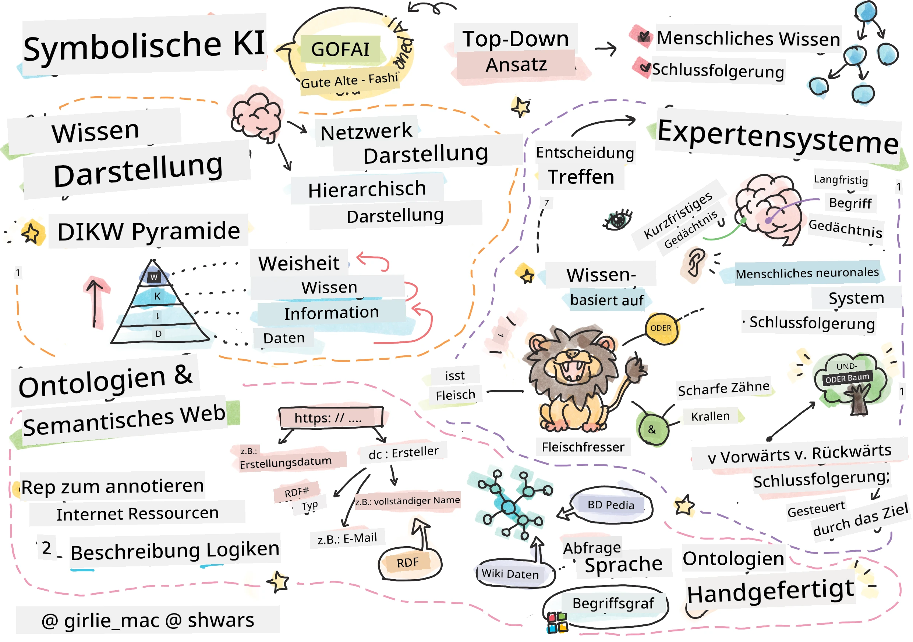
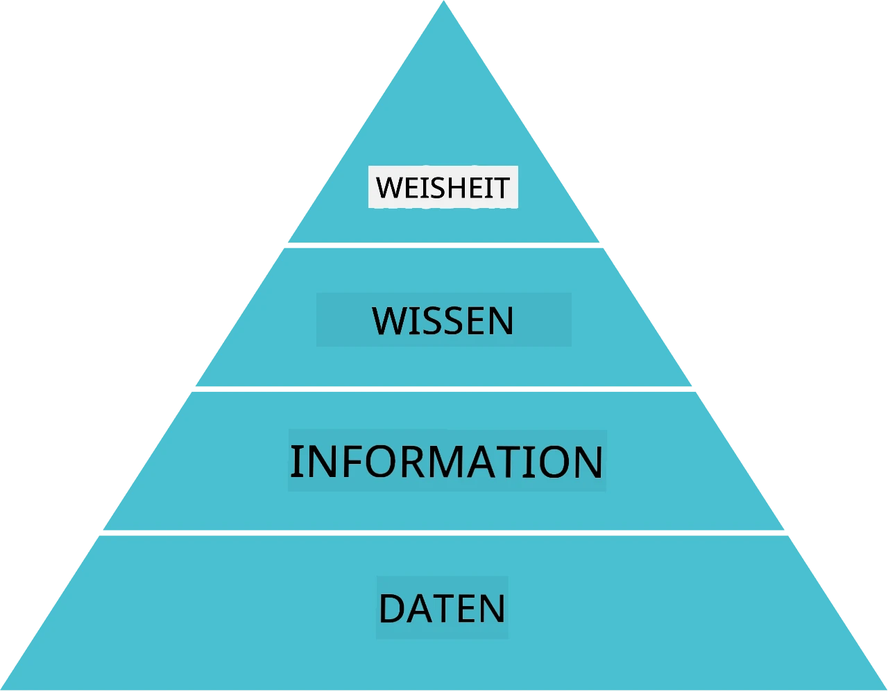
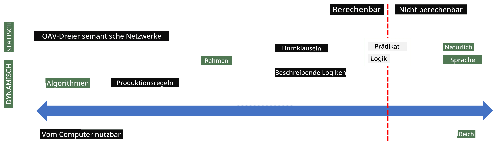
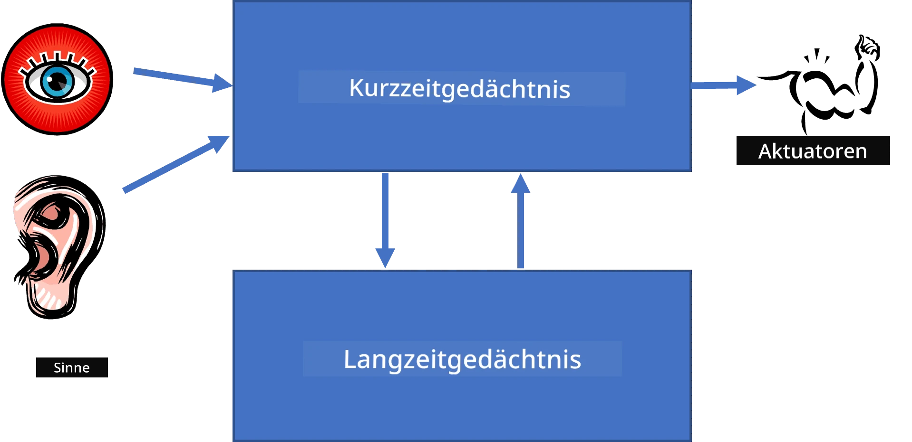
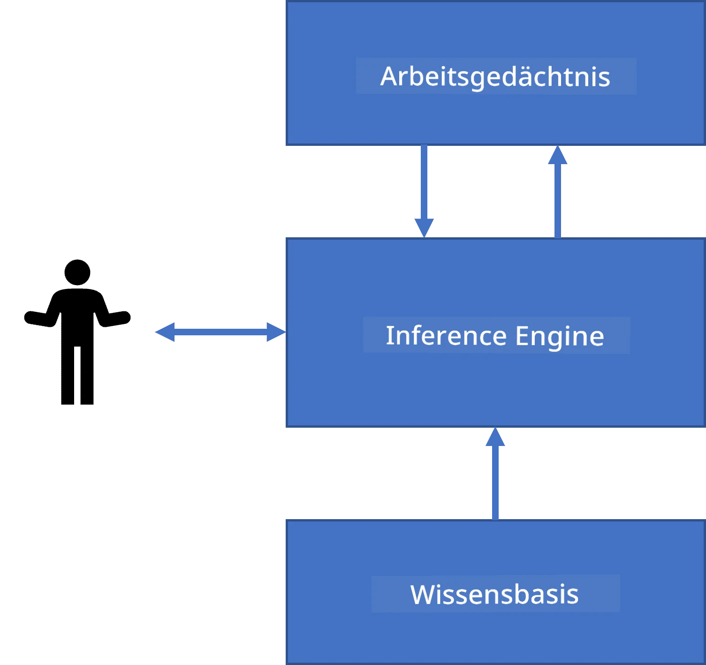
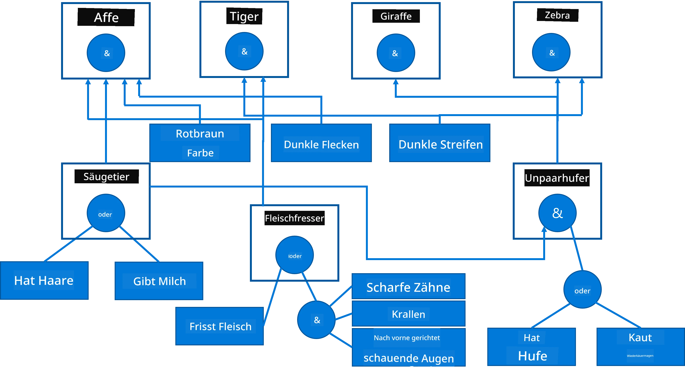
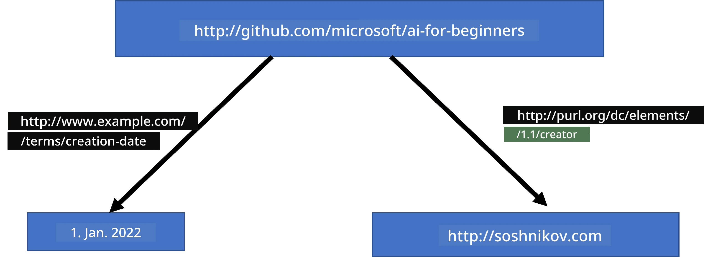
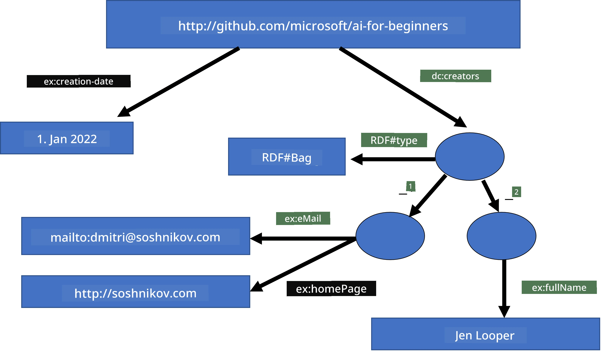
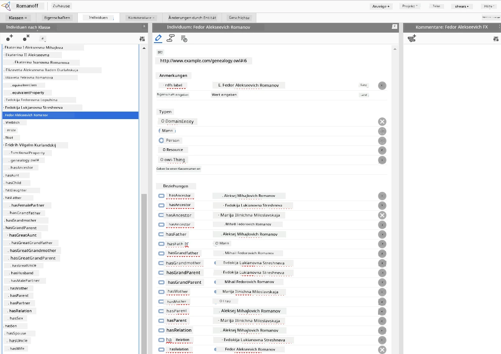

# Wissensrepräsentation und Expertensysteme



> Sketchnote von [Tomomi Imura](https://twitter.com/girlie_mac)

Die Suche nach künstlicher Intelligenz basiert auf der Suche nach Wissen, um die Welt ähnlich wie Menschen zu verstehen. Aber wie kann man das angehen?

## [Vorlesungsquiz](https://ff-quizzes.netlify.app/en/ai/quiz/3)

In den frühen Tagen der KI war der Top-Down-Ansatz zur Erstellung intelligenter Systeme (im vorherigen Kapitel besprochen) beliebt. Die Idee war, Wissen von Menschen in eine maschinenlesbare Form zu extrahieren und es dann automatisch zur Problemlösung zu verwenden. Dieser Ansatz basierte auf zwei großen Ideen:

* Wissensrepräsentation
* Schlussfolgerung

## Wissensrepräsentation

Eines der wichtigen Konzepte in der symbolischen KI ist **Wissen**. Es ist wichtig, Wissen von *Information* oder *Daten* abzugrenzen. Zum Beispiel kann man sagen, dass Bücher Wissen enthalten, weil man Bücher studieren und Experte werden kann. Aber was Bücher tatsächlich enthalten, nennt man *Daten*, und durch das Lesen von Büchern und die Integration dieser Daten in unser Weltmodell wandeln wir diese Daten in Wissen um.

> ✅ **Wissen** ist etwas, das in unserem Kopf enthalten ist und unser Verständnis der Welt repräsentiert. Es wird durch einen aktiven **Lernprozess** gewonnen, der erhaltene Informationsstücke in unser aktives Weltmodell integriert.

Meistens definieren wir Wissen nicht strikt, sondern ordnen es anderen verwandten Konzepten mithilfe der [DIKW-Pyramide](https://de.wikipedia.org/wiki/DIKW-Pyramide) zu. Sie beinhaltet folgende Begriffe:

* **Daten** sind etwas, das in physischen Medien dargestellt wird, wie geschriebener Text oder gesprochene Worte. Daten existieren unabhängig von Menschen und können zwischen Menschen weitergegeben werden.
* **Information** ist, wie wir Daten in unserem Kopf interpretieren. Zum Beispiel haben wir beim Hören des Wortes *Computer* eine Vorstellung davon, was es ist.
* **Wissen** ist Information, die in unser Weltmodell integriert wird. Wenn wir beispielsweise lernen, was ein Computer ist, haben wir Vorstellungen darüber, wie er funktioniert, wie viel er kostet und wofür er verwendet werden kann. Dieses Netz von miteinander verbundenen Konzepten bildet unser Wissen.
* **Weisheit** ist eine weitere Ebene unseres Weltverständnisses und repräsentiert *Metawissen*, z.B. eine Vorstellung darüber, wie und wann Wissen angewendet werden sollte.



*Bild [von Wikipedia](https://commons.wikimedia.org/w/index.php?curid=37705247), Von Longlivetheux - Eigenes Werk, CC BY-SA 4.0*

Somit besteht das Problem der **Wissensrepräsentation** darin, eine effektive Methode zu finden, Wissen innerhalb eines Computers in Form von Daten so darzustellen, dass es automatisch nutzbar ist. Dies kann als Spektrum gesehen werden:



> Bild von [Dmitry Soshnikov](http://soshnikov.com)

* Links sind sehr einfache Arten von Wissensrepräsentationen, die von Computern effektiv genutzt werden können. Die einfachste ist die algorithmische, bei der Wissen durch ein Computerprogramm dargestellt wird. Dies ist jedoch nicht die beste Form der Wissensrepräsentation, weil sie nicht flexibel ist. Wissen in unserem Kopf ist oft nicht-algorithmisch.
* Rechts sind Repräsentationen wie natürliche Texte. Sie sind am mächtigsten, können aber nicht für automatische Schlussfolgerungen verwendet werden.

> ✅ Denken Sie einen Moment darüber nach, wie Sie Wissen in Ihrem Kopf repräsentieren und in Notizen umwandeln. Gibt es ein bestimmtes Format, das für Sie gut funktioniert, um das Behalten zu unterstützen?

## Klassifikation von Computer-Wissensrepräsentationen

Wir können verschiedene Computer-Wissensrepräsentationsmethoden in folgende Kategorien einordnen:

* **Netzwerkrepräsentationen** basieren auf der Tatsache, dass wir ein Netzwerk miteinander verbundener Konzepte in unserem Kopf haben. Wir können versuchen, dieselben Netzwerke als Graphen in einem Computer nachzubilden – ein sogenanntes **semantisches Netzwerk**.

1. **Objekt-Attribut-Wert-Tripel** oder **Attribut-Wert-Paare**. Da ein Graph im Computer als Liste von Knoten und Kanten dargestellt werden kann, können wir ein semantisches Netzwerk durch eine Liste von Tripeln repräsentieren, die Objekte, Attribute und Werte enthalten. Zum Beispiel erstellen wir folgende Tripel über Programmiersprachen:

Objekt | Attribut | Wert  
-------|-----------|------  
Python | ist | Untyped-Language  
Python | erfunden von | Guido van Rossum  
Python | Blocksyntax | Einrückung  
Untyped-Language | hat nicht | Typdefinitionen  

> ✅ Überlegen Sie, wie Tripel verwendet werden können, um andere Wissensarten darzustellen.

2. **Hierarchische Repräsentationen** betonen die Tatsache, dass wir oft eine Hierarchie von Objekten in unserem Kopf anlegen. Zum Beispiel wissen wir, dass eine Kanarienvogel ein Vogel ist, und alle Vögel Flügel haben. Wir haben auch eine Vorstellung davon, welche Farbe ein Kanarienvogel gewöhnlich hat und wie schnell er fliegt.

   - **Frame-Repräsentation** basiert darauf, jedes Objekt oder jede Objektklasse als **Frame** darzustellen, der **Slots** enthält. Slots haben mögliche Standardwerte, Wertbeschränkungen oder gespeicherte Prozeduren, die aufgerufen werden können, um den Wert eines Slots zu erhalten. Alle Frames bilden eine Hierarchie ähnlich der Objekt-Hierarchie in objektorientierten Programmiersprachen.
   - **Szenarien** sind eine spezielle Art von Frames, die komplexe Situationen darstellen, die sich im Zeitverlauf entfalten können.

**Python**

Slot | Wert | Standardwert | Intervall  
-----|-------|---------------|----------  
Name | Python | | |  
Ist-ein | Untyped-Language | | |  
VariablenSchreibweise | | CamelCase | |  
Programmlänge | | | 5-5000 Zeilen |  
Blocksyntax | Einrückung | | |  

3. **Prozedurale Repräsentationen** basieren darauf, Wissen durch eine Liste von auszuführenden Aktionen darzustellen, wenn eine bestimmte Bedingung eintritt.
   - Produktionsregeln sind Wenn-Dann-Anweisungen, die uns erlauben Schlussfolgerungen zu ziehen. Zum Beispiel kann ein Arzt eine Regel haben, die besagt, dass **WENN** ein Patient hohes Fieber **ODER** einen hohen C-reaktiven Proteinspiegel im Bluttest hat, **DANN** hat er eine Entzündung. Wenn eine der Bedingungen erfüllt wird, können wir eine Schlussfolgerung über die Entzündung ziehen und diese dann im weiteren Schlussfolgern verwenden.
   - Algorithmen können als eine weitere Form prozeduraler Repräsentation betrachtet werden, obwohl sie in wissensbasierten Systemen fast nie direkt verwendet werden.

4. **Logik** wurde ursprünglich von Aristoteles als Möglichkeit vorgeschlagen, universelles menschliches Wissen darzustellen.
   - Prädikatenlogik als mathematische Theorie ist zu reichhaltig, um berechenbar zu sein, daher wird normalerweise ein Teil davon verwendet, z.B. Horn-Klauseln, wie sie in Prolog verwendet werden.
   - Beschreibende Logik ist eine Familie von logischen Systemen, die verwendet werden, um über Hierarchien von Objekten in verteilten Wissensrepräsentationen wie dem *Semantic Web* zu repräsentieren und zu schlussfolgern.

## Expertensysteme

Einer der frühen Erfolge der symbolischen KI waren sogenannte **Expertensysteme** – Computersysteme, die entwickelt wurden, um als Experte in einem begrenzten Problembereich zu wirken. Sie basierten auf einer **Wissensbasis**, die von einem oder mehreren menschlichen Experten extrahiert wurde, und enthielten eine **Inferenzmaschine**, die darauf basierend Schlussfolgerungen zog.

 | 
---------------------------------------------|------------------------------------------------
Vereinfachte Struktur des menschlichen neuronalen Systems | Architektur eines wissensbasierten Systems

Expertensysteme sind ähnlich wie das menschliche Schlusssystem aufgebaut, das **Kurzzeitgedächtnis** und **Langzeitgedächtnis** enthält. Ebenso unterscheiden wir in wissensbasierten Systemen folgende Komponenten:

* **Problemspeicher**: enthält Wissen über das gerade zu lösende Problem, z.B. die Temperatur oder den Blutdruck eines Patienten, ob er eine Entzündung hat oder nicht. Dieses Wissen wird auch als **statisches Wissen** bezeichnet, weil es einen Schnappschuss dessen darstellt, was wir aktuell über das Problem wissen – den sogenannten *Problemzustand*.
* **Wissensbasis**: repräsentiert langfristiges Wissen über ein Problemgebiet. Es wird manuell von menschlichen Experten extrahiert und ändert sich nicht von Konsultation zu Konsultation. Da es erlaubt, von einem Problemzustand zum anderen zu navigieren, wird es auch als **dynamisches Wissen** bezeichnet.
* **Inferenzmaschine**: steuert den gesamten Prozess der Suche im Problemzustandsraum und stellt bei Bedarf Fragen an den Benutzer. Sie ist auch verantwortlich dafür, die richtigen Regeln auszuwählen, die auf jeden Zustand angewendet werden.

Als Beispiel betrachten wir folgendes Expertensystem zur Bestimmung eines Tieres anhand seiner physischen Eigenschaften:



> Bild von [Dmitry Soshnikov](http://soshnikov.com)

Dieses Diagramm wird als **AND-OR-Baum** bezeichnet und ist eine grafische Darstellung eines Satzes von Produktionsregeln. Das Zeichnen eines Baums ist zu Beginn der Wissensextraktion vom Experten nützlich. Um das Wissen im Computer darzustellen, ist es praktischer, Regeln zu verwenden:

```
IF the animal eats meat
OR (animal has sharp teeth
    AND animal has claws
    AND animal has forward-looking eyes
) 
THEN the animal is a carnivore
```
  
Man kann erkennen, dass jede Bedingung auf der linken Seite der Regel und die Aktion im Wesentlichen Objekt-Attribut-Wert-(OAV-)Tripel sind. Das **Arbeitsgedächtnis** enthält den Satz von OAV-Tripeln, die dem aktuell zu lösenden Problem entsprechen. Eine **Regelmaschine** sucht nach Regeln, deren Bedingung erfüllt ist, und wendet diese an, indem sie ein weiteres Tripel zum Arbeitsgedächtnis hinzufügt.

> ✅ Erstellen Sie Ihren eigenen AND-OR-Baum zu einem Thema, das Ihnen gefällt!

### Vorwärts- vs. Rückwärtsschlussfolgerung

Der oben beschriebene Prozess wird **Vorwärtsschlussfolgerung** genannt. Er beginnt mit einigen Anfangsdaten über das Problem, die im Arbeitsgedächtnis vorhanden sind, und führt dann die folgende Schlussfolgerungsschleife aus:

1. Wenn das Zielfeld im Arbeitsgedächtnis vorhanden ist – stoppe und gib das Ergebnis aus  
2. Suche alle Regeln, deren Bedingung derzeit erfüllt ist – erhalte eine **Konfliktmenge** von Regeln  
3. Führe die **Konfliktauflösung** durch – wähle eine Regel aus, die in diesem Schritt ausgeführt wird. Es kann verschiedene Strategien der Konfliktauflösung geben:  
   - Wähle die erste anwendbare Regel in der Wissensbasis  
   - Wähle eine zufällige Regel  
   - Wähle eine *spezifischere* Regel, d.h. diejenige, die die meisten Bedingungen auf der linken Seite (LHS) erfüllt  
4. Wende die ausgewählte Regel an und füge ein neues Wissenselement in den Problemzustand ein  
5. Wiederhole ab Schritt 1.

In manchen Fällen möchten wir jedoch mit leerem Wissen über das Problem starten und Fragen stellen, die uns zur Schlussfolgerung führen. Zum Beispiel führen wir bei einer medizinischen Diagnose normalerweise nicht alle Analysen im Voraus durch, bevor wir mit der Diagnose beginnen. Stattdessen möchten wir Analysen durchführen, wenn eine Entscheidung getroffen werden muss.

Dieser Prozess kann mit **Rückwärtsschlussfolgerung** modelliert werden. Er wird vom **Ziel** angetrieben – dem Attributwert, den wir finden wollen:

1. Wähle alle Regeln aus, die uns den Wert des Ziels geben können (d.h. mit dem Ziel auf der rechten Seite (RHS)) – eine Konfliktmenge  
1. Wenn es keine Regeln für dieses Attribut gibt oder eine Regel besagt, dass wir den Wert vom Benutzer erfragen sollen – frage danach, sonst:  
1. Verwende eine Konfliktauflösungsstrategie, um eine Regel auszuwählen, die wir als *Hypothese* verwenden – wir versuchen, sie zu beweisen  
1. Wiederhole rekursiv den Prozess für alle Attribute auf der linken Seite (LHS) der Regel, um sie als Ziele zu beweisen  
1. Wenn der Prozess an irgendeiner Stelle fehlschlägt – verwende eine andere Regel bei Schritt 3.

> ✅ In welchen Situationen ist Vorwärtsschlussfolgerung besser geeignet? Wie sieht es mit Rückwärtsschlussfolgerung aus?

### Implementierung von Expertensystemen

Expertensysteme können mit verschiedenen Werkzeugen implementiert werden:

* Direkte Programmierung in einer höheren Programmiersprache. Das ist keine gute Idee, da der Hauptvorteil eines wissensbasierten Systems darin liegt, dass Wissen von der Schlussfolgerung getrennt ist und potenziell ein Experte des Fachgebiets Regeln schreiben können sollte, ohne die Details des Inferenzprozesses verstehen zu müssen.
* Verwendung einer **Expertensystem-Shell**, d.h. eines Systems, das speziell dafür ausgelegt ist, mit Wissen unter Verwendung einer Wissensrepräsentationssprache befüllt zu werden.

## ✍️ Übung: Tierische Schlussfolgerung

Siehe [Animals.ipynb](https://github.com/microsoft/AI-For-Beginners/blob/main/lessons/2-Symbolic/Animals.ipynb) für ein Beispiel zur Implementierung eines Forward- und Backward-Inferenz-Expertensystems.

> **Hinweis**: Dieses Beispiel ist recht einfach und vermittelt nur die Idee, wie ein Expertensystem aussieht. Erst wenn Sie ein solches System mit einer bestimmten Anzahl an Regeln (etwa 200+) erstellen, werden Sie ein gewisses *intelligentes* Verhalten bemerken. Irgendwann werden Regeln zu komplex, um sie alle im Kopf zu behalten, und Sie fragen sich vielleicht, warum ein System bestimmte Entscheidungen trifft. Doch die wichtige Eigenschaft von wissensbasierten Systemen ist, dass Sie jederzeit *erklären* können, wie eine Entscheidung zustande kam.

## Ontologien und das Semantic Web

Ende des 20. Jahrhunderts gab es die Initiative, Wissensrepräsentation zu verwenden, um Internet-Ressourcen zu annotieren, sodass es möglich wäre, Ressourcen zu finden, die sehr spezifischen Anfragen entsprechen. Diese Bewegung wurde **Semantic Web** genannt und basierte auf mehreren Konzepten:

- Eine spezielle Wissensrepräsentation basierend auf **[beschreibender Logik](https://de.wikipedia.org/wiki/Beschreibende_Logik)** (Description Logic, DL). Sie ähnelt der Frame-Wissensrepräsentation, weil sie eine Hierarchie von Objekten mit Eigenschaften aufbaut, hat aber formale logische Semantik und Inferenz. Es gibt eine ganze Familie von DLs, die einen Ausgleich zwischen Ausdrucksstärke und der algorithmischen Komplexität der Inferenz bilden.
- Verteilte Wissensrepräsentation, bei der alle Konzepte durch eine globale URI kennzeichnet sind, was es ermöglicht, Wissenshierarchien zu erschaffen, die sich über das Internet erstrecken.
- Eine Familie von XML-basierten Sprachen zur Wissensbeschreibung: RDF (Resource Description Framework), RDFS (RDF Schema), OWL (Ontology Web Language).

Ein Kernkonzept im Semantic Web ist das Konzept der **Ontologie**. Es bezieht sich auf eine explizite Spezifikation eines Problemfeldes mithilfe einer formalen Wissensrepräsentation. Die einfachste Ontologie kann nur eine Hierarchie von Objekten im Problemfeld sein, aber komplexere Ontologien schließen Regeln ein, die für Schlussfolgerungen verwendet werden können.

Im Semantic Web basieren alle Repräsentationen auf Tripeln. Jedes Objekt und jede Relation wird eindeutig durch eine URI identifiziert. Zum Beispiel, wenn wir die Tatsache angeben wollen, dass dieser AI Curriculum von Dmitry Soshnikov am 1. Januar 2022 entwickelt wurde – hier sind die Tripel, die wir verwenden können:



```
http://github.com/microsoft/ai-for-beginners http://www.example.com/terms/creation-date “Jan 1, 2022”
http://github.com/microsoft/ai-for-beginners http://purl.org/dc/elements/1.1/creator http://soshnikov.com
```

> ✅ Hier sind `http://www.example.com/terms/creation-date` und `http://purl.org/dc/elements/1.1/creator` einige bekannte und universell akzeptierte URIs, um die Konzepte *Ersteller* und *Erstellungsdatum* auszudrücken.

In einem komplexeren Fall, wenn wir eine Liste von Erstellern definieren wollen, können wir einige Datenstrukturen verwenden, die in RDF definiert sind.



> Obige Diagramme von [Dmitry Soshnikov](http://soshnikov.com)

Der Fortschritt beim Aufbau des Semantic Web wurde durch den Erfolg von Suchmaschinen und Verfahren der natürlichen Sprachverarbeitung, die strukturierte Daten aus Text extrahieren können, etwas verlangsamt. Dennoch gibt es in einigen Bereichen weiterhin erhebliche Anstrengungen, Ontologien und Wissensbasen zu pflegen. Einige bemerkenswerte Projekte:

* [WikiData](https://wikidata.org/) ist eine Sammlung maschinenlesbarer Wissensbasen, die mit Wikipedia verbunden sind. Die meisten Daten werden aus Wikipedia *InfoBoxes* gewonnen, strukturierten Inhaltsfragmenten innerhalb von Wikipedia-Seiten. Sie können Wikidata in SPARQL, einer speziellen Abfragesprache für das Semantic Web, [abfragen](https://query.wikidata.org/). Hier ist eine Beispielabfrage, die die beliebtesten Augenfarben bei Menschen anzeigt:

```sparql
#defaultView:BubbleChart
SELECT ?eyeColorLabel (COUNT(?human) AS ?count)
WHERE
{
  ?human wdt:P31 wd:Q5.       # human instance-of homo sapiens
  ?human wdt:P1340 ?eyeColor. # human eye-color ?eyeColor
  SERVICE wikibase:label { bd:serviceParam wikibase:language "en". }
}
GROUP BY ?eyeColorLabel
```

* [DBpedia](https://www.dbpedia.org/) ist ein weiteres ähnliches Projekt wie WikiData.

> ✅ Wenn Sie mit dem Erstellen eigener Ontologien experimentieren oder bestehende öffnen möchten, gibt es einen großartigen visuellen Ontologie-Editor namens [Protégé](https://protege.stanford.edu/). Laden Sie ihn herunter oder nutzen Sie ihn online.



*Web-Protégé-Editor geöffnet mit der Romanov-Familienontologie. Screenshot von Dmitry Soshnikov*

## ✍️ Übung: Eine Familienontologie

Siehe [FamilyOntology.ipynb](https://github.com/Ezana135/AI-For-Beginners/blob/main/lessons/2-Symbolic/FamilyOntology.ipynb) für ein Beispiel zur Verwendung von Semantic Web-Techniken, um über familiäre Beziehungen zu schlussfolgern. Wir nehmen einen Familienstammbaum, dargestellt im üblichen GEDCOM-Format, und eine Ontologie familiärer Beziehungen und bauen daraus einen Graphen aller familiären Beziehungen für eine gegebene Menge von Individuen.

## Microsoft Concept Graph

In den meisten Fällen werden Ontologien sorgfältig von Hand erstellt. Es ist jedoch auch möglich, Ontologien aus unstrukturierten Daten, zum Beispiel aus natürlichen Sprachtexten, zu **extrahieren**.

Ein solcher Versuch wurde von Microsoft Research unternommen und führte zum [Microsoft Concept Graph](https://blogs.microsoft.com/ai/microsoft-researchers-release-graph-that-helps-machines-conceptualize/?WT.mc_id=academic-77998-cacaste).

Es handelt sich um eine große Sammlung von Entitäten, die mit der `ist-ein`-Vererbungsbeziehung gruppiert sind. Es erlaubt Fragen zu beantworten wie "Was ist Microsoft?" – mit der Antwort in etwa: "ein Unternehmen mit Wahrscheinlichkeit 0,87 und eine Marke mit Wahrscheinlichkeit 0,75."

Der Graph ist entweder als REST-API verfügbar oder als große herunterladbare Textdatei, die alle Entitätenpaare auflistet.

## ✍️ Übung: Ein Konzeptgraph

Probieren Sie das Notebook [MSConceptGraph.ipynb](https://github.com/microsoft/AI-For-Beginners/blob/main/lessons/2-Symbolic/MSConceptGraph.ipynb) aus, um zu sehen, wie wir den Microsoft Concept Graph nutzen können, um Nachrichtenartikel in verschiedene Kategorien zu gruppieren.

## Fazit

Heutzutage wird KI oft als Synonym für *Machine Learning* oder *Neuronale Netze* betrachtet. Ein menschliches Wesen zeigt jedoch auch explizites Schlussfolgern, was derzeit von neuronalen Netzen nicht behandelt wird. In realen Projekten wird explizites Schlussfolgern weiterhin eingesetzt, um Aufgaben zu erfüllen, die Erklärungen erfordern oder die Fähigkeit, das Verhalten des Systems kontrolliert zu modifizieren.

## 🚀 Herausforderung

Im Family Ontology-Notebook zu dieser Lektion gibt es die Möglichkeit, mit anderen familiären Beziehungen zu experimentieren. Versuchen Sie, neue Verbindungen zwischen Personen im Familienstammbaum zu entdecken.

## [Quiz nach der Vorlesung](https://ff-quizzes.netlify.app/en/ai/quiz/4)

## Wiederholung & Selbststudium

Recherchieren Sie im Internet, um Bereiche zu entdecken, in denen Menschen versucht haben, Wissen zu quantifizieren und zu kodifizieren. Schauen Sie sich Blooms Taxonomie an und gehen Sie zurück in die Geschichte, um zu lernen, wie Menschen versucht haben, ihre Welt zu verstehen. Erkunden Sie die Arbeit von Linnaeus zur Erstellung einer Taxonomie von Organismen und beobachten Sie, wie Dmitri Mendelejew eine Methode zur Beschreibung und Gruppierung chemischer Elemente schuf. Welche anderen interessanten Beispiele können Sie finden?

**Aufgabe**: [Erstellen Sie eine Ontologie](assignment.md)

---

<!-- CO-OP TRANSLATOR DISCLAIMER START -->
**Haftungsausschluss**:  
Dieses Dokument wurde mithilfe des KI-Übersetzungsdienstes [Co-op Translator](https://github.com/Azure/co-op-translator) übersetzt. Obwohl wir uns um Genauigkeit bemühen, bitten wir zu beachten, dass automatisierte Übersetzungen Fehler oder Ungenauigkeiten enthalten können. Das Originaldokument in seiner Ursprungssprache gilt als maßgebliche Quelle. Für wichtige Informationen wird eine professionelle menschliche Übersetzung empfohlen. Wir übernehmen keine Haftung für Missverständnisse oder Fehlinterpretationen, die durch die Nutzung dieser Übersetzung entstehen.
<!-- CO-OP TRANSLATOR DISCLAIMER END -->