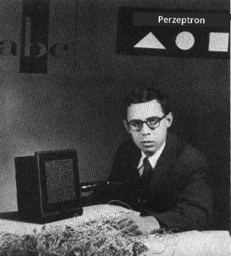
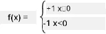

# Einführung in Neuronale Netzwerke: Perzeptron

## [Quiz vor der Vorlesung](https://ff-quizzes.netlify.app/en/ai/quiz/5)

Einer der ersten Versuche, etwas Ähnliches wie ein modernes neuronales Netzwerk zu implementieren, wurde 1957 von Frank Rosenblatt vom Cornell Aeronautical Laboratory unternommen. Es handelte sich um eine Hardware-Implementierung namens "Mark-1", die darauf ausgelegt war, primitive geometrische Figuren wie Dreiecke, Quadrate und Kreise zu erkennen.

|      |      |
|--------------|-----------|
| | |

> Bilder [von Wikipedia](https://en.wikipedia.org/wiki/Perceptron)

Ein Eingabebild wurde durch ein 20x20-Fotodiodenarray dargestellt, sodass das neuronale Netzwerk 400 Eingaben und einen binären Ausgang hatte. Ein einfaches Netzwerk enthielt einen Neuron, auch **Schwellenwert-Logikeinheit** genannt. Die Gewichte des neuronalen Netzwerks fungierten wie Potentiometer, die während der Trainingsphase manuell eingestellt werden mussten.

> ✅ Ein Potentiometer ist ein Gerät, das es dem Benutzer ermöglicht, den Widerstand eines Stromkreises anzupassen.

> Die New York Times schrieb damals über das Perzeptron: *der Embryo eines elektronischen Computers, von dem [die Marine] erwartet, dass er laufen, sprechen, sehen, schreiben, sich selbst reproduzieren und sich seiner Existenz bewusst sein wird.*

## Perzeptron-Modell

Angenommen, wir haben N Merkmale in unserem Modell, in diesem Fall wäre der Eingabevektor ein Vektor der Größe N. Ein Perzeptron ist ein Modell zur **binären Klassifikation**, d.h. es kann zwischen zwei Klassen von Eingabedaten unterscheiden. Wir nehmen an, dass für jeden Eingabevektor x die Ausgabe unseres Perzeptrons entweder +1 oder -1 ist, je nach Klasse. Die Ausgabe wird mit der Formel berechnet:

y(x) = f(w<sup>T</sup>x)

wobei f eine Stufenaktivierungsfunktion ist.

<!-- img src="http://www.sciweavers.org/tex2img.php?eq=f%28x%29%20%3D%20%5Cbegin%7Bcases%7D%0A%20%20%20%20%20%20%20%20%20%2B1%20%26%20x%20%5Cgeq%200%20%5C%5C%0A%20%20%20%20%20%20%20%20%20-1%20%26%20x%20%3C%200%0A%20%20%20%20%20%20%20%5Cend%7Bcases%7D%20%5C%5C%0A&bc=White&fc=Black&im=jpg&fs=12&ff=arev&edit=0" align="center" border="0" alt="f(x) = \begin{cases} +1 & x \geq 0 \\ -1 & x < 0 \end{cases} \\" width="154" height="50" / -->


## Training des Perzeptrons

Um ein Perzeptron zu trainieren, müssen wir einen Gewichtsvektor w finden, der die meisten Werte korrekt klassifiziert, d.h. den kleinsten **Fehler** ergibt. Dieser Fehler E wird durch das **Perzeptron-Kriterium** wie folgt definiert:

E(w) = -&sum;w<sup>T</sup>x<sub>i</sub>t<sub>i</sub>

wobei:

* die Summe über die Trainingsdatenpunkte i genommen wird, die zu einer falschen Klassifikation führen
* x<sub>i</sub> die Eingabedaten sind und t<sub>i</sub> entweder -1 oder +1 für negative bzw. positive Beispiele ist.

Dieses Kriterium wird als Funktion der Gewichte w betrachtet, und wir müssen es minimieren. Oft wird eine Methode namens **Gradientenabstieg** verwendet, bei der wir mit einigen Anfangsgewichten w<sup>(0)</sup> beginnen und die Gewichte bei jedem Schritt gemäß der Formel aktualisieren:

w<sup>(t+1)</sup> = w<sup>(t)</sup> - &eta;&nabla;E(w)

Hier ist &eta; die sogenannte **Lernrate**, und &nabla;E(w) bezeichnet den **Gradienten** von E. Nachdem wir den Gradienten berechnet haben, erhalten wir:

w<sup>(t+1)</sup> = w<sup>(t)</sup> + &sum;&eta;x<sub>i</sub>t<sub>i</sub>

Der Algorithmus in Python sieht wie folgt aus:

```python
def train(positive_examples, negative_examples, num_iterations = 100, eta = 1):

    weights = [0,0,0] # Initialize weights (almost randomly :)
        
    for i in range(num_iterations):
        pos = random.choice(positive_examples)
        neg = random.choice(negative_examples)

        z = np.dot(pos, weights) # compute perceptron output
        if z < 0: # positive example classified as negative
            weights = weights + eta*weights.shape

        z  = np.dot(neg, weights)
        if z >= 0: # negative example classified as positive
            weights = weights - eta*weights.shape

    return weights
```

## Fazit

In dieser Lektion haben Sie etwas über das Perzeptron gelernt, ein Modell zur binären Klassifikation, und wie man es durch die Verwendung eines Gewichtsvektors trainiert.

## 🚀 Herausforderung

Wenn Sie versuchen möchten, Ihr eigenes Perzeptron zu erstellen, probieren Sie [dieses Lab auf Microsoft Learn](https://docs.microsoft.com/en-us/azure/machine-learning/component-reference/two-class-averaged-perceptron?WT.mc_id=academic-77998-cacaste) aus, das den [Azure ML Designer](https://docs.microsoft.com/en-us/azure/machine-learning/concept-designer?WT.mc_id=academic-77998-cacaste) verwendet.

## [Quiz nach der Vorlesung](https://ff-quizzes.netlify.app/en/ai/quiz/6)

## Rückblick & Selbststudium

Um zu sehen, wie wir das Perzeptron verwenden können, um ein Spielzeugproblem sowie reale Probleme zu lösen, und um weiter zu lernen, gehen Sie zum [Perceptron](Perceptron.ipynb)-Notebook.

Hier ist ein interessanter [Artikel über Perzeptrons](https://towardsdatascience.com/what-is-a-perceptron-basics-of-neural-networks-c4cfea20c590).

## [Aufgabe](lab/README.md)

In dieser Lektion haben wir ein Perzeptron für eine binäre Klassifikationsaufgabe implementiert und es verwendet, um zwischen zwei handgeschriebenen Ziffern zu klassifizieren. In diesem Lab sollen Sie das Problem der Ziffernklassifikation vollständig lösen, d.h. bestimmen, welche Ziffer am wahrscheinlichsten zu einem gegebenen Bild gehört.

* [Anleitung](lab/README.md)
* [Notebook](lab/PerceptronMultiClass.ipynb)

---

