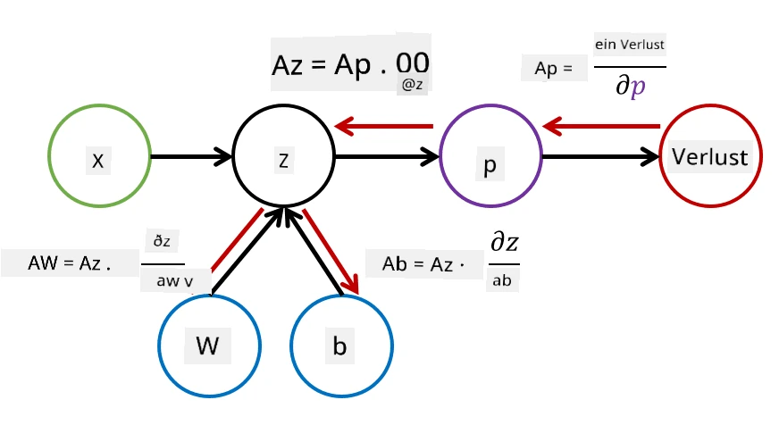

# Einführung in Neuronale Netze. Mehrschichtige Perzeptrons

Im vorherigen Abschnitt hast du das einfachste Modell eines neuronalen Netzes kennengelernt – ein einlagiges Perzeptron, ein lineares Modell zur Klassifikation von zwei Klassen.

In diesem Abschnitt erweitern wir dieses Modell zu einem flexibleren Framework, das uns ermöglicht:

* neben der Zwei-Klassen-Klassifikation auch **Mehrklassen-Klassifikation** durchzuführen
* neben Klassifikationsproblemen auch **Regressionsprobleme** zu lösen
* Klassen zu trennen, die nicht linear separierbar sind

Außerdem entwickeln wir unser eigenes modulares Framework in Python, mit dem wir verschiedene Architekturen neuronaler Netze erstellen können.

## [Quiz vor der Vorlesung](https://ff-quizzes.netlify.app/en/ai/quiz/7)

## Formalisierung des maschinellen Lernens

Beginnen wir mit der Formalisierung des maschinellen Lernproblems. Angenommen, wir haben einen Trainingsdatensatz **X** mit Labels **Y**, und wir müssen ein Modell *f* erstellen, das möglichst genaue Vorhersagen trifft. Die Qualität der Vorhersagen wird durch die **Verlustfunktion** &lagran; gemessen. Die folgenden Verlustfunktionen werden häufig verwendet:

* Für Regressionsprobleme, bei denen wir eine Zahl vorhersagen müssen, können wir den **absoluten Fehler** &sum;i|f(x(i))-y(i)| oder den **quadratischen Fehler** &sum;i(f(x(i))-y(i))2 verwenden.
* Für Klassifikationsprobleme verwenden wir den **0-1-Verlust** (der im Wesentlichen der **Genauigkeit** des Modells entspricht) oder den **logistischen Verlust**.

Für ein einlagiges Perzeptron wurde die Funktion *f* als lineare Funktion definiert: *f(x)=wx+b* (hierbei ist *w* die Gewichtsmatrix, *x* der Vektor der Eingabefeatures und *b* der Bias-Vektor). Für verschiedene Architekturen neuronaler Netze kann diese Funktion eine komplexere Form annehmen.

> Im Fall der Klassifikation ist es oft wünschenswert, Wahrscheinlichkeiten der entsprechenden Klassen als Ausgabe des Netzes zu erhalten. Um beliebige Zahlen in Wahrscheinlichkeiten umzuwandeln (z. B. um die Ausgabe zu normalisieren), verwenden wir oft die **Softmax-Funktion** &sigma;, und die Funktion *f* wird zu *f(x)=&sigma;(wx+b)*.

In der obigen Definition von *f* werden *w* und *b* als **Parameter** &theta;=⟨*w,b*⟩ bezeichnet. Angesichts des Datensatzes ⟨**X**,**Y**⟩ können wir den Gesamterror für den gesamten Datensatz als Funktion der Parameter &theta; berechnen.

> ✅ **Das Ziel des Trainings eines neuronalen Netzes ist es, den Fehler durch Variation der Parameter &theta; zu minimieren.**

## Optimierung durch Gradientenabstieg

Es gibt eine bekannte Methode zur Optimierung von Funktionen, die als **Gradientenabstieg** bezeichnet wird. Die Idee ist, dass wir eine Ableitung (im mehrdimensionalen Fall als **Gradient** bezeichnet) der Verlustfunktion in Bezug auf die Parameter berechnen und die Parameter so variieren können, dass der Fehler abnimmt. Dies kann wie folgt formalisiert werden:

* Initialisiere die Parameter mit zufälligen Werten w(0), b(0)
* Wiederhole die folgenden Schritte viele Male:
    - w(i+1) = w(i)-&eta;&part;&lagran;/&part;w
    - b(i+1) = b(i)-&eta;&part;&lagran;/&part;b

Während des Trainings sollten die Optimierungsschritte unter Berücksichtigung des gesamten Datensatzes berechnet werden (denk daran, dass der Verlust als Summe über alle Trainingsbeispiele berechnet wird). In der Praxis nehmen wir jedoch kleine Teile des Datensatzes, sogenannte **Minibatches**, und berechnen die Gradienten basierend auf einem Teil der Daten. Da der Teil jedes Mal zufällig ausgewählt wird, wird diese Methode als **stochastischer Gradientenabstieg** (SGD) bezeichnet.

## Mehrschichtige Perzeptrons und Backpropagation

Ein einlagiges Netzwerk, wie wir oben gesehen haben, ist in der Lage, linear separierbare Klassen zu klassifizieren. Um ein komplexeres Modell zu erstellen, können wir mehrere Schichten des Netzwerks kombinieren. Mathematisch bedeutet dies, dass die Funktion *f* eine komplexere Form annimmt und in mehreren Schritten berechnet wird:
* z1=w1x+b1
* z2=w2&alpha;(z1)+b2
* f = &sigma;(z2)

Hierbei ist &alpha; eine **nichtlineare Aktivierungsfunktion**, &sigma; eine Softmax-Funktion, und die Parameter sind &theta;=<*w1,b1,w2,b2*>.

Der Algorithmus des Gradientenabstiegs bleibt derselbe, aber die Berechnung der Gradienten wird schwieriger. Mithilfe der Kettenregel der Differentiation können wir die Ableitungen wie folgt berechnen:

* &part;&lagran;/&part;w2 = (&part;&lagran;/&part;&sigma;)(&part;&sigma;/&part;z2)(&part;z2/&part;w2)
* &part;&lagran;/&part;w1 = (&part;&lagran;/&part;&sigma;)(&part;&sigma;/&part;z2)(&part;z2/&part;&alpha;)(&part;&alpha;/&part;z1)(&part;z1/&part;w1)

> ✅ Die Kettenregel der Differentiation wird verwendet, um die Ableitungen der Verlustfunktion in Bezug auf die Parameter zu berechnen.

Beachte, dass der linke Teil all dieser Ausdrücke derselbe ist, und daher können wir die Ableitungen effektiv berechnen, indem wir von der Verlustfunktion ausgehend "rückwärts" durch den Berechnungsgraphen gehen. Daher wird die Methode zum Trainieren eines mehrschichtigen Perzeptrons als **Backpropagation** oder 'Backprop' bezeichnet.

> TODO: Bildquelle angeben

> ✅ Wir werden Backpropagation in unserem Notebook-Beispiel noch viel detaillierter behandeln.

## Fazit

In dieser Lektion haben wir unsere eigene Bibliothek für neuronale Netze erstellt und sie für eine einfache zweidimensionale Klassifikationsaufgabe verwendet.

## 🚀 Herausforderung

Im begleitenden Notebook wirst du dein eigenes Framework zur Erstellung und zum Training mehrschichtiger Perzeptrons implementieren. Du wirst im Detail sehen, wie moderne neuronale Netze funktionieren.

Gehe zum [OwnFramework](OwnFramework.ipynb) Notebook und arbeite es durch.

## [Quiz nach der Vorlesung](https://ff-quizzes.netlify.app/en/ai/quiz/8)

## Rückblick & Selbststudium

Backpropagation ist ein gängiger Algorithmus in KI und ML, der es wert ist, [im Detail untersucht zu werden](https://wikipedia.org/wiki/Backpropagation).

## [Aufgabe](lab/README.md)

In diesem Labor wirst du das Framework, das du in dieser Lektion erstellt hast, verwenden, um die Klassifikation handgeschriebener Ziffern aus dem MNIST-Datensatz zu lösen.

* [Anleitung](lab/README.md)
* [Notebook](lab/MyFW_MNIST.ipynb)

---

