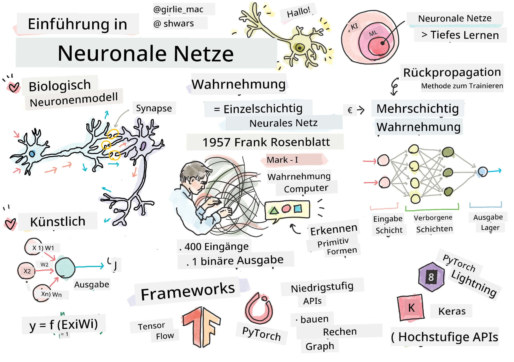
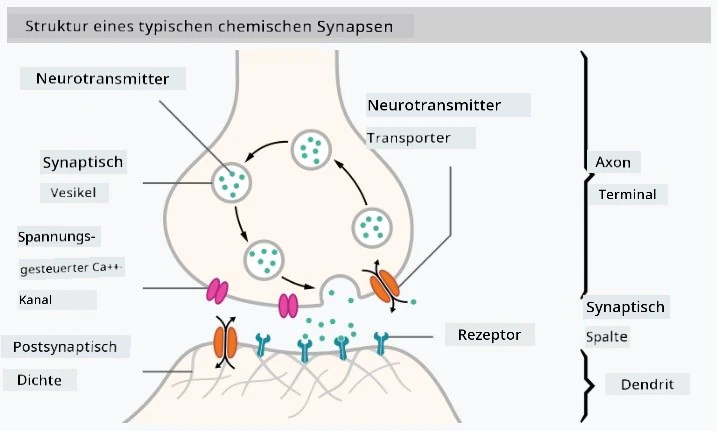

# Einführung in Neuronale Netzwerke

Wie wir in der Einführung besprochen haben, besteht eine Möglichkeit, Intelligenz zu erreichen, darin, ein **Computermodell** oder ein **künstliches Gehirn** zu trainieren. Seit Mitte des 20. Jahrhunderts haben Forscher verschiedene mathematische Modelle ausprobiert, bis sich in den letzten Jahren dieser Ansatz als äußerst erfolgreich erwiesen hat. Solche mathematischen Modelle des Gehirns werden als **neuronale Netzwerke** bezeichnet.

> Manchmal werden neuronale Netzwerke als *Künstliche Neuronale Netzwerke* (Artificial Neural Networks, ANNs) bezeichnet, um klarzustellen, dass es sich um Modelle handelt und nicht um echte Netzwerke von Neuronen.

## Maschinelles Lernen

Neuronale Netzwerke sind Teil einer größeren Disziplin namens **Maschinelles Lernen**, deren Ziel es ist, Daten zu nutzen, um Computermodelle zu trainieren, die Probleme lösen können. Maschinelles Lernen macht einen großen Teil der Künstlichen Intelligenz aus, jedoch behandeln wir in diesem Lehrplan nicht das klassische ML.

> Besuchen Sie unseren separaten **[Maschinelles Lernen für Anfänger](http://github.com/microsoft/ml-for-beginners)** Lehrplan, um mehr über klassisches Maschinelles Lernen zu erfahren.

Im Maschinellen Lernen gehen wir davon aus, dass wir einen Datensatz mit Beispielen **X** und den entsprechenden Ausgabewerten **Y** haben. Beispiele sind oft N-dimensionale Vektoren, die aus **Merkmalen** bestehen, und Ausgaben werden als **Labels** bezeichnet.

Wir betrachten die zwei häufigsten Probleme des Maschinellen Lernens:

* **Klassifikation**, bei der wir ein Eingabeobjekt in zwei oder mehr Klassen einordnen müssen.
* **Regression**, bei der wir für jede Eingabeprobe eine numerische Zahl vorhersagen müssen.

> Wenn Eingaben und Ausgaben als Tensoren dargestellt werden, ist der Eingabedatensatz eine Matrix der Größe M&times;N, wobei M die Anzahl der Proben und N die Anzahl der Merkmale ist. Die Ausgabelabels **Y** sind ein Vektor der Größe M.

In diesem Lehrplan konzentrieren wir uns ausschließlich auf Modelle neuronaler Netzwerke.

## Ein Modell eines Neurons

Aus der Biologie wissen wir, dass unser Gehirn aus Nervenzellen (Neuronen) besteht, von denen jede mehrere "Eingänge" (Dendriten) und einen einzigen "Ausgang" (Axon) hat. Sowohl Dendriten als auch Axone können elektrische Signale leiten, und die Verbindungen zwischen ihnen — bekannt als Synapsen — können unterschiedliche Grade der Leitfähigkeit aufweisen, die durch Neurotransmitter reguliert werden.

 | 
----|----
Echtes Neuron *([Bild](https://en.wikipedia.org/wiki/Synapse#/media/File:SynapseSchematic_lines.svg) von Wikipedia)* | Künstliches Neuron *(Bild vom Autor)*

Das einfachste mathematische Modell eines Neurons enthält daher mehrere Eingänge X1, ..., XN und einen Ausgang Y sowie eine Reihe von Gewichten W1, ..., WN. Der Ausgang wird berechnet als:

wobei **f** eine nichtlineare **Aktivierungsfunktion** ist.

> Frühe Modelle von Neuronen wurden in dem klassischen Artikel [A logical calculus of the ideas immanent in nervous activity](https://www.cs.cmu.edu/~./epxing/Class/10715/reading/McCulloch.and.Pitts.pdf) von Warren McCullock und Walter Pitts im Jahr 1943 beschrieben. Donald Hebb schlug in seinem Buch "[The Organization of Behavior: A Neuropsychological Theory](https://books.google.com/books?id=VNetYrB8EBoC)" vor, wie solche Netzwerke trainiert werden können.

## In diesem Abschnitt

In diesem Abschnitt lernen wir:
* [Perceptron](03-Perceptron/README.md), eines der frühesten neuronalen Netzwerkmodelle für Zwei-Klassen-Klassifikation
* [Mehrschichtige Netzwerke](04-OwnFramework/README.md) mit einem zugehörigen Notebook [wie man unser eigenes Framework erstellt](04-OwnFramework/OwnFramework.ipynb)
* [Frameworks für neuronale Netzwerke](05-Frameworks/README.md), mit diesen Notebooks: [PyTorch](05-Frameworks/IntroPyTorch.ipynb) und [Keras/Tensorflow](05-Frameworks/IntroKerasTF.ipynb)
* [Overfitting](../../../../lessons/3-NeuralNetworks/05-Frameworks)

---

**Haftungsausschluss**:  
Dieses Dokument wurde mit dem KI-Übersetzungsdienst [Co-op Translator](https://github.com/Azure/co-op-translator) übersetzt. Obwohl wir uns um Genauigkeit bemühen, beachten Sie bitte, dass automatisierte Übersetzungen Fehler oder Ungenauigkeiten enthalten können. Das Originaldokument in seiner ursprünglichen Sprache sollte als maßgebliche Quelle betrachtet werden. Für kritische Informationen wird eine professionelle menschliche Übersetzung empfohlen. Wir übernehmen keine Haftung für Missverständnisse oder Fehlinterpretationen, die sich aus der Nutzung dieser Übersetzung ergeben.