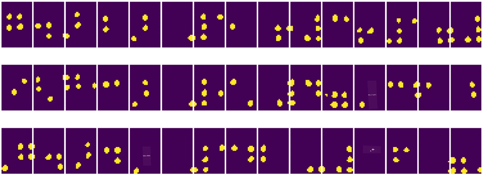

# Einführung in Computer Vision

[Computer Vision](https://wikipedia.org/wiki/Computer_vision) ist ein Fachgebiet, dessen Ziel es ist, Computern ein hochentwickeltes Verständnis von digitalen Bildern zu ermöglichen. Dies ist eine recht breite Definition, da *Verständnis* viele verschiedene Dinge bedeuten kann, wie z. B. das Finden eines Objekts auf einem Bild (**Objekterkennung**), das Verstehen, was passiert (**Ereigniserkennung**), das Beschreiben eines Bildes in Text oder die Rekonstruktion einer Szene in 3D. Es gibt auch spezielle Aufgaben im Zusammenhang mit menschlichen Bildern: Alter- und Emotionserkennung, Gesichtserkennung und -identifikation sowie 3D-Pose-Schätzung, um nur einige zu nennen.

## [Quiz vor der Vorlesung](https://ff-quizzes.netlify.app/en/ai/quiz/11)

Eine der einfachsten Aufgaben von Computer Vision ist die **Bildklassifikation**.

Computer Vision wird oft als ein Teilbereich der KI betrachtet. Heutzutage werden die meisten Aufgaben in der Computer Vision mit neuronalen Netzwerken gelöst. Wir werden mehr über die spezielle Art von neuronalen Netzwerken lernen, die für Computer Vision verwendet werden, [Convolutional Neural Networks](../07-ConvNets/README.md), im Verlauf dieses Abschnitts.

Bevor Sie jedoch ein Bild an ein neuronales Netzwerk weitergeben, macht es in vielen Fällen Sinn, einige algorithmische Techniken anzuwenden, um das Bild zu verbessern.

Es gibt mehrere Python-Bibliotheken für die Bildverarbeitung:

* **[imageio](https://imageio.readthedocs.io/en/stable/)** kann verwendet werden, um verschiedene Bildformate zu lesen/schreiben. Es unterstützt auch ffmpeg, ein nützliches Tool, um Videobilder in Einzelbilder umzuwandeln.
* **[Pillow](https://pillow.readthedocs.io/en/stable/index.html)** (auch bekannt als PIL) ist etwas leistungsfähiger und unterstützt auch einige Bildmanipulationen wie Morphing, Farbpalettenanpassungen und mehr.
* **[OpenCV](https://opencv.org/)** ist eine leistungsstarke Bildverarbeitungsbibliothek, die in C++ geschrieben wurde und zum *de facto* Standard für Bildverarbeitung geworden ist. Sie verfügt über eine praktische Python-Schnittstelle.
* **[dlib](http://dlib.net/)** ist eine C++-Bibliothek, die viele maschinelle Lernalgorithmen implementiert, einschließlich einiger Computer-Vision-Algorithmen. Sie verfügt ebenfalls über eine Python-Schnittstelle und kann für anspruchsvolle Aufgaben wie Gesichts- und Gesichtspunkt-Erkennung verwendet werden.

## OpenCV

[OpenCV](https://opencv.org/) gilt als der *de facto* Standard für Bildverarbeitung. Es enthält viele nützliche Algorithmen, die in C++ implementiert sind. Sie können OpenCV auch von Python aus verwenden.

Eine gute Einführung in OpenCV bietet [dieser Learn OpenCV Kurs](https://learnopencv.com/getting-started-with-opencv/). In unserem Lehrplan ist es nicht unser Ziel, OpenCV zu lernen, sondern Ihnen einige Beispiele zu zeigen, wann und wie es verwendet werden kann.

### Bilder laden

Bilder in Python können bequem durch NumPy-Arrays dargestellt werden. Zum Beispiel würden Graustufenbilder mit einer Größe von 320x200 Pixeln in einem 200x320-Array gespeichert, und Farbbilder derselben Dimension hätten die Form 200x320x3 (für 3 Farbkanäle). Um ein Bild zu laden, können Sie den folgenden Code verwenden:

```python
import cv2
import matplotlib.pyplot as plt

im = cv2.imread('image.jpeg')
plt.imshow(im)
```

Traditionell verwendet OpenCV BGR (Blau-Grün-Rot) Kodierung für Farbbilder, während die meisten anderen Python-Tools die traditionellere RGB (Rot-Grün-Blau) Kodierung verwenden. Damit das Bild korrekt angezeigt wird, müssen Sie es in den RGB-Farbraum konvertieren, entweder durch das Tauschen der Dimensionen im NumPy-Array oder durch Aufrufen einer OpenCV-Funktion:

```python
im = cv2.cvtColor(im,cv2.COLOR_BGR2RGB)
```

Die gleiche `cvtColor`-Funktion kann verwendet werden, um andere Farbraumtransformationen durchzuführen, wie z. B. die Umwandlung eines Bildes in Graustufen oder in den HSV-Farbraum (Farbton-Sättigung-Helligkeit).

Sie können OpenCV auch verwenden, um Video Bild für Bild zu laden – ein Beispiel finden Sie in der Übung [OpenCV Notebook](OpenCV.ipynb).

### Bildverarbeitung

Bevor Sie ein Bild an ein neuronales Netzwerk weitergeben, möchten Sie möglicherweise mehrere Vorverarbeitungsschritte anwenden. OpenCV kann viele Dinge tun, darunter:

* **Größenänderung** des Bildes mit `im = cv2.resize(im, (320,200),interpolation=cv2.INTER_LANCZOS)`
* **Unschärfe** des Bildes mit `im = cv2.medianBlur(im,3)` oder `im = cv2.GaussianBlur(im, (3,3), 0)`
* Änderung der **Helligkeit und des Kontrasts** des Bildes durch NumPy-Array-Manipulationen, wie in [dieser Stackoverflow-Notiz](https://stackoverflow.com/questions/39308030/how-do-i-increase-the-contrast-of-an-image-in-python-opencv) beschrieben.
* Verwendung von [Thresholding](https://docs.opencv.org/4.x/d7/d4d/tutorial_py_thresholding.html) durch Aufrufen der Funktionen `cv2.threshold`/`cv2.adaptiveThreshold`, was oft vorzuziehen ist gegenüber der Anpassung von Helligkeit oder Kontrast.
* Anwendung verschiedener [Transformationen](https://docs.opencv.org/4.5.5/da/d6e/tutorial_py_geometric_transformations.html) auf das Bild:
    - **[Affine Transformationen](https://docs.opencv.org/4.5.5/d4/d61/tutorial_warp_affine.html)** können nützlich sein, wenn Sie Rotation, Größenänderung und Verzerrung des Bildes kombinieren müssen und die Quell- und Zielposition von drei Punkten im Bild kennen. Affine Transformationen halten parallele Linien parallel.
    - **[Perspektivische Transformationen](https://medium.com/analytics-vidhya/opencv-perspective-transformation-9edffefb2143)** können nützlich sein, wenn Sie die Quell- und Zielpositionen von 4 Punkten im Bild kennen. Zum Beispiel, wenn Sie ein rechteckiges Dokument mit einer Smartphone-Kamera aus einem Winkel fotografieren und ein rechteckiges Bild des Dokuments selbst erstellen möchten.
* Bewegungserkennung im Bild durch **[Optischen Fluss](https://docs.opencv.org/4.5.5/d4/dee/tutorial_optical_flow.html)**.

## Beispiele für die Verwendung von Computer Vision

In unserem [OpenCV Notebook](OpenCV.ipynb) geben wir einige Beispiele, wann Computer Vision verwendet werden kann, um spezifische Aufgaben zu erfüllen:

* **Vorverarbeitung eines Fotos eines Braille-Buchs**. Wir konzentrieren uns darauf, wie wir Thresholding, Merkmalserkennung, perspektivische Transformation und NumPy-Manipulationen verwenden können, um einzelne Braille-Symbole für die weitere Klassifikation durch ein neuronales Netzwerk zu trennen.

 |  | 
----|-----|-----

> Bild aus [OpenCV.ipynb](OpenCV.ipynb)

* **Bewegungserkennung in Videos durch Frame-Differenz**. Wenn die Kamera fixiert ist, sollten die Frames des Kamerafeeds ziemlich ähnlich zueinander sein. Da Frames als Arrays dargestellt werden, erhalten wir durch das Subtrahieren dieser Arrays für zwei aufeinanderfolgende Frames die Pixelunterschiede, die bei statischen Frames gering sein sollten und bei erheblicher Bewegung im Bild höher werden.


> Bild aus [OpenCV.ipynb](OpenCV.ipynb)

* **Bewegungserkennung mit Optischem Fluss**. [Optischer Fluss](https://docs.opencv.org/3.4/d4/dee/tutorial_optical_flow.html) ermöglicht es uns zu verstehen, wie sich einzelne Pixel in Video-Frames bewegen. Es gibt zwei Arten von optischem Fluss:

   - **Dichter Optischer Fluss** berechnet das Vektorfeld, das zeigt, wohin sich jeder Pixel bewegt.
   - **Spärlicher Optischer Fluss** basiert darauf, einige markante Merkmale im Bild (z. B. Kanten) zu nehmen und deren Trajektorie von Frame zu Frame zu erstellen.


> Bild aus [OpenCV.ipynb](OpenCV.ipynb)

## ✍️ Beispiel-Notebooks: OpenCV [OpenCV in Aktion ausprobieren](OpenCV.ipynb)

Lassen Sie uns einige Experimente mit OpenCV durchführen, indem wir [OpenCV Notebook](OpenCV.ipynb) erkunden.

## Fazit

Manchmal können relativ komplexe Aufgaben wie Bewegungserkennung oder Fingerspitzen-Erkennung rein durch Computer Vision gelöst werden. Daher ist es sehr hilfreich, die grundlegenden Techniken der Computer Vision zu kennen und zu wissen, was Bibliotheken wie OpenCV leisten können.

## 🚀 Herausforderung

Sehen Sie sich [dieses Video](https://docs.microsoft.com/shows/ai-show/ai-show--2021-opencv-ai-competition--grand-prize-winners--cortic-tigers--episode-32?WT.mc_id=academic-77998-cacaste) aus der AI-Show an, um mehr über das Cortic Tigers-Projekt zu erfahren und wie sie eine blockbasierte Lösung entwickelt haben, um Computer-Vision-Aufgaben über einen Roboter zu demokratisieren. Recherchieren Sie weitere Projekte wie dieses, die neuen Lernenden den Einstieg in das Fachgebiet erleichtern.

## [Quiz nach der Vorlesung](https://ff-quizzes.netlify.app/en/ai/quiz/12)

## Überprüfung & Selbststudium

Lesen Sie mehr über optischen Fluss [in diesem großartigen Tutorial](https://learnopencv.com/optical-flow-in-opencv/).

## [Aufgabe](lab/README.md)

In diesem Labor werden Sie ein Video mit einfachen Gesten aufnehmen, und Ihr Ziel ist es, Aufwärts-/Abwärts-/Links-/Rechts-Bewegungen mithilfe des optischen Flusses zu extrahieren.


---

