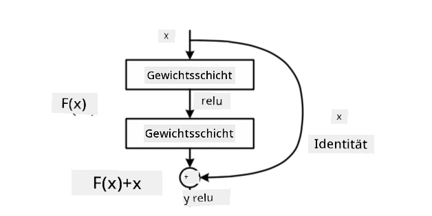

# Bekannte CNN-Architekturen

### VGG-16

VGG-16 ist ein Netzwerk, das 2014 eine Genauigkeit von 92,7 % bei der ImageNet-Top-5-Klassifikation erreichte. Es hat die folgende Schichtstruktur:

Wie man sehen kann, folgt VGG einer traditionellen Pyramidenarchitektur, die aus einer Abfolge von Convolution-Pooling-Schichten besteht.

> Bild von [Researchgate](https://www.researchgate.net/figure/Vgg16-model-structure-To-get-the-VGG-NIN-model-we-replace-the-2-nd-4-th-6-th-7-th_fig2_335194493)

### ResNet

ResNet ist eine Modellfamilie, die 2015 von Microsoft Research vorgeschlagen wurde. Die Hauptidee von ResNet ist die Verwendung von **Residual Blocks**:

> Bild aus [diesem Paper](https://arxiv.org/pdf/1512.03385.pdf)

Der Grund für die Verwendung von Identity-Pass-Through ist, dass die Schicht **die Differenz** zwischen dem Ergebnis einer vorherigen Schicht und dem Output des Residual Blocks vorhersagen soll – daher der Name *residual*. Diese Blöcke sind viel einfacher zu trainieren, und man kann Netzwerke mit mehreren Hunderten dieser Blöcke konstruieren (die häufigsten Varianten sind ResNet-52, ResNet-101 und ResNet-152).

Man kann sich dieses Netzwerk auch so vorstellen, dass es seine Komplexität an den Datensatz anpassen kann. Zu Beginn des Trainings sind die Gewichtswerte klein, und die meisten Signale gehen durch die Identity-Layer. Im Laufe des Trainings, wenn die Gewichte größer werden, steigt die Bedeutung der Netzwerkparameter, und das Netzwerk passt sich an, um die erforderliche Ausdruckskraft zu erreichen, um die Trainingsbilder korrekt zu klassifizieren.

### Google Inception

Die Google Inception-Architektur geht einen Schritt weiter und baut jede Netzwerkschicht als Kombination aus mehreren verschiedenen Pfaden:

> Bild von [Researchgate](https://www.researchgate.net/figure/Inception-module-with-dimension-reductions-left-and-schema-for-Inception-ResNet-v1_fig2_355547454)

Hier müssen wir die Rolle der 1x1-Convolutions hervorheben, da sie zunächst keinen Sinn ergeben. Warum sollte man ein Bild mit einem 1x1-Filter durchlaufen? Man muss jedoch bedenken, dass Convolution-Filter auch mit mehreren Tiefenkanälen arbeiten (ursprünglich RGB-Farben, in nachfolgenden Schichten Kanäle für verschiedene Filter), und die 1x1-Convolution wird verwendet, um diese Eingabekanäle mit unterschiedlichen trainierbaren Gewichten zu mischen. Sie kann auch als Downsampling (Pooling) über die Kanaldimension betrachtet werden.

Hier ist [ein guter Blogbeitrag](https://medium.com/analytics-vidhya/talented-mr-1x1-comprehensive-look-at-1x1-convolution-in-deep-learning-f6b355825578) zu diesem Thema und [das Original-Paper](https://arxiv.org/pdf/1312.4400.pdf).

### MobileNet

MobileNet ist eine Modellfamilie mit reduzierter Größe, die für mobile Geräte geeignet ist. Verwenden Sie sie, wenn Sie wenig Ressourcen haben und ein wenig Genauigkeit opfern können. Die Hauptidee dahinter ist die sogenannte **Depthwise Separable Convolution**, die es ermöglicht, Convolution-Filter durch eine Zusammensetzung von räumlichen Convolutions und 1x1-Convolution über Tiefenkanäle darzustellen. Dies reduziert die Anzahl der Parameter erheblich, wodurch das Netzwerk kleiner wird und auch mit weniger Daten leichter zu trainieren ist.

Hier ist [ein guter Blogbeitrag über MobileNet](https://medium.com/analytics-vidhya/image-classification-with-mobilenet-cc6fbb2cd470).

## Fazit

In dieser Einheit haben Sie das Hauptkonzept hinter neuronalen Netzwerken für Computer Vision gelernt – Convolutional Networks. Realitätsnahe Architekturen, die Bildklassifikation, Objekterkennung und sogar Bildgenerierungsnetzwerke antreiben, basieren alle auf CNNs, nur mit mehr Schichten und einigen zusätzlichen Trainingstricks.

## 🚀 Herausforderung

In den begleitenden Notebooks gibt es am Ende Hinweise darauf, wie man eine höhere Genauigkeit erzielen kann. Führen Sie einige Experimente durch, um zu sehen, ob Sie eine höhere Genauigkeit erreichen können.

## [Quiz nach der Vorlesung](https://ff-quizzes.netlify.app/en/ai/quiz/14)

## Rückblick & Selbststudium

Während CNNs am häufigsten für Aufgaben im Bereich Computer Vision verwendet werden, eignen sie sich im Allgemeinen gut für die Extraktion von Mustern fester Größe. Wenn wir beispielsweise mit Geräuschen arbeiten, möchten wir möglicherweise auch CNNs verwenden, um nach bestimmten Mustern im Audiosignal zu suchen – in diesem Fall wären die Filter eindimensional (und dieses CNN würde als 1D-CNN bezeichnet). Außerdem wird manchmal 3D-CNN verwendet, um Merkmale in einem mehrdimensionalen Raum zu extrahieren, wie bestimmte Ereignisse, die in Videos auftreten – CNN kann bestimmte Muster von Merkmalsänderungen über die Zeit erfassen. Machen Sie eine Rückschau und ein Selbststudium über andere Aufgaben, die mit CNNs erledigt werden können.

## [Aufgabe](lab/README.md)

In diesem Labor sollen Sie verschiedene Katzen- und Hunderassen klassifizieren. Diese Bilder sind komplexer als der MNIST-Datensatz, haben höhere Dimensionen und es gibt mehr als 10 Klassen.

---

