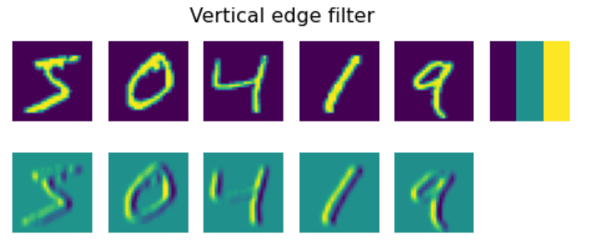

# Convolutional Neural Networks

Wir haben bereits gesehen, dass neuronale Netze ziemlich gut mit Bildern umgehen können, und sogar ein einstufiger Perzeptron in der Lage ist, handgeschriebene Ziffern aus dem MNIST-Datensatz mit angemessener Genauigkeit zu erkennen. Der MNIST-Datensatz ist jedoch sehr speziell, und alle Ziffern sind zentriert im Bild, was die Aufgabe einfacher macht.

## [Vorlesungsquiz](https://red-field-0a6ddfd03.1.azurestaticapps.net/quiz/107)

Im echten Leben möchten wir in der Lage sein, Objekte auf einem Bild unabhängig von ihrer genauen Position im Bild zu erkennen. Die Computer Vision unterscheidet sich von der allgemeinen Klassifikation, denn wenn wir versuchen, ein bestimmtes Objekt im Bild zu finden, scannen wir das Bild nach bestimmten **Mustern** und deren Kombinationen. Zum Beispiel, wenn wir nach einer Katze suchen, schauen wir zuerst nach horizontalen Linien, die Schnurrhaare bilden können, und dann kann eine bestimmte Kombination von Schnurrhaaren uns sagen, dass es sich tatsächlich um ein Bild einer Katze handelt. Die relative Position und das Vorhandensein bestimmter Muster sind wichtig, nicht ihre genaue Position im Bild.

Um Muster zu extrahieren, verwenden wir das Konzept der **konvolutionalen Filter**. Wie Sie wissen, wird ein Bild durch eine 2D-Matrix oder einen 3D-Tensor mit Farbtiefe dargestellt. Das Anwenden eines Filters bedeutet, dass wir eine relativ kleine **Filterkernel**-Matrix nehmen und für jedes Pixel im ursprünglichen Bild den gewichteten Durchschnitt mit benachbarten Punkten berechnen. Wir können dies als ein kleines Fenster betrachten, das über das gesamte Bild gleitet und alle Pixel gemäß den Gewichten in der Filterkernel-Matrix mittelt.

 | 
----|----

> Bild von Dmitry Soshnikov

Wenn wir beispielsweise 3x3 vertikale und horizontale Kantensfilter auf die MNIST-Ziffern anwenden, können wir Hervorhebungen (z.B. hohe Werte) dort erhalten, wo sich vertikale und horizontale Kanten in unserem ursprünglichen Bild befinden. Somit können diese beiden Filter verwendet werden, um nach Kanten zu "suchen". Ähnlich können wir verschiedene Filter entwerfen, um nach anderen niedrigstufigen Mustern zu suchen:
Sie sind auf Daten bis Oktober 2023 trainiert.

> Bild von [Leung-Malik Filterbank](https://www.robots.ox.ac.uk/~vgg/research/texclass/filters.html)

Obwohl wir die Filter manuell entwerfen können, um einige Muster zu extrahieren, können wir das Netzwerk auch so gestalten, dass es die Muster automatisch lernt. Das ist eine der Hauptideen hinter dem CNN.

## Hauptideen hinter CNN

Die Funktionsweise von CNNs basiert auf den folgenden wichtigen Ideen:

* Konvolutionale Filter können Muster extrahieren
* Wir können das Netzwerk so gestalten, dass die Filter automatisch trainiert werden
* Wir können denselben Ansatz verwenden, um Muster in hochgradigen Merkmalen zu finden, nicht nur im ursprünglichen Bild. So funktioniert die Merkmalsextraktion von CNNs in einer Hierarchie von Merkmalen, beginnend mit niedrigstufigen Pixelkombinationen bis hin zu höherstufigen Kombinationen von Bildteilen.

> Bild aus [einer Arbeit von Hislop-Lynch](https://www.semanticscholar.org/paper/Computer-vision-based-pedestrian-trajectory-Hislop-Lynch/26e6f74853fc9bbb7487b06dc2cf095d36c9021d), basierend auf [ihrer Forschung](https://dl.acm.org/doi/abs/10.1145/1553374.1553453)

## ✍️ Übungen: Convolutional Neural Networks

Lassen Sie uns weiterhin erkunden, wie konvolutionale neuronale Netze funktionieren und wie wir trainierbare Filter erreichen können, indem wir die entsprechenden Notebooks durchgehen:

* [Convolutional Neural Networks - PyTorch](../../../../../lessons/4-ComputerVision/07-ConvNets/ConvNetsPyTorch.ipynb)
* [Convolutional Neural Networks - TensorFlow](../../../../../lessons/4-ComputerVision/07-ConvNets/ConvNetsTF.ipynb)

## Pyramid Architecture

Die meisten der für die Bildverarbeitung verwendeten CNNs folgen einer sogenannten Pyramid-Architektur. Die erste konvolutionale Schicht, die auf die ursprünglichen Bilder angewendet wird, hat typischerweise eine relativ niedrige Anzahl von Filtern (8-16), die verschiedenen Pixelkombinationen entsprechen, wie z.B. horizontalen/vertikalen Linien von Strichen. Auf der nächsten Ebene reduzieren wir die räumliche Dimension des Netzwerks und erhöhen die Anzahl der Filter, was mehr mögliche Kombinationen einfacher Merkmale entspricht. Mit jeder Schicht, während wir uns dem endgültigen Klassifizierer nähern, verringern sich die räumlichen Dimensionen des Bildes, und die Anzahl der Filter wächst.

Als Beispiel schauen wir uns die Architektur von VGG-16 an, einem Netzwerk, das 2014 eine Genauigkeit von 92,7 % in der Top-5-Klassifikation von ImageNet erreicht hat:

> Bild von [Researchgate](https://www.researchgate.net/figure/Vgg16-model-structure-To-get-the-VGG-NIN-model-we-replace-the-2-nd-4-th-6-th-7-th_fig2_335194493)

## Bekannteste CNN-Architekturen

[Setzen Sie Ihr Studium über die bekanntesten CNN-Architekturen fort](CNN_Architectures.md)

**Haftungsausschluss**:  
Dieses Dokument wurde mit maschinellen KI-Übersetzungsdiensten übersetzt. Obwohl wir uns um Genauigkeit bemühen, beachten Sie bitte, dass automatisierte Übersetzungen Fehler oder Ungenauigkeiten enthalten können. Das Originaldokument in seiner ursprünglichen Sprache sollte als die maßgebliche Quelle betrachtet werden. Für kritische Informationen wird eine professionelle menschliche Übersetzung empfohlen. Wir übernehmen keine Haftung für Missverständnisse oder Fehlinterpretationen, die aus der Verwendung dieser Übersetzung entstehen.