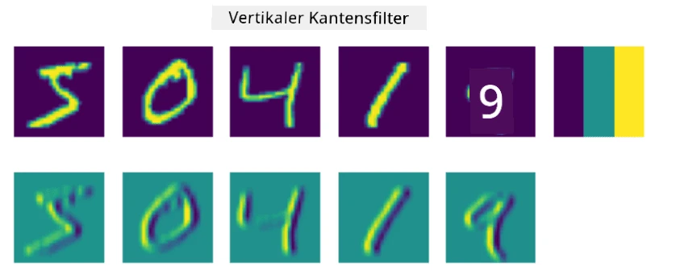
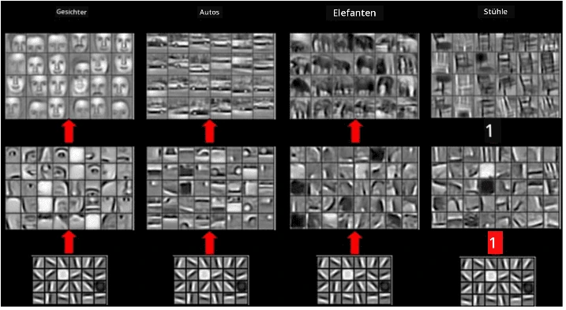
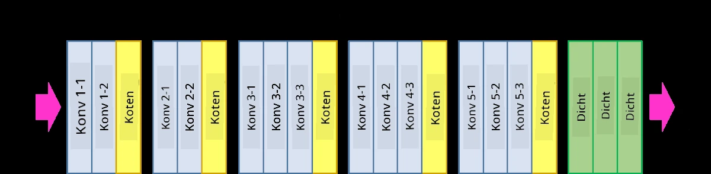
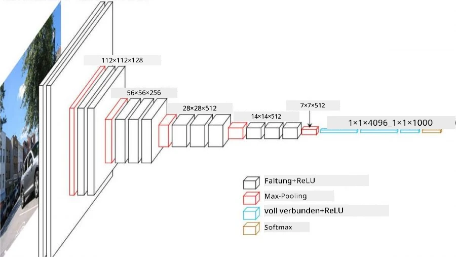

# Convolutional Neural Networks

Wir haben bereits gesehen, dass neuronale Netze recht gut mit Bildern umgehen können, und selbst ein Ein-Schicht-Perzeptron ist in der Lage, handgeschriebene Ziffern aus dem MNIST-Datensatz mit einer akzeptablen Genauigkeit zu erkennen. Der MNIST-Datensatz ist jedoch etwas Besonderes, da alle Ziffern zentriert im Bild dargestellt sind, was die Aufgabe vereinfacht.

## [Quiz vor der Vorlesung](https://ff-quizzes.netlify.app/en/ai/quiz/13)

Im echten Leben möchten wir Objekte auf einem Bild unabhängig von ihrer genauen Position im Bild erkennen können. Computer Vision unterscheidet sich von allgemeiner Klassifikation, da wir beim Versuch, ein bestimmtes Objekt im Bild zu finden, das Bild nach spezifischen **Mustern** und deren Kombinationen durchsuchen. Zum Beispiel, wenn wir nach einer Katze suchen, könnten wir zunächst nach horizontalen Linien suchen, die Schnurrhaare bilden können, und dann kann eine bestimmte Kombination von Schnurrhaaren uns sagen, dass es sich tatsächlich um ein Bild einer Katze handelt. Die relative Position und das Vorhandensein bestimmter Muster sind wichtig, nicht jedoch deren exakte Position im Bild.

Um Muster zu extrahieren, verwenden wir den Begriff der **Faltung (Convolutional Filters)**. Wie du weißt, wird ein Bild durch eine 2D-Matrix oder einen 3D-Tensor mit Farbtiefe dargestellt. Das Anwenden eines Filters bedeutet, dass wir eine relativ kleine **Filterkern**-Matrix nehmen und für jedes Pixel im Originalbild den gewichteten Durchschnitt mit benachbarten Punkten berechnen. Man kann sich das wie ein kleines Fenster vorstellen, das über das gesamte Bild gleitet und alle Pixel gemäß den Gewichten in der Filterkern-Matrix mittelt.

 | 
----|----

> Bild von Dmitry Soshnikov

Wenn wir beispielsweise 3x3-Filter für vertikale und horizontale Kanten auf die MNIST-Ziffern anwenden, können wir Bereiche hervorheben (z. B. hohe Werte), in denen es vertikale und horizontale Kanten im Originalbild gibt. Diese beiden Filter können also verwendet werden, um "nach" Kanten zu suchen. Ebenso können wir verschiedene Filter entwerfen, um nach anderen grundlegenden Mustern zu suchen:

> Bild des [Leung-Malik Filter Bank](https://www.robots.ox.ac.uk/~vgg/research/texclass/filters.html)

Während wir die Filter manuell entwerfen können, um bestimmte Muster zu extrahieren, können wir das Netzwerk auch so gestalten, dass es die Muster automatisch lernt. Dies ist eine der Hauptideen hinter CNNs.

## Hauptideen hinter CNNs

Die Funktionsweise von CNNs basiert auf den folgenden wichtigen Konzepten:

* Faltungsfilter können Muster extrahieren.
* Wir können das Netzwerk so gestalten, dass die Filter automatisch trainiert werden.
* Wir können denselben Ansatz verwenden, um Muster in hochrangigen Merkmalen zu finden, nicht nur im Originalbild. Die Merkmalsextraktion in CNNs arbeitet also mit einer Hierarchie von Merkmalen, beginnend mit einfachen Pixelkombinationen bis hin zu komplexeren Kombinationen von Bildteilen.

> Bild aus [einem Paper von Hislop-Lynch](https://www.semanticscholar.org/paper/Computer-vision-based-pedestrian-trajectory-Hislop-Lynch/26e6f74853fc9bbb7487b06dc2cf095d36c9021d), basierend auf [ihrer Forschung](https://dl.acm.org/doi/abs/10.1145/1553374.1553453)

## ✍️ Übungen: Convolutional Neural Networks

Lass uns weiter erkunden, wie Convolutional Neural Networks funktionieren und wie wir trainierbare Filter erreichen können, indem wir die entsprechenden Notebooks durcharbeiten:

* [Convolutional Neural Networks - PyTorch](ConvNetsPyTorch.ipynb)
* [Convolutional Neural Networks - TensorFlow](ConvNetsTF.ipynb)

## Pyramidenarchitektur

Die meisten CNNs, die für die Bildverarbeitung verwendet werden, folgen einer sogenannten Pyramidenarchitektur. Die erste Faltungsschicht, die auf die Originalbilder angewendet wird, hat typischerweise eine relativ geringe Anzahl von Filtern (8-16), die verschiedenen Pixelkombinationen entsprechen, wie z. B. horizontalen/vertikalen Linien oder Strichen. Auf der nächsten Ebene reduzieren wir die räumliche Dimension des Netzwerks und erhöhen die Anzahl der Filter, was mehr mögliche Kombinationen einfacher Merkmale ermöglicht. Mit jeder Schicht, die wir uns dem finalen Klassifikator nähern, nehmen die räumlichen Dimensionen des Bildes ab, während die Anzahl der Filter zunimmt.

Als Beispiel betrachten wir die Architektur von VGG-16, einem Netzwerk, das 2014 eine Genauigkeit von 92,7 % in der Top-5-Klassifikation von ImageNet erreichte:

> Bild von [Researchgate](https://www.researchgate.net/figure/Vgg16-model-structure-To-get-the-VGG-NIN-model-we-replace-the-2-nd-4-th-6-th-7-th_fig2_335194493)

## Bekannteste CNN-Architekturen

[Setze dein Studium über die bekanntesten CNN-Architekturen fort](CNN_Architectures.md)

---

