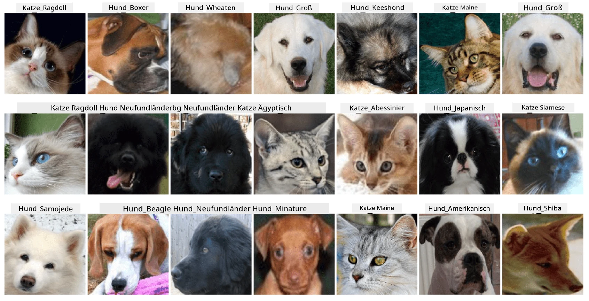

# Klassifikation von Haustiergesichtern

Laboraufgabe aus dem [AI for Beginners Curriculum](https://github.com/microsoft/ai-for-beginners).

## Aufgabe

Stellen Sie sich vor, Sie müssen eine Anwendung für eine Tierpension entwickeln, um alle Haustiere zu katalogisieren. Eine großartige Funktion einer solchen Anwendung wäre die automatische Erkennung der Rasse anhand eines Fotos. Dies kann erfolgreich mit neuronalen Netzwerken durchgeführt werden.

Sie müssen ein konvolutionales neuronales Netzwerk trainieren, um verschiedene Katzen- und Hunderassen mithilfe des **Pet Faces**-Datensatzes zu klassifizieren.

## Der Datensatz

Wir verwenden den [Oxford-IIIT Pet Dataset](https://www.robots.ox.ac.uk/~vgg/data/pets/), der Bilder von 37 verschiedenen Hunde- und Katzenrassen enthält.



Um den Datensatz herunterzuladen, verwenden Sie diesen Code-Schnipsel:

```python
!wget https://thor.robots.ox.ac.uk/~vgg/data/pets/images.tar.gz
!tar xfz images.tar.gz
!rm images.tar.gz
```

**Hinweis:** Die Bilder des Oxford-IIIT Pet Dataset sind nach Dateinamen organisiert (z. B. `Abyssinian_1.jpg`, `Bengal_2.jpg`). Das Notebook enthält Code, um diese Bilder in rassespezifische Unterverzeichnisse zu organisieren, um die Klassifikation zu erleichtern.

## Start-Notebook

Beginnen Sie das Labor, indem Sie [PetFaces.ipynb](PetFaces.ipynb) öffnen.

## Fazit

Sie haben ein relativ komplexes Problem der Bildklassifikation von Grund auf gelöst! Es gab eine Vielzahl von Klassen, und dennoch konnten Sie eine angemessene Genauigkeit erzielen! Es ist auch sinnvoll, die Top-k-Genauigkeit zu messen, da es leicht ist, einige Klassen zu verwechseln, die selbst für Menschen nicht eindeutig unterscheidbar sind.

---

**Haftungsausschluss**:  
Dieses Dokument wurde mit dem KI-Übersetzungsdienst [Co-op Translator](https://github.com/Azure/co-op-translator) übersetzt. Obwohl wir uns um Genauigkeit bemühen, beachten Sie bitte, dass automatisierte Übersetzungen Fehler oder Ungenauigkeiten enthalten können. Das Originaldokument in seiner ursprünglichen Sprache sollte als maßgebliche Quelle betrachtet werden. Für kritische Informationen wird eine professionelle menschliche Übersetzung empfohlen. Wir übernehmen keine Haftung für Missverständnisse oder Fehlinterpretationen, die sich aus der Nutzung dieser Übersetzung ergeben.