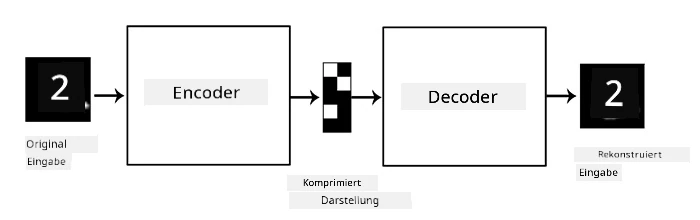

# Autoencoder

Beim Training von CNNs besteht eines der Probleme darin, dass wir eine große Menge an gelabelten Daten benötigen. Im Fall der Bildklassifikation müssen wir Bilder in verschiedene Klassen unterteilen, was manuell erfolgen muss.

## [Quiz vor der Vorlesung](https://ff-quizzes.netlify.app/en/ai/quiz/17)

Es kann jedoch sinnvoll sein, rohe (nicht gelabelte) Daten für das Training von CNN-Feature-Extraktoren zu verwenden, was als **selbstüberwachtes Lernen** bezeichnet wird. Anstelle von Labels verwenden wir Trainingsbilder sowohl als Eingabe als auch als Ausgabe des Netzwerks. Die Hauptidee eines **Autoencoders** besteht darin, ein **Encoder-Netzwerk** zu haben, das das Eingabebild in einen **latenten Raum** (normalerweise ein Vektor mit kleinerer Größe) umwandelt, und ein **Decoder-Netzwerk**, dessen Ziel es ist, das ursprüngliche Bild zu rekonstruieren.

> ✅ Ein [Autoencoder](https://wikipedia.org/wiki/Autoencoder) ist "eine Art künstliches neuronales Netzwerk, das effiziente Codierungen von nicht gelabelten Daten lernt."

Da wir einen Autoencoder trainieren, um so viele Informationen wie möglich aus dem ursprünglichen Bild zu erfassen, um eine genaue Rekonstruktion zu ermöglichen, versucht das Netzwerk, die beste **Einbettung** der Eingabebilder zu finden, um deren Bedeutung zu erfassen.

> Bild von [Keras Blog](https://blog.keras.io/building-autoencoders-in-keras.html)

## Szenarien für die Verwendung von Autoencodern

Obwohl die Rekonstruktion von Originalbildern an sich nicht besonders nützlich erscheint, gibt es einige Szenarien, in denen Autoencoder besonders hilfreich sind:

* **Reduzierung der Dimension von Bildern zur Visualisierung** oder **Training von Bild-Einbettungen**. Autoencoder liefern in der Regel bessere Ergebnisse als PCA, da sie die räumliche Natur von Bildern und hierarchische Merkmale berücksichtigen.
* **Rauschunterdrückung**, d. h. das Entfernen von Rauschen aus Bildern. Da Rauschen viele unnütze Informationen enthält, kann der Autoencoder nicht alles in den relativ kleinen latenten Raum einpassen und erfasst daher nur die wichtigen Teile des Bildes. Beim Training von Rauschunterdrückern beginnen wir mit Originalbildern und verwenden Bilder mit künstlich hinzugefügtem Rauschen als Eingabe für den Autoencoder.
* **Superauflösung**, d. h. die Erhöhung der Bildauflösung. Wir beginnen mit hochauflösenden Bildern und verwenden das Bild mit niedrigerer Auflösung als Eingabe für den Autoencoder.
* **Generative Modelle**. Sobald wir den Autoencoder trainiert haben, kann der Decoder-Teil verwendet werden, um neue Objekte aus zufälligen latenten Vektoren zu erstellen.

## Variationale Autoencoder (VAE)

Traditionelle Autoencoder reduzieren die Dimension der Eingabedaten auf irgendeine Weise und identifizieren die wichtigen Merkmale der Eingabebilder. Allerdings machen latente Vektoren oft wenig Sinn. Mit anderen Worten: Wenn wir das MNIST-Dataset als Beispiel nehmen, ist es nicht einfach herauszufinden, welche Ziffern zu verschiedenen latenten Vektoren gehören, da nahegelegene latente Vektoren nicht unbedingt denselben Ziffern entsprechen.

Für das Training von *generativen* Modellen ist es jedoch besser, ein Verständnis des latenten Raums zu haben. Diese Idee führt uns zu **variationalen Autoencodern** (VAE).

Ein VAE ist ein Autoencoder, der lernt, die *statistische Verteilung* der latenten Parameter vorherzusagen, die sogenannte **latente Verteilung**. Zum Beispiel möchten wir vielleicht, dass latente Vektoren normal verteilt sind mit einem Mittelwert zmean und einer Standardabweichung zsigma (beide, Mittelwert und Standardabweichung, sind Vektoren einer bestimmten Dimension d). Der Encoder im VAE lernt, diese Parameter vorherzusagen, und der Decoder nimmt dann einen zufälligen Vektor aus dieser Verteilung, um das Objekt zu rekonstruieren.

Zusammengefasst:

 * Aus dem Eingabevektor sagen wir `z_mean` und `z_log_sigma` voraus (anstatt die Standardabweichung direkt vorherzusagen, sagen wir deren Logarithmus voraus).
 * Wir entnehmen einen Vektor `sample` aus der Verteilung N(zmean,exp(zlog\_sigma)).
 * Der Decoder versucht, das ursprüngliche Bild mithilfe von `sample` als Eingabevektor zu dekodieren.

 

> Bild aus [diesem Blogbeitrag](https://ijdykeman.github.io/ml/2016/12/21/cvae.html) von Isaak Dykeman

Variationale Autoencoder verwenden eine komplexe Verlustfunktion, die aus zwei Teilen besteht:

* **Rekonstruktionsverlust** ist die Verlustfunktion, die zeigt, wie nah ein rekonstruiertes Bild am Ziel ist (z. B. Mean Squared Error, MSE). Es ist dieselbe Verlustfunktion wie bei normalen Autoencodern.
* **KL-Verlust**, der sicherstellt, dass die Verteilung der latenten Variablen nahe an der Normalverteilung bleibt. Er basiert auf dem Konzept der [Kullback-Leibler-Divergenz](https://www.countbayesie.com/blog/2017/5/9/kullback-leibler-divergence-explained) – einem Maß zur Schätzung der Ähnlichkeit zweier statistischer Verteilungen.

Ein wichtiger Vorteil von VAEs ist, dass sie es uns ermöglichen, relativ einfach neue Bilder zu generieren, da wir wissen, aus welcher Verteilung wir latente Vektoren entnehmen müssen. Wenn wir beispielsweise einen VAE mit einem 2D-latenten Vektor auf MNIST trainieren, können wir die Komponenten des latenten Vektors variieren, um verschiedene Ziffern zu erhalten:

> Bild von [Dmitry Soshnikov](http://soshnikov.com)

Beobachten Sie, wie Bilder ineinander übergehen, wenn wir beginnen, latente Vektoren aus verschiedenen Bereichen des latenten Parameterraums zu entnehmen. Wir können diesen Raum auch in 2D visualisieren:

 

> Bild von [Dmitry Soshnikov](http://soshnikov.com)

## ✍️ Übungen: Autoencoder

Erfahren Sie mehr über Autoencoder in den entsprechenden Notebooks:

* [Autoencoder in TensorFlow](AutoencodersTF.ipynb)
* [Autoencoder in PyTorch](AutoEncodersPyTorch.ipynb)

## Eigenschaften von Autoencodern

* **Daten-spezifisch** - Sie funktionieren nur gut mit der Art von Bildern, auf denen sie trainiert wurden. Wenn wir beispielsweise ein Superauflösungsnetzwerk auf Blumen trainieren, funktioniert es nicht gut bei Porträts. Das liegt daran, dass das Netzwerk hochauflösende Bilder erzeugen kann, indem es feine Details aus den Merkmalen des Trainingsdatensatzes übernimmt.
* **Verlustbehaftet** - Das rekonstruierte Bild ist nicht identisch mit dem Originalbild. Die Art des Verlusts wird durch die während des Trainings verwendete *Verlustfunktion* definiert.
* Funktioniert mit **nicht gelabelten Daten**

## [Quiz nach der Vorlesung](https://ff-quizzes.netlify.app/en/ai/quiz/18)

## Fazit

In dieser Lektion haben Sie die verschiedenen Arten von Autoencodern kennengelernt, die einem KI-Wissenschaftler zur Verfügung stehen. Sie haben gelernt, wie man sie erstellt und wie man sie verwendet, um Bilder zu rekonstruieren. Sie haben auch den VAE kennengelernt und erfahren, wie man ihn verwendet, um neue Bilder zu generieren.

## 🚀 Herausforderung

In dieser Lektion haben Sie gelernt, wie man Autoencoder für Bilder verwendet. Aber sie können auch für Musik verwendet werden! Schauen Sie sich das [MusicVAE](https://magenta.tensorflow.org/music-vae)-Projekt des Magenta-Projekts an, das Autoencoder verwendet, um Musik zu rekonstruieren. Machen Sie einige [Experimente](https://colab.research.google.com/github/magenta/magenta-demos/blob/master/colab-notebooks/Multitrack_MusicVAE.ipynb) mit dieser Bibliothek, um zu sehen, was Sie erstellen können.

## [Quiz nach der Vorlesung](https://ff-quizzes.netlify.app/en/ai/quiz/16)

## Wiederholung & Selbststudium

Lesen Sie zur Referenz mehr über Autoencoder in diesen Ressourcen:

* [Building Autoencoders in Keras](https://blog.keras.io/building-autoencoders-in-keras.html)
* [Blogbeitrag auf NeuroHive](https://neurohive.io/ru/osnovy-data-science/variacionnyj-avtojenkoder-vae/)
* [Variational Autoencoders Explained](https://kvfrans.com/variational-autoencoders-explained/)
* [Conditional Variational Autoencoders](https://ijdykeman.github.io/ml/2016/12/21/cvae.html)

## Aufgabe

Am Ende [dieses Notebooks mit TensorFlow](AutoencodersTF.ipynb) finden Sie eine 'Aufgabe' – verwenden Sie diese als Ihre Hausaufgabe.

---

