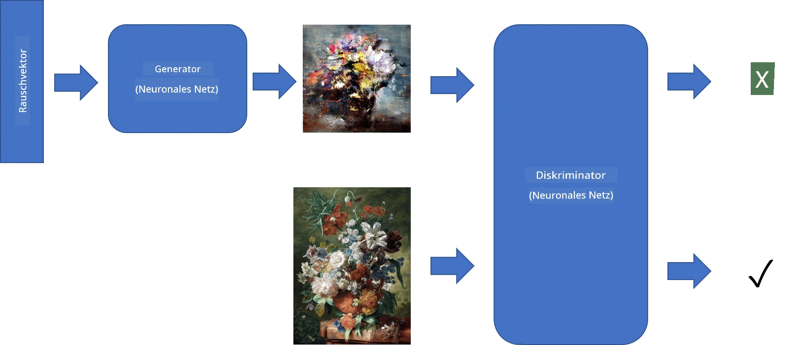
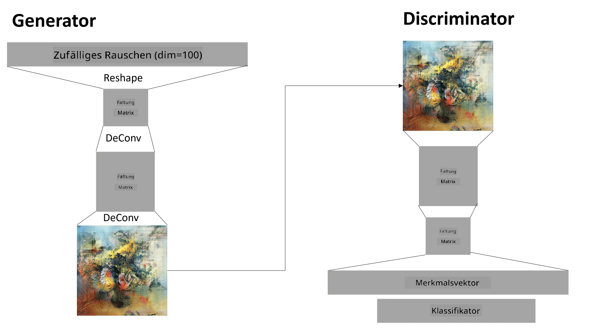

# Generative Adversarial Networks

Im vorherigen Abschnitt haben wir über **generative Modelle** gelernt: Modelle, die neue Bilder erzeugen können, die den Bildern im Trainingsdatensatz ähneln. VAE war ein gutes Beispiel für ein generatives Modell.

## [Quiz vor der Vorlesung](https://ff-quizzes.netlify.app/en/ai/quiz/19)

Wenn wir jedoch versuchen, etwas wirklich Bedeutungsvolles zu erzeugen, wie ein Gemälde in angemessener Auflösung, werden wir feststellen, dass das Training mit VAE nicht gut konvergiert. Für diesen Anwendungsfall sollten wir eine andere Architektur kennenlernen, die speziell auf generative Modelle ausgerichtet ist - **Generative Adversarial Networks**, oder GANs.

Die Hauptidee eines GANs besteht darin, zwei neuronale Netzwerke zu haben, die gegeneinander trainiert werden:

> Bild von [Dmitry Soshnikov](http://soshnikov.com)

> ✅ Ein bisschen Vokabular:
> * **Generator** ist ein Netzwerk, das einen zufälligen Vektor nimmt und daraus ein Bild erzeugt.
> * **Diskriminator** ist ein Netzwerk, das ein Bild nimmt und entscheiden soll, ob es ein echtes Bild (aus dem Trainingsdatensatz) oder ein vom Generator erzeugtes Bild ist. Es ist im Wesentlichen ein Bildklassifikator.

### Diskriminator

Die Architektur des Diskriminators unterscheidet sich nicht von einem gewöhnlichen Bildklassifikationsnetzwerk. Im einfachsten Fall kann es ein vollständig verbundenes Klassifikationsnetzwerk sein, aber höchstwahrscheinlich wird es ein [Convolutional Network](../07-ConvNets/README.md) sein.

> ✅ Ein GAN, das auf Convolutional Networks basiert, wird als [DCGAN](https://arxiv.org/pdf/1511.06434.pdf) bezeichnet.

Ein CNN-Diskriminator besteht aus den folgenden Schichten: mehreren Convolutions+Poolings (mit abnehmender räumlicher Größe) und einer oder mehreren vollständig verbundenen Schichten, um einen "Feature-Vektor" zu erhalten, sowie einem abschließenden binären Klassifikator.

> ✅ Ein 'Pooling' in diesem Kontext ist eine Technik, die die Größe des Bildes reduziert. "Pooling-Schichten reduzieren die Dimensionen der Daten, indem sie die Ausgaben von Neuronenclustern in einer Schicht zu einem einzigen Neuron in der nächsten Schicht kombinieren." - [Quelle](https://wikipedia.org/wiki/Convolutional_neural_network#Pooling_layers)

### Generator

Ein Generator ist etwas komplizierter. Man kann ihn als umgekehrten Diskriminator betrachten. Ausgehend von einem latenten Vektor (anstelle eines Feature-Vektors) hat er eine vollständig verbundene Schicht, um ihn in die erforderliche Größe/Form umzuwandeln, gefolgt von Deconvolutions+Upscaling. Dies ähnelt dem *Decoder*-Teil eines [Autoencoders](../09-Autoencoders/README.md).

> ✅ Da die Convolution-Schicht als linearer Filter implementiert ist, der das Bild durchläuft, ist Deconvolution im Wesentlichen ähnlich wie Convolution und kann mit derselben Schichtlogik implementiert werden.

> Bild von [Dmitry Soshnikov](http://soshnikov.com)

### Training des GANs

GANs werden **adversarial** genannt, weil es einen ständigen Wettbewerb zwischen dem Generator und dem Diskriminator gibt. Während dieses Wettbewerbs verbessern sich sowohl der Generator als auch der Diskriminator, sodass das Netzwerk lernt, immer bessere Bilder zu erzeugen.

Das Training erfolgt in zwei Phasen:

* **Training des Diskriminators**. Diese Aufgabe ist ziemlich einfach: Wir erzeugen eine Batch von Bildern mit dem Generator, die mit 0 gekennzeichnet werden, was für ein gefälschtes Bild steht, und nehmen eine Batch von Bildern aus dem Eingabedatensatz (mit Label 1, echtes Bild). Wir erhalten einen *Diskriminatorverlust* und führen Backpropagation durch.
* **Training des Generators**. Dies ist etwas komplizierter, da wir den erwarteten Output für den Generator nicht direkt kennen. Wir nehmen das gesamte GAN-Netzwerk, bestehend aus einem Generator, gefolgt von einem Diskriminator, füttern es mit zufälligen Vektoren und erwarten, dass das Ergebnis 1 ist (entsprechend echten Bildern). Wir frieren dann die Parameter des Diskriminators ein (wir wollen ihn in diesem Schritt nicht trainieren) und führen Backpropagation durch.

Während dieses Prozesses sinken die Verluste des Generators und des Diskriminators nicht signifikant. Im Idealfall sollten sie oszillieren, was darauf hinweist, dass beide Netzwerke ihre Leistung verbessern.

## ✍️ Übungen: GANs

* [GAN Notebook in TensorFlow/Keras](GANTF.ipynb)
* [GAN Notebook in PyTorch](GANPyTorch.ipynb)

### Probleme beim GAN-Training

GANs sind dafür bekannt, besonders schwierig zu trainieren zu sein. Hier sind einige Probleme:

* **Mode Collapse**. Damit ist gemeint, dass der Generator lernt, ein erfolgreiches Bild zu erzeugen, das den Diskriminator täuscht, und nicht eine Vielzahl unterschiedlicher Bilder.
* **Empfindlichkeit gegenüber Hyperparametern**. Oft kann man sehen, dass ein GAN überhaupt nicht konvergiert und dann plötzlich durch eine Verringerung der Lernrate zur Konvergenz führt.
* Das **Gleichgewicht** zwischen Generator und Diskriminator halten. In vielen Fällen kann der Diskriminatorverlust relativ schnell auf null sinken, was dazu führt, dass der Generator nicht weiter trainieren kann. Um dies zu überwinden, können wir versuchen, unterschiedliche Lernraten für Generator und Diskriminator festzulegen oder das Training des Diskriminators zu überspringen, wenn der Verlust bereits zu niedrig ist.
* Training für **hohe Auflösung**. Dieses Problem spiegelt dasselbe Problem wie bei Autoencodern wider und tritt auf, weil das Rekonstruieren zu vieler Schichten eines Convolutional Networks zu Artefakten führt. Dieses Problem wird typischerweise durch sogenanntes **progressives Wachstum** gelöst, bei dem zunächst einige Schichten mit niedrig aufgelösten Bildern trainiert werden und dann Schichten "freigeschaltet" oder hinzugefügt werden. Eine andere Lösung wäre, zusätzliche Verbindungen zwischen den Schichten hinzuzufügen und mehrere Auflösungen gleichzeitig zu trainieren - siehe dieses [Multi-Scale Gradient GANs Paper](https://arxiv.org/abs/1903.06048) für Details.

## Style Transfer

GANs sind eine großartige Möglichkeit, künstlerische Bilder zu erzeugen. Eine andere interessante Technik ist der sogenannte **Style Transfer**, bei dem ein **Inhaltsbild** genommen und in einem anderen Stil neu gezeichnet wird, indem Filter aus einem **Stilbild** angewendet werden.

So funktioniert es:
* Wir beginnen mit einem zufälligen Rauschbild (oder mit einem Inhaltsbild, aber der Einfachheit halber ist es leichter, mit zufälligem Rauschen zu beginnen).
* Unser Ziel ist es, ein Bild zu erstellen, das sowohl dem Inhaltsbild als auch dem Stilbild nahekommt. Dies wird durch zwei Verlustfunktionen bestimmt:
   - **Content Loss** wird basierend auf den von der CNN extrahierten Features an einigen Schichten aus dem aktuellen Bild und dem Inhaltsbild berechnet.
   - **Style Loss** wird zwischen dem aktuellen Bild und dem Stilbild auf clevere Weise unter Verwendung von Gram-Matrizen berechnet (mehr Details im [Beispiel-Notebook](StyleTransfer.ipynb)).
* Um das Bild glatter zu machen und Rauschen zu entfernen, führen wir auch **Variation Loss** ein, der den durchschnittlichen Abstand zwischen benachbarten Pixeln berechnet.
* Die Hauptoptimierungsschleife passt das aktuelle Bild mithilfe von Gradient Descent (oder einem anderen Optimierungsalgorithmus) an, um den Gesamten Verlust zu minimieren, der eine gewichtete Summe aller drei Verluste ist.

## ✍️ Beispiel: [Style Transfer](StyleTransfer.ipynb)

## [Quiz nach der Vorlesung](https://ff-quizzes.netlify.app/en/ai/quiz/20)

## Fazit

In dieser Lektion haben Sie etwas über GANs und deren Training gelernt. Sie haben auch die besonderen Herausforderungen kennengelernt, denen diese Art von neuronalen Netzwerken begegnen kann, und einige Strategien, um diese zu überwinden.

## 🚀 Herausforderung

Führen Sie das [Style Transfer Notebook](StyleTransfer.ipynb) mit Ihren eigenen Bildern durch.

## Überprüfung & Selbststudium

Lesen Sie zur Referenz mehr über GANs in diesen Ressourcen:

* Marco Pasini, [10 Lessons I Learned Training GANs for one Year](https://towardsdatascience.com/10-lessons-i-learned-training-generative-adversarial-networks-gans-for-a-year-c9071159628)
* [StyleGAN](https://en.wikipedia.org/wiki/StyleGAN), eine *de facto* GAN-Architektur, die man in Betracht ziehen sollte
* [Creating Generative Art using GANs on Azure ML](https://soshnikov.com/scienceart/creating-generative-art-using-gan-on-azureml/)

## Aufgabe

Besuchen Sie eines der beiden Notebooks, die mit dieser Lektion verbunden sind, und trainieren Sie das GAN mit Ihren eigenen Bildern neu. Was können Sie erstellen?

---

