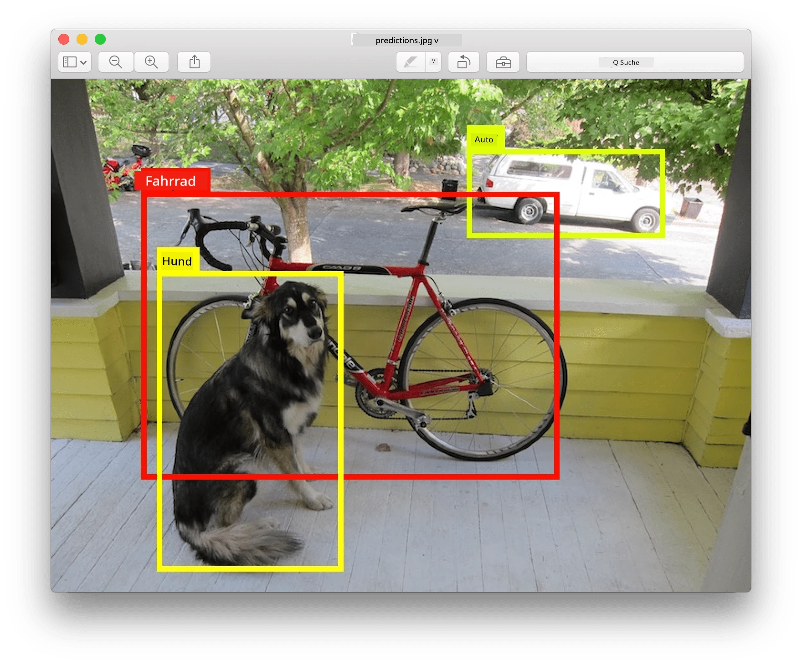
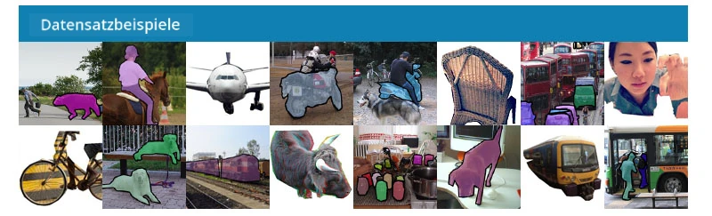
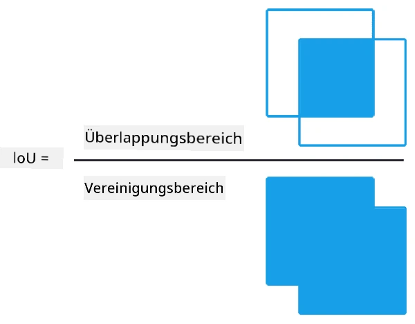
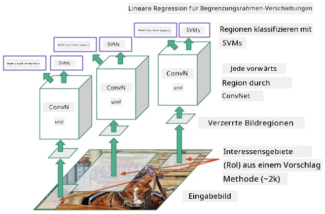
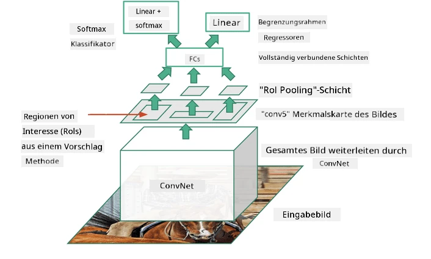
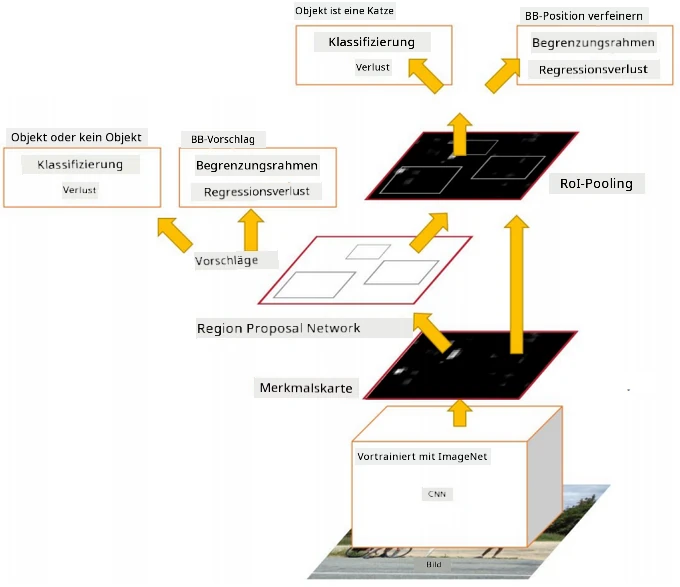
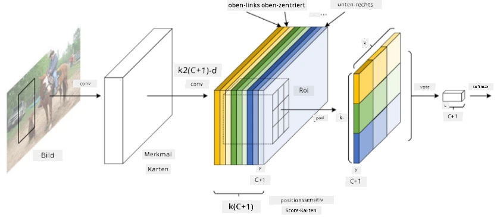
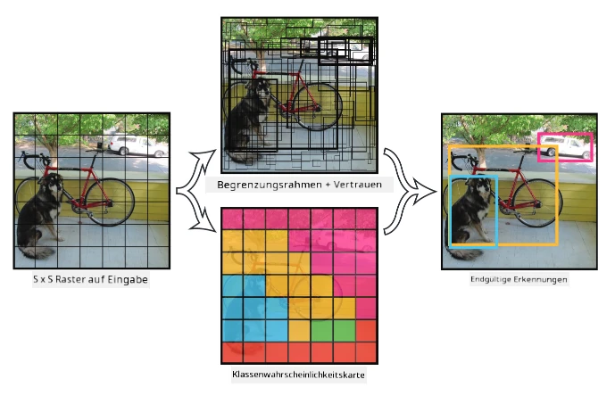

# Objekterkennung

Die Bildklassifizierungsmodelle, die wir bisher behandelt haben, nahmen ein Bild und lieferten ein kategorisches Ergebnis, wie beispielsweise die Klasse "Zahl" in einem MNIST-Problem. In vielen Fällen möchten wir jedoch nicht nur wissen, dass ein Bild Objekte darstellt – wir möchten auch deren genaue Position bestimmen können. Genau darum geht es bei der **Objekterkennung**.

## [Quiz vor der Vorlesung](https://ff-quizzes.netlify.app/en/ai/quiz/21)

> Bild von der [YOLO v2 Webseite](https://pjreddie.com/darknet/yolov2/)

## Ein naiver Ansatz zur Objekterkennung

Angenommen, wir wollten eine Katze auf einem Bild finden, dann wäre ein sehr naiver Ansatz zur Objekterkennung folgender:

1. Zerlege das Bild in eine Anzahl von Kacheln.
2. Führe eine Bildklassifikation auf jeder Kachel durch.
3. Die Kacheln, die eine ausreichend hohe Aktivierung zeigen, können als die Kacheln betrachtet werden, die das gesuchte Objekt enthalten.

> *Bild aus dem [Übungsnotebook](ObjectDetection-TF.ipynb)*

Dieser Ansatz ist jedoch alles andere als ideal, da er es dem Algorithmus nur erlaubt, die Begrenzungsbox des Objekts sehr ungenau zu lokalisieren. Für eine präzisere Lokalisierung müssen wir eine Art **Regression** durchführen, um die Koordinaten der Begrenzungsboxen vorherzusagen – und dafür benötigen wir spezielle Datensätze.

## Regression für Objekterkennung

[Dieser Blogbeitrag](https://towardsdatascience.com/object-detection-with-neural-networks-a4e2c46b4491) bietet eine großartige Einführung in die Erkennung von Formen.

## Datensätze für Objekterkennung

Für diese Aufgabe könnten Sie auf die folgenden Datensätze stoßen:

* [PASCAL VOC](http://host.robots.ox.ac.uk/pascal/VOC/) – 20 Klassen
* [COCO](http://cocodataset.org/#home) – Common Objects in Context. 80 Klassen, Begrenzungsboxen und Segmentierungsmasken

## Metriken für Objekterkennung

### Intersection over Union

Während es bei der Bildklassifikation einfach ist, die Leistung des Algorithmus zu messen, müssen wir bei der Objekterkennung sowohl die Richtigkeit der Klasse als auch die Genauigkeit der vorhergesagten Position der Begrenzungsbox messen. Für Letzteres verwenden wir die sogenannte **Intersection over Union** (IoU), die misst, wie gut sich zwei Boxen (oder zwei beliebige Bereiche) überlappen.

> *Abbildung 2 aus [diesem ausgezeichneten Blogbeitrag über IoU](https://pyimagesearch.com/2016/11/07/intersection-over-union-iou-for-object-detection/)*

Die Idee ist einfach – wir teilen die Fläche der Überschneidung zwischen zwei Figuren durch die Fläche ihrer Vereinigung. Für zwei identische Flächen wäre IoU gleich 1, während für vollständig getrennte Flächen IoU gleich 0 ist. Ansonsten variiert der Wert zwischen 0 und 1. Wir betrachten typischerweise nur die Begrenzungsboxen, bei denen IoU über einem bestimmten Wert liegt.

### Durchschnittliche Präzision

Angenommen, wir möchten messen, wie gut eine bestimmte Objektklasse $C$ erkannt wird. Um dies zu messen, verwenden wir die **Durchschnittliche Präzision** (Average Precision, AP), die wie folgt berechnet wird:

1. Betrachten Sie die Precision-Recall-Kurve, die die Genauigkeit in Abhängigkeit von einem Erkennungsschwellenwert (von 0 bis 1) zeigt.
2. Abhängig vom Schwellenwert werden mehr oder weniger Objekte im Bild erkannt, und es ergeben sich unterschiedliche Werte für Präzision und Recall.
3. Die Kurve sieht wie folgt aus:

> *Bild aus [NeuroWorkshop](http://github.com/shwars/NeuroWorkshop)*

Die durchschnittliche Präzision für eine gegebene Klasse $C$ ist die Fläche unter dieser Kurve. Genauer gesagt wird die Recall-Achse typischerweise in 10 Teile unterteilt, und die Präzision wird über alle diese Punkte gemittelt:

$$
AP = {1\over11}\sum_{i=0}^{10}\mbox{Precision}(\mbox{Recall}={i\over10})
$$

### AP und IoU

Wir betrachten nur die Erkennungen, bei denen IoU über einem bestimmten Wert liegt. Beispielsweise wird im PASCAL VOC-Datensatz typischerweise $\mbox{IoU Threshold} = 0.5$ angenommen, während im COCO-Datensatz AP für verschiedene Werte von $\mbox{IoU Threshold}$ gemessen wird.

> *Bild aus [NeuroWorkshop](http://github.com/shwars/NeuroWorkshop)*

### Mittlere Durchschnittliche Präzision – mAP

Die Hauptmetrik für die Objekterkennung wird **Mittlere Durchschnittliche Präzision** (Mean Average Precision, mAP) genannt. Sie ist der Wert der Durchschnittlichen Präzision, gemittelt über alle Objektklassen und manchmal auch über $\mbox{IoU Threshold}$. Der Prozess zur Berechnung von **mAP** wird ausführlich
[in diesem Blogbeitrag](https://medium.com/@timothycarlen/understanding-the-map-evaluation-metric-for-object-detection-a07fe6962cf3) beschrieben, sowie [hier mit Codebeispielen](https://gist.github.com/tarlen5/008809c3decf19313de216b9208f3734).

## Verschiedene Ansätze zur Objekterkennung

Es gibt zwei Hauptklassen von Objekterkennungsalgorithmen:

* **Region Proposal Networks** (R-CNN, Fast R-CNN, Faster R-CNN). Die Hauptidee ist, **Regions of Interest** (ROI) zu generieren und CNN darüber laufen zu lassen, um maximale Aktivierung zu finden. Dies ähnelt dem naiven Ansatz, mit der Ausnahme, dass ROIs auf eine intelligentere Weise generiert werden. Ein Hauptnachteil solcher Methoden ist, dass sie langsam sind, da viele Durchläufe des CNN-Klassifikators über das Bild erforderlich sind.
* **One-pass** (YOLO, SSD, RetinaNet) Methoden. In diesen Architekturen wird das Netzwerk so gestaltet, dass es sowohl Klassen als auch ROIs in einem Durchgang vorhersagt.

### R-CNN: Region-Based CNN

[R-CNN](http://islab.ulsan.ac.kr/files/announcement/513/rcnn_pami.pdf) verwendet [Selective Search](http://www.huppelen.nl/publications/selectiveSearchDraft.pdf), um eine hierarchische Struktur von ROI-Regionen zu generieren, die dann durch CNN-Feature-Extraktoren und SVM-Klassifikatoren geleitet werden, um die Objektklasse zu bestimmen, sowie durch lineare Regression, um die *Koordinaten der Begrenzungsbox* zu bestimmen. [Offizielles Paper](https://arxiv.org/pdf/1506.01497v1.pdf)

> *Bild von van de Sande et al. ICCV’11*

> *Bilder aus [diesem Blog](https://towardsdatascience.com/r-cnn-fast-r-cnn-faster-r-cnn-yolo-object-detection-algorithms-36d53571365e)*

### F-RCNN – Fast R-CNN

Dieser Ansatz ähnelt R-CNN, aber die Regionen werden definiert, nachdem die Convolution-Schichten angewendet wurden.

> Bild aus [dem offiziellen Paper](https://www.cv-foundation.org/openaccess/content_iccv_2015/papers/Girshick_Fast_R-CNN_ICCV_2015_paper.pdf), [arXiv](https://arxiv.org/pdf/1504.08083.pdf), 2015

### Faster R-CNN

Die Hauptidee dieses Ansatzes ist die Verwendung eines neuronalen Netzwerks zur Vorhersage von ROIs – des sogenannten *Region Proposal Network*. [Paper](https://arxiv.org/pdf/1506.01497.pdf), 2016

> Bild aus [dem offiziellen Paper](https://arxiv.org/pdf/1506.01497.pdf)

### R-FCN: Region-Based Fully Convolutional Network

Dieser Algorithmus ist sogar schneller als Faster R-CNN. Die Hauptidee ist folgende:

1. Wir extrahieren Features mit ResNet-101.
2. Die Features werden durch **Position-Sensitive Score Map** verarbeitet. Jedes Objekt aus $C$ Klassen wird in $k\times k$ Regionen unterteilt, und wir trainieren, um Teile von Objekten vorherzusagen.
3. Für jeden Teil aus den $k\times k$ Regionen stimmen alle Netzwerke für Objektklassen ab, und die Objektklasse mit der maximalen Stimmenanzahl wird ausgewählt.

> Bild aus [dem offiziellen Paper](https://arxiv.org/abs/1605.06409)

### YOLO – You Only Look Once

YOLO ist ein Echtzeit-One-Pass-Algorithmus. Die Hauptidee ist folgende:

 * Das Bild wird in $S\times S$ Regionen unterteilt.
 * Für jede Region sagt **CNN** $n$ mögliche Objekte, *Koordinaten der Begrenzungsbox* und *Confidence*=*Wahrscheinlichkeit* * IoU voraus.

 

> Bild aus [dem offiziellen Paper](https://arxiv.org/abs/1506.02640)

### Andere Algorithmen

* RetinaNet: [Offizielles Paper](https://arxiv.org/abs/1708.02002)
   - [PyTorch-Implementierung in Torchvision](https://pytorch.org/vision/stable/_modules/torchvision/models/detection/retinanet.html)
   - [Keras-Implementierung](https://github.com/fizyr/keras-retinanet)
   - [Objekterkennung mit RetinaNet](https://keras.io/examples/vision/retinanet/) in Keras-Beispielen
* SSD (Single Shot Detector): [Offizielles Paper](https://arxiv.org/abs/1512.02325)

## ✍️ Übungen: Objekterkennung

Setzen Sie Ihr Lernen im folgenden Notebook fort:

[ObjectDetection.ipynb](ObjectDetection.ipynb)

## Fazit

In dieser Lektion haben Sie einen Überblick über die verschiedenen Möglichkeiten zur Objekterkennung erhalten!

## 🚀 Herausforderung

Lesen Sie diese Artikel und Notebooks über YOLO und probieren Sie sie selbst aus:

* [Guter Blogbeitrag](https://www.analyticsvidhya.com/blog/2018/12/practical-guide-object-detection-yolo-framewor-python/) über YOLO
 * [Offizielle Seite](https://pjreddie.com/darknet/yolo/)
 * Yolo: [Keras-Implementierung](https://github.com/experiencor/keras-yolo2), [Schritt-für-Schritt-Notebook](https://github.com/experiencor/basic-yolo-keras/blob/master/Yolo%20Step-by-Step.ipynb)
 * Yolo v2: [Keras-Implementierung](https://github.com/experiencor/keras-yolo2), [Schritt-für-Schritt-Notebook](https://github.com/experiencor/keras-yolo2/blob/master/Yolo%20Step-by-Step.ipynb)

## [Quiz nach der Vorlesung](https://ff-quizzes.netlify.app/en/ai/quiz/22)

## Überprüfung & Selbststudium

* [Objekterkennung](https://tjmachinelearning.com/lectures/1718/obj/) von Nikhil Sardana
* [Ein guter Vergleich von Objekterkennungsalgorithmen](https://lilianweng.github.io/lil-log/2018/12/27/object-detection-part-4.html)
* [Überblick über Deep-Learning-Algorithmen für die Objekterkennung](https://medium.com/comet-app/review-of-deep-learning-algorithms-for-object-detection-c1f3d437b852)
* [Eine Schritt-für-Schritt-Einführung in die grundlegenden Objekterkennungsalgorithmen](https://www.analyticsvidhya.com/blog/2018/10/a-step-by-step-introduction-to-the-basic-object-detection-algorithms-part-1/)
* [Implementierung von Faster R-CNN in Python für die Objekterkennung](https://www.analyticsvidhya.com/blog/2018/11/implementation-faster-r-cnn-python-object-detection/)

## [Aufgabe: Objekterkennung](lab/README.md)

---

