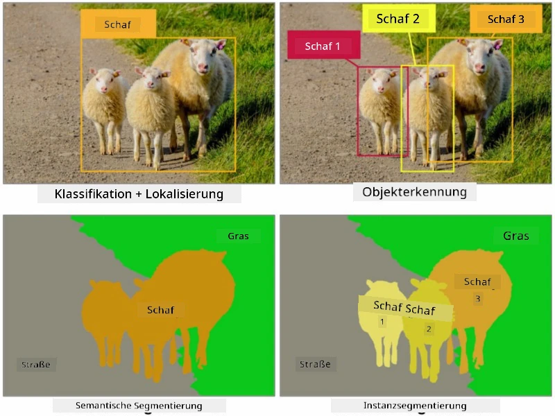
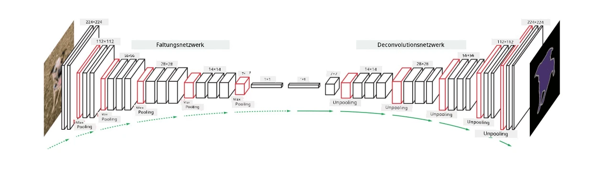

# Segmentierung

Wir haben zuvor über Objekterkennung gelernt, die es uns ermöglicht, Objekte im Bild zu lokalisieren, indem ihre *begrenzenden Boxen* vorhergesagt werden. Für einige Aufgaben benötigen wir jedoch nicht nur begrenzende Boxen, sondern auch eine präzisere Objektlokalisierung. Diese Aufgabe nennt man **Segmentierung**.

## [Quiz vor der Vorlesung](https://ff-quizzes.netlify.app/en/ai/quiz/23)

Segmentierung kann als **Pixelklassifikation** betrachtet werden, wobei für **jedes** Pixel des Bildes seine Klasse vorhergesagt werden muss (*Hintergrund* ist eine der Klassen). Es gibt zwei Hauptarten von Segmentierungsalgorithmen:

* **Semantische Segmentierung** gibt nur die Pixelklasse an und unterscheidet nicht zwischen verschiedenen Objekten derselben Klasse.
* **Instanzsegmentierung** teilt Klassen in verschiedene Instanzen auf.

Bei der Instanzsegmentierung sind diese Schafe unterschiedliche Objekte, aber bei der semantischen Segmentierung werden alle Schafe durch eine Klasse repräsentiert.

> Bild aus [diesem Blogbeitrag](https://nirmalamurali.medium.com/image-classification-vs-semantic-segmentation-vs-instance-segmentation-625c33a08d50)

Es gibt verschiedene neuronale Architekturen für die Segmentierung, aber sie haben alle die gleiche Struktur. In gewisser Weise ähnelt sie dem Autoencoder, den Sie zuvor kennengelernt haben, aber anstatt das ursprüngliche Bild zu rekonstruieren, ist unser Ziel, eine **Maske** zu rekonstruieren. Daher hat ein Segmentierungsnetzwerk die folgenden Teile:

* **Encoder** extrahiert Merkmale aus dem Eingabebild.
* **Decoder** transformiert diese Merkmale in das **Maskenbild**, mit derselben Größe und einer Anzahl von Kanälen, die der Anzahl der Klassen entspricht.

> Bild aus [dieser Publikation](https://arxiv.org/pdf/2001.05566.pdf)

Besonders erwähnenswert ist die Verlustfunktion, die für die Segmentierung verwendet wird. Bei klassischen Autoencodern müssen wir die Ähnlichkeit zwischen zwei Bildern messen, und dafür können wir den mittleren quadratischen Fehler (MSE) verwenden. Bei der Segmentierung repräsentiert jedes Pixel im Zielmaskenbild die Klassennummer (one-hot-encoded entlang der dritten Dimension), sodass wir Verlustfunktionen verwenden müssen, die speziell für Klassifikationen geeignet sind - Kreuzentropieverlust, gemittelt über alle Pixel. Wenn die Maske binär ist, wird **binärer Kreuzentropieverlust** (BCE) verwendet.

> ✅ One-hot-Encoding ist eine Methode, um eine Klassenbezeichnung in einen Vektor mit einer Länge zu kodieren, die der Anzahl der Klassen entspricht. Schauen Sie sich [diesen Artikel](https://datagy.io/sklearn-one-hot-encode/) zu dieser Technik an.

## Segmentierung in der medizinischen Bildgebung

In dieser Lektion werden wir die Segmentierung in Aktion sehen, indem wir ein Netzwerk trainieren, um menschliche Nävi (auch bekannt als Muttermale) auf medizinischen Bildern zu erkennen. Wir verwenden die <a href="https://www.fc.up.pt/addi/ph2%20database.html">PH2-Datenbank</a> für Dermoskopiebilder als Bildquelle. Dieses Datenset enthält 200 Bilder von drei Klassen: typischer Nävus, atypischer Nävus und Melanom. Alle Bilder enthalten auch eine entsprechende **Maske**, die den Nävus umreißt.

> ✅ Diese Technik ist besonders geeignet für diese Art der medizinischen Bildgebung, aber welche anderen Anwendungen in der realen Welt könnten Sie sich vorstellen?

> Bild aus der PH2-Datenbank

Wir werden ein Modell trainieren, um jeden Nävus vom Hintergrund zu segmentieren.

## ✍️ Übungen: Semantische Segmentierung

Öffnen Sie die untenstehenden Notebooks, um mehr über verschiedene semantische Segmentierungsarchitekturen zu erfahren, mit ihnen zu arbeiten und sie in Aktion zu sehen.

* [Semantische Segmentierung Pytorch](SemanticSegmentationPytorch.ipynb)
* [Semantische Segmentierung TensorFlow](SemanticSegmentationTF.ipynb)

## [Quiz nach der Vorlesung](https://ff-quizzes.netlify.app/en/ai/quiz/24)

## Fazit

Segmentierung ist eine sehr leistungsstarke Technik für die Bildklassifikation, die über begrenzende Boxen hinausgeht und eine Klassifikation auf Pixelebene ermöglicht. Sie wird unter anderem in der medizinischen Bildgebung eingesetzt.

## 🚀 Herausforderung

Die Segmentierung des Körpers ist nur eine der häufigen Aufgaben, die wir mit Bildern von Menschen durchführen können. Andere wichtige Aufgaben umfassen **Skelett-Erkennung** und **Pose-Erkennung**. Probieren Sie die [OpenPose](https://github.com/CMU-Perceptual-Computing-Lab/openpose)-Bibliothek aus, um zu sehen, wie Pose-Erkennung verwendet werden kann.

## Überprüfung & Selbststudium

Dieser [Wikipedia-Artikel](https://wikipedia.org/wiki/Image_segmentation) bietet einen guten Überblick über die verschiedenen Anwendungen dieser Technik. Erfahren Sie mehr über die Unterbereiche der Instanzsegmentierung und Panoptischen Segmentierung in diesem Forschungsfeld.

## [Aufgabe](lab/README.md)

In diesem Labor versuchen Sie die **Segmentierung des menschlichen Körpers** mit dem [Segmentation Full Body MADS Dataset](https://www.kaggle.com/datasets/tapakah68/segmentation-full-body-mads-dataset) von Kaggle.

---

