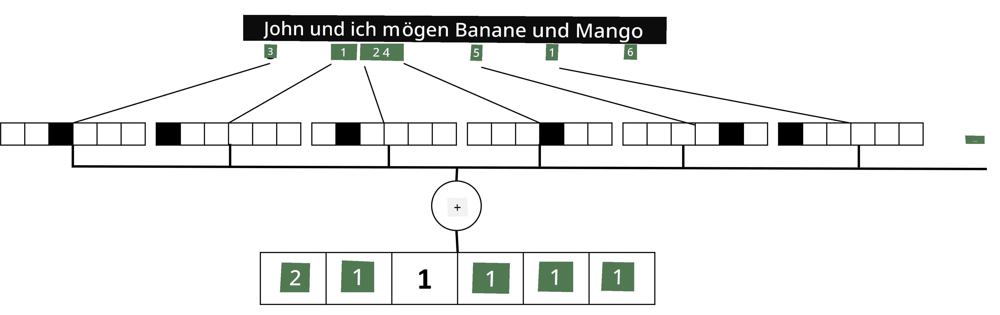

# Darstellung von Text als Tensoren

## [Quiz vor der Vorlesung](https://ff-quizzes.netlify.app/en/ai/quiz/25)

## Textklassifikation

Im ersten Teil dieses Abschnitts konzentrieren wir uns auf die Aufgabe der **Textklassifikation**. Wir verwenden das [AG News](https://www.kaggle.com/amananandrai/ag-news-classification-dataset)-Dataset, das Nachrichtenartikel wie die folgenden enthält:

* Kategorie: Wissenschaft/Technik
* Titel: Ky. Unternehmen erhält Zuschuss zur Erforschung von Peptiden (AP)
* Text: AP - Ein Unternehmen, das von einem Chemieforscher der Universität von Louisville gegründet wurde, erhielt einen Zuschuss zur Entwicklung...

Unser Ziel wird es sein, den Nachrichtenartikel basierend auf dem Text einer der Kategorien zuzuordnen.

## Darstellung von Text

Um Aufgaben der natürlichen Sprachverarbeitung (NLP) mit neuronalen Netzwerken zu lösen, benötigen wir eine Methode, um Text als Tensoren darzustellen. Computer repräsentieren Textzeichen bereits als Zahlen, die mit Codierungen wie ASCII oder UTF-8 auf die Schriftarten auf Ihrem Bildschirm abgebildet werden.

> [Bildquelle](https://www.seobility.net/en/wiki/ASCII)

Als Menschen verstehen wir, was jeder Buchstabe **darstellt** und wie alle Zeichen zusammenkommen, um die Wörter eines Satzes zu bilden. Computer hingegen haben von sich aus kein solches Verständnis, und ein neuronales Netzwerk muss die Bedeutung während des Trainings lernen.

Daher können wir verschiedene Ansätze verwenden, um Text darzustellen:

* **Zeichenbasierte Darstellung**, bei der wir Text darstellen, indem wir jedes Zeichen als Zahl behandeln. Angenommen, wir haben *C* verschiedene Zeichen in unserem Textkorpus, dann würde das Wort *Hello* durch einen 5x*C*-Tensor dargestellt. Jeder Buchstabe würde einer Spalte des Tensors in One-Hot-Codierung entsprechen.
* **Wortbasierte Darstellung**, bei der wir ein **Vokabular** aller Wörter in unserem Text erstellen und dann Wörter mit One-Hot-Codierung darstellen. Dieser Ansatz ist in gewisser Weise besser, da jeder Buchstabe für sich genommen nicht viel Bedeutung hat. Durch die Verwendung höherer semantischer Konzepte – Wörter – vereinfachen wir die Aufgabe für das neuronale Netzwerk. Allerdings müssen wir aufgrund der großen Wörterbuchgröße mit hochdimensionalen, spärlichen Tensoren umgehen.

Unabhängig von der Darstellung müssen wir den Text zunächst in eine Sequenz von **Tokens** umwandeln, wobei ein Token entweder ein Zeichen, ein Wort oder manchmal sogar ein Teil eines Wortes sein kann. Anschließend konvertieren wir das Token in eine Zahl, typischerweise mithilfe eines **Vokabulars**, und diese Zahl kann mithilfe von One-Hot-Codierung in ein neuronales Netzwerk eingespeist werden.

## N-Gramme

In der natürlichen Sprache kann die genaue Bedeutung von Wörtern nur im Kontext bestimmt werden. Zum Beispiel haben *neuronales Netzwerk* und *Fischernetz* völlig unterschiedliche Bedeutungen. Eine Möglichkeit, dies zu berücksichtigen, besteht darin, unser Modell auf Wortpaaren aufzubauen und Wortpaare als separate Vokabular-Tokens zu betrachten. Auf diese Weise wird der Satz *Ich gehe gerne angeln* durch die folgende Sequenz von Tokens dargestellt: *Ich gehe*, *gehe gerne*, *gerne angeln*. Das Problem bei diesem Ansatz ist, dass die Wörterbuchgröße erheblich wächst und Kombinationen wie *gerne angeln* und *gerne einkaufen* durch unterschiedliche Tokens dargestellt werden, die trotz des gleichen Verbs keine semantische Ähnlichkeit teilen.

In einigen Fällen können wir auch die Verwendung von Tri-Grammen – Kombinationen aus drei Wörtern – in Betracht ziehen. Daher wird dieser Ansatz oft als **n-Gramme** bezeichnet. Es macht auch Sinn, n-Gramme mit zeichenbasierter Darstellung zu verwenden, wobei n-Gramme ungefähr verschiedenen Silben entsprechen.

## Bag-of-Words und TF/IDF

Bei Aufgaben wie der Textklassifikation müssen wir in der Lage sein, Text durch einen festen Vektor darzustellen, den wir als Eingabe für den abschließenden dichten Klassifikator verwenden. Eine der einfachsten Möglichkeiten, dies zu tun, besteht darin, alle individuellen Wortdarstellungen zu kombinieren, z. B. durch Addition. Wenn wir die One-Hot-Codierungen jedes Wortes addieren, erhalten wir einen Frequenzvektor, der zeigt, wie oft jedes Wort im Text vorkommt. Eine solche Darstellung von Text wird als **Bag-of-Words** (BoW) bezeichnet.

> Bild vom Autor

Ein BoW zeigt im Wesentlichen, welche Wörter im Text vorkommen und in welchen Mengen, was tatsächlich ein guter Hinweis darauf sein kann, worum es im Text geht. Beispielsweise enthält ein Nachrichtenartikel über Politik wahrscheinlich Wörter wie *Präsident* und *Land*, während eine wissenschaftliche Veröffentlichung Begriffe wie *Collider*, *entdeckt* usw. enthalten könnte. Daher können Wortfrequenzen in vielen Fällen ein guter Indikator für den Textinhalt sein.

Das Problem bei BoW ist, dass bestimmte häufig vorkommende Wörter wie *und*, *ist* usw. in den meisten Texten erscheinen und die höchsten Frequenzen haben, wodurch die wirklich wichtigen Wörter überdeckt werden. Wir können die Bedeutung dieser Wörter verringern, indem wir die Häufigkeit berücksichtigen, mit der Wörter in der gesamten Dokumentensammlung vorkommen. Dies ist die Hauptidee hinter dem TF/IDF-Ansatz, der in den zu dieser Lektion beigefügten Notebooks ausführlicher behandelt wird.

Keiner dieser Ansätze kann jedoch die **Semantik** des Textes vollständig berücksichtigen. Um dies zu erreichen, benötigen wir leistungsstärkere Modelle für neuronale Netzwerke, die wir später in diesem Abschnitt besprechen werden.

## ✍️ Übungen: Textdarstellung

Setzen Sie Ihr Lernen in den folgenden Notebooks fort:

* [Textdarstellung mit PyTorch](TextRepresentationPyTorch.ipynb)
* [Textdarstellung mit TensorFlow](TextRepresentationTF.ipynb)

## Fazit

Bisher haben wir Techniken untersucht, die Frequenzgewichtungen für verschiedene Wörter hinzufügen können. Sie sind jedoch nicht in der Lage, Bedeutung oder Reihenfolge darzustellen. Wie der berühmte Linguist J. R. Firth 1935 sagte: "Die vollständige Bedeutung eines Wortes ist immer kontextuell, und keine Untersuchung der Bedeutung außerhalb des Kontexts kann ernst genommen werden." Später im Kurs werden wir lernen, wie man kontextuelle Informationen aus Text mithilfe von Sprachmodellen erfasst.

## 🚀 Herausforderung

Probieren Sie einige andere Übungen mit Bag-of-Words und verschiedenen Datenmodellen aus. Lassen Sie sich vielleicht von diesem [Wettbewerb auf Kaggle](https://www.kaggle.com/competitions/word2vec-nlp-tutorial/overview/part-1-for-beginners-bag-of-words) inspirieren.

## [Quiz nach der Vorlesung](https://ff-quizzes.netlify.app/en/ai/quiz/26)

## Überprüfung & Selbststudium

Üben Sie Ihre Fähigkeiten mit Text-Einbettungen und Bag-of-Words-Techniken auf [Microsoft Learn](https://docs.microsoft.com/learn/modules/intro-natural-language-processing-pytorch/?WT.mc_id=academic-77998-cacaste)

## [Aufgabe: Notebooks](assignment.md)

---

