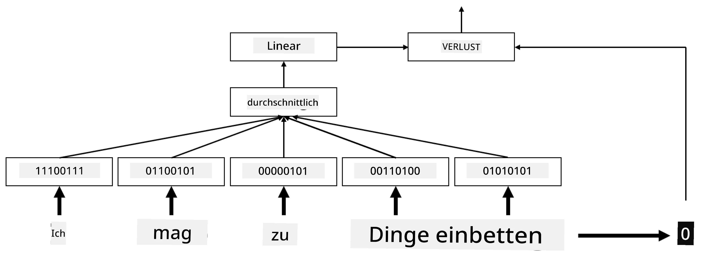
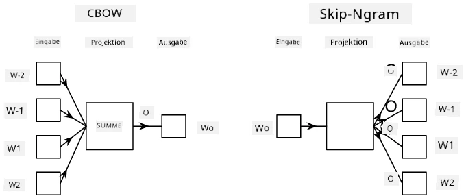

# Einbettungen

## [Quiz vor der Vorlesung](https://ff-quizzes.netlify.app/en/ai/quiz/27)

Beim Training von Klassifikatoren basierend auf BoW oder TF/IDF haben wir mit hochdimensionalen Bag-of-Words-Vektoren gearbeitet, deren Länge `vocab_size` entspricht. Dabei haben wir explizit von niedrigdimensionalen Positionsdarstellungsvektoren in spärliche One-Hot-Darstellungen umgewandelt. Diese One-Hot-Darstellung ist jedoch nicht speichereffizient. Außerdem wird jedes Wort unabhängig von den anderen behandelt, d. h. One-Hot-codierte Vektoren drücken keine semantische Ähnlichkeit zwischen Wörtern aus.

Die Idee der **Einbettung** besteht darin, Wörter durch niedrigdimensionale dichte Vektoren darzustellen, die irgendwie die semantische Bedeutung eines Wortes widerspiegeln. Später werden wir besprechen, wie man sinnvolle Wort-Einbettungen erstellt, aber vorerst können wir Einbettungen als eine Methode betrachten, die Dimensionalität eines Wortvektors zu reduzieren.

Die Einbettungsschicht würde also ein Wort als Eingabe nehmen und einen Ausgabesektor mit einer festgelegten `embedding_size` erzeugen. In gewisser Weise ähnelt sie einer `Linear`-Schicht, aber anstatt einen One-Hot-codierten Vektor zu verwenden, kann sie eine Wortnummer als Eingabe akzeptieren, wodurch wir große One-Hot-codierte Vektoren vermeiden können.

Durch die Verwendung einer Einbettungsschicht als erste Schicht in unserem Klassifikator-Netzwerk können wir von einem Bag-of-Words-Modell zu einem **Embedding-Bag-Modell** wechseln, bei dem wir zunächst jedes Wort in unserem Text in die entsprechende Einbettung umwandeln und dann eine Aggregatfunktion über alle diese Einbettungen berechnen, wie z. B. `sum`, `average` oder `max`.

> Bild vom Autor

## ✍️ Übungen: Einbettungen

Setze dein Lernen in den folgenden Notebooks fort:
* [Einbettungen mit PyTorch](EmbeddingsPyTorch.ipynb)
* [Einbettungen mit TensorFlow](EmbeddingsTF.ipynb)

## Semantische Einbettungen: Word2Vec

Während die Einbettungsschicht gelernt hat, Wörter in Vektordarstellungen zu überführen, hat diese Darstellung jedoch nicht unbedingt eine semantische Bedeutung. Es wäre wünschenswert, eine Vektordarstellung zu lernen, bei der ähnliche Wörter oder Synonyme Vektoren entsprechen, die in Bezug auf eine Vektordistanz (z. B. euklidische Distanz) nahe beieinander liegen.

Um dies zu erreichen, müssen wir unser Einbettungsmodell auf einer großen Textsammlung in einer spezifischen Weise vortrainieren. Eine Methode, semantische Einbettungen zu trainieren, nennt sich [Word2Vec](https://en.wikipedia.org/wiki/Word2vec). Es basiert auf zwei Hauptarchitekturen, die verwendet werden, um eine verteilte Darstellung von Wörtern zu erzeugen:

 - **Continuous Bag-of-Words** (CBoW) — In dieser Architektur trainieren wir das Modell darauf, ein Wort aus dem umgebenden Kontext vorherzusagen. Gegeben das Ngram $(W_{-2},W_{-1},W_0,W_1,W_2)$, ist das Ziel des Modells, $W_0$ aus $(W_{-2},W_{-1},W_1,W_2)$ vorherzusagen.
 - **Continuous Skip-Gram** ist das Gegenteil von CBoW. Das Modell verwendet das umgebende Fenster von Kontextwörtern, um das aktuelle Wort vorherzusagen.

CBoW ist schneller, während Skip-Gram langsamer ist, aber eine bessere Darstellung von seltenen Wörtern liefert.

> Bild aus [diesem Paper](https://arxiv.org/pdf/1301.3781.pdf)

Word2Vec vortrainierte Einbettungen (sowie andere ähnliche Modelle wie GloVe) können auch anstelle der Einbettungsschicht in neuronalen Netzwerken verwendet werden. Allerdings müssen wir uns mit Vokabularen auseinandersetzen, da das Vokabular, das zum Vortrainieren von Word2Vec/GloVe verwendet wurde, wahrscheinlich von dem Vokabular in unserem Textkorpus abweicht. Schau dir die oben genannten Notebooks an, um zu sehen, wie dieses Problem gelöst werden kann.

## Kontextuelle Einbettungen

Eine zentrale Einschränkung traditioneller vortrainierter Einbettungsdarstellungen wie Word2Vec ist das Problem der Mehrdeutigkeit von Wortbedeutungen. Während vortrainierte Einbettungen einige Bedeutungen von Wörtern im Kontext erfassen können, wird jede mögliche Bedeutung eines Wortes in derselben Einbettung kodiert. Dies kann Probleme in nachgelagerten Modellen verursachen, da viele Wörter, wie das Wort 'play', je nach Kontext unterschiedliche Bedeutungen haben.

Zum Beispiel hat das Wort 'play' in diesen beiden Sätzen ganz unterschiedliche Bedeutungen:

- Ich war in einem **Theaterstück**.
- John möchte mit seinen Freunden **spielen**.

Die oben genannten vortrainierten Einbettungen repräsentieren beide Bedeutungen des Wortes 'play' in derselben Einbettung. Um diese Einschränkung zu überwinden, müssen wir Einbettungen basierend auf dem **Sprachmodell** erstellen, das auf einem großen Textkorpus trainiert wurde und *weiß*, wie Wörter in verschiedenen Kontexten zusammengefügt werden können. Die Diskussion über kontextuelle Einbettungen liegt außerhalb des Umfangs dieses Tutorials, aber wir werden später im Kurs darauf zurückkommen, wenn wir über Sprachmodelle sprechen.

## Fazit

In dieser Lektion hast du gelernt, wie man Einbettungsschichten in TensorFlow und PyTorch erstellt und verwendet, um die semantische Bedeutung von Wörtern besser widerzuspiegeln.

## 🚀 Herausforderung

Word2Vec wurde für einige interessante Anwendungen verwendet, einschließlich der Generierung von Songtexten und Gedichten. Schau dir [diesen Artikel](https://www.politetype.com/blog/word2vec-color-poems) an, der erklärt, wie der Autor Word2Vec verwendet hat, um Gedichte zu generieren. Sieh dir auch [dieses Video von Dan Shiffmann](https://www.youtube.com/watch?v=LSS_bos_TPI&ab_channel=TheCodingTrain) an, um eine andere Erklärung dieser Technik zu entdecken. Versuche dann, diese Techniken auf deinen eigenen Textkorpus anzuwenden, vielleicht aus Kaggle.

## [Quiz nach der Vorlesung](https://ff-quizzes.netlify.app/en/ai/quiz/28)

## Überprüfung & Selbststudium

Lies dieses Paper über Word2Vec: [Efficient Estimation of Word Representations in Vector Space](https://arxiv.org/pdf/1301.3781.pdf)

## [Aufgabe: Notebooks](assignment.md)

---

