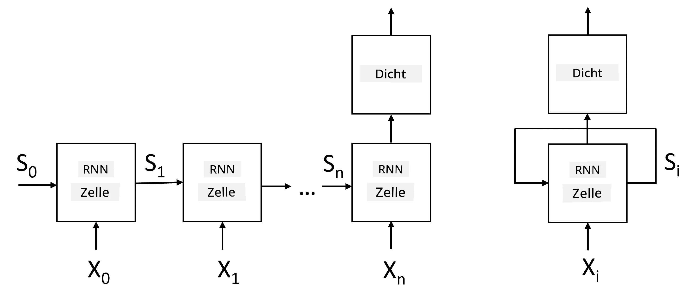
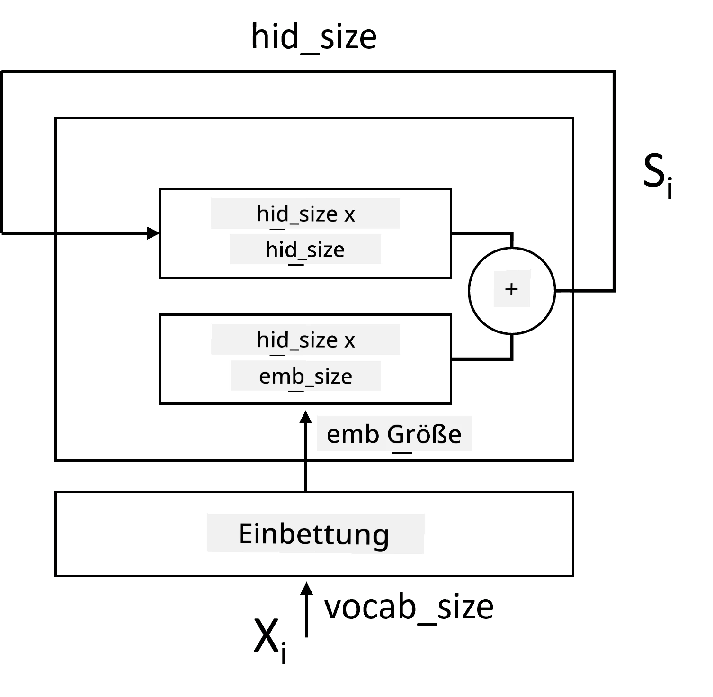
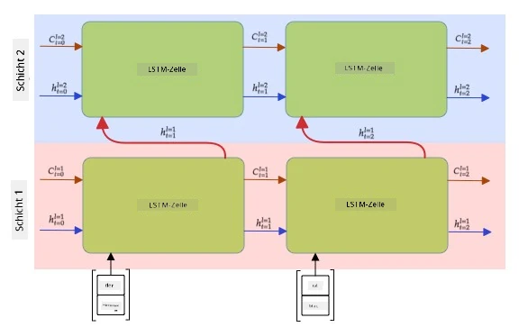

# Rekurrente Neuronale Netze

## [Quiz vor der Vorlesung](https://ff-quizzes.netlify.app/en/ai/quiz/31)

In den vorherigen Abschnitten haben wir reichhaltige semantische Repräsentationen von Text und einen einfachen linearen Klassifikator auf den Einbettungen verwendet. Diese Architektur erfasst die aggregierte Bedeutung der Wörter in einem Satz, berücksichtigt jedoch nicht die **Reihenfolge** der Wörter, da die Aggregationsoperation auf den Einbettungen diese Information aus dem ursprünglichen Text entfernt. Da diese Modelle die Wortreihenfolge nicht modellieren können, sind sie nicht in der Lage, komplexere oder mehrdeutige Aufgaben wie Textgenerierung oder Fragebeantwortung zu lösen.

Um die Bedeutung einer Textsequenz zu erfassen, müssen wir eine andere Architektur für neuronale Netze verwenden, die als **rekurrentes neuronales Netz** oder RNN bezeichnet wird. Im RNN geben wir unseren Satz ein Symbol nach dem anderen durch das Netzwerk, und das Netzwerk erzeugt einen **Zustand**, den wir dann mit dem nächsten Symbol erneut in das Netzwerk einspeisen.

> Bild vom Autor

Angenommen, wir haben eine Eingabesequenz von Token X0,...,Xn, erstellt das RNN eine Sequenz von neuronalen Netzwerkblöcken und trainiert diese Sequenz end-to-end mittels Backpropagation. Jeder Netzwerkblock nimmt ein Paar (Xi,Si) als Eingabe und erzeugt Si+1 als Ergebnis. Der finale Zustand Sn oder (Ausgabe Yn) wird in einen linearen Klassifikator eingespeist, um das Ergebnis zu erzeugen. Alle Netzwerkblöcke teilen sich die gleichen Gewichte und werden end-to-end mit einem Backpropagation-Durchgang trainiert.

Da die Zustandsvektoren S0,...,Sn durch das Netzwerk weitergegeben werden, kann es die sequentiellen Abhängigkeiten zwischen Wörtern lernen. Zum Beispiel, wenn das Wort *nicht* irgendwo in der Sequenz erscheint, kann es lernen, bestimmte Elemente innerhalb des Zustandsvektors zu negieren, was zu einer Verneinung führt.

> ✅ Da die Gewichte aller RNN-Blöcke im obigen Bild geteilt werden, kann dasselbe Bild als ein Block (rechts) mit einer rekurrenten Rückkopplungsschleife dargestellt werden, die den Ausgabestatus des Netzwerks wieder an die Eingabe weitergibt.

## Anatomie einer RNN-Zelle

Schauen wir uns an, wie eine einfache RNN-Zelle organisiert ist. Sie akzeptiert den vorherigen Zustand Si-1 und das aktuelle Symbol Xi als Eingaben und muss den Ausgabestatus Si erzeugen (und manchmal sind wir auch an einer anderen Ausgabe Yi interessiert, wie im Fall von generativen Netzwerken).

Eine einfache RNN-Zelle hat zwei Gewichtsmatrizen: eine transformiert ein Eingabesymbol (wir nennen sie W), und eine andere transformiert einen Eingabezustand (H). In diesem Fall wird die Ausgabe des Netzwerks als &sigma;(W&times;Xi+H&times;Si-1+b) berechnet, wobei &sigma; die Aktivierungsfunktion und b ein zusätzlicher Bias ist.

> Bild vom Autor

In vielen Fällen werden Eingabetoken vor dem Eintritt in das RNN durch die Einbettungsschicht geleitet, um die Dimensionalität zu reduzieren. In diesem Fall, wenn die Dimension der Eingabevektoren *emb_size* ist und der Zustandsvektor *hid_size* ist - beträgt die Größe von W *emb_size*&times;*hid_size*, und die Größe von H ist *hid_size*&times;*hid_size*.

## Long Short Term Memory (LSTM)

Eines der Hauptprobleme klassischer RNNs ist das sogenannte **Problem der verschwindenden Gradienten**. Da RNNs end-to-end in einem Backpropagation-Durchgang trainiert werden, haben sie Schwierigkeiten, Fehler zu den ersten Schichten des Netzwerks zu propagieren, und können daher keine Beziehungen zwischen weit entfernten Token lernen. Eine Möglichkeit, dieses Problem zu vermeiden, besteht darin, **explizites Zustandsmanagement** durch sogenannte **Gates** einzuführen. Es gibt zwei bekannte Architekturen dieser Art: **Long Short Term Memory** (LSTM) und **Gated Relay Unit** (GRU).

> Bildquelle TBD

Das LSTM-Netzwerk ist ähnlich wie ein RNN organisiert, aber es gibt zwei Zustände, die von Schicht zu Schicht weitergegeben werden: der eigentliche Zustand C und der versteckte Vektor H. In jeder Einheit wird der versteckte Vektor Hi mit der Eingabe Xi verkettet, und sie steuern, was mit dem Zustand C über **Gates** geschieht. Jedes Gate ist ein neuronales Netzwerk mit Sigmoid-Aktivierung (Ausgabe im Bereich [0,1]), das als bitweises Maskieren betrachtet werden kann, wenn es mit dem Zustandsvektor multipliziert wird. Es gibt die folgenden Gates (von links nach rechts im obigen Bild):

* Das **Vergessens-Gate** nimmt einen versteckten Vektor und bestimmt, welche Komponenten des Vektors C wir vergessen und welche wir durchlassen müssen.
* Das **Eingabe-Gate** nimmt einige Informationen aus den Eingabe- und versteckten Vektoren und fügt sie in den Zustand ein.
* Das **Ausgabe-Gate** transformiert den Zustand über eine lineare Schicht mit *tanh*-Aktivierung und wählt dann einige seiner Komponenten mithilfe eines versteckten Vektors Hi aus, um einen neuen Zustand Ci+1 zu erzeugen.

Komponenten des Zustands C können als Flags betrachtet werden, die ein- und ausgeschaltet werden können. Zum Beispiel, wenn wir in der Sequenz den Namen *Alice* begegnen, könnten wir annehmen, dass er sich auf eine weibliche Figur bezieht, und das Flag im Zustand setzen, dass wir ein weibliches Substantiv im Satz haben. Wenn wir später die Phrase *und Tom* begegnen, setzen wir das Flag, dass wir ein Plural-Substantiv haben. Durch die Manipulation des Zustands können wir also angeblich die grammatikalischen Eigenschaften von Satzteilen verfolgen.

> ✅ Eine ausgezeichnete Ressource, um die Interna von LSTM zu verstehen, ist dieser großartige Artikel [Understanding LSTM Networks](https://colah.github.io/posts/2015-08-Understanding-LSTMs/) von Christopher Olah.

## Bidirektionale und mehrschichtige RNNs

Wir haben rekurrente Netzwerke besprochen, die in eine Richtung arbeiten, vom Anfang einer Sequenz bis zum Ende. Das erscheint natürlich, da es der Art und Weise ähnelt, wie wir lesen und Sprache hören. Da wir jedoch in vielen praktischen Fällen zufälligen Zugriff auf die Eingabesequenz haben, könnte es sinnvoll sein, die rekurrente Berechnung in beide Richtungen auszuführen. Solche Netzwerke werden als **bidirektionale** RNNs bezeichnet. Bei einem bidirektionalen Netzwerk benötigen wir zwei versteckte Zustandsvektoren, einen für jede Richtung.

Ein rekurrentes Netzwerk, sei es eindirektional oder bidirektional, erfasst bestimmte Muster innerhalb einer Sequenz und kann sie in einem Zustandsvektor speichern oder in die Ausgabe weitergeben. Wie bei konvolutionalen Netzwerken können wir eine weitere rekurrente Schicht auf die erste aufbauen, um höherstufige Muster zu erfassen und aus den niedrigstufigen Mustern zu bauen, die von der ersten Schicht extrahiert wurden. Dies führt uns zum Konzept eines **mehrschichtigen RNN**, das aus zwei oder mehr rekurrenten Netzwerken besteht, wobei die Ausgabe der vorherigen Schicht als Eingabe an die nächste Schicht weitergegeben wird.

*Bild aus [diesem wunderbaren Beitrag](https://towardsdatascience.com/from-a-lstm-cell-to-a-multilayer-lstm-network-with-pytorch-2899eb5696f3) von Fernando López*

## ✍️ Übungen: Einbettungen

Setzen Sie Ihr Lernen in den folgenden Notebooks fort:

* [RNNs mit PyTorch](RNNPyTorch.ipynb)
* [RNNs mit TensorFlow](RNNTF.ipynb)

## Fazit

In dieser Einheit haben wir gesehen, dass RNNs für die Sequenzklassifikation verwendet werden können, aber tatsächlich können sie viele weitere Aufgaben bewältigen, wie Textgenerierung, maschinelle Übersetzung und mehr. Diese Aufgaben werden wir in der nächsten Einheit betrachten.

## 🚀 Herausforderung

Lesen Sie einige Literatur über LSTMs und denken Sie über deren Anwendungen nach:

- [Grid Long Short-Term Memory](https://arxiv.org/pdf/1507.01526v1.pdf)
- [Show, Attend and Tell: Neural Image Caption
Generation with Visual Attention](https://arxiv.org/pdf/1502.03044v2.pdf)

## [Quiz nach der Vorlesung](https://ff-quizzes.netlify.app/en/ai/quiz/32)

## Überprüfung & Selbststudium

- [Understanding LSTM Networks](https://colah.github.io/posts/2015-08-Understanding-LSTMs/) von Christopher Olah.

## [Aufgabe: Notebooks](assignment.md)

---

