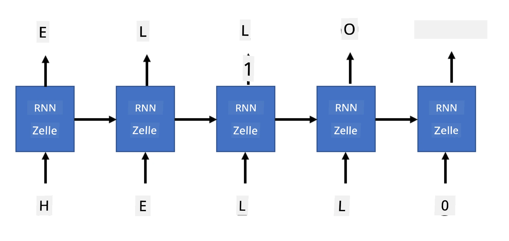

# Generative Netzwerke

## [Quiz vor der Vorlesung](https://ff-quizzes.netlify.app/en/ai/quiz/33)

Recurrent Neural Networks (RNNs) und ihre Varianten mit gated Zellen wie Long Short Term Memory Cells (LSTMs) und Gated Recurrent Units (GRUs) bieten eine Möglichkeit zur Sprachmodellierung, da sie die Wortreihenfolge lernen und Vorhersagen für das nächste Wort in einer Sequenz treffen können. Dies ermöglicht es uns, RNNs für **generative Aufgaben** zu nutzen, wie z. B. gewöhnliche Textgenerierung, maschinelle Übersetzung und sogar Bildbeschriftung.

> ✅ Denke an all die Male, in denen du von generativen Aufgaben wie der Textvervollständigung beim Tippen profitiert hast. Recherchiere zu deinen Lieblingsanwendungen, um herauszufinden, ob sie RNNs verwendet haben.

In der RNN-Architektur, die wir in der vorherigen Einheit besprochen haben, erzeugte jede RNN-Einheit den nächsten versteckten Zustand als Ausgabe. Wir können jedoch auch eine weitere Ausgabe zu jeder rekurrenten Einheit hinzufügen, die es uns ermöglicht, eine **Sequenz** auszugeben (die genauso lang ist wie die ursprüngliche Sequenz). Darüber hinaus können wir RNN-Einheiten verwenden, die bei jedem Schritt keine Eingabe akzeptieren, sondern nur einen anfänglichen Zustandsvektor nehmen und dann eine Sequenz von Ausgaben erzeugen.

Dies ermöglicht verschiedene neuronale Architekturen, die im folgenden Bild dargestellt sind:


> Bild aus dem Blogpost [Unreasonable Effectiveness of Recurrent Neural Networks](http://karpathy.github.io/2015/05/21/rnn-effectiveness/) von [Andrej Karpaty](http://karpathy.github.io/)

* **One-to-one** ist ein traditionelles neuronales Netzwerk mit einer Eingabe und einer Ausgabe.
* **One-to-many** ist eine generative Architektur, die einen Eingabewert akzeptiert und eine Sequenz von Ausgabewerten erzeugt. Zum Beispiel, wenn wir ein **Bildbeschriftungsnetzwerk** trainieren möchten, das eine textuelle Beschreibung eines Bildes erzeugt, können wir ein Bild als Eingabe nehmen, es durch ein CNN leiten, um seinen versteckten Zustand zu erhalten, und dann eine rekurrente Kette Wort für Wort die Beschriftung generieren lassen.
* **Many-to-one** entspricht den RNN-Architekturen, die wir in der vorherigen Einheit beschrieben haben, wie z. B. Textklassifikation.
* **Many-to-many**, oder **sequence-to-sequence**, entspricht Aufgaben wie **maschineller Übersetzung**, bei denen wir zuerst ein RNN alle Informationen aus der Eingabesequenz in den versteckten Zustand sammeln lassen und eine andere RNN-Kette diesen Zustand in die Ausgabesequenz entfaltet.

In dieser Einheit konzentrieren wir uns auf einfache generative Modelle, die uns helfen, Text zu generieren. Der Einfachheit halber verwenden wir eine Tokenisierung auf Zeichenebene.

Wir werden dieses RNN trainieren, um Text Schritt für Schritt zu generieren. Bei jedem Schritt nehmen wir eine Zeichenfolge der Länge `nchars` und bitten das Netzwerk, das nächste Ausgabesymbol für jedes Eingabesymbol zu generieren:



Bei der Textgenerierung (während der Inferenz) beginnen wir mit einem **Prompt**, der durch die RNN-Zellen geleitet wird, um seinen Zwischenzustand zu erzeugen, und dann beginnt die Generierung aus diesem Zustand. Wir generieren ein Zeichen nach dem anderen und übergeben den Zustand und das generierte Zeichen an eine andere RNN-Zelle, um das nächste zu generieren, bis wir genügend Zeichen erzeugt haben.


> Bild vom Autor

## ✍️ Übungen: Generative Netzwerke

Setze dein Lernen in den folgenden Notebooks fort:

* [Generative Netzwerke mit PyTorch](GenerativePyTorch.ipynb)
* [Generative Netzwerke mit TensorFlow](GenerativeTF.ipynb)

## Weiche Textgenerierung und Temperatur

Die Ausgabe jeder RNN-Zelle ist eine Wahrscheinlichkeitsverteilung von Zeichen. Wenn wir immer das Zeichen mit der höchsten Wahrscheinlichkeit als nächstes Zeichen im generierten Text nehmen, kann der Text oft "zyklisch" werden und sich zwischen denselben Zeichenfolgen wiederholen, wie in diesem Beispiel:

```
today of the second the company and a second the company ...
```

Wenn wir jedoch die Wahrscheinlichkeitsverteilung für das nächste Zeichen betrachten, könnte es sein, dass der Unterschied zwischen den höchsten Wahrscheinlichkeiten nicht groß ist, z. B. könnte ein Zeichen eine Wahrscheinlichkeit von 0,2 haben, ein anderes - 0,19 usw. Zum Beispiel könnte das nächste Zeichen in der Sequenz '*play*' genauso gut ein Leerzeichen oder **e** sein (wie im Wort *player*).

Dies führt uns zu der Erkenntnis, dass es nicht immer "fair" ist, das Zeichen mit der höchsten Wahrscheinlichkeit auszuwählen, da die Wahl des zweitbesten Zeichens immer noch zu sinnvollem Text führen könnte. Es ist klüger, **Zeichen** aus der Wahrscheinlichkeitsverteilung zu **samplen**, die durch die Netzwerkausgabe gegeben wird. Wir können auch einen Parameter, **Temperatur**, verwenden, der die Wahrscheinlichkeitsverteilung abflacht, falls wir mehr Zufälligkeit hinzufügen möchten, oder sie steiler macht, wenn wir uns stärker an die Zeichen mit der höchsten Wahrscheinlichkeit halten möchten.

Erkunde, wie diese weiche Textgenerierung in den oben verlinkten Notebooks implementiert ist.

## Fazit

Während die Textgenerierung an sich nützlich sein kann, liegen die Hauptvorteile in der Fähigkeit, Text mithilfe von RNNs aus einem anfänglichen Feature-Vektor zu generieren. Zum Beispiel wird die Textgenerierung als Teil der maschinellen Übersetzung verwendet (sequence-to-sequence, in diesem Fall wird der Zustandsvektor vom *Encoder* verwendet, um die übersetzte Nachricht zu generieren oder zu *decodieren*), oder um eine textuelle Beschreibung eines Bildes zu erzeugen (in diesem Fall würde der Feature-Vektor von einem CNN-Extraktor stammen).

## 🚀 Herausforderung

Nimm einige Lektionen auf Microsoft Learn zu diesem Thema:

* Textgenerierung mit [PyTorch](https://docs.microsoft.com/learn/modules/intro-natural-language-processing-pytorch/6-generative-networks/?WT.mc_id=academic-77998-cacaste)/[TensorFlow](https://docs.microsoft.com/learn/modules/intro-natural-language-processing-tensorflow/5-generative-networks/?WT.mc_id=academic-77998-cacaste)

## [Quiz nach der Vorlesung](https://ff-quizzes.netlify.app/en/ai/quiz/34)

## Rückblick & Selbststudium

Hier sind einige Artikel, um dein Wissen zu erweitern:

* Verschiedene Ansätze zur Textgenerierung mit Markov-Kette, LSTM und GPT-2: [Blogpost](https://towardsdatascience.com/text-generation-gpt-2-lstm-markov-chain-9ea371820e1e)
* Beispiel zur Textgenerierung in der [Keras-Dokumentation](https://keras.io/examples/generative/lstm_character_level_text_generation/)

## [Aufgabe](lab/README.md)

Wir haben gesehen, wie man Text Zeichen für Zeichen generiert. Im Labor wirst du die Textgenerierung auf Wortebene erkunden.

---

