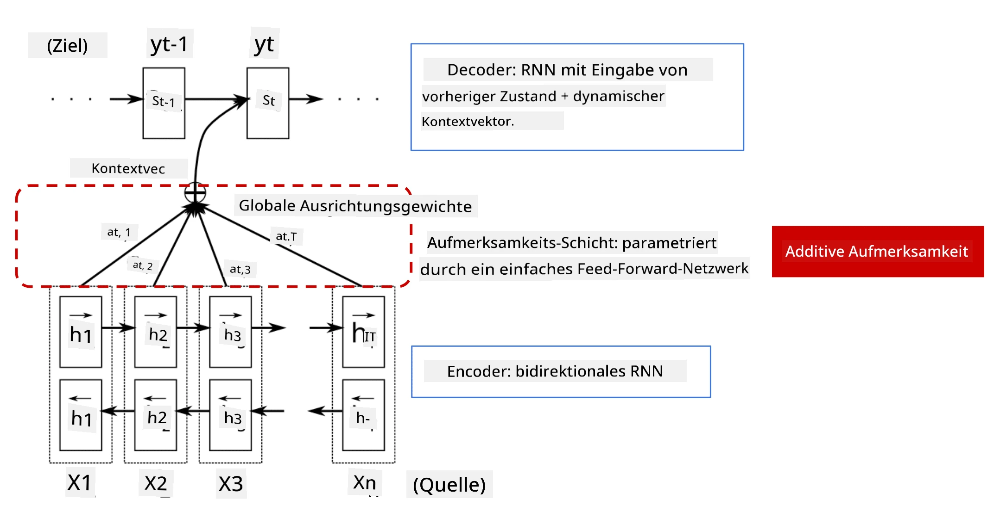
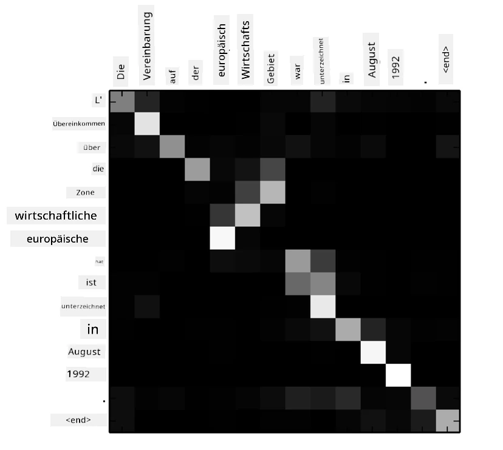
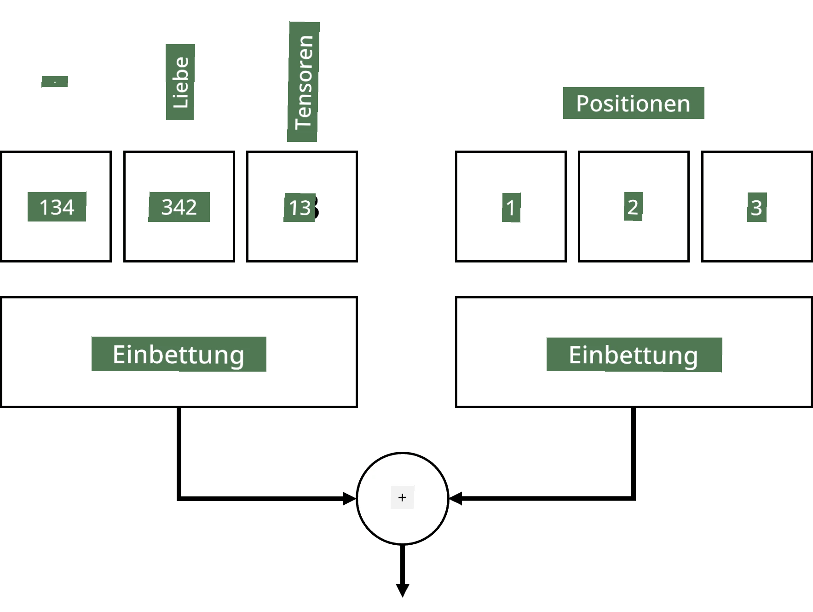
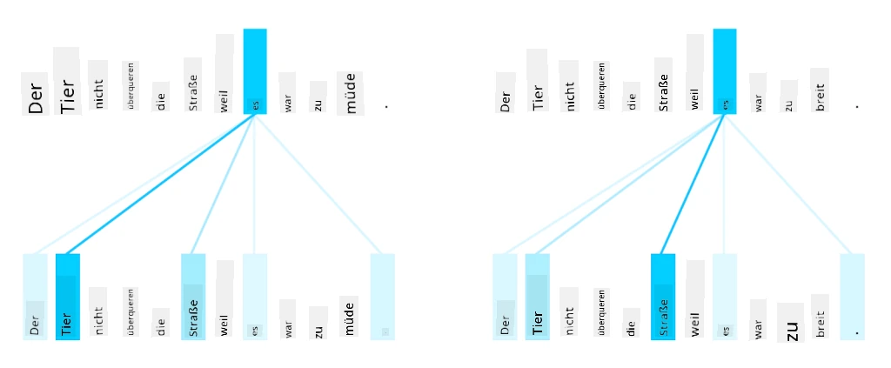
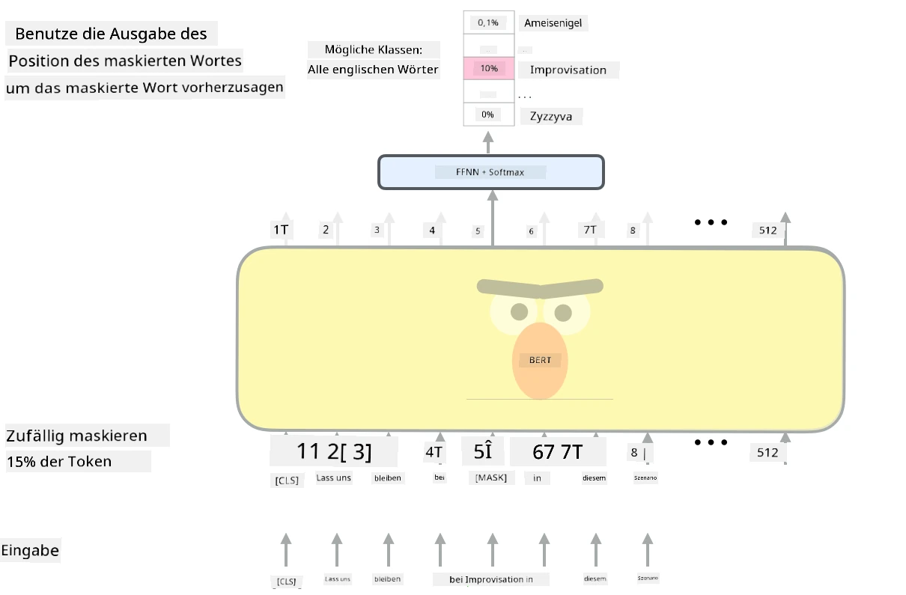

# Aufmerksamkeitsmechanismen und Transformer

## [Quiz vor der Vorlesung](https://ff-quizzes.netlify.app/en/ai/quiz/35)

Eines der wichtigsten Probleme im Bereich der NLP ist die **maschinelle Übersetzung**, eine zentrale Aufgabe, die Tools wie Google Translate zugrunde liegt. In diesem Abschnitt konzentrieren wir uns auf die maschinelle Übersetzung oder allgemeiner auf jede *Sequence-to-Sequence*-Aufgabe (auch **Satztransduktion** genannt).

Mit RNNs wird Sequence-to-Sequence durch zwei rekurrente Netzwerke implementiert, wobei ein Netzwerk, der **Encoder**, eine Eingabesequenz in einen versteckten Zustand zusammenfasst, während ein anderes Netzwerk, der **Decoder**, diesen versteckten Zustand in ein übersetztes Ergebnis entfaltet. Es gibt jedoch einige Probleme bei diesem Ansatz:

* Der Endzustand des Encoder-Netzwerks hat Schwierigkeiten, sich an den Anfang eines Satzes zu erinnern, was zu einer schlechten Modellqualität bei langen Sätzen führt.
* Alle Wörter in einer Sequenz haben den gleichen Einfluss auf das Ergebnis. In der Realität haben jedoch bestimmte Wörter in der Eingabesequenz oft mehr Einfluss auf die sequentiellen Ausgaben als andere.

**Aufmerksamkeitsmechanismen** bieten eine Möglichkeit, den kontextuellen Einfluss jedes Eingabevektors auf jede Ausgabewahrscheinlichkeit des RNN zu gewichten. Dies wird durch die Erstellung von Abkürzungen zwischen den Zwischenzuständen des Eingabe-RNN und des Ausgabe-RNN umgesetzt. Auf diese Weise berücksichtigen wir beim Generieren des Ausgabesymbols yt alle versteckten Eingabezustände hi, mit unterschiedlichen Gewichtungskoeffizienten &alpha;t,i.

> Das Encoder-Decoder-Modell mit additivem Aufmerksamkeitsmechanismus aus [Bahdanau et al., 2015](https://arxiv.org/pdf/1409.0473.pdf), zitiert aus [diesem Blogbeitrag](https://lilianweng.github.io/lil-log/2018/06/24/attention-attention.html)

Die Aufmerksamkeitsmatrix {&alpha;i,j} repräsentiert den Grad, in dem bestimmte Eingabewörter bei der Generierung eines bestimmten Wortes in der Ausgabesequenz eine Rolle spielen. Unten ist ein Beispiel für eine solche Matrix:

> Abbildung aus [Bahdanau et al., 2015](https://arxiv.org/pdf/1409.0473.pdf) (Fig.3)

Aufmerksamkeitsmechanismen sind verantwortlich für viele der aktuellen oder nahezu aktuellen Spitzenleistungen in der NLP. Das Hinzufügen von Aufmerksamkeit erhöht jedoch die Anzahl der Modellparameter erheblich, was zu Skalierungsproblemen bei RNNs führte. Eine zentrale Einschränkung bei der Skalierung von RNNs ist, dass die rekurrente Natur der Modelle es schwierig macht, das Training zu batchen und zu parallelisieren. In einem RNN muss jedes Element einer Sequenz in der Reihenfolge verarbeitet werden, was eine einfache Parallelisierung verhindert.

> Abbildung aus [Googles Blog](https://research.googleblog.com/2016/09/a-neural-network-for-machine.html)

Die Einführung von Aufmerksamkeitsmechanismen in Kombination mit dieser Einschränkung führte zur Entwicklung der heute bekannten und genutzten Transformer-Modelle, wie BERT und Open-GPT3.

## Transformer-Modelle

Eine der Hauptideen hinter Transformern ist es, die sequentielle Natur von RNNs zu vermeiden und ein Modell zu schaffen, das während des Trainings parallelisierbar ist. Dies wird durch die Implementierung von zwei Ideen erreicht:

* Positionskodierung
* Verwendung des Self-Attention-Mechanismus, um Muster zu erfassen, anstelle von RNNs (oder CNNs) (deshalb heißt das Paper, das Transformer einführt, *[Attention is all you need](https://arxiv.org/abs/1706.03762)*).

### Positionskodierung/Einbettung

Die Idee der Positionskodierung ist folgende:  
1. Bei der Verwendung von RNNs wird die relative Position der Tokens durch die Anzahl der Schritte dargestellt und muss daher nicht explizit repräsentiert werden.  
2. Sobald wir jedoch zu Aufmerksamkeit wechseln, müssen wir die relativen Positionen der Tokens innerhalb einer Sequenz kennen.  
3. Um Positionskodierung zu erhalten, erweitern wir unsere Sequenz von Tokens mit einer Sequenz von Token-Positionen in der Sequenz (d.h. eine Sequenz von Zahlen 0,1, ...).  
4. Wir mischen dann die Token-Position mit einem Token-Einbettungsvektor. Um die Position (Ganzzahl) in einen Vektor zu transformieren, können wir verschiedene Ansätze verwenden:

* Trainierbare Einbettung, ähnlich wie Token-Einbettung. Dies ist der Ansatz, den wir hier betrachten. Wir wenden Einbettungsschichten sowohl auf Tokens als auch auf ihre Positionen an, was zu Einbettungsvektoren mit denselben Dimensionen führt, die wir dann zusammen addieren.
* Feste Positionskodierungsfunktion, wie im ursprünglichen Paper vorgeschlagen.

> Bild vom Autor

Das Ergebnis, das wir mit Positionskodierung erhalten, bettet sowohl das ursprüngliche Token als auch dessen Position innerhalb einer Sequenz ein.

### Multi-Head Self-Attention

Als Nächstes müssen wir einige Muster innerhalb unserer Sequenz erfassen. Um dies zu tun, verwenden Transformer einen **Self-Attention**-Mechanismus, der im Wesentlichen Aufmerksamkeit ist, die auf dieselbe Sequenz als Eingabe und Ausgabe angewendet wird. Die Anwendung von Self-Attention ermöglicht es uns, den **Kontext** innerhalb des Satzes zu berücksichtigen und zu sehen, welche Wörter miteinander in Beziehung stehen. Zum Beispiel ermöglicht es uns zu sehen, auf welche Wörter durch Koreferenzen wie *es* verwiesen wird, und auch den Kontext zu berücksichtigen:

> Bild aus dem [Google Blog](https://research.googleblog.com/2017/08/transformer-novel-neural-network.html)

In Transformern verwenden wir **Multi-Head Attention**, um dem Netzwerk die Fähigkeit zu geben, verschiedene Arten von Abhängigkeiten zu erfassen, z. B. langfristige vs. kurzfristige Wortbeziehungen, Koreferenzen vs. etwas anderes usw.

[TensorFlow Notebook](TransformersTF.ipynb) enthält weitere Details zur Implementierung von Transformer-Schichten.

### Encoder-Decoder-Aufmerksamkeit

In Transformern wird Aufmerksamkeit an zwei Stellen verwendet:

* Um Muster innerhalb des Eingabetextes mit Self-Attention zu erfassen
* Um Sequenzübersetzung durchzuführen – dies ist die Aufmerksamkeits-Schicht zwischen Encoder und Decoder.

Encoder-Decoder-Aufmerksamkeit ist der Aufmerksamkeitsmechanismus, der in RNNs verwendet wird, wie zu Beginn dieses Abschnitts beschrieben. Dieses animierte Diagramm erklärt die Rolle der Encoder-Decoder-Aufmerksamkeit.

Da jede Eingabeposition unabhängig von jeder Ausgabeposition abgebildet wird, können Transformer besser parallelisieren als RNNs, was viel größere und ausdrucksstärkere Sprachmodelle ermöglicht. Jeder Aufmerksamkeitskopf kann verwendet werden, um verschiedene Beziehungen zwischen Wörtern zu lernen, was die nachgelagerten Aufgaben der natürlichen Sprachverarbeitung verbessert.

## BERT

**BERT** (Bidirectional Encoder Representations from Transformers) ist ein sehr großes mehrschichtiges Transformer-Netzwerk mit 12 Schichten für *BERT-base* und 24 für *BERT-large*. Das Modell wird zunächst auf einem großen Textkorpus (Wikipedia + Bücher) mit unüberwachtem Training (Vorhersage maskierter Wörter in einem Satz) vortrainiert. Während des Vortrainings nimmt das Modell ein erhebliches Maß an Sprachverständnis auf, das dann mit anderen Datensätzen durch Feintuning genutzt werden kann. Dieser Prozess wird als **Transfer Learning** bezeichnet.

> Bild [Quelle](http://jalammar.github.io/illustrated-bert/)

## ✍️ Übungen: Transformer

Setzen Sie Ihr Lernen in den folgenden Notebooks fort:

* [Transformer in PyTorch](TransformersPyTorch.ipynb)
* [Transformer in TensorFlow](TransformersTF.ipynb)

## Fazit

In dieser Lektion haben Sie etwas über Transformer und Aufmerksamkeitsmechanismen gelernt, alles wesentliche Werkzeuge im NLP-Werkzeugkasten. Es gibt viele Variationen von Transformer-Architekturen, einschließlich BERT, DistilBERT, BigBird, OpenGPT3 und mehr, die fein abgestimmt werden können. Das [HuggingFace-Paket](https://github.com/huggingface/) bietet ein Repository für das Training vieler dieser Architekturen mit sowohl PyTorch als auch TensorFlow.

## 🚀 Herausforderung

## [Quiz nach der Vorlesung](https://ff-quizzes.netlify.app/en/ai/quiz/36)

## Überprüfung & Selbststudium

* [Blogbeitrag](https://mchromiak.github.io/articles/2017/Sep/12/Transformer-Attention-is-all-you-need/), der das klassische [Attention is all you need](https://arxiv.org/abs/1706.03762)-Paper über Transformer erklärt.
* [Eine Serie von Blogbeiträgen](https://towardsdatascience.com/transformers-explained-visually-part-1-overview-of-functionality-95a6dd460452) über Transformer, die die Architektur im Detail erklären.

## [Aufgabe](assignment.md)

---

