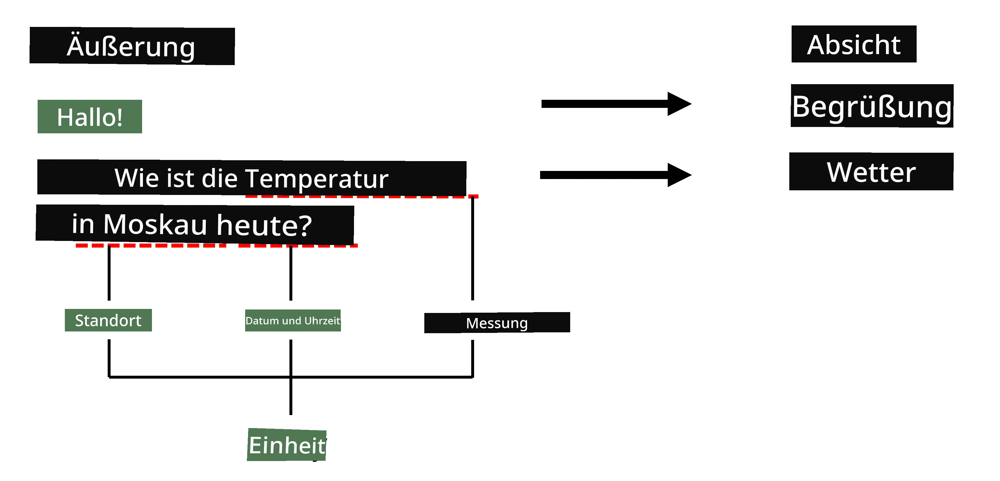
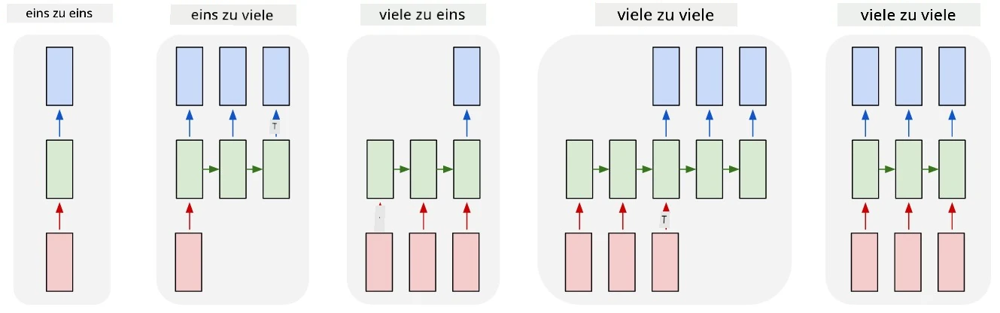

# Named Entity Recognition

Bis jetzt haben wir uns hauptsächlich auf eine NLP-Aufgabe konzentriert – die Klassifikation. Es gibt jedoch auch andere NLP-Aufgaben, die mit neuronalen Netzwerken gelöst werden können. Eine dieser Aufgaben ist **[Named Entity Recognition](https://wikipedia.org/wiki/Named-entity_recognition)** (NER), die sich mit der Erkennung spezifischer Entitäten im Text befasst, wie Orte, Personennamen, Zeitintervalle, chemische Formeln und vieles mehr.

## [Quiz vor der Vorlesung](https://ff-quizzes.netlify.app/en/ai/quiz/37)

## Beispiel für die Verwendung von NER

Angenommen, Sie möchten einen natürlichen Sprach-Chatbot entwickeln, ähnlich wie Amazon Alexa oder Google Assistant. Intelligente Chatbots funktionieren, indem sie *verstehen*, was der Benutzer möchte, indem sie eine Textklassifikation auf den Eingabesatz anwenden. Das Ergebnis dieser Klassifikation ist die sogenannte **Intent**, die bestimmt, was der Chatbot tun soll.

> Bild vom Autor

Ein Benutzer könnte jedoch einige Parameter als Teil des Satzes angeben. Wenn er beispielsweise nach dem Wetter fragt, könnte er einen Ort oder ein Datum angeben. Ein Bot sollte in der Lage sein, diese Entitäten zu verstehen und die Parameter entsprechend auszufüllen, bevor er die Aktion ausführt. Genau hier kommt NER ins Spiel.

> ✅ Ein weiteres Beispiel wäre [die Analyse wissenschaftlicher medizinischer Artikel](https://soshnikov.com/science/analyzing-medical-papers-with-azure-and-text-analytics-for-health/). Eine der Hauptaufgaben besteht darin, spezifische medizinische Begriffe wie Krankheiten und medizinische Substanzen zu identifizieren. Während eine kleine Anzahl von Krankheiten wahrscheinlich durch Substring-Suche extrahiert werden kann, erfordern komplexere Entitäten wie chemische Verbindungen und Medikamentennamen einen komplexeren Ansatz.

## NER als Token-Klassifikation

NER-Modelle sind im Wesentlichen **Token-Klassifikationsmodelle**, da wir für jedes der Eingabetokens entscheiden müssen, ob es zu einer Entität gehört oder nicht, und falls ja – zu welcher Entitätsklasse.

Betrachten Sie den folgenden Titel eines Artikels:

**Trikuspidalklappeninsuffizienz** und **Lithiumcarbonat**-**Toxizität** bei einem neugeborenen Säugling.

Die Entitäten hier sind:

* Trikuspidalklappeninsuffizienz ist eine Krankheit (`DIS`)
* Lithiumcarbonat ist eine chemische Substanz (`CHEM`)
* Toxizität ist ebenfalls eine Krankheit (`DIS`)

Beachten Sie, dass eine Entität aus mehreren Tokens bestehen kann. Und wie in diesem Fall müssen wir zwischen zwei aufeinanderfolgenden Entitäten unterscheiden. Daher ist es üblich, zwei Klassen für jede Entität zu verwenden – eine, die das erste Token der Entität angibt (oft wird das Präfix `B-` für **b**eginning verwendet), und eine andere für die Fortsetzung einer Entität (`I-`, für **i**nner Token). Wir verwenden auch `O` als Klasse, um alle **o**ther Tokens darzustellen. Eine solche Token-Kennzeichnung wird [BIO-Tagging](https://en.wikipedia.org/wiki/Inside%E2%80%93outside%E2%80%93beginning_(tagging)) (oder IOB) genannt. Nach der Kennzeichnung sieht unser Titel so aus:

Token | Tag
------|-----
Trikuspidalklappen | B-DIS
insuffizienz | I-DIS
und | O
Lithium | B-CHEM
carbonat | I-CHEM
Toxizität | B-DIS
bei | O
einem | O
neugeborenen | O
Säugling | O
. | O

Da wir eine Eins-zu-Eins-Korrespondenz zwischen Tokens und Klassen herstellen müssen, können wir ein rechtsbasiertes **Many-to-Many**-Neuralnetzwerkmodell aus diesem Bild trainieren:

> *Bild aus [diesem Blogbeitrag](http://karpathy.github.io/2015/05/21/rnn-effectiveness/) von [Andrej Karpathy](http://karpathy.github.io/). NER-Token-Klassifikationsmodelle entsprechen der rechtsbasierten Netzwerkarchitektur auf diesem Bild.*

## Training von NER-Modellen

Da ein NER-Modell im Wesentlichen ein Token-Klassifikationsmodell ist, können wir RNNs, die wir bereits kennen, für diese Aufgabe verwenden. In diesem Fall gibt jeder Block des rekurrenten Netzwerks die Token-ID zurück. Das folgende Beispiel-Notebook zeigt, wie man LSTM für die Token-Klassifikation trainiert.

## ✍️ Beispiel-Notebooks: NER

Setzen Sie Ihr Lernen mit dem folgenden Notebook fort:

* [NER mit TensorFlow](NER-TF.ipynb)

## Fazit

Ein NER-Modell ist ein **Token-Klassifikationsmodell**, was bedeutet, dass es zur Token-Klassifikation verwendet werden kann. Dies ist eine sehr häufige Aufgabe in der NLP, die hilft, spezifische Entitäten im Text zu erkennen, einschließlich Orte, Namen, Daten und mehr.

## 🚀 Herausforderung

Bearbeiten Sie die unten verlinkte Aufgabe, um ein Named Entity Recognition-Modell für medizinische Begriffe zu trainieren, und testen Sie es anschließend mit einem anderen Datensatz.

## [Quiz nach der Vorlesung](https://ff-quizzes.netlify.app/en/ai/quiz/38)

## Überprüfung & Selbststudium

Lesen Sie den Blog [The Unreasonable Effectiveness of Recurrent Neural Networks](http://karpathy.github.io/2015/05/21/rnn-effectiveness/) und folgen Sie dem Abschnitt "Weiterführende Literatur" in diesem Artikel, um Ihr Wissen zu vertiefen.

## [Aufgabe](lab/README.md)

In der Aufgabe zu dieser Lektion müssen Sie ein Modell zur Erkennung medizinischer Entitäten trainieren. Sie können mit dem Training eines LSTM-Modells beginnen, wie in dieser Lektion beschrieben, und anschließend das BERT-Transformer-Modell verwenden. Lesen Sie [die Anweisungen](lab/README.md), um alle Details zu erhalten.

---

