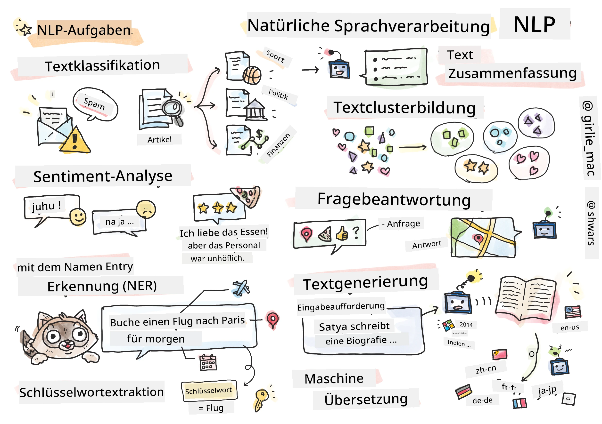

# Verarbeitung natürlicher Sprache



In diesem Abschnitt konzentrieren wir uns darauf, neuronale Netze für Aufgaben im Zusammenhang mit **Natural Language Processing (NLP)** einzusetzen. Es gibt viele NLP-Probleme, die Computer lösen sollen:

* **Textklassifikation** ist ein typisches Klassifikationsproblem im Bereich von Textsequenzen. Beispiele sind das Klassifizieren von E-Mails als Spam oder kein Spam oder das Kategorisieren von Artikeln in Sport, Wirtschaft, Politik usw. Beim Entwickeln von Chatbots müssen wir oft verstehen, was ein Benutzer sagen wollte – in diesem Fall handelt es sich um **Intent-Klassifikation**. Hierbei müssen wir oft mit vielen Kategorien umgehen.
* **Sentiment-Analyse** ist ein typisches Regressionsproblem, bei dem wir eine Zahl (ein Sentiment) zuordnen müssen, die angibt, wie positiv oder negativ die Bedeutung eines Satzes ist. Eine fortgeschrittenere Version der Sentiment-Analyse ist die **aspektbasierte Sentiment-Analyse** (ABSA), bei der wir das Sentiment nicht auf den ganzen Satz, sondern auf verschiedene Teile davon (Aspekte) beziehen, z. B. *In diesem Restaurant mochte ich die Küche, aber die Atmosphäre war schrecklich*.
* **Named Entity Recognition** (NER) bezeichnet das Problem, bestimmte Entitäten aus Texten zu extrahieren. Beispielsweise müssen wir verstehen, dass im Satz *Ich muss morgen nach Paris fliegen* das Wort *morgen* ein DATUM bezeichnet und *Paris* ein ORT ist.  
* **Keyword-Extraktion** ähnelt NER, jedoch müssen automatisch die für die Bedeutung wichtigen Wörter extrahiert werden, ohne vorheriges Training für spezifische Entitätstypen.
* **Text-Clustering** kann nützlich sein, wenn wir ähnliche Sätze gruppieren möchten, z. B. ähnliche Anfragen in Support-Gesprächen.
* **Fragebeantwortung** bezeichnet die Fähigkeit eines Modells, auf eine gegebene Frage zu antworten. Das Modell erhält einen Textabschnitt und eine Frage als Eingabe und muss den Textabschnitt angeben, in dem die Antwort auf die Frage enthalten ist (oder manchmal die Antwort selbst generieren).
* **Textgenerierung** ist die Fähigkeit eines Modells, neuen Text zu erzeugen. Dies kann als Klassifikationsaufgabe betrachtet werden, bei der das nächste Zeichen/Wort basierend auf einem *Textprompt* vorhergesagt wird. Fortgeschrittene Textgenerierungsmodelle wie GPT-3 können andere NLP-Aufgaben wie Klassifikation mithilfe von Techniken wie [Prompt-Programmierung](https://towardsdatascience.com/software-3-0-how-prompting-will-change-the-rules-of-the-game-a982fbfe1e0) oder [Prompt-Engineering](https://medium.com/swlh/openai-gpt-3-and-prompt-engineering-dcdc2c5fcd29) lösen.
* **Textzusammenfassung** ist eine Technik, bei der ein Computer lange Texte „liest“ und sie in wenigen Sätzen zusammenfasst.
* **Maschinelle Übersetzung** kann als Kombination aus Textverständnis in einer Sprache und Textgenerierung in einer anderen Sprache betrachtet werden.

Anfangs wurden die meisten NLP-Aufgaben mit traditionellen Methoden wie Grammatiken gelöst. Beispielsweise wurden bei der maschinellen Übersetzung Parser verwendet, um einen Satz in einen Syntaxbaum zu transformieren, daraus höhere semantische Strukturen extrahiert, um die Bedeutung des Satzes darzustellen, und basierend auf dieser Bedeutung und der Grammatik der Zielsprache das Ergebnis generiert. Heutzutage werden viele NLP-Aufgaben effektiver mit neuronalen Netzen gelöst.

> Viele klassische NLP-Methoden sind in der Python-Bibliothek [Natural Language Processing Toolkit (NLTK)](https://www.nltk.org) implementiert. Es gibt ein großartiges [NLTK-Buch](https://www.nltk.org/book/), das online verfügbar ist und behandelt, wie verschiedene NLP-Aufgaben mit NLTK gelöst werden können.

In unserem Kurs konzentrieren wir uns hauptsächlich darauf, neuronale Netze für NLP zu verwenden, und wir nutzen NLTK bei Bedarf.

Wir haben bereits gelernt, neuronale Netze für tabellarische Daten und Bilder zu verwenden. Der Hauptunterschied zwischen diesen Datenarten und Text ist, dass Text eine Sequenz variabler Länge ist, während die Eingangsgröße bei Bildern im Voraus bekannt ist. Während konvolutionale Netzwerke Muster aus Eingabedaten extrahieren können, sind Muster im Text komplexer. Zum Beispiel kann die Verneinung vom Subjekt durch viele Wörter beliebig getrennt sein (z. B. *Ich mag keine Orangen* vs. *Ich mag diese großen bunten leckeren Orangen nicht*), und das sollte immer noch als ein Muster interpretiert werden. Um Sprache zu verarbeiten, benötigen wir daher neue Typen von neuronalen Netzen, wie *rekurrente Netze* und *Transformers*.

## Bibliotheken installieren

Wenn Sie eine lokale Python-Installation verwenden, um diesen Kurs durchzuführen, müssen Sie möglicherweise alle erforderlichen Bibliotheken für NLP mit den folgenden Befehlen installieren:

**Für PyTorch**
```bash
pip install -r requirements-pytorch.txt
```
**Für TensorFlow**
```bash
pip install -r requirements-tf.txt
```

> Sie können NLP mit TensorFlow auf [Microsoft Learn](https://docs.microsoft.com/learn/modules/intro-natural-language-processing-tensorflow/?WT.mc_id=academic-77998-cacaste) ausprobieren.

## GPU-Warnung

In diesem Abschnitt werden wir einige ziemlich große Modelle trainieren.
* **Verwenden Sie einen GPU-fähigen Computer**: Es ist ratsam, Ihre Notebooks auf einem GPU-fähigen Computer auszuführen, um Wartezeiten beim Arbeiten mit großen Modellen zu reduzieren.
* **GPU-Speicherbegrenzungen**: Das Ausführen auf einer GPU kann dazu führen, dass der GPU-Speicher ausgeht, insbesondere beim Training großer Modelle.
* **GPU-Speicherverbrauch**: Die Menge des während des Trainings verbrauchten GPU-Speichers hängt von verschiedenen Faktoren ab, einschließlich der Minibatch-Größe.
* **Minibatch-Größe minimieren**: Wenn Sie auf Probleme mit dem GPU-Speicher stoßen, ziehen Sie in Erwägung, die Minibatch-Größe in Ihrem Code zu reduzieren.
* **GPU-Speicherfreigabe in TensorFlow**: Ältere TensorFlow-Versionen geben den GPU-Speicher beim Training mehrerer Modelle in einem Python-Kernel möglicherweise nicht korrekt frei. Um den GPU-Speicher effizient zu verwalten, können Sie TensorFlow so konfigurieren, dass der GPU-Speicher nur nach Bedarf allokiert wird.
* **Codeeinbindung**: Um TensorFlow so einzustellen, dass der GPU-Speicher nur bei Bedarf wächst, fügen Sie den folgenden Code in Ihre Notebooks ein:

```python
physical_devices = tf.config.list_physical_devices('GPU') 
if len(physical_devices)>0:
    tf.config.experimental.set_memory_growth(physical_devices[0], True) 
```

Wenn Sie NLP aus einer klassischen ML-Perspektive kennenlernen möchten, besuchen Sie [diese Lektionensammlung](https://github.com/microsoft/ML-For-Beginners/tree/main/6-NLP)

## In diesem Abschnitt
In diesem Abschnitt lernen wir:

* [Text als Tensoren darstellen](13-TextRep/README.md)
* [Wort-Einbettungen](14-Embeddings/README.md)
* [Sprachmodellierung](15-LanguageModeling/README.md)
* [Rekurrente neuronale Netze](16-RNN/README.md)
* [Generative Netzwerke](17-GenerativeNetworks/README.md)
* [Transformers](18-Transformers/README.md)

---

<!-- CO-OP TRANSLATOR DISCLAIMER START -->
**Haftungsausschluss**:
Dieses Dokument wurde mit dem KI-Übersetzungsdienst [Co-op Translator](https://github.com/Azure/co-op-translator) übersetzt. Obwohl wir uns um Genauigkeit bemühen, beachten Sie bitte, dass automatisierte Übersetzungen Fehler oder Ungenauigkeiten enthalten können. Das Originaldokument in seiner Ursprungssprache gilt als maßgebliche Quelle. Bei kritischen Informationen wird eine professionelle menschliche Übersetzung empfohlen. Wir übernehmen keine Haftung für Missverständnisse oder Fehlinterpretationen, die aus der Verwendung dieser Übersetzung entstehen.
<!-- CO-OP TRANSLATOR DISCLAIMER END -->