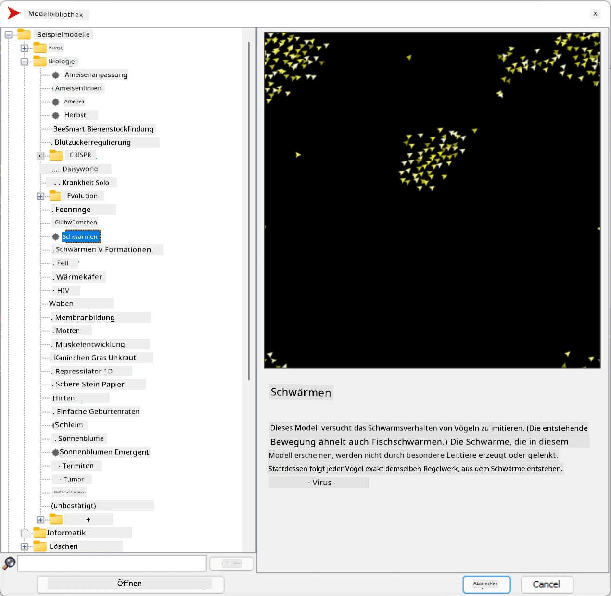
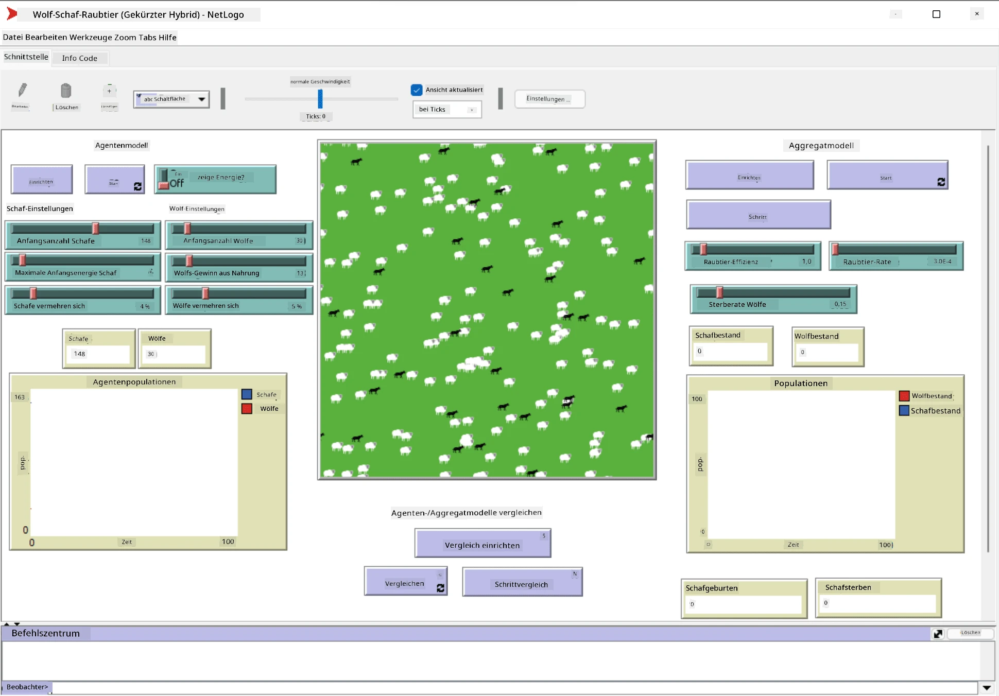

# Multi-Agenten-Systeme

Eine mögliche Methode, Intelligenz zu erreichen, ist der sogenannte **emergente** (oder **synergetische**) Ansatz. Dieser basiert auf der Tatsache, dass das kombinierte Verhalten vieler relativ einfacher Agenten zu einem insgesamt komplexeren (oder intelligenteren) Verhalten des Systems als Ganzes führen kann. Theoretisch basiert dies auf den Prinzipien der [kollektiven Intelligenz](https://en.wikipedia.org/wiki/Collective_intelligence), des [Emergentismus](https://en.wikipedia.org/wiki/Global_brain) und der [evolutionären Kybernetik](https://en.wikipedia.org/wiki/Global_brain), die besagen, dass höherstufige Systeme einen Mehrwert erhalten, wenn sie richtig aus niedrigeren Systemen kombiniert werden (das sogenannte *Prinzip des Metasystemübergangs*).

## [Quiz vor der Vorlesung](https://ff-quizzes.netlify.app/en/ai/quiz/45)

Die Richtung der **Multi-Agenten-Systeme** entstand in den 1990er Jahren als Reaktion auf das Wachstum des Internets und verteilter Systeme. Eines der klassischen Lehrbücher der KI, [Artificial Intelligence: A Modern Approach](https://en.wikipedia.org/wiki/Artificial_Intelligence:_A_Modern_Approach), betrachtet die klassische KI aus der Perspektive von Multi-Agenten-Systemen.

Im Mittelpunkt des Multi-Agenten-Ansatzes steht der Begriff des **Agenten** – eine Entität, die in einer **Umgebung** lebt, die sie wahrnehmen und auf die sie einwirken kann. Dies ist eine sehr breite Definition, und es gibt viele verschiedene Typen und Klassifikationen von Agenten:

* Nach ihrer Fähigkeit zu denken:
   - **Reaktive** Agenten haben normalerweise ein einfaches Anfrage-Antwort-Verhalten.
   - **Deliberative** Agenten nutzen eine Art logisches Denken und/oder Planungsfähigkeiten.
* Nach dem Ort, an dem der Agent seinen Code ausführt:
   - **Statische** Agenten arbeiten auf einem dedizierten Netzwerkknoten.
   - **Mobile** Agenten können ihren Code zwischen Netzwerkknoten verschieben.
* Nach ihrem Verhalten:
   - **Passive Agenten** haben keine spezifischen Ziele. Solche Agenten können auf externe Reize reagieren, initiieren jedoch keine eigenen Aktionen.
   - **Aktive Agenten** verfolgen bestimmte Ziele.
   - **Kognitive Agenten** beinhalten komplexe Planung und Denken.

Multi-Agenten-Systeme werden heute in einer Vielzahl von Anwendungen eingesetzt:

* In Spielen nutzen viele Nicht-Spieler-Charaktere eine Art KI und können als intelligente Agenten betrachtet werden.
* In der Videoproduktion wird das Rendern komplexer 3D-Szenen mit Menschenmengen typischerweise mithilfe von Multi-Agenten-Simulationen durchgeführt.
* In der Systemmodellierung wird der Multi-Agenten-Ansatz verwendet, um das Verhalten eines komplexen Modells zu simulieren. Beispielsweise wurde der Multi-Agenten-Ansatz erfolgreich eingesetzt, um die weltweite Ausbreitung der COVID-19-Krankheit vorherzusagen. Ein ähnlicher Ansatz kann verwendet werden, um den Verkehr in einer Stadt zu modellieren und zu sehen, wie er auf Änderungen der Verkehrsregeln reagiert.
* In komplexen Automatisierungssystemen kann jedes Gerät als unabhängiger Agent agieren, wodurch das gesamte System weniger monolithisch und robuster wird.

Wir werden nicht viel Zeit damit verbringen, tief in Multi-Agenten-Systeme einzutauchen, sondern ein Beispiel für **Multi-Agenten-Modellierung** betrachten.

## NetLogo

[NetLogo](https://ccl.northwestern.edu/netlogo/) ist eine Multi-Agenten-Modellierungsumgebung, die auf einer modifizierten Version der [Logo](https://en.wikipedia.org/wiki/Logo_(programming_language))-Programmiersprache basiert. Diese Sprache wurde entwickelt, um Kindern Programmierkonzepte beizubringen, und ermöglicht es, einen Agenten namens **Turtle** zu steuern, der sich bewegen und dabei eine Spur hinterlassen kann. Dies ermöglicht die Erstellung komplexer geometrischer Figuren, was eine sehr visuelle Möglichkeit ist, das Verhalten eines Agenten zu verstehen.

In NetLogo können wir viele Turtles mit dem Befehl `create-turtles` erstellen. Wir können dann alle Turtles anweisen, bestimmte Aktionen auszuführen (im folgenden Beispiel - 10 Punkte vorwärts bewegen):

```
create-turtles 10
ask turtles [
  forward 10
]
```

Natürlich ist es nicht interessant, wenn alle Turtles dasselbe tun, daher können wir Gruppen von Turtles mit `ask` ansprechen, z. B. diejenigen, die sich in der Nähe eines bestimmten Punktes befinden. Wir können auch Turtles verschiedener *Rassen* mit dem Befehl `breed [cats cat]` erstellen. Hier ist `cat` der Name einer Rasse, und wir müssen sowohl das Singular- als auch das Pluralwort angeben, da verschiedene Befehle unterschiedliche Formen für Klarheit verwenden.

> ✅ Wir werden nicht in die NetLogo-Sprache selbst eintauchen – Sie können die großartige Ressource [Beginner's Interactive NetLogo Dictionary](https://ccl.northwestern.edu/netlogo/bind/) besuchen, wenn Sie mehr darüber lernen möchten.

Sie können [NetLogo herunterladen](https://ccl.northwestern.edu/netlogo/download.shtml) und installieren, um es auszuprobieren.

### Modellbibliothek

Ein großartiges Merkmal von NetLogo ist, dass es eine Bibliothek mit funktionierenden Modellen enthält, die Sie ausprobieren können. Gehen Sie zu **Datei &rightarrow; Modellbibliothek**, und Sie haben viele Kategorien von Modellen zur Auswahl.



> Ein Screenshot der Modellbibliothek von Dmitry Soshnikov

Sie können eines der Modelle öffnen, beispielsweise **Biologie &rightarrow; Flocking**.

### Hauptprinzipien

Nach dem Öffnen des Modells gelangen Sie zum Hauptbildschirm von NetLogo. Hier ist ein Beispielmodell, das die Population von Wölfen und Schafen beschreibt, basierend auf begrenzten Ressourcen (Gras).



> Screenshot von Dmitry Soshnikov

Auf diesem Bildschirm sehen Sie:

* Den **Interface**-Bereich, der Folgendes enthält:
  - Das Hauptfeld, in dem alle Agenten leben
  - Verschiedene Steuerungen: Schaltflächen, Schieberegler usw.
  - Diagramme, die Sie verwenden können, um Parameter der Simulation anzuzeigen
* Den **Code**-Tab, der den Editor enthält, in dem Sie NetLogo-Programme schreiben können

In den meisten Fällen enthält die Benutzeroberfläche eine **Setup**-Schaltfläche, die den Simulationszustand initialisiert, und eine **Go**-Schaltfläche, die die Ausführung startet. Diese werden von entsprechenden Handlern im Code gesteuert, die wie folgt aussehen:

```
to go [
...
]
```

Die Welt von NetLogo besteht aus den folgenden Objekten:

* **Agenten** (Turtles), die sich über das Feld bewegen und etwas tun können. Sie steuern Agenten mit der Syntax `ask turtles [...]`, und der Code in den Klammern wird von allen Agenten im *Turtle-Modus* ausgeführt.
* **Patches** sind quadratische Bereiche des Feldes, auf denen Agenten leben. Sie können sich auf alle Agenten auf demselben Patch beziehen oder die Farben und einige andere Eigenschaften des Patches ändern. Sie können auch `ask patches` verwenden, um etwas zu tun.
* **Observer** ist ein einzigartiger Agent, der die Welt kontrolliert. Alle Button-Handler werden im *Observer-Modus* ausgeführt.

> ✅ Die Schönheit einer Multi-Agenten-Umgebung liegt darin, dass der Code, der im Turtle-Modus oder im Patch-Modus ausgeführt wird, gleichzeitig von allen Agenten parallel ausgeführt wird. Indem Sie also wenig Code schreiben und das Verhalten eines einzelnen Agenten programmieren, können Sie ein komplexes Verhalten des gesamten Simulationssystems erzeugen.

### Flocking

Als Beispiel für Multi-Agenten-Verhalten betrachten wir **[Flocking](https://en.wikipedia.org/wiki/Flocking_(behavior))**. Flocking ist ein komplexes Muster, das dem Flug von Vogelschwärmen sehr ähnlich ist. Wenn man sie fliegen sieht, könnte man denken, dass sie einem kollektiven Algorithmus folgen oder eine Form von *kollektiver Intelligenz* besitzen. Dieses komplexe Verhalten entsteht jedoch, wenn jeder einzelne Agent (in diesem Fall ein *Vogel*) nur einige andere Agenten in kurzer Entfernung beobachtet und drei einfache Regeln befolgt:

* **Ausrichtung** – es steuert in Richtung der durchschnittlichen Flugrichtung benachbarter Agenten.
* **Kohäsion** – es versucht, sich in Richtung der durchschnittlichen Position der Nachbarn zu bewegen (*langfristige Anziehung*).
* **Trennung** – wenn es anderen Vögeln zu nahe kommt, versucht es, sich zu entfernen (*kurzfristige Abstoßung*).

Sie können das Flocking-Beispiel ausführen und das Verhalten beobachten. Sie können auch Parameter wie den *Grad der Trennung* oder die *Sichtweite* anpassen, die definiert, wie weit jeder Vogel sehen kann. Beachten Sie, dass, wenn Sie die Sichtweite auf 0 reduzieren, alle Vögel blind werden und das Flocking aufhört. Wenn Sie die Trennung auf 0 reduzieren, sammeln sich alle Vögel in einer geraden Linie.

> ✅ Wechseln Sie zum **Code**-Tab und sehen Sie, wo die drei Regeln des Flockings (Ausrichtung, Kohäsion und Trennung) im Code implementiert sind. Beachten Sie, wie wir uns nur auf die Agenten beziehen, die in Sichtweite sind.

### Weitere Modelle zum Ausprobieren

Es gibt einige weitere interessante Modelle, die Sie ausprobieren können:

* **Kunst &rightarrow; Feuerwerk** zeigt, wie ein Feuerwerk als kollektives Verhalten einzelner Feuerströme betrachtet werden kann.
* **Sozialwissenschaften &rightarrow; Verkehr Basic** und **Sozialwissenschaften &rightarrow; Verkehr Grid** zeigen das Modell des Stadtverkehrs in 1D und 2D-Gitter mit oder ohne Ampeln. Jedes Auto in der Simulation folgt den folgenden Regeln:
   - Wenn der Raum vor ihm leer ist – beschleunigen (bis zu einer bestimmten Maximalgeschwindigkeit).
   - Wenn es ein Hindernis vor sich sieht – bremsen (und Sie können anpassen, wie weit ein Fahrer sehen kann).
* **Sozialwissenschaften &rightarrow; Party** zeigt, wie sich Menschen während einer Cocktailparty gruppieren. Sie können die Kombination von Parametern finden, die zu einer schnelleren Steigerung des Glücks der Gruppe führt.

Wie Sie aus diesen Beispielen sehen können, können Multi-Agenten-Simulationen eine nützliche Möglichkeit sein, das Verhalten eines komplexen Systems zu verstehen, das aus Individuen besteht, die derselben oder ähnlichen Logik folgen. Sie können auch verwendet werden, um virtuelle Agenten wie [NPCs](https://en.wikipedia.org/wiki/NPC) in Computerspielen oder Agenten in 3D-animierten Welten zu steuern.

## Deliberative Agenten

Die oben beschriebenen Agenten sind sehr einfach und reagieren auf Änderungen in der Umgebung mithilfe einer Art Algorithmus. Als solche sind sie **reaktive Agenten**. Manchmal können Agenten jedoch denken und ihre Aktionen planen, in diesem Fall werden sie als **deliberative** bezeichnet.

Ein typisches Beispiel wäre ein persönlicher Agent, der von einem Menschen die Anweisung erhält, eine Urlaubsreise zu buchen. Angenommen, es gibt viele Agenten im Internet, die ihm dabei helfen können. Er sollte dann andere Agenten kontaktieren, um zu sehen, welche Flüge verfügbar sind, welche Hotelpreise für verschiedene Daten gelten, und versuchen, den besten Preis auszuhandeln. Wenn der Urlaubsplan abgeschlossen und vom Besitzer bestätigt ist, kann er mit der Buchung fortfahren.

Um dies zu tun, müssen Agenten **kommunizieren**. Für eine erfolgreiche Kommunikation benötigen sie:

* Einige **Standardsprachen zum Austausch von Wissen**, wie [Knowledge Interchange Format](https://en.wikipedia.org/wiki/Knowledge_Interchange_Format) (KIF) und [Knowledge Query and Manipulation Language](https://en.wikipedia.org/wiki/Knowledge_Query_and_Manipulation_Language) (KQML). Diese Sprachen basieren auf der [Sprechakttheorie](https://en.wikipedia.org/wiki/Speech_act).
* Diese Sprachen sollten auch einige **Protokolle für Verhandlungen** enthalten, basierend auf verschiedenen **Auktionstypen**.
* Eine **gemeinsame Ontologie**, damit sie sich auf dieselben Konzepte beziehen und deren Semantik kennen.
* Eine Möglichkeit, **herauszufinden**, was verschiedene Agenten tun können, ebenfalls basierend auf einer Art Ontologie.

Deliberative Agenten sind viel komplexer als reaktive, da sie nicht nur auf Änderungen in der Umgebung reagieren, sondern auch Aktionen *initiieren* können. Eine der vorgeschlagenen Architekturen für deliberative Agenten ist der sogenannte Belief-Desire-Intention (BDI)-Agent:

* **Beliefs** bilden eine Wissensbasis über die Umgebung des Agenten. Sie können als Wissensdatenbank oder Regelwerk strukturiert sein, das ein Agent auf eine bestimmte Situation in der Umgebung anwenden kann.
* **Desires** definieren, was ein Agent tun möchte, d. h. seine Ziele. Zum Beispiel ist das Ziel des persönlichen Assistenten-Agenten oben, eine Reise zu buchen, und das Ziel eines Hotel-Agenten ist es, den Gewinn zu maximieren.
* **Intentions** sind spezifische Aktionen, die ein Agent plant, um seine Ziele zu erreichen. Aktionen ändern typischerweise die Umgebung und führen zu Kommunikation mit anderen Agenten.

Es gibt einige Plattformen, die für den Aufbau von Multi-Agenten-Systemen verfügbar sind, wie [JADE](https://jade.tilab.com/). [Dieses Papier](https://arxiv.org/ftp/arxiv/papers/2007/2007.08961.pdf) enthält eine Übersicht über Multi-Agenten-Plattformen sowie eine kurze Geschichte der Multi-Agenten-Systeme und ihrer verschiedenen Anwendungsszenarien.

## Fazit

Multi-Agenten-Systeme können sehr unterschiedliche Formen annehmen und in vielen verschiedenen Anwendungen eingesetzt werden. 
Sie konzentrieren sich alle auf das einfachere Verhalten eines einzelnen Agenten und erreichen ein komplexeres Verhalten des Gesamtsystems durch den **synergetischen Effekt**.

## 🚀 Herausforderung

Übertragen Sie diese Lektion in die reale Welt und versuchen Sie, ein Multi-Agenten-System zu konzipieren, das ein Problem lösen kann. Was müsste ein Multi-Agenten-System beispielsweise tun, um eine Schulbusroute zu optimieren? Wie könnte es in einer Bäckerei funktionieren?

## [Quiz nach der Vorlesung](https://ff-quizzes.netlify.app/en/ai/quiz/46)

## Überprüfung & Selbststudium

Überprüfen Sie die Verwendung dieses Systemtyps in der Industrie. Wählen Sie einen Bereich wie die Fertigung oder die Videospielindustrie und entdecken Sie, wie Multi-Agenten-Systeme verwendet werden können, um einzigartige Probleme zu lösen.

## [NetLogo Aufgabe](assignment.md)

---

