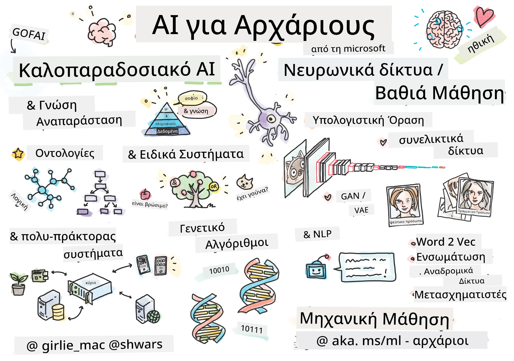

[](https://github.com/microsoft/AI-For-Beginners/blob/main/LICENSE)
[](https://GitHub.com/microsoft/AI-For-Beginners/graphs/contributors/)
[](https://GitHub.com/microsoft/AI-For-Beginners/issues/)
[](https://GitHub.com/microsoft/AI-For-Beginners/pulls/)
[](http://makeapullrequest.com)

[](https://GitHub.com/microsoft/AI-For-Beginners/watchers/)
[](https://GitHub.com/microsoft/AI-For-Beginners/network/)
[](https://GitHub.com/microsoft/AI-For-Beginners/stargazers/)
[](https://mybinder.org/v2/gh/microsoft/ai-for-beginners/HEAD)
[](https://gitter.im/Microsoft/ai-for-beginners?utm_source=badge&utm_medium=badge&utm_campaign=pr-badge)

[](https://discord.gg/nTYy5BXMWG)

# Τεχνητή Νοημοσύνη για Αρχάριους - Ένα Πρόγραμμα Σπουδών

||
|:---:|
| Τεχνητή Νοημοσύνη για Αρχάριους - _Σημειώσεις από [@girlie_mac](https://twitter.com/girlie_mac)_ |

Εξερευνήστε τον κόσμο της **Τεχνητής Νοημοσύνης** (AI) με το πρόγραμμα σπουδών μας 12 εβδομάδων και 24 μαθημάτων! Περιλαμβάνει πρακτικά μαθήματα, κουίζ και εργαστήρια. Το πρόγραμμα είναι φιλικό προς τους αρχάριους και καλύπτει εργαλεία όπως TensorFlow και PyTorch, καθώς και ηθική στην AI


### 🌐 Υποστήριξη Πολύγλωσσων

#### Υποστηρίζεται μέσω GitHub Action (Αυτόματη & Πάντα Ενημερωμένη)

<!-- CO-OP TRANSLATOR LANGUAGES TABLE START -->
[Αραβικά](../ar/README.md) | [Μπενγκάλι](../bn/README.md) | [Βουλγαρικά](../bg/README.md) | [Βιρμανικά (Μιανμάρ)](../my/README.md) | [Κινέζικα (Απλοποιημένα)](../zh-CN/README.md) | [Κινέζικα (Παραδοσιακά, Χονγκ Κονγκ)](../zh-HK/README.md) | [Κινέζικα (Παραδοσιακά, Μακάο)](../zh-MO/README.md) | [Κινέζικα (Παραδοσιακά, Ταϊβάν)](../zh-TW/README.md) | [Κροατικά](../hr/README.md) | [Τσεχικά](../cs/README.md) | [Δανέζικα](../da/README.md) | [Ολλανδικά](../nl/README.md) | [Εσθονικά](../et/README.md) | [Φινλανδικά](../fi/README.md) | [Γαλλικά](../fr/README.md) | [Γερμανικά](../de/README.md) | [Ελληνικά](./README.md) | [Εβραϊκά](../he/README.md) | [Χίντι](../hi/README.md) | [Ουγγρικά](../hu/README.md) | [Ινδονησιακά](../id/README.md) | [Ιταλικά](../it/README.md) | [Ιαπωνικά](../ja/README.md) | [Κανάντα](../kn/README.md) | [Κορεατικά](../ko/README.md) | [Λιθουανικά](../lt/README.md) | [Μαλαισιανά](../ms/README.md) | [Μαλαγιάλαμ](../ml/README.md) | [Μαράθι](../mr/README.md) | [Νεπάλια](../ne/README.md) | [Νιγηριανό Πίτζιν](../pcm/README.md) | [Νορβηγικά](../no/README.md) | [Περσικά (Φαρσί)](../fa/README.md) | [Πολωνικά](../pl/README.md) | [Πορτογαλικά (Βραζιλίας)](../pt-BR/README.md) | [Πορτογαλικά (Πορτογαλίας)](../pt-PT/README.md) | [Πουντζάμπι (Gurmukhi)](../pa/README.md) | [Ρουμανικά](../ro/README.md) | [Ρωσικά](../ru/README.md) | [Σερβικά (Κυριλλικά)](../sr/README.md) | [Σλοβακικά](../sk/README.md) | [Σλοβενικά](../sl/README.md) | [Ισπανικά](../es/README.md) | [Σουαχίλι](../sw/README.md) | [Σουηδικά](../sv/README.md) | [Ταγκαλόγκ (Φιλιππινέζικα)](../tl/README.md) | [Ταμίλ](../ta/README.md) | [Τελούγκου](../te/README.md) | [Ταϊλανδέζικα](../th/README.md) | [Τουρκικά](../tr/README.md) | [Ουκρανικά](../uk/README.md) | [Ουρντού](../ur/README.md) | [Βιετναμέζικα](../vi/README.md)

> **Προτιμάτε να κάνετε τοπικό κλωνοποίηση;**

> Αυτό το αποθετήριο περιλαμβάνει 50+ μεταφράσεις γλωσσών, αυξάνοντας σημαντικά το μέγεθος λήψης. Για να κλωνοποιήσετε χωρίς μεταφράσεις, χρησιμοποιήστε sparse checkout:
> ```bash
> git clone --filter=blob:none --sparse https://github.com/microsoft/AI-For-Beginners.git
> cd AI-For-Beginners
> git sparse-checkout set --no-cone '/*' '!translations' '!translated_images'
> ```
> Αυτό σας δίνει όλα όσα χρειάζεστε για να ολοκληρώσετε το μάθημα με πολύ γρηγορότερη λήψη.
<!-- CO-OP TRANSLATOR LANGUAGES TABLE END -->

**Αν θέλετε να υποστηρίζονται επιπλέον γλώσσες μετάφρασης, είναι καταχωρημένες [εδώ](https://github.com/Azure/co-op-translator/blob/main/getting_started/supported-languages.md)**

## Ενταχθείτε στην Κοινότητα
[](https://discord.gg/nTYy5BXMWG)

## Τι θα μάθετε

**[Διάγραμμα Σκέψης του Μαθήματος](http://soshnikov.com/courses/ai-for-beginners/mindmap.html)**

Σε αυτό το πρόγραμμα σπουδών, θα μάθετε:

* Διάφορες προσεγγίσεις στην Τεχνητή Νοημοσύνη, συμπεριλαμβανομένης της "παλιάς καλής" συμβολικής προσέγγισης με **Αναπαράσταση Γνώσης** και συλλογισμό ([GOFAI](https://en.wikipedia.org/wiki/Symbolic_artificial_intelligence)).
* **Νευρωνικά Δίκτυα** και **Βαθιά Μάθηση**, που βρίσκονται στον πυρήνα της σύγχρονης AI. Θα απεικονίσουμε τις έννοιες πίσω από αυτά τα σημαντικά θέματα χρησιμοποιώντας κώδικα σε δύο από τα πιο δημοφιλή πλαίσια - [TensorFlow](http://Tensorflow.org) και [PyTorch](http://pytorch.org).
* **Νευρωνικές Αρχιτεκτονικές** για εργασία με εικόνες και κείμενο. Θα καλύψουμε πρόσφατα μοντέλα αλλά μπορεί να είναι λίγο ελλιπείς στην πιο σύγχρονη κατάσταση της τέχνης.
* Λιγότερο δημοφιλείς προσεγγίσεις στην AI, όπως οι **Γενετικοί Αλγόριθμοι** και τα **Συστήματα Πολλαπλών Πρακτόρων**.

Τι δεν θα καλύψουμε σε αυτό το πρόγραμμα σπουδών:

> [Βρείτε όλους τους επιπλέον πόρους για αυτό το μάθημα στη συλλογή Microsoft Learn](https://learn.microsoft.com/en-us/collections/7w28iy2xrqzdj0?WT.mc_id=academic-77998-bethanycheum)

* Επιχειρηματικές περιπτώσεις χρήσης της **AI στις Επιχειρήσεις**. Σκεφτείτε να ακολουθήσετε το μαθησιακό μονοπάτι [Εισαγωγή στην AI για επιχειρηματικούς χρήστες](https://docs.microsoft.com/learn/paths/introduction-ai-for-business-users/?WT.mc_id=academic-77998-bethanycheum) στο Microsoft Learn, ή το [AI Business School](https://www.microsoft.com/ai/ai-business-school/?WT.mc_id=academic-77998-bethanycheum), που αναπτύχθηκε σε συνεργασία με το [INSEAD](https://www.insead.edu/).
* **Κλασική Μηχανική Μάθηση**, που περιγράφεται καλά στο [Πρόγραμμα Σπουδών Μηχανικής Μάθησης για Αρχάριους](http://github.com/Microsoft/ML-for-Beginners).
* Πρακτικές εφαρμογές AI που κατασκευάζονται χρησιμοποιώντας **[Cognitive Services](https://azure.microsoft.com/services/cognitive-services/?WT.mc_id=academic-77998-bethanycheum)**. Για αυτό, προτείνουμε να ξεκινήσετε με τα μαθήματα Microsoft Learn για [οπτική](https://docs.microsoft.com/learn/paths/create-computer-vision-solutions-azure-cognitive-services/?WT.mc_id=academic-77998-bethanycheum), [επεξεργασία φυσικής γλώσσας](https://docs.microsoft.com/learn/paths/explore-natural-language-processing/?WT.mc_id=academic-77998-bethanycheum), **[Γεννητική AI με Azure OpenAI Service](https://learn.microsoft.com/en-us/training/paths/develop-ai-solutions-azure-openai/?WT.mc_id=academic-77998-bethanycheum)** και άλλα.
* Συγκεκριμένα **Πλαίσια Cloud για ML**, όπως το [Azure Machine Learning](https://azure.microsoft.com/services/machine-learning/?WT.mc_id=academic-77998-bethanycheum), [Microsoft Fabric](https://learn.microsoft.com/en-us/training/paths/get-started-fabric/?WT.mc_id=academic-77998-bethanycheum), ή [Azure Databricks](https://docs.microsoft.com/learn/paths/data-engineer-azure-databricks?WT.mc_id=academic-77998-bethanycheum). Σκεφτείτε να χρησιμοποιήσετε τα μαθησιακά μονοπάτια [Κατασκευή και λειτουργία λύσεων μηχανικής μάθησης με Azure Machine Learning](https://docs.microsoft.com/learn/paths/build-ai-solutions-with-azure-ml-service/?WT.mc_id=academic-77998-bethanycheum) και [Κατασκευή και Λειτουργία Λύσεων Μηχανικής Μάθησης με Azure Databricks](https://docs.microsoft.com/learn/paths/build-operate-machine-learning-solutions-azure-databricks/?WT.mc_id=academic-77998-bethanycheum).
* **Συνομιλητική AI** και **Chat Bots**. Υπάρχει ένα ξεχωριστό μαθησιακό μονοπάτι [Δημιουργία συνομιλητικών λύσεων AI](https://docs.microsoft.com/learn/paths/create-conversational-ai-solutions/?WT.mc_id=academic-77998-bethanycheum), και μπορείτε επίσης να ανατρέξετε σε [αυτή την ανάρτηση στο ιστολόγιο](https://soshnikov.com/azure/hello-bot-conversational-ai-on-microsoft-platform/) για περισσότερες λεπτομέρειες.
* **Εκτεταμένα Μαθηματικά** πίσω από τη βαθιά μάθηση. Για αυτό, θα προτείναμε το [Deep Learning](https://www.amazon.com/Deep-Learning-Adaptive-Computation-Machine/dp/0262035618) των Ian Goodfellow, Yoshua Bengio και Aaron Courville, που είναι επίσης διαθέσιμο online στο [https://www.deeplearningbook.org/](https://www.deeplearningbook.org/).

Για μια απλή εισαγωγή σε θέματα _AI στο Cloud_ μπορείτε να σκεφτείτε να ακολουθήσετε το μαθησιακό μονοπάτι [Ξεκινήστε με τεχνητή νοημοσύνη στο Azure](https://docs.microsoft.com/learn/paths/get-started-with-artificial-intelligence-on-azure/?WT.mc_id=academic-77998-bethanycheum).

# Περιεχόμενο

|     |                                                                 Σύνδεσμος Μαθήματος                                                                  |                                           PyTorch/Keras/TensorFlow                                          | Εργαστήριο                                                            |
| :-: | :------------------------------------------------------------------------------------------------------------------------------------------: | :---------------------------------------------------------------------------------------------: | ------------------------------------------------------------------------------ |
| 0  |                                 [Ρύθμιση Μαθήματος](./lessons/0-course-setup/setup.md)                                 |                      [Ρύθμισε το Περιβάλλον Ανάπτυξής σου](./lessons/0-course-setup/how-to-run.md)                       |   |
| I  |               [**Εισαγωγή στην AI**](./lessons/1-Intro/README.md)      | | |
| 01  |       [Εισαγωγή και Ιστορία της AI](./lessons/1-Intro/README.md)       |           -                            | -  |
| II |              **Συμβολική AI**              |
| 02  |       [Αναπαράσταση Γνώσης και Συστήματα Εμπειρογνωμόνων](./lessons/2-Symbolic/README.md)       |            [Συστήματα Εμπειρογνωμόνων](./lessons/2-Symbolic/Animals.ipynb) /  [Οντολογία](./lessons/2-Symbolic/FamilyOntology.ipynb) /[Γράφος Εννοιών](./lessons/2-Symbolic/MSConceptGraph.ipynb)                             |  |
| III |                        [**Εισαγωγή στα Νευρωνικά Δίκτυα**](./lessons/3-NeuralNetworks/README.md) |||
| 03  |                [Περσέψτρον](./lessons/3-NeuralNetworks/03-Perceptron/README.md)                 |                       [Σημειωματάριο](./lessons/3-NeuralNetworks/03-Perceptron/Perceptron.ipynb)                      | [Εργαστήριο](./lessons/3-NeuralNetworks/03-Perceptron/lab/README.md) |
| 04  |                   [Πολυστρωματικό Περσέψτρον και Δημιουργία του δικού μας Πλαισίου](./lessons/3-NeuralNetworks/04-OwnFramework/README.md)                   |        [Σημειωματάριο](./lessons/3-NeuralNetworks/04-OwnFramework/OwnFramework.ipynb)        | [Εργαστήριο](./lessons/3-NeuralNetworks/04-OwnFramework/lab/README.md) |
| 05  |            [Εισαγωγή σε Πλαίσια (PyTorch/TensorFlow) και Υπερεκπαιδεύση](./lessons/3-NeuralNetworks/05-Frameworks/README.md)             |           [PyTorch](./lessons/3-NeuralNetworks/05-Frameworks/IntroPyTorch.ipynb) / [Keras](./lessons/3-NeuralNetworks/05-Frameworks/IntroKeras.ipynb) / [TensorFlow](./lessons/3-NeuralNetworks/05-Frameworks/IntroKerasTF.ipynb)             | [Εργαστήριο](./lessons/3-NeuralNetworks/05-Frameworks/lab/README.md) |
| IV  |            [**Υπολογιστική Όραση**](./lessons/4-ComputerVision/README.md)             | [PyTorch](https://docs.microsoft.com/learn/modules/intro-computer-vision-pytorch/?WT.mc_id=academic-77998-cacaste) / [TensorFlow](https://docs.microsoft.com/learn/modules/intro-computer-vision-TensorFlow/?WT.mc_id=academic-77998-cacaste)| [Εξερεύνηση της Υπολογιστικής Όρασης στο Microsoft Azure](https://learn.microsoft.com/en-us/collections/7w28iy2xrqzdj0?WT.mc_id=academic-77998-bethanycheum) |
| 06  |            [Εισαγωγή στην Υπολογιστική Όραση. OpenCV](./lessons/4-ComputerVision/06-IntroCV/README.md)             |           [Σημειωματάριο](./lessons/4-ComputerVision/06-IntroCV/OpenCV.ipynb)         | [Εργαστήριο](./lessons/4-ComputerVision/06-IntroCV/lab/README.md) |
| 07  |            [Συνελικτικά Νευρωνικά Δίκτυα](./lessons/4-ComputerVision/07-ConvNets/README.md) &  [Αρχιτεκτονικές CNN](./lessons/4-ComputerVision/07-ConvNets/CNN_Architectures.md)             |           [PyTorch](./lessons/4-ComputerVision/07-ConvNets/ConvNetsPyTorch.ipynb) /[TensorFlow](./lessons/4-ComputerVision/07-ConvNets/ConvNetsTF.ipynb)             | [Εργαστήριο](./lessons/4-ComputerVision/07-ConvNets/lab/README.md) |
| 08  |            [Προεκπαιδευμένα Δίκτυα και Μεταφορά Μάθησης](./lessons/4-ComputerVision/08-TransferLearning/README.md) και [Τεχνάσματα Εκπαίδευσης](./lessons/4-ComputerVision/08-TransferLearning/TrainingTricks.md)             |           [PyTorch](./lessons/4-ComputerVision/08-TransferLearning/TransferLearningPyTorch.ipynb) / [TensorFlow](./lessons/3-NeuralNetworks/05-Frameworks/IntroKerasTF.ipynb)             | [Εργαστήριο](./lessons/4-ComputerVision/08-TransferLearning/lab/README.md) |
| 09  |            [Αυτοκωδικοποιητές και VAEs](./lessons/4-ComputerVision/09-Autoencoders/README.md)             |           [PyTorch](./lessons/4-ComputerVision/09-Autoencoders/AutoEncodersPyTorch.ipynb) / [TensorFlow](./lessons/4-ComputerVision/09-Autoencoders/AutoencodersTF.ipynb)             |  |
| 10  |            [Γεννητικά Αντιπαραθετικά Δίκτυα & Μεταφορά Καλλιτεχνικού Στυλ](./lessons/4-ComputerVision/10-GANs/README.md)             |           [PyTorch](./lessons/4-ComputerVision/10-GANs/GANPyTorch.ipynb) / [TensorFlow](./lessons/4-ComputerVision/10-GANs/GANTF.ipynb)             |  |
| 11  |            [Ανίχνευση Αντικειμένων](./lessons/4-ComputerVision/11-ObjectDetection/README.md)             |         [TensorFlow](./lessons/4-ComputerVision/11-ObjectDetection/ObjectDetection.ipynb)             | [Εργαστήριο](./lessons/4-ComputerVision/11-ObjectDetection/lab/README.md) |
| 12  |            [Σημασιολογική Τμηματοποίηση. U-Net](./lessons/4-ComputerVision/12-Segmentation/README.md)             |           [PyTorch](./lessons/4-ComputerVision/12-Segmentation/SemanticSegmentationPytorch.ipynb) / [TensorFlow](./lessons/4-ComputerVision/12-Segmentation/SemanticSegmentationTF.ipynb)             |  |
| V  |            [**Επεξεργασία Φυσικής Γλώσσας**](./lessons/5-NLP/README.md)             | [PyTorch](https://docs.microsoft.com/learn/modules/intro-natural-language-processing-pytorch/?WT.mc_id=academic-77998-cacaste) /[TensorFlow](https://docs.microsoft.com/learn/modules/intro-natural-language-processing-TensorFlow/?WT.mc_id=academic-77998-cacaste) | [Εξερεύνηση της Επεξεργασίας Φυσικής Γλώσσας στο Microsoft Azure](https://learn.microsoft.com/en-us/collections/7w28iy2xrqzdj0?WT.mc_id=academic-77998-bethanycheum)|
| 13  |            [Αναπαράσταση Κειμένου. Bow/TF-IDF](./lessons/5-NLP/13-TextRep/README.md)             |           [PyTorch](https://github.com/microsoft/AI-For-Beginners/blob/main/lessons/5-NLP/13-TextRep/TextRepresentationPyTorch.ipynb) / [TensorFlow](https://github.com/microsoft/AI-For-Beginners/blob/main/lessons/5-NLP/13-TextRep/TextRepresentationTF.ipynb)             | |
| 14  |            [Σημασιολογικές Ενσωματώσεις Λέξεων. Word2Vec και GloVe](./lessons/5-NLP/14-Embeddings/README.md)             |           [PyTorch](https://github.com/microsoft/AI-For-Beginners/blob/main/lessons/5-NLP/14-Embeddings/EmbeddingsPyTorch.ipynb) / [TensorFlow](https://github.com/microsoft/AI-For-Beginners/blob/main/lessons/5-NLP/14-Embeddings/EmbeddingsTF.ipynb)             |  |
| 15  |            [Μοντελοποίηση Γλώσσας. Εκπαίδευση των δικών σας ενσωματώσεων](./lessons/5-NLP/15-LanguageModeling/README.md)             |           [PyTorch](https://github.com/microsoft/AI-For-Beginners/blob/main/lessons/5-NLP/15-LanguageModeling/CBoW-PyTorch.ipynb) / [TensorFlow](https://github.com/microsoft/AI-For-Beginners/blob/main/lessons/5-NLP/15-LanguageModeling/CBoW-TF.ipynb)             | [Εργαστήριο](./lessons/5-NLP/15-LanguageModeling/lab/README.md) |
| 16  |            [Επαναληπτικά Νευρωνικά Δίκτυα](./lessons/5-NLP/16-RNN/README.md)             |           [PyTorch](https://github.com/microsoft/AI-For-Beginners/blob/main/lessons/5-NLP/16-RNN/RNNPyTorch.ipynb) / [TensorFlow](https://github.com/microsoft/AI-For-Beginners/blob/main/lessons/5-NLP/16-RNN/RNNTF.ipynb)             |  |
| 17  |            [Γεννητικά Επαναληπτικά Δίκτυα](./lessons/5-NLP/17-GenerativeNetworks/README.md)             |           [PyTorch](https://github.com/microsoft/AI-For-Beginners/blob/main/lessons/5-NLP/17-GenerativeNetworks/GenerativePyTorch.ipynb) / [TensorFlow](https://github.com/microsoft/AI-For-Beginners/blob/main/lessons/5-NLP/17-GenerativeNetworks/GenerativeTF.ipynb)             | [Εργαστήριο](./lessons/5-NLP/17-GenerativeNetworks/lab/README.md) |
| 18  |            [Transformers. BERT.](./lessons/5-NLP/18-Transformers/README.md)             |           [PyTorch](https://github.com/microsoft/AI-For-Beginners/blob/main/lessons/5-NLP/18-Transformers/TransformersPyTorch.ipynb) /[TensorFlow](https://github.com/microsoft/AI-For-Beginners/blob/main/lessons/5-NLP/18-Transformers/TransformersTF.ipynb)             |  |
| 19  |            [Αναγνώριση Ονομασμένων Οντοτήτων](./lessons/5-NLP/19-NER/README.md)             |           [TensorFlow](https://microsoft.github.io/AI-For-Beginners/lessons/5-NLP/19-NER/NER-TF.ipynb)             | [Εργαστήριο](./lessons/5-NLP/19-NER/lab/README.md) |
| 20  |            [Μεγάλα Μοντέλα Γλώσσας, Προγραμματισμός Εντολών και Εργασίες Με Λίγα Παραδείγματα](./lessons/5-NLP/20-LangModels/README.md)             |           [PyTorch](https://microsoft.github.io/AI-For-Beginners/lessons/5-NLP/20-LangModels/GPT-PyTorch.ipynb) | |
| VI |            **Άλλες Τεχνικές Τεχνητής Νοημοσύνης** || |
| 21  |            [Γενετικοί Αλγόριθμοι](./lessons/6-Other/21-GeneticAlgorithms/README.md)             |           [Σημειωματάριο](./lessons/6-Other/21-GeneticAlgorithms/Genetic.ipynb) | |
| 22  |            [Βαθιά Ενισχυτική Μάθηση](./lessons/6-Other/22-DeepRL/README.md)             |           [PyTorch](./lessons/6-Other/22-DeepRL/CartPole-RL-PyTorch.ipynb) /[TensorFlow](./lessons/6-Other/22-DeepRL/CartPole-RL-TF.ipynb)             | [Εργαστήριο](./lessons/6-Other/22-DeepRL/lab/README.md) |
| 23  |            [Συστήματα Πολύ-Πρακτόρων](./lessons/6-Other/23-MultiagentSystems/README.md)             |  | |
| VII |            **Ηθική της Τεχνητής Νοημοσύνης** | | |
| 24  |            [Ηθική της Τεχνητής Νοημοσύνης και Υπεύθυνη ΤΝ](./lessons/7-Ethics/README.md)             |           [Microsoft Learn: Αρχές Υπεύθυνης ΤΝ](https://docs.microsoft.com/learn/paths/responsible-ai-business-principles/?WT.mc_id=academic-77998-cacaste) | |
| IX  |            **Επιπλέον** | | |
| 25  |            [Πολυ-μορφικά Δίκτυα, CLIP και VQGAN](./lessons/X-Extras/X1-MultiModal/README.md)             |           [Σημειωματάριο](./lessons/X-Extras/X1-MultiModal/Clip.ipynb)    | |

## Κάθε μάθημα περιλαμβάνει

* Υλικό προανάγνωσης
* Εκτελέσιμα Σημειωματάρια Jupyter, τα οποία συχνά είναι ειδικά για το πλαίσιο (**PyTorch** ή **TensorFlow**). Το εκτελέσιμο σημειωματάριο περιέχει επίσης πάρα πολύ θεωρητικό υλικό, έτσι για να κατανοήσεις το θέμα πρέπει να περάσεις τουλάχιστον από μία έκδοση του σημειωματαρίου (είτε PyTorch είτε TensorFlow).
* **Εργαστήρια** διαθέσιμα για μερικά θέματα, που σου δίνουν την ευκαιρία να δοκιμάσεις την εφαρμογή του υλικού που έχεις μάθει σε ένα συγκεκριμένο πρόβλημα.
* Κάποιες ενότητες περιέχουν συνδέσμους προς [**MS Learn**](https://learn.microsoft.com/en-us/collections/7w28iy2xrqzdj0?WT.mc_id=academic-77998-bethanycheum) ενότητες που καλύπτουν συναφή θέματα.

## Ξεκινώντας

### 🎯 Νέος στην Τεχνητή Νοημοσύνη; Ξεκίνα Εδώ!

Αν είσαι εντελώς νέος στην Τεχνητή Νοημοσύνη και θέλεις γρήγορα, πρακτικά παραδείγματα, δες τα [**Φιλικά για Αρχάριους Παραδείγματα**](./examples/README.md)! Αυτά περιλαμβάνουν:

- 🌟 **Γεια σου Κόσμε της ΤΝ** - Το πρώτο σου πρόγραμμα ΤΝ (αναγνώριση προτύπων)
- 🧠 **Απλό Νευρωνικό Δίκτυο** - Δημιούργησε ένα νευρωνικό δίκτυο από το μηδέν  

- 🖼️ **Ταξινομητής Εικόνων** - Ταξινομεί εικόνες με λεπτομερή σχόλια  
- 💬 **Συναίσθημα Κειμένου** - Αναλύει θετικό/αρνητικό κείμενο  

Αυτά τα παραδείγματα έχουν σχεδιαστεί για να σας βοηθήσουν να κατανοήσετε τις έννοιες της τεχνητής νοημοσύνης πριν εμβαθύνετε στο πλήρες πρόγραμμα σπουδών.

### 📚 Ρύθμιση Πλήρους Προγράμματος Σπουδών

- Έχουμε δημιουργήσει ένα [μάθημα ρύθμισης](./lessons/0-course-setup/setup.md) για να σας βοηθήσουμε με τη ρύθμιση του περιβάλλοντος ανάπτυξης. - Για εκπαιδευτικούς, έχουμε δημιουργήσει ένα [μάθημα ρύθμισης προγράμματος σπουδών](./lessons/0-course-setup/for-teachers.md) και για εσάς!  
- Πώς να [εκτελέσετε τον κώδικα σε VSCode ή Codespace](./lessons/0-course-setup/how-to-run.md)  

Ακολουθήστε αυτά τα βήματα:  

Fork το Αποθετήριο: Κάντε κλικ στο κουμπί "Fork" στην επάνω δεξιά γωνία αυτής της σελίδας.  

Κλωνοποιήστε το Αποθετήριο: `git clone https://github.com/microsoft/AI-For-Beginners.git`  

Μην ξεχάσετε να προσθέσετε αστέρι (🌟) σε αυτό το αποθετήριο για να το βρίσκετε πιο εύκολα αργότερα.

## Γνωρίστε άλλους Μαθητές

Γίνετε μέλος στο [επίσημο Discord server τεχνητής νοημοσύνης](https://aka.ms/genai-discord?WT.mc_id=academic-105485-bethanycheum) για να γνωρίσετε και να δικτυωθείτε με άλλους μαθητές που παρακολουθούν αυτό το μάθημα και να λάβετε υποστήριξη.

Αν έχετε σχόλια για το προϊόν ή ερωτήσεις κατά την κατασκευή, επισκεφθείτε το [Azure AI Foundry Developer Forum](https://aka.ms/foundry/forum)

## Κουίζ

> **Μια σημείωση για τα κουίζ**: Όλα τα κουίζ βρίσκονται στον φάκελο Quiz-app στον φάκελο etc\quiz-app, ή [ηλεκτρονικά εδώ](https://ff-quizzes.netlify.app/) Είναι συνδεδεμένα μέσα από τα μαθήματα. Η εφαρμογή κουίζ μπορεί να τρέξει τοπικά ή να αναπτυχθεί στο Azure. Ακολουθήστε τις οδηγίες στον φάκελο `quiz-app`. Βρίσκονται σταδιακά σε τοπική μετάφραση.

## Υποστήριξη

Έχετε προτάσεις ή βρήκατε ορθογραφικά ή σφάλματα κώδικα; Δημιουργήστε ένα issue ή υποβάλετε ένα pull request.

## Ειδικές Ευχαριστίες

* **✍️ Κύριος Συγγραφέας:** [Dmitry Soshnikov](http://soshnikov.com), PhD  
* **🔥 Επιμελήτρια:** [Jen Looper](https://twitter.com/jenlooper), PhD  
* **🎨 Σκιτσογράφος:** [Tomomi Imura](https://twitter.com/girlie_mac)  
* **✅ Δημιουργός Κουίζ:** [Lateefah Bello](https://github.com/CinnamonXI), [MLSA](https://studentambassadors.microsoft.com/)  
* **🙏 Βασικοί Συνεισφέροντες:** [Evgenii Pishchik](https://github.com/Pe4enIks)  

## Άλλα Προγράμματα Σπουδών

Η ομάδα μας παράγει και άλλα προγράμματα σπουδών! Ρίξτε μια ματιά:

<!-- CO-OP TRANSLATOR OTHER COURSES START -->
### LangChain  
[](https://aka.ms/langchain4j-for-beginners)  
[](https://aka.ms/langchainjs-for-beginners?WT.mc_id=m365-94501-dwahlin)  
[](https://github.com/microsoft/langchain-for-beginners?WT.mc_id=m365-94501-dwahlin)  
---

### Azure / Edge / MCP / Agents  
[](https://github.com/microsoft/AZD-for-beginners?WT.mc_id=academic-105485-koreyst)  
[](https://github.com/microsoft/edgeai-for-beginners?WT.mc_id=academic-105485-koreyst)  
[](https://github.com/microsoft/mcp-for-beginners?WT.mc_id=academic-105485-koreyst)  
[](https://github.com/microsoft/ai-agents-for-beginners?WT.mc_id=academic-105485-koreyst)  

---

### Σειρά Γενετικής Τεχνητής Νοημοσύνης  
[](https://github.com/microsoft/generative-ai-for-beginners?WT.mc_id=academic-105485-koreyst)  
[-9333EA?style=for-the-badge&labelColor=E5E7EB&color=9333EA)](https://github.com/microsoft/Generative-AI-for-beginners-dotnet?WT.mc_id=academic-105485-koreyst)  
[-C084FC?style=for-the-badge&labelColor=E5E7EB&color=C084FC)](https://github.com/microsoft/generative-ai-for-beginners-java?WT.mc_id=academic-105485-koreyst)  
[-E879F9?style=for-the-badge&labelColor=E5E7EB&color=E879F9)](https://github.com/microsoft/generative-ai-with-javascript?WT.mc_id=academic-105485-koreyst)  

---

### Βασική Μάθηση  
[](https://aka.ms/ml-beginners?WT.mc_id=academic-105485-koreyst)  
[](https://aka.ms/datascience-beginners?WT.mc_id=academic-105485-koreyst)  
[](https://aka.ms/ai-beginners?WT.mc_id=academic-105485-koreyst)  
[](https://github.com/microsoft/Security-101?WT.mc_id=academic-96948-sayoung)  
[](https://aka.ms/webdev-beginners?WT.mc_id=academic-105485-koreyst)  
[](https://aka.ms/iot-beginners?WT.mc_id=academic-105485-koreyst)  
[](https://github.com/microsoft/xr-development-for-beginners?WT.mc_id=academic-105485-koreyst)  

---

### Σειρά Copilot  
[](https://aka.ms/GitHubCopilotAI?WT.mc_id=academic-105485-koreyst)  
[](https://github.com/microsoft/mastering-github-copilot-for-dotnet-csharp-developers?WT.mc_id=academic-105485-koreyst)  
[](https://github.com/microsoft/CopilotAdventures?WT.mc_id=academic-105485-koreyst)  
<!-- CO-OP TRANSLATOR OTHER COURSES END -->

## Λήψη Βοήθειας

Αν κολλήσετε ή έχετε οποιεσδήποτε ερωτήσεις για την κατασκευή εφαρμογών τεχνητής νοημοσύνης, συμμετάσχετε με άλλους μαθητές και έμπειρους προγραμματιστές σε συζητήσεις για το MCP. Είναι μια υποστηρικτική κοινότητα όπου οι ερωτήσεις είναι ευπρόσδεκτες και η γνώση μοιράζεται ελεύθερα.

[](https://discord.gg/nTYy5BXMWG)

Αν έχετε σχόλια για το προϊόν ή σφάλματα κατά την κατασκευή, επισκεφθείτε:

[](https://aka.ms/foundry/forum)

---

<!-- CO-OP TRANSLATOR DISCLAIMER START -->
**Αποποίηση ευθυνών**:  
Αυτό το έγγραφο έχει μεταφραστεί χρησιμοποιώντας την υπηρεσία αυτόματης μετάφρασης AI [Co-op Translator](https://github.com/Azure/co-op-translator). Παρόλο που κάνουμε το καλύτερο δυνατό για ακρίβεια, παρακαλούμε να γνωρίζετε ότι οι αυτόματες μεταφράσεις ενδέχεται να περιέχουν λάθη ή ανακρίβειες. Το πρωτότυπο έγγραφο στη μητρική του γλώσσα πρέπει να θεωρείται η αυθεντική πηγή. Για κρίσιμες πληροφορίες, προτείνεται η επαγγελματική μετάφραση από ανθρώπους. Δεν φέρουμε ευθύνη για οποιεσδήποτε παρεξηγήσεις ή λανθασμένες ερμηνείες που προκύπτουν από τη χρήση αυτής της μετάφρασης.
<!-- CO-OP TRANSLATOR DISCLAIMER END -->