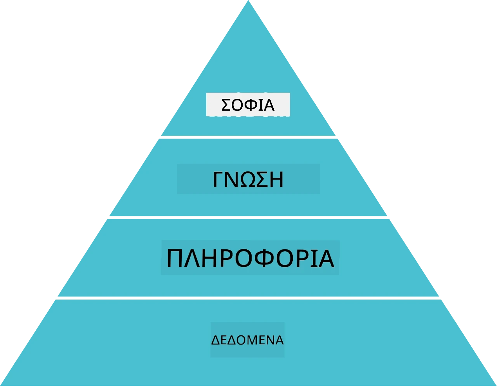
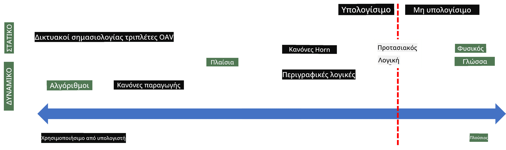
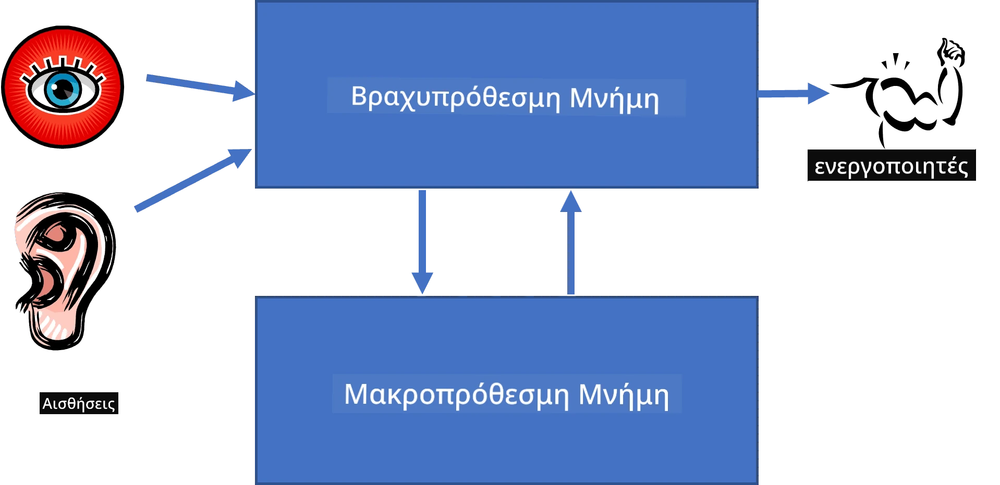
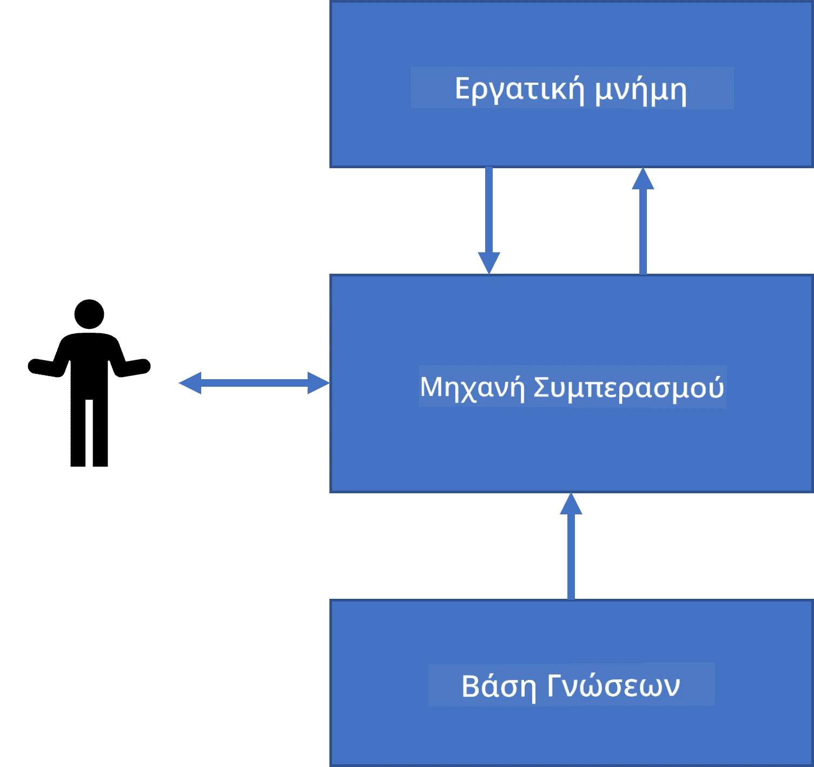
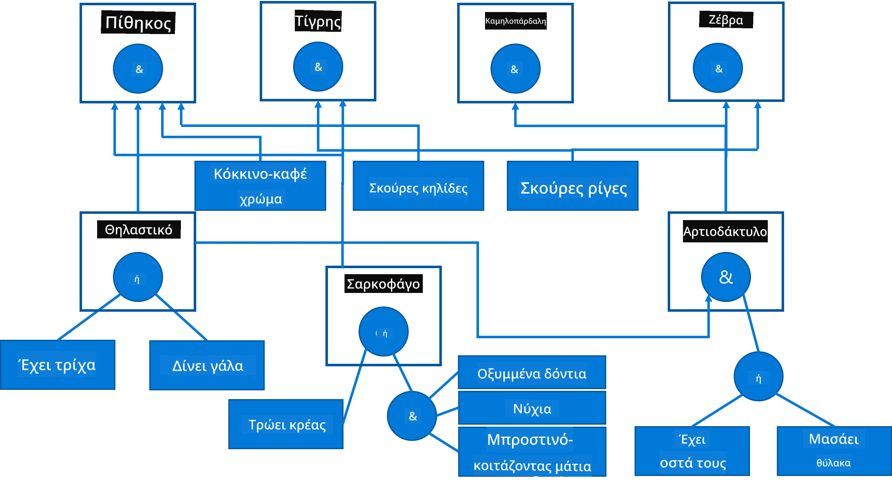
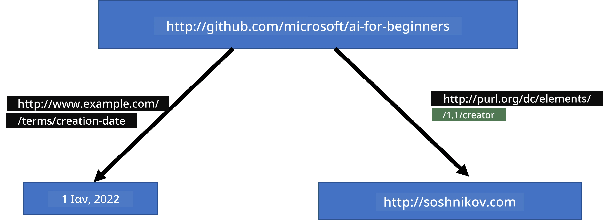
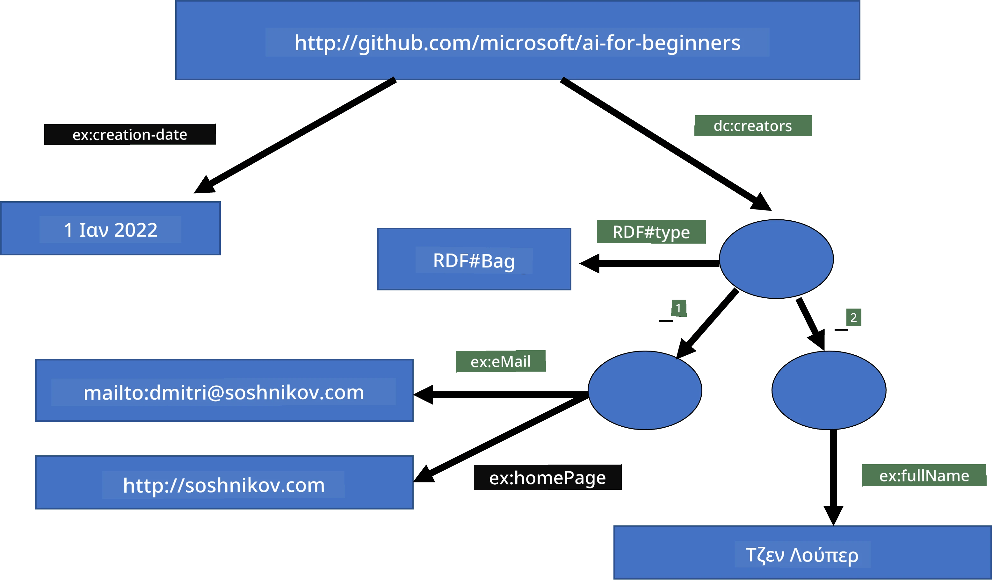
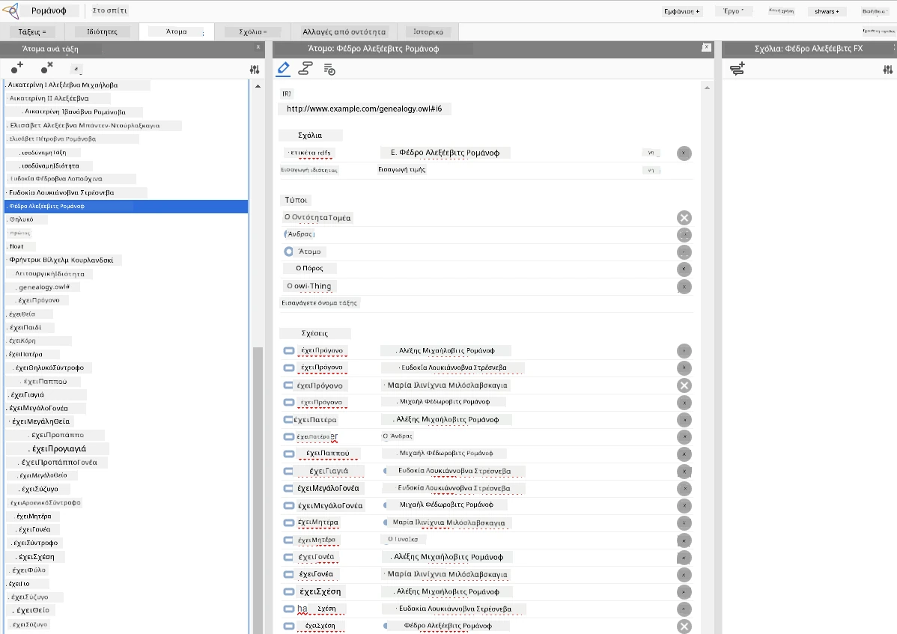

# Αναπαράσταση Γνώσης και Ειδικά Συστήματα


> Σκίτσο από [Tomomi Imura](https://twitter.com/girlie_mac)

Η αναζήτηση της τεχνητής νοημοσύνης βασίζεται στην αναζήτηση γνώσης, για να κατανοήσει τον κόσμο παρόμοια με τον τρόπο που το κάνουν οι άνθρωποι. Αλλά πώς μπορεί κάποιος να το κάνει αυτό;

## [Προ-διάλεξη κουίζ](https://ff-quizzes.netlify.app/en/ai/quiz/3)

Στις πρώτες μέρες της ΤΝ, ο προσεγγιστικός τρόπος κορυφής προς τα κάτω για τη δημιουργία ευφυών συστημάτων (που συζητήθηκε στο προηγούμενο μάθημα) ήταν δημοφιλής. Η ιδέα ήταν να εξαχθεί η γνώση από ανθρώπους σε κάποια μορφή που να μπορεί να διαβαστεί από μηχανή, και στη συνέχεια να χρησιμοποιηθεί για να λύσει αυτόματα προβλήματα. Αυτή η προσέγγιση βασίστηκε σε δύο μεγάλα ιδέες:

* Αναπαράσταση Γνώσης
* Λογική Σκέψη (Συλλογιστική)

## Αναπαράσταση Γνώσης

Μια από τις σημαντικές έννοιες στη Συμβολική ΤΝ είναι η **γνώση**. Είναι σημαντικό να διαχωρίζουμε την γνώση από την *πληροφορία* ή τα *δεδομένα*. Για παράδειγμα, μπορεί κάποιος να πει ότι τα βιβλία περιέχουν γνώση, επειδή μπορεί κανείς να μελετήσει τα βιβλία και να γίνει ειδικός. Ωστόσο, αυτό που πραγματικά περιέχουν τα βιβλία ονομάζεται *δεδομένα*, και διαβάζοντας τα βιβλία και ενσωματώνοντας αυτά τα δεδομένα στο μοντέλο κόσμου μας μετατρέπουμε αυτά τα δεδομένα σε γνώση.

> ✅ **Η γνώση** είναι κάτι που περιέχεται στο κεφάλι μας και αντιπροσωπεύει την κατανόησή μας για τον κόσμο. Αποκτάται μέσω μιας ενεργής διαδικασίας **μάθησης**, η οποία ενσωματώνει κομμάτια πληροφορίας που λαμβάνουμε στο ενεργό μοντέλο μας του κόσμου.

Στις περισσότερες περιπτώσεις, δεν ορίζουμε αυστηρά τη γνώση, αλλά την ευθυγραμμίζουμε με άλλες σχετικές έννοιες χρησιμοποιώντας την [πυραμίδα DIKW](https://en.wikipedia.org/wiki/DIKW_pyramid). Περιλαμβάνει τις εξής έννοιες:

* **Δεδομένα** είναι κάτι που αντιπροσωπεύεται σε φυσικό μέσο, όπως γραπτό κείμενο ή προφορικές λέξεις. Τα δεδομένα υπάρχουν ανεξάρτητα από τους ανθρώπους και μπορούν να μεταβιβαστούν μεταξύ ανθρώπων.
* **Πληροφορία** είναι ο τρόπος με τον οποίο ερμηνεύουμε τα δεδομένα στο μυαλό μας. Για παράδειγμα, όταν ακούμε τη λέξη *υπολογιστής*, έχουμε κάποια κατανόηση του τι είναι.
* **Γνώση** είναι η πληροφορία που ενσωματώνεται στο μοντέλο του κόσμου μας. Για παράδειγμα, μόλις μάθουμε τι είναι ένας υπολογιστής, αρχίζουμε να έχουμε κάποιες ιδέες για το πώς λειτουργεί, πόσο κοστίζει και για ποιο σκοπό μπορεί να χρησιμοποιηθεί. Αυτό το δίκτυο αλληλοσυνδεδεμένων εννοιών σχηματίζει τη γνώση μας.
* **Σοφία** είναι ένα ακόμη επίπεδο της κατανόησής μας για τον κόσμο, και αντιπροσωπεύει τη *μετα-γνώση*, δηλαδή μια ιδέα για το πώς και πότε πρέπει να χρησιμοποιείται η γνώση.



*Εικόνα [από τη Wikipedia](https://commons.wikimedia.org/w/index.php?curid=37705247), Από Longlivetheux - Ιδιωτικό έργο, CC BY-SA 4.0*

Έτσι, το πρόβλημα της **αναπαράστασης γνώσης** είναι να βρεθεί ένας αποτελεσματικός τρόπος να αναπαρασταθεί η γνώση μέσα σε έναν υπολογιστή με τη μορφή δεδομένων, ώστε να μπορεί να χρησιμοποιηθεί αυτόματα. Αυτό μπορεί να θεωρηθεί ως ένα φάσμα:



> Εικόνα από [Dmitry Soshnikov](http://soshnikov.com)

* Στα αριστερά υπάρχουν πολύ απλοί τύποι αναπαραστάσεων γνώσης που μπορούν να χρησιμοποιηθούν αποτελεσματικά από υπολογιστές. Ο απλούστερος είναι ο αλγοριθμικός, όταν η γνώση αναπαρίσταται από ένα πρόγραμμα υπολογιστή. Αυτό, όμως, δεν είναι ο καλύτερος τρόπος αναπαράστασης γνώσης, επειδή δεν είναι ευέλικτος. Η γνώση στο κεφάλι μας συχνά δεν είναι αλγοριθμική.
* Στα δεξιά υπάρχουν αναπαραστάσεις όπως το φυσικό κείμενο. Είναι η πιο ισχυρή, αλλά δεν μπορεί να χρησιμοποιηθεί για αυτόματη συλλογιστική.

> ✅ Σκεφτείτε για μια στιγμή πώς αναπαριστάτε τη γνώση στο κεφάλι σας και πώς την μετατρέπετε σε σημειώσεις. Υπάρχει κάποια συγκεκριμένη μορφή που λειτουργεί καλά για εσάς και βοηθά στη διατήρηση;

## Ταξινόμηση Αναπαραστάσεων Γνώσης Υπολογιστών

Μπορούμε να κατηγοριοποιήσουμε τις διάφορες μεθόδους αναπαράστασης γνώσης υπολογιστών στις παρακάτω κατηγορίες:

* **Δικτυακές αναπαραστάσεις** βασίζονται στο γεγονός ότι έχουμε ένα δίκτυο αλληλοσυνδεδεμένων εννοιών μέσα στο κεφάλι μας. Μπορούμε να προσπαθήσουμε να αναπαραστήσουμε τα ίδια δίκτυα ως γράφο μέσα σε έναν υπολογιστή - το λεγόμενο **σημασιολογικό δίκτυο**.

1. **Τριπλέτες Αντικείμενο-Χαρακτηριστικό-Τιμή** ή **Ζεύγη Χαρακτηριστικό-Τιμή**. Εφόσον ένας γράφος μπορεί να αναπαρασταθεί μέσα σε υπολογιστή ως λίστα από κόμβους και ακμές, μπορούμε να αναπαραστήσουμε ένα σημασιολογικό δίκτυο με μια λίστα τριπλετών που περιέχουν αντικείμενα, χαρακτηριστικά και τιμές. Για παράδειγμα, κατασκευάζουμε τις παρακάτω τριπλέτες για τις γλώσσες προγραμματισμού:

Αντικείμενο | Χαρακτηριστικό | Τιμή
------------|----------------|------
Python | είναι | Αδόμητη-Γλώσσα
Python | εφευρέθηκε-από | Guido van Rossum
Python | σύνταξη-μπλοκ | εσοχή
Αδόμητη-Γλώσσα | δεν-έχει | ορισμούς-τύπων

> ✅ Σκεφτείτε πώς οι τριπλέτες μπορούν να χρησιμοποιηθούν για να αναπαραστήσουν άλλους τύπους γνώσης.

2. **Ιεραρχικές αναπαραστάσεις** τονίζουν το γεγονός ότι συχνά δημιουργούμε μια ιεραρχία αντικειμένων στο κεφάλι μας. Για παράδειγμα, ξέρουμε ότι το καναρίνι είναι πουλί, και όλα τα πουλιά έχουν φτερά. Έχουμε επίσης κάποια ιδέα για το συνήθη χρώμα ενός καναρινιού και την ταχύτητα πτήσης τους.

   - Η **αναπαράσταση πλαισίου (frame representation)** βασίζεται στην αναπαράσταση κάθε αντικειμένου ή κλάσης αντικειμένων ως **πλαίσιο (frame)** που περιέχει **θέσεις (slots)**. Οι θέσεις έχουν πιθανές προεπιλεγμένες τιμές, περιορισμούς τιμών, ή αποθηκευμένες διαδικασίες που μπορούν να κληθούν για να πάρουμε την τιμή μιας θέσης. Όλα τα πλαίσια σχηματίζουν μια ιεραρχία παρόμοια με την ιεραρχία αντικειμένων στις αντικειμενοστραφείς γλώσσες προγραμματισμού.
   - Τα **σενάρια (scenarios)** είναι ειδικός τύπος πλαισίων που αναπαριστούν πολύπλοκες καταστάσεις που μπορούν να εξελιχθούν με τον χρόνο.

**Python**

Θέση | Τιμή | Προεπιλεγμένη Τιμή | Διάστημα |
-----|-------|---------------------|----------|
Όνομα | Python | | |
Είναι-Τύπος | Αδόμητη-Γλώσσα | | |
Τύπος Μεταβλητής | | CamelCase | |
Μήκος Προγράμματος | | | 5-5000 γραμμές |
Σύνταξη Μπλοκ | Εσοχή | | |

3. **Διαδικασιακές αναπαραστάσεις** βασίζονται στην αναπαράσταση της γνώσης με μια λίστα ενεργειών που μπορούν να εκτελεστούν όταν συμβεί κάποιο συγκεκριμένο γεγονός.
   - Οι κανόνες παραγωγής είναι δηλώσεις αν-τότε που μας επιτρέπουν να βγάζουμε συμπεράσματα. Για παράδειγμα, ένας γιατρός μπορεί να έχει έναν κανόνα που λέει ότι **ΑΝ** ένας ασθενής έχει υψηλό πυρετό **Η** υψηλό επίπεδο C-αντιδρώσας πρωτεΐνης σε εξέταση αίματος **ΤΟΤΕ** έχει φλεγμονή. Μόλις συναντήσουμε μία από τις συνθήκες, μπορούμε να βγάλουμε το συμπέρασμα για τη φλεγμονή και μετά να το χρησιμοποιήσουμε σε περαιτέρω συλλογισμούς.
   - Οι αλγόριθμοι μπορούν να θεωρηθούν ως μια άλλη μορφή διαδικασιακής αναπαράστασης, αν και σχεδόν ποτέ δεν χρησιμοποιούνται απευθείας σε συστήματα βασισμένα σε γνώση.

4. **Λογική** προτάθηκε αρχικά από τον Αριστοτέλη ως τρόπος αναπαράστασης της παγκόσμιας ανθρώπινης γνώσης.
   - Η Προτασιακή Λογική ως μαθηματική θεωρία είναι πολύ πλούσια για να είναι υπολογίσιμη, γι' αυτό χρησιμοποιούνται συνήθως υποσύνολα της, όπως οι ρητές Horn που χρησιμοποιούνται στο Prolog.
   - Η Περιγραφική Λογική είναι μια οικογένεια λογικών συστημάτων που χρησιμοποιούνται για να αναπαραστήσουν και να συλλογιστούν για ιεραρχίες αντικειμένων και διανεμημένες αναπαραστάσεις γνώσης όπως ο *σημασιολογικός ιστός*.

## Ειδικά Συστήματα

Μια από τις πρώτες επιτυχίες της συμβολικής ΤΝ ήταν τα λεγόμενα **ειδικά συστήματα** - υπολογιστικά συστήματα σχεδιασμένα να λειτουργούν ως ειδικοί σε έναν περιορισμένο τομέα προβλημάτων. Βασίζονταν σε μια **βάση γνώσης** που εξήχθη από έναν ή περισσότερους ανθρώπινους ειδικούς, και περιείχαν μια **μηχανή συλλογιστικής** που εκτελούσε συλλογισμούς πάνω σε αυτήν.

 | 
-------------------------------------------------------|----------------------------------------------
Απλοποιημένη δομή του ανθρώπινου νευρικού συστήματος | Αρχιτεκτονική συστήματος βασισμένου σε γνώση

Τα ειδικά συστήματα χτίζονται όπως το ανθρώπινο σύστημα συλλογιστικής, το οποίο περιέχει **βραχυπρόθεσμη μνήμη** και **μακροπρόθεσμη μνήμη**. Παρομοίως, σε συστήματα βασισμένα σε γνώση διακρίνουμε τα εξής συστατικά:

* **Μνήμη προβλήματος**: περιέχει τη γνώση για το πρόβλημα που επιλύεται αυτή τη στιγμή, π.χ. τη θερμοκρασία ή την αρτηριακή πίεση ενός ασθενούς, αν έχει φλεγμονή ή όχι κλπ. Αυτή η γνώση ονομάζεται επίσης **στατική γνώση**, επειδή περιέχει ένα στιγμιότυπο του τι γνωρίζουμε επί του παρόντος για το πρόβλημα - την αποκαλούμενη *κατάσταση προβλήματος*.
* **Βάση γνώσης**: αναπαριστά μακροπρόθεσμη γνώση για έναν τομέα προβλημάτων. Εξάγεται χειροκίνητα από ανθρώπινους ειδικούς και δεν αλλάζει από διαβούλευση σε διαβούλευση. Επειδή επιτρέπει την πλοήγηση από μία κατάσταση προβλήματος σε άλλη, ονομάζεται επίσης **δυναμική γνώση**.
* **Μηχανή συλλογιστικής**: συντονίζει ολόκληρη τη διαδικασία αναζήτησης στο χώρο καταστάσεων προβλήματος, κάνοντας ερωτήσεις στον χρήστη όταν χρειάζεται. Είναι επίσης υπεύθυνη για την εύρεση των σωστών κανόνων που πρέπει να εφαρμοστούν σε κάθε κατάσταση.

Ένα παράδειγμα είναι το παρακάτω ειδικό σύστημα για την αναγνώριση ενός ζώου βάσει των φυσικών του χαρακτηριστικών:



> Εικόνα από [Dmitry Soshnikov](http://soshnikov.com)

Αυτό το διάγραμμα ονομάζεται **δέντρο AND-OR**, και είναι μια γραφική αναπαράσταση ενός συνόλου κανόνων παραγωγής. Η σχεδίαση ενός δέντρου είναι χρήσιμη στην αρχή της εξαγωγής γνώσης από τον ειδικό. Για την αναπαράσταση της γνώσης μέσα στον υπολογιστή είναι πιο βολικό να χρησιμοποιούνται κανόνες:

```
IF the animal eats meat
OR (animal has sharp teeth
    AND animal has claws
    AND animal has forward-looking eyes
) 
THEN the animal is a carnivore
```

Μπορείτε να παρατηρήσετε ότι κάθε συνθήκη στην αριστερή πλευρά του κανόνα και η ενέργεια είναι ουσιαστικά τριπλέτες αντικείμενο-χαρακτηριστικό-τιμή (OAV). Η **εργαζόμενη μνήμη** περιέχει το σύνολο των τριπλετών OAV που αντιστοιχούν στο πρόβλημα που λύνεται αυτή τη στιγμή. Μια **μηχανή κανόνων** ψάχνει για κανόνες των οποίων η συνθήκη ικανοποιείται και τους εφαρμόζει, προσθέτοντας μια ακόμη τριπλέτα στην εργαζόμενη μνήμη.

> ✅ Γράψτε το δικό σας δέντρο AND-OR σε ένα θέμα που σας ενδιαφέρει!

### Προώθηση έναντι Οπισθοδρομικής Συλλογιστικής

Η παραπάνω διαδικασία ονομάζεται **προώθηση (forward inference)**. Ξεκινάει με κάποια αρχικά δεδομένα για το πρόβλημα που είναι διαθέσιμα στην εργαζόμενη μνήμη, και έπειτα εκτελεί τον εξής βρόχο συλλογιστικής:

1. Αν το ζητούμενο χαρακτηριστικό υπάρχει στην εργαζόμενη μνήμη - σταματήστε και δώστε το αποτέλεσμα
2. Ψάξτε για όλους τους κανόνες των οποίων η συνθήκη ικανοποιείται - πάρτε το **σύνολο σύγκρουσης** των κανόνων.
3. Εκτελέστε **επίλυση σύγκρουσης** - επιλέξτε έναν κανόνα που θα εκτελεστεί σε αυτό το βήμα. Υπάρχουν διάφορες στρατηγικές επίλυσης σύγκρουσης:
   - Επιλέξτε τον πρώτο εφαρμόσιμο κανόνα στη βάση γνώσης
   - Επιλέξτε έναν τυχαίο κανόνα
   - Επιλέξτε έναν *πιο συγκεκριμένο* κανόνα, δηλαδή αυτόν που ικανοποιεί τις περισσότερες συνθήκες στο "αριστερό μέρος" (LHS)
4. Εφαρμόστε τον επιλεγμένο κανόνα και εισάγετε νέο κομμάτι γνώσης στην κατάσταση προβλήματος
5. Επαναλάβετε από το βήμα 1.

Ωστόσο, σε ορισμένες περιπτώσεις μπορεί να θέλουμε να ξεκινήσουμε με καθαρή γνώση για το πρόβλημα και να κάνουμε ερωτήσεις που θα μας βοηθήσουν να καταλήξουμε στο συμπέρασμα. Για παράδειγμα, κατά τη διάγνωση ασθενειών, συνήθως δεν κάνουμε όλες τις ιατρικές εξετάσεις εκ των προτέρων πριν ξεκινήσουμε τη διάγνωση. Προτιμούμε να κάνουμε εξετάσεις όταν πρέπει να ληφθεί η απόφαση.

Αυτή η διαδικασία μπορεί να μοντελοποιηθεί με τη χρήση της **οπισθοδρομικής συλλογιστικής (backward inference)**. Οδηγείται από τον **στόχο** - την τιμή του χαρακτηριστικού που αναζητούμε:

1. Επιλέξτε όλους τους κανόνες που μπορούν να μας δώσουν την τιμή του στόχου (δηλαδή με τον στόχο στη δεξιά πλευρά, RHS) - σύνολο σύγκρουσης
1. Αν δεν υπάρχουν κανόνες για αυτό το χαρακτηριστικό, ή υπάρχει κανόνας που λέει ότι πρέπει να ρωτήσουμε τον χρήστη - ρωτήστε το, αλλιώς:
1. Χρησιμοποιήστε στρατηγική επίλυσης σύγκρουσης για να επιλέξετε έναν κανόνα που θα χρησιμοποιήσουμε ως *υπόθεση* - θα προσπαθήσουμε να την αποδείξουμε
1. Επαναληπτικά επαναλάβετε τη διαδικασία για όλα τα χαρακτηριστικά στο LHS του κανόνα, προσπαθώντας να τα αποδείξετε ως στόχους
1. Αν σε κάποιο σημείο η διαδικασία αποτύχει - χρησιμοποιήστε άλλον κανόνα στο βήμα 3.

> ✅ Σε ποιες περιπτώσεις είναι πιο κατάλληλη η προώθηση (forward inference); Και η οπισθοδρομική συλλογιστική;

### Υλοποίηση Ειδικών Συστημάτων

Τα ειδικά συστήματα μπορούν να υλοποιηθούν με διάφορα εργαλεία:

* Προγραμματίζοντας τα απευθείας σε κάποια γλώσσα προγραμματισμού υψηλού επιπέδου. Αυτό δεν είναι η καλύτερη ιδέα, επειδή το κύριο πλεονέκτημα ενός συστήματος βασισμένου σε γνώση είναι ότι η γνώση διαχωρίζεται από τη συλλογιστική και ενδεχομένως ο ειδικός του τομέα προβλημάτων θα πρέπει να μπορεί να γράψει κανόνες χωρίς να κατανοεί τις λεπτομέρειες της διαδικασίας συλλογιστικής.
* Χρησιμοποιώντας ένα **κέλυφος ειδικού συστήματος (expert systems shell)**, δηλαδή ένα σύστημα σχεδιασμένο ειδικά για να γεμίζει με γνώση χρησιμοποιώντας κάποια γλώσσα αναπαράστασης γνώσης.

## ✍️ Άσκηση: Συλλογιστική για Ζώα

Δείτε το [Animals.ipynb](https://github.com/microsoft/AI-For-Beginners/blob/main/lessons/2-Symbolic/Animals.ipynb) για ένα παράδειγμα υλοποίησης ειδικού συστήματος με προώθηση και οπισθοδρομική συλλογιστική.

> **Σημείωση**: Αυτό το παράδειγμα είναι αρκετά απλό, και δίνει μόνο την ιδέα του πώς μοιάζει ένα ειδικό σύστημα. Όταν αρχίζετε να δημιουργείτε τέτοιο σύστημα, θα παρατηρήσετε *έξυπνη* συμπεριφορά μόνο αφού φτάσετε έναν αριθμό κανόνων γύρω στους 200+. Σε κάποιο σημείο, οι κανόνες γίνονται πολύ περίπλοκοι για να θυμάστε όλους, και τότε μπορεί να αναρωτηθείτε γιατί το σύστημα παίρνει ορισμένες αποφάσεις. Ωστόσο, τα σημαντικά χαρακτηριστικά των συστημάτων βασισμένων σε γνώση είναι ότι μπορείτε πάντα να *εξηγήσετε* ακριβώς πώς λήφθηκαν οποιεσδήποτε αποφάσεις.

## Οντολογίες και ο Σημασιολογικός Ιστός

Στο τέλος του 20ού αιώνα υπήρξε μια πρωτοβουλία να χρησιμοποιηθεί η αναπαράσταση γνώσης για να σχολιαστούν πόροι του Διαδικτύου, ώστε να είναι δυνατή η εύρεση πόρων που αντιστοιχούν σε πολύ συγκεκριμένα ερωτήματα. Αυτή η πρωτοβουλία ονομάστηκε **Σημασιολογικός Ιστός (Semantic Web)**, και βασίστηκε σε αρκετές έννοιες:

- Μια ειδική αναπαράσταση γνώσης βασισμένη στην **[περιγραφική λογική](https://en.wikipedia.org/wiki/Description_logic)** (DL). Είναι παρόμοια με την αναπαράσταση γνώσης με πλαίσια, επειδή δημιουργεί μια ιεραρχία αντικειμένων με ιδιότητες, αλλά έχει τυπική λογική σημασιολογία και συλλογιστική. Υπάρχει ολόκληρη οικογένεια DL που ισορροπεί μεταξύ της εκφραστικότητας και της αλγοριθμικής πολυπλοκότητας της συλλογιστικής.
- Διανεμημένη αναπαράσταση γνώσης, όπου όλες οι έννοιες αναπαρίστανται με έναν παγκόσμιο αναγνωριστικό URI, καθιστώντας δυνατή τη δημιουργία ιεραρχιών γνώσης που εκτείνονται στο διαδίκτυο.
- Μια οικογένεια γλωσσών βασισμένων σε XML για περιγραφή γνώσης: RDF (Resource Description Framework), RDFS (RDF Schema), OWL (Ontology Web Language).

Ένα βασικό πλαίσιο στο Σημασιολογικό Ιστό είναι η έννοια της **Οντολογίας**. Αναφέρεται σε μια ρητή προδιαγραφή ενός πεδίου προβλήματος χρησιμοποιώντας κάποια επίσημη αναπαράσταση γνώσης. Η πιο απλή οντολογία μπορεί να είναι απλώς μια ιεραρχία αντικειμένων σε ένα πεδίο προβλήματος, αλλά πιο πολύπλοκες οντολογίες θα περιλαμβάνουν κανόνες που μπορούν να χρησιμοποιηθούν για συμπερασμό.

Στον σημασιολογικό ιστό, όλες οι αναπαραστάσεις βασίζονται σε τριάδες. Κάθε αντικείμενο και κάθε σχέση ταυτοποιούνται μοναδικά από το URI. Για παράδειγμα, αν θέλουμε να δηλώσουμε το γεγονός ότι αυτό το Πρόγραμμα Σπουδών Τεχνητής Νοημοσύνης έχει αναπτυχθεί από τον Dmitry Soshnikov την 1η Ιανουαρίου 2022 - εδώ είναι οι τριάδες που μπορούμε να χρησιμοποιήσουμε:



```
http://github.com/microsoft/ai-for-beginners http://www.example.com/terms/creation-date “Jan 1, 2022”
http://github.com/microsoft/ai-for-beginners http://purl.org/dc/elements/1.1/creator http://soshnikov.com
```

> ✅ Εδώ τα `http://www.example.com/terms/creation-date` και `http://purl.org/dc/elements/1.1/creator` είναι κάποια καλά γνωστά και καθολικά αποδεκτά URIs για να εκφράσουν τις έννοιες του *δημιουργού* και της *ημερομηνίας δημιουργίας*.

Σε μια πιο σύνθετη περίπτωση, αν θέλουμε να ορίσουμε μια λίστα δημιουργών, μπορούμε να χρησιμοποιήσουμε κάποιες δομές δεδομένων ορισμένες στο RDF.



> Διαγράμματα παραπάνω από τον [Dmitry Soshnikov](http://soshnikov.com)

Η πρόοδος στην κατασκευή του Σημασιολογικού Ιστού επιβραδύνθηκε κάπως από την επιτυχία των μηχανών αναζήτησης και των τεχνικών επεξεργασίας φυσικής γλώσσας, οι οποίες επιτρέπουν την εξαγωγή δομημένων δεδομένων από κείμενο. Ωστόσο, σε ορισμένους τομείς εξακολουθούν να γίνονται σημαντικές προσπάθειες για τη διατήρηση οντολογιών και βάσεων γνώσης. Μερικά έργα που αξίζει να σημειωθούν:

* [WikiData](https://wikidata.org/) είναι μια συλλογή μηχανικά αναγνώσιμων βάσεων γνώσης που σχετίζονται με τη Wikipedia. Τα περισσότερα δεδομένα εξορύσσονται από τα *InfoBoxes* της Wikipedia, κομμάτια δομημένου περιεχομένου μέσα στις σελίδες της Wikipedia. Μπορείτε να [κάνετε ερωτήματα](https://query.wikidata.org/) σε wikidata με SPARQL, μια ειδική γλώσσα ερωτημάτων για τον Σημασιολογικό Ιστό. Εδώ είναι ένα παράδειγμα ερωτήματος που εμφανίζει τα πιο δημοφιλή χρώματα ματιών ανάμεσα σε ανθρώπους:

```sparql
#defaultView:BubbleChart
SELECT ?eyeColorLabel (COUNT(?human) AS ?count)
WHERE
{
  ?human wdt:P31 wd:Q5.       # human instance-of homo sapiens
  ?human wdt:P1340 ?eyeColor. # human eye-color ?eyeColor
  SERVICE wikibase:label { bd:serviceParam wikibase:language "en". }
}
GROUP BY ?eyeColorLabel
```

* [DBpedia](https://www.dbpedia.org/) είναι μια άλλη προσπάθεια παρόμοια με το WikiData.

> ✅ Αν θέλετε να πειραματιστείτε με τη δημιουργία των δικών σας οντολογιών ή να ανοίξετε υπάρχουσες οντολογίες, υπάρχει ένας εξαιρετικός οπτικός επεξεργαστής οντολογίας που ονομάζεται [Protégé](https://protege.stanford.edu/). Κατεβάστε τον ή χρησιμοποιήστε τον online.



*Ο επεξεργαστής Web Protégé ανοιχτός με την οντολογία της Οικογένειας Ρομάνοφ. Στιγμιότυπο οθόνης από τον Dmitry Soshnikov*

## ✍️ Άσκηση: Μια Οντολογία Οικογένειας


Δείτε το [FamilyOntology.ipynb](https://github.com/Ezana135/AI-For-Beginners/blob/main/lessons/2-Symbolic/FamilyOntology.ipynb) για ένα παράδειγμα χρήσης τεχνικών Σημασιολογικού Ιστού για να κάνετε συμπεράσματα σχετικά με οικογενειακές σχέσεις. Θα λάβουμε ένα οικογενειακό δέντρο που αναπαρίσταται στη συνηθισμένη μορφή GEDCOM και μια οντολογία οικογενειακών σχέσεων και θα δημιουργήσουμε ένα γράφημα όλων των οικογενειακών σχέσεων για ένα δοσμένο σύνολο ατόμων.

## Γράφημα Εννοιών Microsoft

Στις περισσότερες περιπτώσεις, οι οντολογίες δημιουργούνται προσεκτικά με το χέρι. Ωστόσο, είναι επίσης δυνατό να **εξορυχθούν** οντολογίες από μη δομημένα δεδομένα, για παράδειγμα, από κείμενα φυσικής γλώσσας.

Μια τέτοια προσπάθεια έγινε από την Microsoft Research, και είχε ως αποτέλεσμα το [Microsoft Concept Graph](https://blogs.microsoft.com/ai/microsoft-researchers-release-graph-that-helps-machines-conceptualize/?WT.mc_id=academic-77998-cacaste).

Είναι μια μεγάλη συλλογή οντοτήτων ομαδοποιημένων χρησιμοποιώντας τη σχέση κληρονομικότητας `είναι-ένα`. Επιτρέπει την απάντηση σε ερωτήσεις όπως "Τι είναι η Microsoft;" - με απάντηση κάτι σαν "μια εταιρεία με πιθανότητα 0.87 και μια μάρκα με πιθανότητα 0.75".

Το Γράφημα είναι διαθέσιμο είτε ως REST API, είτε ως ένα μεγάλο αρχείο κειμένου για κατέβασμα που παραθέτει όλα τα ζεύγη οντοτήτων.

## ✍️ Άσκηση: Ένα Γράφημα Εννοιών

Δοκιμάστε το σημειωματάριο [MSConceptGraph.ipynb](https://github.com/microsoft/AI-For-Beginners/blob/main/lessons/2-Symbolic/MSConceptGraph.ipynb) για να δείτε πώς μπορούμε να χρησιμοποιήσουμε το Microsoft Concept Graph για να ομαδοποιήσουμε ειδήσεις σε διάφορες κατηγορίες.

## Συμπέρασμα

Σήμερα, η Τεχνητή Νοημοσύνη συχνά θεωρείται συνώνυμο του *Machine Learning* ή των *Νευρωνικών Δικτύων*. Ωστόσο, ο άνθρωπος επιδεικνύει επίσης ρητό συλλογισμό, κάτι που προς το παρόν δεν καλύπτεται από τα νευρωνικά δίκτυα. Σε πραγματικά έργα, ο ρητός συλλογισμός εξακολουθεί να χρησιμοποιείται για την εκτέλεση εργασιών που απαιτούν εξηγήσεις, ή την ικανότητα να τροποποιείται η συμπεριφορά του συστήματος με ελεγχόμενο τρόπο.

## 🚀 Πρόκληση

Στο σημειωματάριο Οντολογίας Οικογένειας που σχετίζεται με αυτό το μάθημα, υπάρχει η ευκαιρία να πειραματιστείτε με άλλες οικογενειακές σχέσεις. Προσπαθήστε να ανακαλύψετε νέες συνδέσεις ανάμεσα σε ανθρώπους στο οικογενειακό δέντρο.

## [Κουίζ μετά τη διάλεξη](https://ff-quizzes.netlify.app/en/ai/quiz/4)

## Ανασκόπηση & Αυτοδίδακτος

Κάντε μια έρευνα στο διαδίκτυο για να ανακαλύψετε τομείς όπου οι άνθρωποι προσπάθησαν να ποσοτικοποιήσουν και να κωδικοποιήσουν τη γνώση. Ρίξτε μια ματιά στη Ταξινομία του Bloom, και επιστρέψτε στην ιστορία για να μάθετε πώς οι άνθρωποι προσπάθησαν να κατανοήσουν τον κόσμο τους. Εξερευνήστε το έργο του Linnaeus για τη δημιουργία μιας ταξονομίας οργανισμών, και παρατηρήστε τον τρόπο που ο Dmitri Mendeleev δημιούργησε έναν τρόπο για να περιγράφονται και να ομαδοποιούνται τα χημικά στοιχεία. Ποια άλλα ενδιαφέροντα παραδείγματα μπορείτε να βρείτε;

**Ανάθεση**: [Κατασκευή Οντολογίας](assignment.md)

---

<!-- CO-OP TRANSLATOR DISCLAIMER START -->
**Αποποίηση ευθυνών**:  
Αυτό το έγγραφο έχει μεταφραστεί χρησιμοποιώντας την υπηρεσία μετάφρασης AI [Co-op Translator](https://github.com/Azure/co-op-translator). Παρόλο που καταβάλλουμε προσπάθεια για ακρίβεια, παρακαλούμε να λάβετε υπόψη ότι οι αυτόματες μεταφράσεις ενδέχεται να περιέχουν σφάλματα ή ανακρίβειες. Το πρωτότυπο έγγραφο στη μητρική του γλώσσα πρέπει να θεωρείται η αυθεντική πηγή. Για κρίσιμες πληροφορίες, συνιστάται η επαγγελματική μετάφραση από ανθρώπους. Δεν φέρουμε καμία ευθύνη για τυχόν παρεξηγήσεις ή λανθασμένες ερμηνείες που προκύπτουν από τη χρήση αυτής της μετάφρασης.
<!-- CO-OP TRANSLATOR DISCLAIMER END -->