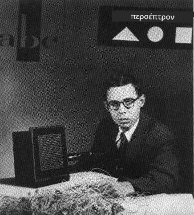
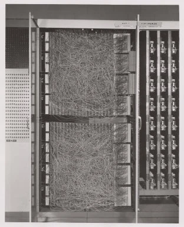

# Εισαγωγή στα Νευρωνικά Δίκτυα: Perceptron

## [Προ-διάλεξης κουίζ](https://ff-quizzes.netlify.app/en/ai/quiz/5)

Μία από τις πρώτες προσπάθειες υλοποίησης κάτι παρόμοιου με ένα σύγχρονο νευρωνικό δίκτυο έγινε από τον Frank Rosenblatt στο Cornell Aeronautical Laboratory το 1957. Ήταν μια υλοποίηση υλικού που ονομάστηκε "Mark-1", σχεδιασμένη να αναγνωρίζει πρωτόγονα γεωμετρικά σχήματα, όπως τρίγωνα, τετράγωνα και κύκλους.

|      |      |
|--------------|-----------|
| | |

> Εικόνες [από τη Wikipedia](https://en.wikipedia.org/wiki/Perceptron)

Μια εικόνα εισόδου αναπαριστάτο από έναν πίνακα φωτοκυττάρων 20x20, οπότε το νευρωνικό δίκτυο είχε 400 εισόδους και μία δυαδική έξοδο. Ένα απλό δίκτυο περιείχε έναν νευρώνα, που ονομάζεται επίσης **μονάδα λογικής κατωφλίου**. Τα βάρη του νευρωνικού δικτύου λειτουργούσαν σαν ποτενσιόμετρα που απαιτούσαν χειροκίνητη ρύθμιση κατά τη φάση εκπαίδευσης.

> ✅ Ένα ποτενσιόμετρο είναι μια συσκευή που επιτρέπει στον χρήστη να ρυθμίζει την αντίσταση ενός κυκλώματος.

> Οι New York Times έγραψαν για το perceptron εκείνη την εποχή: *το έμβρυο ενός ηλεκτρονικού υπολογιστή που [το Ναυτικό] αναμένει ότι θα μπορεί να περπατά, να μιλά, να βλέπει, να γράφει, να αναπαράγεται και να έχει συνείδηση της ύπαρξής του.*

## Μοντέλο Perceptron

Ας υποθέσουμε ότι έχουμε N χαρακτηριστικά στο μοντέλο μας, οπότε το διάνυσμα εισόδου θα είναι ένα διάνυσμα μεγέθους N. Ένα perceptron είναι ένα μοντέλο **δυαδικής ταξινόμησης**, δηλαδή μπορεί να διακρίνει μεταξύ δύο κατηγοριών δεδομένων εισόδου. Θα υποθέσουμε ότι για κάθε διάνυσμα εισόδου x η έξοδος του perceptron μας θα είναι είτε +1 είτε -1, ανάλογα με την κατηγορία. Η έξοδος θα υπολογίζεται χρησιμοποιώντας τον τύπο:

y(x) = f(w<sup>T</sup>x)

όπου f είναι μια συνάρτηση ενεργοποίησης βήματος

<!-- img src="http://www.sciweavers.org/tex2img.php?eq=f%28x%29%20%3D%20%5Cbegin%7Bcases%7D%0A%20%20%20%20%20%20%20%20%20%2B1%20%26%20x%20%5Cgeq%200%20%5C%5C%0A%20%20%20%20%20%20%20%20%20-1%20%26%20x%20%3C%200%0A%20%20%20%20%20%20%20%5Cend%7Bcases%7D%20%5C%5C%0A&bc=White&fc=Black&im=jpg&fs=12&ff=arev&edit=0" align="center" border="0" alt="f(x) = \begin{cases} +1 & x \geq 0 \\ -1 & x < 0 \end{cases} \\" width="154" height="50" / -->


## Εκπαίδευση του Perceptron

Για να εκπαιδεύσουμε ένα perceptron, πρέπει να βρούμε ένα διάνυσμα βαρών w που ταξινομεί σωστά τις περισσότερες τιμές, δηλαδή που οδηγεί στο μικρότερο **σφάλμα**. Αυτό το σφάλμα E ορίζεται από το **κριτήριο του perceptron** ως εξής:

E(w) = -&sum;w<sup>T</sup>x<sub>i</sub>t<sub>i</sub>

όπου:

* το άθροισμα λαμβάνεται για εκείνα τα σημεία δεδομένων εκπαίδευσης i που οδηγούν σε λανθασμένη ταξινόμηση
* x<sub>i</sub> είναι τα δεδομένα εισόδου, και t<sub>i</sub> είναι είτε -1 είτε +1 για αρνητικά και θετικά παραδείγματα αντίστοιχα.

Αυτό το κριτήριο θεωρείται ως συνάρτηση των βαρών w, και πρέπει να το ελαχιστοποιήσουμε. Συχνά χρησιμοποιείται μια μέθοδος που ονομάζεται **κατάβαση κλίσης** (gradient descent), στην οποία ξεκινάμε με κάποια αρχικά βάρη w<sup>(0)</sup>, και στη συνέχεια σε κάθε βήμα ενημερώνουμε τα βάρη σύμφωνα με τον τύπο:

w<sup>(t+1)</sup> = w<sup>(t)</sup> - &eta;&nabla;E(w)

Εδώ &eta; είναι ο λεγόμενος **ρυθμός εκμάθησης** (learning rate), και &nabla;E(w) δηλώνει την **κλίση** του E. Μετά τον υπολογισμό της κλίσης, καταλήγουμε στον τύπο:

w<sup>(t+1)</sup> = w<sup>(t)</sup> + &sum;&eta;x<sub>i</sub>t<sub>i</sub>

Ο αλγόριθμος σε Python μοιάζει ως εξής:

```python
def train(positive_examples, negative_examples, num_iterations = 100, eta = 1):

    weights = [0,0,0] # Initialize weights (almost randomly :)
        
    for i in range(num_iterations):
        pos = random.choice(positive_examples)
        neg = random.choice(negative_examples)

        z = np.dot(pos, weights) # compute perceptron output
        if z < 0: # positive example classified as negative
            weights = weights + eta*weights.shape

        z  = np.dot(neg, weights)
        if z >= 0: # negative example classified as positive
            weights = weights - eta*weights.shape

    return weights
```

## Συμπέρασμα

Σε αυτό το μάθημα, μάθατε για το perceptron, το οποίο είναι ένα μοντέλο δυαδικής ταξινόμησης, και πώς να το εκπαιδεύσετε χρησιμοποιώντας ένα διάνυσμα βαρών.

## 🚀 Πρόκληση

Αν θέλετε να δοκιμάσετε να δημιουργήσετε το δικό σας perceptron, δοκιμάστε [αυτό το εργαστήριο στο Microsoft Learn](https://docs.microsoft.com/en-us/azure/machine-learning/component-reference/two-class-averaged-perceptron?WT.mc_id=academic-77998-cacaste) που χρησιμοποιεί τον [Azure ML designer](https://docs.microsoft.com/en-us/azure/machine-learning/concept-designer?WT.mc_id=academic-77998-cacaste).

## [Μετα-διάλεξης κουίζ](https://ff-quizzes.netlify.app/en/ai/quiz/6)

## Ανασκόπηση & Αυτομελέτη

Για να δείτε πώς μπορούμε να χρησιμοποιήσουμε το perceptron για να λύσουμε ένα απλό πρόβλημα καθώς και προβλήματα της πραγματικής ζωής, και για να συνεχίσετε τη μάθηση - επισκεφθείτε το σημειωματάριο [Perceptron](Perceptron.ipynb).

Εδώ υπάρχει ένα ενδιαφέρον [άρθρο για τα perceptrons](https://towardsdatascience.com/what-is-a-perceptron-basics-of-neural-networks-c4cfea20c590).

## [Εργασία](lab/README.md)

Σε αυτό το μάθημα, υλοποιήσαμε ένα perceptron για μια εργασία δυαδικής ταξινόμησης και το χρησιμοποιήσαμε για να ταξινομήσουμε μεταξύ δύο χειρόγραφων ψηφίων. Σε αυτό το εργαστήριο, σας ζητείται να λύσετε το πρόβλημα της ταξινόμησης ψηφίων εξ ολοκλήρου, δηλαδή να προσδιορίσετε ποιο ψηφίο είναι πιο πιθανό να αντιστοιχεί σε μια δεδομένη εικόνα.

* [Οδηγίες](lab/README.md)
* [Σημειωματάριο](lab/PerceptronMultiClass.ipynb)

---

