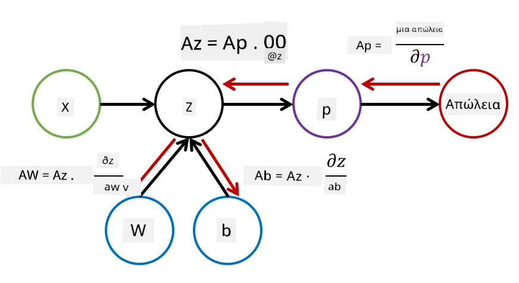

# Εισαγωγή στα Νευρωνικά Δίκτυα. Πολυεπίπεδος Perceptron

Στην προηγούμενη ενότητα, μάθατε για το πιο απλό μοντέλο νευρωνικού δικτύου - τον μονοεπίπεδο perceptron, ένα γραμμικό μοντέλο ταξινόμησης δύο κατηγοριών.

Σε αυτή την ενότητα θα επεκτείνουμε αυτό το μοντέλο σε ένα πιο ευέλικτο πλαίσιο, που μας επιτρέπει να:

* πραγματοποιούμε **ταξινόμηση πολλαπλών κατηγοριών** εκτός από δύο κατηγορίες
* επιλύουμε **προβλήματα παλινδρόμησης** εκτός από ταξινόμηση
* διαχωρίζουμε κατηγορίες που δεν είναι γραμμικά διαχωρίσιμες

Επιπλέον, θα αναπτύξουμε το δικό μας αρθρωτό πλαίσιο σε Python, που θα μας επιτρέπει να κατασκευάζουμε διαφορετικές αρχιτεκτονικές νευρωνικών δικτύων.

## [Προ-διάλεξης κουίζ](https://ff-quizzes.netlify.app/en/ai/quiz/7)

## Τυποποίηση της Μηχανικής Μάθησης

Ας ξεκινήσουμε τυποποιώντας το πρόβλημα της Μηχανικής Μάθησης. Υποθέτουμε ότι έχουμε ένα σύνολο εκπαίδευσης **X** με ετικέτες **Y**, και πρέπει να κατασκευάσουμε ένα μοντέλο *f* που θα κάνει τις πιο ακριβείς προβλέψεις. Η ποιότητα των προβλέψεων μετριέται από τη **συνάρτηση απώλειας** &lagran;. Οι ακόλουθες συναρτήσεις απώλειας χρησιμοποιούνται συχνά:

* Για πρόβλημα παλινδρόμησης, όταν πρέπει να προβλέψουμε έναν αριθμό, μπορούμε να χρησιμοποιήσουμε **απόλυτο σφάλμα** &sum;i|f(x(i))-y(i)|, ή **τετραγωνικό σφάλμα** &sum;i(f(x(i))-y(i))2
* Για ταξινόμηση, χρησιμοποιούμε **0-1 απώλεια** (που είναι ουσιαστικά το ίδιο με την **ακρίβεια** του μοντέλου), ή **λογιστική απώλεια**.

Για τον μονοεπίπεδο perceptron, η συνάρτηση *f* οριζόταν ως γραμμική συνάρτηση *f(x)=wx+b* (όπου *w* είναι ο πίνακας βαρών, *x* είναι το διάνυσμα χαρακτηριστικών εισόδου, και *b* είναι το διάνυσμα προκατάληψης). Για διαφορετικές αρχιτεκτονικές νευρωνικών δικτύων, αυτή η συνάρτηση μπορεί να πάρει πιο σύνθετη μορφή.

> Στην περίπτωση της ταξινόμησης, είναι συχνά επιθυμητό να λαμβάνουμε πιθανότητες των αντίστοιχων κατηγοριών ως έξοδο του δικτύου. Για να μετατρέψουμε αυθαίρετους αριθμούς σε πιθανότητες (π.χ. να κανονικοποιήσουμε την έξοδο), χρησιμοποιούμε συχνά τη **συνάρτηση softmax** &sigma;, και η συνάρτηση *f* γίνεται *f(x)=&sigma;(wx+b)*

Στον ορισμό της *f* παραπάνω, *w* και *b* ονομάζονται **παράμετροι** &theta;=⟨*w,b*⟩. Δεδομένου του συνόλου δεδομένων ⟨**X**,**Y**⟩, μπορούμε να υπολογίσουμε το συνολικό σφάλμα σε ολόκληρο το σύνολο δεδομένων ως συνάρτηση των παραμέτρων &theta;.

> ✅ **Ο στόχος της εκπαίδευσης του νευρωνικού δικτύου είναι να ελαχιστοποιηθεί το σφάλμα μεταβάλλοντας τις παραμέτρους &theta;**

## Βελτιστοποίηση με Καθοδική Κλίση

Υπάρχει μια γνωστή μέθοδος βελτιστοποίησης συναρτήσεων που ονομάζεται **καθοδική κλίση**. Η ιδέα είναι ότι μπορούμε να υπολογίσουμε την παράγωγο (στην πολυδιάστατη περίπτωση ονομάζεται **κλίση**) της συνάρτησης απώλειας ως προς τις παραμέτρους, και να μεταβάλλουμε τις παραμέτρους με τέτοιο τρόπο ώστε το σφάλμα να μειώνεται. Αυτό μπορεί να τυποποιηθεί ως εξής:

* Αρχικοποιούμε τις παραμέτρους με κάποιες τυχαίες τιμές w(0), b(0)
* Επαναλαμβάνουμε το ακόλουθο βήμα πολλές φορές:
    - w(i+1) = w(i)-&eta;&part;&lagran;/&part;w
    - b(i+1) = b(i)-&eta;&part;&lagran;/&part;b

Κατά την εκπαίδευση, τα βήματα βελτιστοποίησης υποτίθεται ότι υπολογίζονται λαμβάνοντας υπόψη ολόκληρο το σύνολο δεδομένων (θυμηθείτε ότι η απώλεια υπολογίζεται ως άθροισμα όλων των δειγμάτων εκπαίδευσης). Ωστόσο, στην πραγματικότητα λαμβάνουμε μικρά τμήματα του συνόλου δεδομένων που ονομάζονται **minibatches**, και υπολογίζουμε τις κλίσεις βάσει ενός υποσυνόλου δεδομένων. Επειδή το υποσύνολο λαμβάνεται τυχαία κάθε φορά, αυτή η μέθοδος ονομάζεται **στοχαστική καθοδική κλίση** (SGD).

## Πολυεπίπεδοι Perceptrons και Backpropagation

Το μονοεπίπεδο δίκτυο, όπως είδαμε παραπάνω, είναι ικανό να ταξινομεί γραμμικά διαχωρίσιμες κατηγορίες. Για να κατασκευάσουμε ένα πιο πλούσιο μοντέλο, μπορούμε να συνδυάσουμε αρκετά επίπεδα του δικτύου. Μαθηματικά, αυτό θα σήμαινε ότι η συνάρτηση *f* θα είχε πιο σύνθετη μορφή και θα υπολογιζόταν σε αρκετά βήματα:
* z1=w1x+b1
* z2=w2&alpha;(z1)+b2
* f = &sigma;(z2)

Εδώ, &alpha; είναι μια **μη γραμμική συνάρτηση ενεργοποίησης**, &sigma; είναι η συνάρτηση softmax, και οι παράμετροι &theta;=<*w1,b1,w2,b2*>.

Ο αλγόριθμος καθοδικής κλίσης θα παραμείνει ο ίδιος, αλλά θα είναι πιο δύσκολο να υπολογιστούν οι κλίσεις. Δεδομένου του κανόνα αλυσίδας για τις παραγώγους, μπορούμε να υπολογίσουμε τις παραγώγους ως:

* &part;&lagran;/&part;w2 = (&part;&lagran;/&part;&sigma;)(&part;&sigma;/&part;z2)(&part;z2/&part;w2)
* &part;&lagran;/&part;w1 = (&part;&lagran;/&part;&sigma;)(&part;&sigma;/&part;z2)(&part;z2/&part;&alpha;)(&part;&alpha;/&part;z1)(&part;z1/&part;w1)

> ✅ Ο κανόνας αλυσίδας χρησιμοποιείται για τον υπολογισμό των παραγώγων της συνάρτησης απώλειας ως προς τις παραμέτρους.

Σημειώστε ότι το αριστερότερο μέρος όλων αυτών των εκφράσεων είναι το ίδιο, και έτσι μπορούμε να υπολογίσουμε αποτελεσματικά τις παραγώγους ξεκινώντας από τη συνάρτηση απώλειας και πηγαίνοντας "προς τα πίσω" μέσω του γραφήματος υπολογισμού. Έτσι, η μέθοδος εκπαίδευσης ενός πολυεπίπεδου perceptron ονομάζεται **backpropagation**, ή 'backprop'.

> TODO: αναφορά εικόνας

> ✅ Θα καλύψουμε το backprop με πολύ περισσότερες λεπτομέρειες στο παράδειγμα του notebook μας.  

## Συμπέρασμα

Σε αυτό το μάθημα, κατασκευάσαμε τη δική μας βιβλιοθήκη νευρωνικών δικτύων και τη χρησιμοποιήσαμε για μια απλή δισδιάστατη ταξινόμηση.

## 🚀 Πρόκληση

Στο συνοδευτικό notebook, θα υλοποιήσετε το δικό σας πλαίσιο για την κατασκευή και εκπαίδευση πολυεπίπεδων perceptrons. Θα μπορέσετε να δείτε λεπτομερώς πώς λειτουργούν τα σύγχρονα νευρωνικά δίκτυα.

Προχωρήστε στο notebook [OwnFramework](OwnFramework.ipynb) και δουλέψτε πάνω σε αυτό.

## [Μετά-διάλεξης κουίζ](https://ff-quizzes.netlify.app/en/ai/quiz/8)

## Ανασκόπηση & Αυτομελέτη

Το backpropagation είναι ένας κοινός αλγόριθμος που χρησιμοποιείται στην Τεχνητή Νοημοσύνη και τη Μηχανική Μάθηση, αξίζει να μελετηθεί [πιο λεπτομερώς](https://wikipedia.org/wiki/Backpropagation)

## [Εργασία](lab/README.md)

Σε αυτό το εργαστήριο, σας ζητείται να χρησιμοποιήσετε το πλαίσιο που κατασκευάσατε σε αυτό το μάθημα για να λύσετε την ταξινόμηση χειρόγραφων ψηφίων MNIST.

* [Οδηγίες](lab/README.md)
* [Notebook](lab/MyFW_MNIST.ipynb)

---

