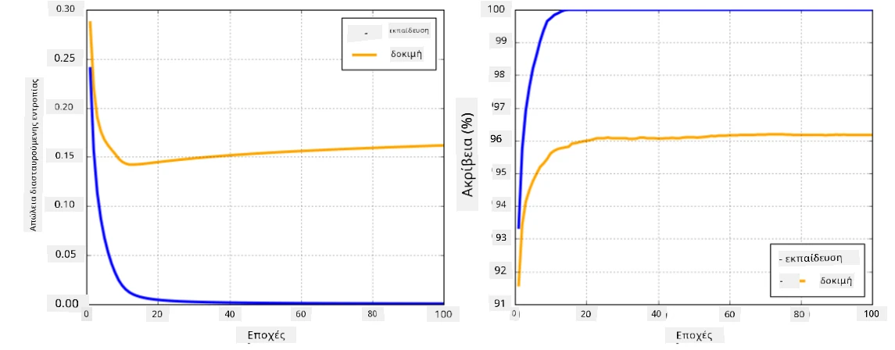

# Πλαίσια Νευρωνικών Δικτύων

Όπως έχουμε ήδη μάθει, για να μπορέσουμε να εκπαιδεύσουμε νευρωνικά δίκτυα αποτελεσματικά, πρέπει να κάνουμε δύο πράγματα:

* Να δουλέψουμε με τανυστές, π.χ. να πολλαπλασιάσουμε, να προσθέσουμε και να υπολογίσουμε κάποιες συναρτήσεις όπως sigmoid ή softmax.
* Να υπολογίσουμε τις παραγώγους όλων των εκφράσεων, ώστε να εκτελέσουμε βελτιστοποίηση με κατηφορική μέθοδο.

## [Προ-μάθημα κουίζ](https://ff-quizzes.netlify.app/en/ai/quiz/9)

Ενώ η βιβλιοθήκη `numpy` μπορεί να κάνει το πρώτο μέρος, χρειαζόμαστε κάποιο μηχανισμό για να υπολογίσουμε παραγώγους. Στο [πλαίσιο μας](../04-OwnFramework/OwnFramework.ipynb) που αναπτύξαμε στην προηγούμενη ενότητα, έπρεπε να προγραμματίσουμε χειροκίνητα όλες τις συναρτήσεις παραγώγων μέσα στη μέθοδο `backward`, η οποία εκτελεί την οπισθοδιάδοση. Ιδανικά, ένα πλαίσιο θα πρέπει να μας δίνει τη δυνατότητα να υπολογίσουμε παραγώγους για *οποιαδήποτε έκφραση* μπορούμε να ορίσουμε.

Ένα άλλο σημαντικό στοιχείο είναι η δυνατότητα εκτέλεσης υπολογισμών σε GPU ή σε άλλες εξειδικευμένες μονάδες υπολογισμού, όπως [TPU](https://en.wikipedia.org/wiki/Tensor_Processing_Unit). Η εκπαίδευση βαθιών νευρωνικών δικτύων απαιτεί *πολλούς* υπολογισμούς, και η δυνατότητα παράλληλης εκτέλεσης αυτών των υπολογισμών σε GPUs είναι πολύ σημαντική.

> ✅ Ο όρος 'παραλληλοποίηση' σημαίνει τη διανομή των υπολογισμών σε πολλαπλές συσκευές.

Αυτή τη στιγμή, τα δύο πιο δημοφιλή πλαίσια νευρωνικών δικτύων είναι: [TensorFlow](http://TensorFlow.org) και [PyTorch](https://pytorch.org/). Και τα δύο παρέχουν ένα API χαμηλού επιπέδου για λειτουργία με τανυστές τόσο σε CPU όσο και σε GPU. Πάνω από το API χαμηλού επιπέδου, υπάρχει επίσης ένα API υψηλού επιπέδου, που ονομάζεται [Keras](https://keras.io/) και [PyTorch Lightning](https://pytorchlightning.ai/) αντίστοιχα.

Low-Level API | [TensorFlow](http://TensorFlow.org) | [PyTorch](https://pytorch.org/)
--------------|-------------------------------------|--------------------------------
High-level API| [Keras](https://keras.io/) | [PyTorch Lightning](https://pytorchlightning.ai/)

**Τα APIs χαμηλού επιπέδου** και στα δύο πλαίσια σας επιτρέπουν να δημιουργήσετε τους λεγόμενους **υπολογιστικούς γραφήματα**. Αυτό το γράφημα ορίζει πώς να υπολογίσετε την έξοδο (συνήθως τη συνάρτηση απώλειας) με δεδομένες παραμέτρους εισόδου και μπορεί να προωθηθεί για υπολογισμό σε GPU, αν είναι διαθέσιμη. Υπάρχουν συναρτήσεις για τη διαφοροποίηση αυτού του γραφήματος και τον υπολογισμό παραγώγων, οι οποίες μπορούν στη συνέχεια να χρησιμοποιηθούν για τη βελτιστοποίηση των παραμέτρων του μοντέλου.

**Τα APIs υψηλού επιπέδου** θεωρούν τα νευρωνικά δίκτυα ως μια **ακολουθία στρωμάτων**, και κάνουν την κατασκευή των περισσότερων νευρωνικών δικτύων πολύ πιο εύκολη. Η εκπαίδευση του μοντέλου συνήθως απαιτεί την προετοιμασία των δεδομένων και στη συνέχεια την κλήση μιας συνάρτησης `fit` για να γίνει η δουλειά.

Το API υψηλού επιπέδου σας επιτρέπει να κατασκευάσετε τυπικά νευρωνικά δίκτυα πολύ γρήγορα χωρίς να ανησυχείτε για πολλές λεπτομέρειες. Ταυτόχρονα, το API χαμηλού επιπέδου προσφέρει πολύ περισσότερο έλεγχο στη διαδικασία εκπαίδευσης, και έτσι χρησιμοποιείται πολύ στην έρευνα, όταν ασχολείστε με νέες αρχιτεκτονικές νευρωνικών δικτύων.

Είναι επίσης σημαντικό να κατανοήσετε ότι μπορείτε να χρησιμοποιήσετε και τα δύο APIs μαζί, π.χ. μπορείτε να αναπτύξετε τη δική σας αρχιτεκτονική στρώματος δικτύου χρησιμοποιώντας το API χαμηλού επιπέδου και στη συνέχεια να το χρησιμοποιήσετε μέσα σε ένα μεγαλύτερο δίκτυο που κατασκευάζεται και εκπαιδεύεται με το API υψηλού επιπέδου. Ή μπορείτε να ορίσετε ένα δίκτυο χρησιμοποιώντας το API υψηλού επιπέδου ως ακολουθία στρωμάτων και στη συνέχεια να χρησιμοποιήσετε τη δική σας διαδικασία εκπαίδευσης χαμηλού επιπέδου για να εκτελέσετε τη βελτιστοποίηση. Και τα δύο APIs χρησιμοποιούν τις ίδιες βασικές υποκείμενες έννοιες και έχουν σχεδιαστεί για να συνεργάζονται καλά.

## Μάθηση

Σε αυτό το μάθημα, προσφέρουμε το μεγαλύτερο μέρος του περιεχομένου τόσο για PyTorch όσο και για TensorFlow. Μπορείτε να επιλέξετε το προτιμώμενο πλαίσιο σας και να περάσετε μόνο από τα αντίστοιχα σημειωματάρια. Αν δεν είστε σίγουροι ποιο πλαίσιο να επιλέξετε, διαβάστε κάποιες συζητήσεις στο διαδίκτυο σχετικά με **PyTorch vs. TensorFlow**. Μπορείτε επίσης να ρίξετε μια ματιά και στα δύο πλαίσια για να αποκτήσετε καλύτερη κατανόηση.

Όπου είναι δυνατόν, θα χρησιμοποιήσουμε APIs υψηλού επιπέδου για απλότητα. Ωστόσο, πιστεύουμε ότι είναι σημαντικό να κατανοήσετε πώς λειτουργούν τα νευρωνικά δίκτυα από την αρχή, έτσι στην αρχή ξεκινάμε δουλεύοντας με APIs χαμηλού επιπέδου και τανυστές. Ωστόσο, αν θέλετε να ξεκινήσετε γρήγορα και δεν θέλετε να αφιερώσετε πολύ χρόνο στην εκμάθηση αυτών των λεπτομερειών, μπορείτε να παραλείψετε αυτά και να πάτε κατευθείαν στα σημειωματάρια υψηλού επιπέδου.

## ✍️ Ασκήσεις: Πλαίσια

Συνεχίστε τη μάθηση σας στα παρακάτω σημειωματάρια:

Low-Level API | [TensorFlow+Keras Notebook](IntroKerasTF.ipynb) | [PyTorch](IntroPyTorch.ipynb)
--------------|-------------------------------------|--------------------------------
High-level API| [Keras](IntroKeras.ipynb) | *PyTorch Lightning*

Αφού κατακτήσετε τα πλαίσια, ας επαναλάβουμε την έννοια της υπερπροσαρμογής.

# Υπερπροσαρμογή

Η υπερπροσαρμογή είναι μια εξαιρετικά σημαντική έννοια στη μηχανική μάθηση, και είναι πολύ σημαντικό να την κατανοήσουμε σωστά!

Ας εξετάσουμε το παρακάτω πρόβλημα προσέγγισης 5 σημείων (που αναπαρίστανται από `x` στα γραφήματα παρακάτω):

 | 
-------------------------|--------------------------
**Γραμμικό μοντέλο, 2 παράμετροι** | **Μη γραμμικό μοντέλο, 7 παράμετροι**
Σφάλμα εκπαίδευσης = 5.3 | Σφάλμα εκπαίδευσης = 0
Σφάλμα επικύρωσης = 5.1 | Σφάλμα επικύρωσης = 20

* Στα αριστερά, βλέπουμε μια καλή προσέγγιση με ευθεία γραμμή. Επειδή ο αριθμός των παραμέτρων είναι επαρκής, το μοντέλο κατανοεί σωστά τη διανομή των σημείων.
* Στα δεξιά, το μοντέλο είναι υπερβολικά ισχυρό. Επειδή έχουμε μόνο 5 σημεία και το μοντέλο έχει 7 παραμέτρους, μπορεί να προσαρμοστεί έτσι ώστε να περνάει από όλα τα σημεία, κάνοντας το σφάλμα εκπαίδευσης να είναι 0. Ωστόσο, αυτό εμποδίζει το μοντέλο να κατανοήσει το σωστό μοτίβο πίσω από τα δεδομένα, με αποτέλεσμα το σφάλμα επικύρωσης να είναι πολύ υψηλό.

Είναι πολύ σημαντικό να βρούμε τη σωστή ισορροπία μεταξύ της πολυπλοκότητας του μοντέλου (αριθμός παραμέτρων) και του αριθμού των δειγμάτων εκπαίδευσης.

## Γιατί συμβαίνει υπερπροσαρμογή

  * Μη επαρκή δεδομένα εκπαίδευσης
  * Υπερβολικά ισχυρό μοντέλο
  * Πάρα πολύ θόρυβος στα δεδομένα εισόδου

## Πώς να ανιχνεύσετε την υπερπροσαρμογή

Όπως μπορείτε να δείτε από το παραπάνω γράφημα, η υπερπροσαρμογή μπορεί να ανιχνευθεί από ένα πολύ χαμηλό σφάλμα εκπαίδευσης και ένα υψηλό σφάλμα επικύρωσης. Κανονικά κατά την εκπαίδευση θα βλέπουμε τόσο το σφάλμα εκπαίδευσης όσο και το σφάλμα επικύρωσης να αρχίζουν να μειώνονται, και στη συνέχεια σε κάποιο σημείο το σφάλμα επικύρωσης μπορεί να σταματήσει να μειώνεται και να αρχίσει να αυξάνεται. Αυτό θα είναι ένα σημάδι υπερπροσαρμογής και η ένδειξη ότι πιθανώς πρέπει να σταματήσουμε την εκπαίδευση σε αυτό το σημείο (ή τουλάχιστον να κάνουμε ένα στιγμιότυπο του μοντέλου).

## Πώς να αποτρέψετε την υπερπροσαρμογή

Αν παρατηρήσετε ότι συμβαίνει υπερπροσαρμογή, μπορείτε να κάνετε ένα από τα παρακάτω:

 * Αυξήστε την ποσότητα των δεδομένων εκπαίδευσης
 * Μειώστε την πολυπλοκότητα του μοντέλου
 * Χρησιμοποιήστε κάποια [τεχνική κανονικοποίησης](../../4-ComputerVision/08-TransferLearning/TrainingTricks.md), όπως [Dropout](../../4-ComputerVision/08-TransferLearning/TrainingTricks.md#Dropout), την οποία θα εξετάσουμε αργότερα.

## Υπερπροσαρμογή και Συμβιβασμός Μεροληψίας-Διακύμανσης

Η υπερπροσαρμογή είναι στην πραγματικότητα μια περίπτωση ενός πιο γενικού προβλήματος στη στατιστική που ονομάζεται [Συμβιβασμός Μεροληψίας-Διακύμανσης](https://en.wikipedia.org/wiki/Bias%E2%80%93variance_tradeoff). Αν εξετάσουμε τις πιθανές πηγές σφάλματος στο μοντέλο μας, μπορούμε να δούμε δύο τύπους σφαλμάτων:

* **Σφάλματα μεροληψίας** προκαλούνται από το γεγονός ότι ο αλγόριθμός μας δεν μπορεί να καταγράψει σωστά τη σχέση μεταξύ των δεδομένων εκπαίδευσης. Μπορεί να προκύψει από το γεγονός ότι το μοντέλο μας δεν είναι αρκετά ισχυρό (**υποπροσαρμογή**).
* **Σφάλματα διακύμανσης**, που προκαλούνται από το μοντέλο να προσεγγίζει θόρυβο στα δεδομένα εισόδου αντί για ουσιαστική σχέση (**υπερπροσαρμογή**).

Κατά την εκπαίδευση, το σφάλμα μεροληψίας μειώνεται (καθώς το μοντέλο μας μαθαίνει να προσεγγίζει τα δεδομένα), και το σφάλμα διακύμανσης αυξάνεται. Είναι σημαντικό να σταματήσουμε την εκπαίδευση - είτε χειροκίνητα (όταν ανιχνεύουμε υπερπροσαρμογή) είτε αυτόματα (με την εισαγωγή κανονικοποίησης) - για να αποτρέψουμε την υπερπροσαρμογή.

## Συμπέρασμα

Σε αυτό το μάθημα, μάθατε για τις διαφορές μεταξύ των διάφορων APIs για τα δύο πιο δημοφιλή πλαίσια AI, TensorFlow και PyTorch. Επιπλέον, μάθατε για ένα πολύ σημαντικό θέμα, την υπερπροσαρμογή.

## 🚀 Πρόκληση

Στα συνοδευτικά σημειωματάρια, θα βρείτε 'tasks' στο τέλος. Εργαστείτε μέσα από τα σημειωματάρια και ολοκληρώστε τις εργασίες.

## [Μετά-μάθημα κουίζ](https://ff-quizzes.netlify.app/en/ai/quiz/10)

## Ανασκόπηση & Αυτομελέτη

Κάντε έρευνα για τα παρακάτω θέματα:

- TensorFlow
- PyTorch
- Υπερπροσαρμογή

Ρωτήστε τον εαυτό σας τις εξής ερωτήσεις:

- Ποια είναι η διαφορά μεταξύ TensorFlow και PyTorch;
- Ποια είναι η διαφορά μεταξύ υπερπροσαρμογής και υποπροσαρμογής;

## [Εργασία](lab/README.md)

Σε αυτό το εργαστήριο, σας ζητείται να λύσετε δύο προβλήματα ταξινόμησης χρησιμοποιώντας πλήρως συνδεδεμένα δίκτυα με μία και πολλαπλές στρώσεις, χρησιμοποιώντας PyTorch ή TensorFlow.

* [Οδηγίες](lab/README.md)
* [Σημειωματάριο](lab/LabFrameworks.ipynb)

---

