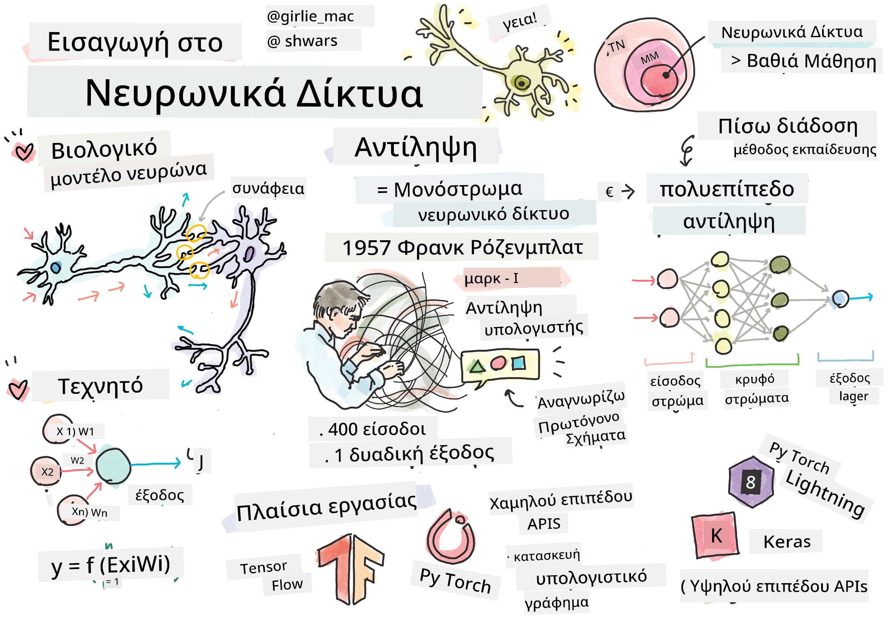
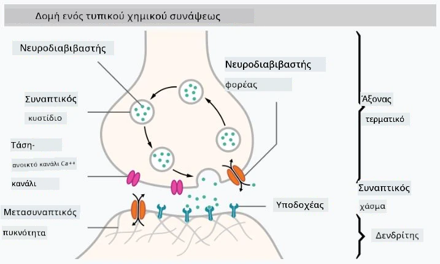

# Εισαγωγή στα Νευρωνικά Δίκτυα

Όπως συζητήσαμε στην εισαγωγή, ένας από τους τρόπους για να επιτευχθεί η νοημοσύνη είναι η εκπαίδευση ενός **μοντέλου υπολογιστή** ή ενός **τεχνητού εγκεφάλου**. Από τα μέσα του 20ού αιώνα, οι ερευνητές δοκίμασαν διάφορα μαθηματικά μοντέλα, μέχρι που τα τελευταία χρόνια αυτή η κατεύθυνση αποδείχθηκε εξαιρετικά επιτυχημένη. Αυτά τα μαθηματικά μοντέλα του εγκεφάλου ονομάζονται **νευρωνικά δίκτυα**.

> Μερικές φορές τα νευρωνικά δίκτυα ονομάζονται *Τεχνητά Νευρωνικά Δίκτυα*, ANNs, για να διευκρινιστεί ότι μιλάμε για μοντέλα και όχι για πραγματικά δίκτυα νευρώνων.

## Μηχανική Μάθηση

Τα Νευρωνικά Δίκτυα αποτελούν μέρος μιας ευρύτερης επιστήμης που ονομάζεται **Μηχανική Μάθηση**, η οποία έχει ως στόχο τη χρήση δεδομένων για την εκπαίδευση μοντέλων υπολογιστή που μπορούν να επιλύουν προβλήματα. Η Μηχανική Μάθηση αποτελεί μεγάλο μέρος της Τεχνητής Νοημοσύνης, ωστόσο, δεν καλύπτουμε την κλασική Μηχανική Μάθηση σε αυτό το πρόγραμμα σπουδών.

> Επισκεφθείτε το ξεχωριστό πρόγραμμα σπουδών **[Machine Learning for Beginners](http://github.com/microsoft/ml-for-beginners)** για να μάθετε περισσότερα σχετικά με την κλασική Μηχανική Μάθηση.

Στη Μηχανική Μάθηση, υποθέτουμε ότι έχουμε κάποιο σύνολο δεδομένων παραδειγμάτων **X** και αντίστοιχες τιμές εξόδου **Y**. Τα παραδείγματα είναι συχνά N-διάστατοι διανύσματα που αποτελούνται από **χαρακτηριστικά**, και οι έξοδοι ονομάζονται **ετικέτες**.

Θα εξετάσουμε τα δύο πιο κοινά προβλήματα της μηχανικής μάθησης:

* **Ταξινόμηση**, όπου πρέπει να ταξινομήσουμε ένα αντικείμενο εισόδου σε δύο ή περισσότερες κατηγορίες.
* **Παλινδρόμηση**, όπου πρέπει να προβλέψουμε έναν αριθμητικό αριθμό για κάθε δείγμα εισόδου.

> Όταν αναπαριστούμε τις εισόδους και τις εξόδους ως τανυστές, το σύνολο δεδομένων εισόδου είναι ένας πίνακας μεγέθους M&times;N, όπου M είναι ο αριθμός των δειγμάτων και N είναι ο αριθμός των χαρακτηριστικών. Οι ετικέτες εξόδου Y είναι ο διάνυσμα μεγέθους M.

Σε αυτό το πρόγραμμα σπουδών, θα επικεντρωθούμε μόνο σε μοντέλα νευρωνικών δικτύων.

## Ένα Μοντέλο Νευρώνα

Από τη βιολογία, γνωρίζουμε ότι ο εγκέφαλός μας αποτελείται από νευρικά κύτταρα (νευρώνες), καθένα από τα οποία έχει πολλαπλές "εισόδους" (δενδρίτες) και μία "έξοδο" (άξονα). Τόσο οι δενδρίτες όσο και οι άξονες μπορούν να μεταφέρουν ηλεκτρικά σήματα, και οι συνδέσεις μεταξύ τους — γνωστές ως συνάψεις — μπορούν να παρουσιάζουν διαφορετικούς βαθμούς αγωγιμότητας, οι οποίοι ρυθμίζονται από νευροδιαβιβαστές.

 | 
----|----
Πραγματικός Νευρώνας *([Εικόνα](https://en.wikipedia.org/wiki/Synapse#/media/File:SynapseSchematic_lines.svg) από τη Wikipedia)* | Τεχνητός Νευρώνας *(Εικόνα από τον Συγγραφέα)*

Έτσι, το απλούστερο μαθηματικό μοντέλο ενός νευρώνα περιέχει αρκετές εισόδους X1, ..., XN και μία έξοδο Y, καθώς και μια σειρά από βάρη W1, ..., WN. Η έξοδος υπολογίζεται ως:

όπου f είναι κάποια μη γραμμική **συνάρτηση ενεργοποίησης**.

> Τα πρώτα μοντέλα νευρώνα περιγράφηκαν στο κλασικό άρθρο [A logical calculus of the ideas immanent in nervous activity](https://www.cs.cmu.edu/~./epxing/Class/10715/reading/McCulloch.and.Pitts.pdf) από τους Warren McCullock και Walter Pitts το 1943. Ο Donald Hebb στο βιβλίο του "[The Organization of Behavior: A Neuropsychological Theory](https://books.google.com/books?id=VNetYrB8EBoC)" πρότεινε τον τρόπο με τον οποίο αυτά τα δίκτυα μπορούν να εκπαιδευτούν.

## Σε αυτή την Ενότητα

Σε αυτή την ενότητα θα μάθουμε για:
* [Perceptron](03-Perceptron/README.md), ένα από τα πρώτα μοντέλα νευρωνικών δικτύων για ταξινόμηση δύο κατηγοριών
* [Δίκτυα πολλαπλών επιπέδων](04-OwnFramework/README.md) με ένα συνδεδεμένο σημειωματάριο [πώς να δημιουργήσουμε το δικό μας πλαίσιο](04-OwnFramework/OwnFramework.ipynb)
* [Πλαίσια Νευρωνικών Δικτύων](05-Frameworks/README.md), με αυτά τα σημειωματάρια: [PyTorch](05-Frameworks/IntroPyTorch.ipynb) και [Keras/Tensorflow](05-Frameworks/IntroKerasTF.ipynb)
* [Υπερπροσαρμογή](../../../../lessons/3-NeuralNetworks/05-Frameworks)

---

**Αποποίηση ευθύνης**:  
Αυτό το έγγραφο έχει μεταφραστεί χρησιμοποιώντας την υπηρεσία αυτόματης μετάφρασης [Co-op Translator](https://github.com/Azure/co-op-translator). Παρόλο που καταβάλλουμε προσπάθειες για ακρίβεια, παρακαλούμε να έχετε υπόψη ότι οι αυτόματες μεταφράσεις ενδέχεται να περιέχουν σφάλματα ή ανακρίβειες. Το πρωτότυπο έγγραφο στη μητρική του γλώσσα θα πρέπει να θεωρείται η αυθεντική πηγή. Για κρίσιμες πληροφορίες, συνιστάται επαγγελματική ανθρώπινη μετάφραση. Δεν φέρουμε ευθύνη για τυχόν παρεξηγήσεις ή εσφαλμένες ερμηνείες που προκύπτουν από τη χρήση αυτής της μετάφρασης.