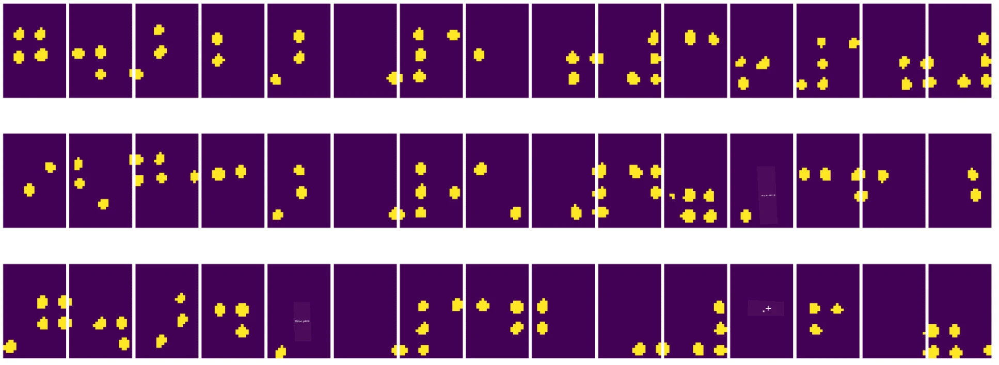
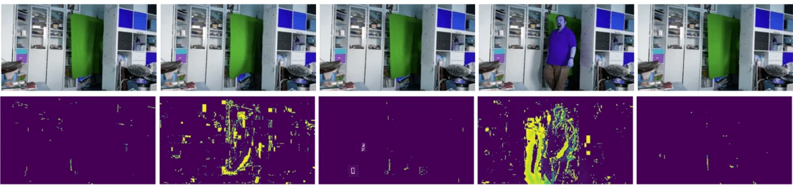

# Εισαγωγή στην Υπολογιστική Όραση

[Η Υπολογιστική Όραση](https://wikipedia.org/wiki/Computer_vision) είναι ένας τομέας που στοχεύει να επιτρέψει στους υπολογιστές να αποκτήσουν υψηλού επιπέδου κατανόηση ψηφιακών εικόνων. Αυτή είναι μια αρκετά ευρεία έννοια, καθώς η *κατανόηση* μπορεί να σημαίνει πολλά διαφορετικά πράγματα, όπως την εύρεση ενός αντικειμένου σε μια εικόνα (**ανίχνευση αντικειμένου**), την κατανόηση του τι συμβαίνει (**ανίχνευση γεγονότων**), την περιγραφή μιας εικόνας με κείμενο ή την ανακατασκευή μιας σκηνής σε 3D. Υπάρχουν επίσης ειδικές εργασίες που σχετίζονται με ανθρώπινες εικόνες: εκτίμηση ηλικίας και συναισθημάτων, ανίχνευση και αναγνώριση προσώπου, και εκτίμηση στάσης σε 3D, για να αναφέρουμε μερικές.

## [Προ-διάλεξης κουίζ](https://ff-quizzes.netlify.app/en/ai/quiz/11)

Μία από τις πιο απλές εργασίες της υπολογιστικής όρασης είναι η **ταξινόμηση εικόνων**.

Η υπολογιστική όραση συχνά θεωρείται κλάδος της Τεχνητής Νοημοσύνης. Σήμερα, οι περισσότερες εργασίες υπολογιστικής όρασης λύνονται χρησιμοποιώντας νευρωνικά δίκτυα. Θα μάθουμε περισσότερα για τον ειδικό τύπο νευρωνικών δικτύων που χρησιμοποιούνται στην υπολογιστική όραση, [συνελικτικά νευρωνικά δίκτυα](../07-ConvNets/README.md), σε αυτή την ενότητα.

Ωστόσο, πριν περάσετε την εικόνα σε ένα νευρωνικό δίκτυο, σε πολλές περιπτώσεις έχει νόημα να χρησιμοποιήσετε κάποιες αλγοριθμικές τεχνικές για να βελτιώσετε την εικόνα.

Υπάρχουν αρκετές βιβλιοθήκες Python διαθέσιμες για επεξεργασία εικόνων:

* **[imageio](https://imageio.readthedocs.io/en/stable/)** μπορεί να χρησιμοποιηθεί για ανάγνωση/εγγραφή διαφορετικών μορφών εικόνας. Υποστηρίζει επίσης το ffmpeg, ένα χρήσιμο εργαλείο για τη μετατροπή καρέ βίντεο σε εικόνες.
* **[Pillow](https://pillow.readthedocs.io/en/stable/index.html)** (γνωστό και ως PIL) είναι λίγο πιο ισχυρό και υποστηρίζει επίσης κάποιες επεξεργασίες εικόνας όπως μορφοποίηση, προσαρμογές παλέτας και άλλα.
* **[OpenCV](https://opencv.org/)** είναι μια ισχυρή βιβλιοθήκη επεξεργασίας εικόνας γραμμένη σε C++, η οποία έχει γίνει το *de facto* πρότυπο για επεξεργασία εικόνας. Διαθέτει μια βολική διεπαφή Python.
* **[dlib](http://dlib.net/)** είναι μια βιβλιοθήκη C++ που υλοποιεί πολλούς αλγορίθμους μηχανικής μάθησης, συμπεριλαμβανομένων κάποιων αλγορίθμων υπολογιστικής όρασης. Διαθέτει επίσης διεπαφή Python και μπορεί να χρησιμοποιηθεί για απαιτητικές εργασίες όπως ανίχνευση προσώπου και χαρακτηριστικών προσώπου.

## OpenCV

Το [OpenCV](https://opencv.org/) θεωρείται το *de facto* πρότυπο για επεξεργασία εικόνας. Περιέχει πολλούς χρήσιμους αλγορίθμους, υλοποιημένους σε C++. Μπορείτε να καλέσετε το OpenCV και από Python.

Ένα καλό μέρος για να μάθετε το OpenCV είναι [αυτό το μάθημα Learn OpenCV](https://learnopencv.com/getting-started-with-opencv/). Στο πρόγραμμα σπουδών μας, ο στόχος μας δεν είναι να μάθουμε το OpenCV, αλλά να σας δείξουμε μερικά παραδείγματα για το πότε μπορεί να χρησιμοποιηθεί και πώς.

### Φόρτωση Εικόνων

Οι εικόνες στην Python μπορούν να αναπαρασταθούν εύκολα με πίνακες NumPy. Για παράδειγμα, οι ασπρόμαυρες εικόνες με μέγεθος 320x200 pixels θα αποθηκεύονταν σε έναν πίνακα 200x320, και οι έγχρωμες εικόνες της ίδιας διάστασης θα είχαν σχήμα 200x320x3 (για 3 κανάλια χρώματος). Για να φορτώσετε μια εικόνα, μπορείτε να χρησιμοποιήσετε τον παρακάτω κώδικα:

```python
import cv2
import matplotlib.pyplot as plt

im = cv2.imread('image.jpeg')
plt.imshow(im)
```

Παραδοσιακά, το OpenCV χρησιμοποιεί την κωδικοποίηση BGR (Μπλε-Πράσινο-Κόκκινο) για έγχρωμες εικόνες, ενώ τα υπόλοιπα εργαλεία Python χρησιμοποιούν την πιο παραδοσιακή RGB (Κόκκινο-Πράσινο-Μπλε). Για να φαίνεται σωστά η εικόνα, πρέπει να την μετατρέψετε στον χρωματικό χώρο RGB, είτε αλλάζοντας τις διαστάσεις στον πίνακα NumPy, είτε καλώντας μια συνάρτηση του OpenCV:

```python
im = cv2.cvtColor(im,cv2.COLOR_BGR2RGB)
```

Η ίδια συνάρτηση `cvtColor` μπορεί να χρησιμοποιηθεί για να εκτελέσει άλλες μετατροπές χρωματικού χώρου, όπως η μετατροπή μιας εικόνας σε ασπρόμαυρη ή στον χρωματικό χώρο HSV (Απόχρωση-Κορεσμός-Τιμή).

Μπορείτε επίσης να χρησιμοποιήσετε το OpenCV για να φορτώσετε βίντεο καρέ-καρέ - ένα παράδειγμα δίνεται στην άσκηση [OpenCV Notebook](OpenCV.ipynb).

### Επεξεργασία Εικόνων

Πριν δώσετε μια εικόνα σε ένα νευρωνικό δίκτυο, ίσως θέλετε να εφαρμόσετε αρκετά βήματα προεπεξεργασίας. Το OpenCV μπορεί να κάνει πολλά πράγματα, όπως:

* **Αλλαγή μεγέθους** της εικόνας χρησιμοποιώντας `im = cv2.resize(im, (320,200),interpolation=cv2.INTER_LANCZOS)`
* **Θόλωση** της εικόνας χρησιμοποιώντας `im = cv2.medianBlur(im,3)` ή `im = cv2.GaussianBlur(im, (3,3), 0)`
* Αλλαγή της **φωτεινότητας και αντίθεσης** της εικόνας μπορεί να γίνει με χειρισμούς πινάκων NumPy, όπως περιγράφεται [σε αυτή τη σημείωση του Stackoverflow](https://stackoverflow.com/questions/39308030/how-do-i-increase-the-contrast-of-an-image-in-python-opencv).
* Χρήση [κατωφλίωσης](https://docs.opencv.org/4.x/d7/d4d/tutorial_py_thresholding.html) καλώντας τις συναρτήσεις `cv2.threshold`/`cv2.adaptiveThreshold`, που συχνά προτιμάται από την προσαρμογή φωτεινότητας ή αντίθεσης.
* Εφαρμογή διαφορετικών [μετασχηματισμών](https://docs.opencv.org/4.5.5/da/d6e/tutorial_py_geometric_transformations.html) στην εικόνα:
    - **[Αφινικοί μετασχηματισμοί](https://docs.opencv.org/4.5.5/d4/d61/tutorial_warp_affine.html)** μπορεί να είναι χρήσιμοι αν χρειάζεται να συνδυάσετε περιστροφή, αλλαγή μεγέθους και παραμόρφωση στην εικόνα και γνωρίζετε την αρχική και τελική θέση τριών σημείων στην εικόνα. Οι αφινικοί μετασχηματισμοί διατηρούν τις παράλληλες γραμμές παράλληλες.
    - **[Μετασχηματισμοί προοπτικής](https://medium.com/analytics-vidhya/opencv-perspective-transformation-9edffefb2143)** μπορεί να είναι χρήσιμοι όταν γνωρίζετε τις αρχικές και τελικές θέσεις τεσσάρων σημείων στην εικόνα. Για παράδειγμα, αν τραβήξετε μια φωτογραφία ενός ορθογώνιου εγγράφου μέσω της κάμερας ενός smartphone από κάποια γωνία και θέλετε να δημιουργήσετε μια ορθογώνια εικόνα του εγγράφου.
* Κατανόηση της κίνησης μέσα στην εικόνα χρησιμοποιώντας **[οπτική ροή](https://docs.opencv.org/4.5.5/d4/dee/tutorial_optical_flow.html)**.

## Παραδείγματα χρήσης της Υπολογιστικής Όρασης

Στο [OpenCV Notebook](OpenCV.ipynb), δίνουμε μερικά παραδείγματα για το πότε μπορεί να χρησιμοποιηθεί η υπολογιστική όραση για την εκτέλεση συγκεκριμένων εργασιών:

* **Προεπεξεργασία μιας φωτογραφίας ενός βιβλίου Braille**. Εστιάζουμε στο πώς μπορούμε να χρησιμοποιήσουμε την κατωφλίωση, την ανίχνευση χαρακτηριστικών, τον μετασχηματισμό προοπτικής και τους χειρισμούς NumPy για να διαχωρίσουμε μεμονωμένα σύμβολα Braille για περαιτέρω ταξινόμηση από ένα νευρωνικό δίκτυο.

 |  | 
----|-----|-----

> Εικόνα από [OpenCV.ipynb](OpenCV.ipynb)

* **Ανίχνευση κίνησης σε βίντεο χρησιμοποιώντας διαφορά καρέ**. Αν η κάμερα είναι σταθερή, τότε τα καρέ από τη ροή της κάμερας θα πρέπει να είναι αρκετά παρόμοια μεταξύ τους. Επειδή τα καρέ αναπαρίστανται ως πίνακες, απλώς αφαιρώντας αυτούς τους πίνακες για δύο διαδοχικά καρέ θα πάρουμε τη διαφορά των pixels, η οποία θα πρέπει να είναι χαμηλή για στατικά καρέ και να αυξάνεται όταν υπάρχει σημαντική κίνηση στην εικόνα.



> Εικόνα από [OpenCV.ipynb](OpenCV.ipynb)

* **Ανίχνευση κίνησης χρησιμοποιώντας Οπτική Ροή**. Η [οπτική ροή](https://docs.opencv.org/3.4/d4/dee/tutorial_optical_flow.html) μας επιτρέπει να κατανοήσουμε πώς κινούνται μεμονωμένα pixels στα καρέ βίντεο. Υπάρχουν δύο τύποι οπτικής ροής:

   - **Πυκνή Οπτική Ροή** υπολογίζει το πεδίο διανυσμάτων που δείχνει για κάθε pixel πού κινείται
   - **Αραιή Οπτική Ροή** βασίζεται στη λήψη κάποιων χαρακτηριστικών στην εικόνα (π.χ. άκρες) και στην κατασκευή της τροχιάς τους από καρέ σε καρέ.


> Εικόνα από [OpenCV.ipynb](OpenCV.ipynb)

## ✍️ Παράδειγμα Σημειωματάρια: OpenCV [δοκιμάστε το OpenCV σε δράση](OpenCV.ipynb)

Ας κάνουμε μερικά πειράματα με το OpenCV εξερευνώντας το [OpenCV Notebook](OpenCV.ipynb)

## Συμπέρασμα

Μερικές φορές, σχετικά σύνθετες εργασίες όπως η ανίχνευση κίνησης ή η ανίχνευση άκρων δακτύλων μπορούν να λυθούν αποκλειστικά μέσω υπολογιστικής όρασης. Επομένως, είναι πολύ χρήσιμο να γνωρίζετε τις βασικές τεχνικές της υπολογιστικής όρασης και τι μπορούν να κάνουν βιβλιοθήκες όπως το OpenCV.

## 🚀 Πρόκληση

Παρακολουθήστε [αυτό το βίντεο](https://docs.microsoft.com/shows/ai-show/ai-show--2021-opencv-ai-competition--grand-prize-winners--cortic-tigers--episode-32?WT.mc_id=academic-77998-cacaste) από το AI show για να μάθετε για το έργο Cortic Tigers και πώς δημιούργησαν μια λύση βασισμένη σε μπλοκ για να εκδημοκρατίσουν τις εργασίες υπολογιστικής όρασης μέσω ενός ρομπότ. Κάντε έρευνα για άλλα παρόμοια έργα που βοηθούν νέους μαθητές να εισέλθουν στον τομέα.

## [Μετά-διάλεξης κουίζ](https://ff-quizzes.netlify.app/en/ai/quiz/12)

## Ανασκόπηση & Αυτομελέτη

Διαβάστε περισσότερα για την οπτική ροή [σε αυτό το εξαιρετικό σεμινάριο](https://learnopencv.com/optical-flow-in-opencv/).

## [Εργασία](lab/README.md)

Σε αυτό το εργαστήριο, θα τραβήξετε ένα βίντεο με απλές χειρονομίες, και ο στόχος σας είναι να εξάγετε κινήσεις πάνω/κάτω/αριστερά/δεξιά χρησιμοποιώντας οπτική ροή.


---

