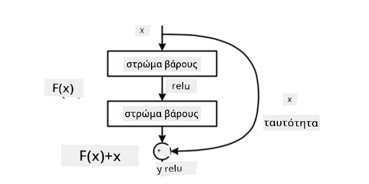
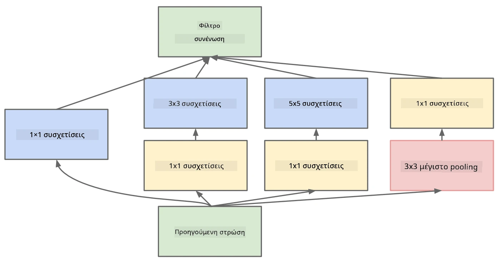

# Γνωστές Αρχιτεκτονικές CNN

### VGG-16

Το VGG-16 είναι ένα δίκτυο που πέτυχε ακρίβεια 92.7% στην ταξινόμηση top-5 του ImageNet το 2014. Έχει την εξής δομή στρώσεων:

Όπως μπορείτε να δείτε, το VGG ακολουθεί μια παραδοσιακή πυραμιδική αρχιτεκτονική, η οποία είναι μια ακολουθία από στρώσεις συνελικτικής και pooling.

> Εικόνα από [Researchgate](https://www.researchgate.net/figure/Vgg16-model-structure-To-get-the-VGG-NIN-model-we-replace-the-2-nd-4-th-6-th-7-th_fig2_335194493)

### ResNet

Το ResNet είναι μια οικογένεια μοντέλων που προτάθηκε από τη Microsoft Research το 2015. Η βασική ιδέα του ResNet είναι η χρήση **residual blocks**:

> Εικόνα από [αυτό το άρθρο](https://arxiv.org/pdf/1512.03385.pdf)

Ο λόγος για τη χρήση της ταυτότητας pass-through είναι να προβλέπει η στρώση **τη διαφορά** μεταξύ του αποτελέσματος της προηγούμενης στρώσης και της εξόδου του residual block - εξού και το όνομα *residual*. Αυτά τα blocks είναι πολύ πιο εύκολα να εκπαιδευτούν, και μπορεί κανείς να κατασκευάσει δίκτυα με εκατοντάδες από αυτά τα blocks (οι πιο συνηθισμένες παραλλαγές είναι ResNet-52, ResNet-101 και ResNet-152).

Μπορείτε επίσης να σκεφτείτε αυτό το δίκτυο ως ένα δίκτυο που προσαρμόζει την πολυπλοκότητά του στο dataset. Αρχικά, όταν ξεκινάτε την εκπαίδευση του δικτύου, οι τιμές των βαρών είναι μικρές, και το μεγαλύτερο μέρος του σήματος περνάει μέσω των στρώσεων ταυτότητας. Καθώς η εκπαίδευση προχωρά και οι τιμές των βαρών μεγαλώνουν, η σημασία των παραμέτρων του δικτύου αυξάνεται, και το δίκτυο προσαρμόζεται για να αποκτήσει την απαιτούμενη εκφραστική δύναμη ώστε να ταξινομήσει σωστά τις εικόνες εκπαίδευσης.

### Google Inception

Η αρχιτεκτονική Google Inception προχωρά αυτή την ιδέα ένα βήμα παραπέρα, και κατασκευάζει κάθε στρώση του δικτύου ως συνδυασμό πολλών διαφορετικών διαδρομών:

> Εικόνα από [Researchgate](https://www.researchgate.net/figure/Inception-module-with-dimension-reductions-left-and-schema-for-Inception-ResNet-v1_fig2_355547454)

Εδώ, πρέπει να τονίσουμε τον ρόλο των συνελικτικών 1x1, γιατί αρχικά δεν φαίνεται να έχουν νόημα. Γιατί να χρειαστεί να περάσουμε την εικόνα με φίλτρο 1x1; Ωστόσο, πρέπει να θυμάστε ότι τα φίλτρα συνελικτικής λειτουργούν επίσης με πολλά κανάλια βάθους (αρχικά - χρώματα RGB, σε επόμενες στρώσεις - κανάλια για διαφορετικά φίλτρα), και η συνελικτική 1x1 χρησιμοποιείται για να συνδυάσει αυτά τα κανάλια εισόδου χρησιμοποιώντας διαφορετικά εκπαιδεύσιμα βάρη. Μπορεί επίσης να θεωρηθεί ως downsampling (pooling) στη διάσταση των καναλιών.

Εδώ είναι [ένα καλό blog post](https://medium.com/analytics-vidhya/talented-mr-1x1-comprehensive-look-at-1x1-convolution-in-deep-learning-f6b355825578) για το θέμα, και [το αρχικό άρθρο](https://arxiv.org/pdf/1312.4400.pdf).

### MobileNet

Το MobileNet είναι μια οικογένεια μοντέλων με μειωμένο μέγεθος, κατάλληλα για κινητές συσκευές. Χρησιμοποιήστε τα αν έχετε περιορισμένους πόρους και μπορείτε να θυσιάσετε λίγη ακρίβεια. Η βασική ιδέα πίσω από αυτά είναι η λεγόμενη **depthwise separable convolution**, η οποία επιτρέπει την αναπαράσταση φίλτρων συνελικτικής μέσω μιας σύνθεσης χωρικών συνελικτικών και συνελικτικής 1x1 πάνω στα κανάλια βάθους. Αυτό μειώνει σημαντικά τον αριθμό των παραμέτρων, κάνοντας το δίκτυο μικρότερο σε μέγεθος, και επίσης πιο εύκολο να εκπαιδευτεί με λιγότερα δεδομένα.

Εδώ είναι [ένα καλό blog post για το MobileNet](https://medium.com/analytics-vidhya/image-classification-with-mobilenet-cc6fbb2cd470).

## Συμπέρασμα

Σε αυτή την ενότητα, μάθατε την κύρια ιδέα πίσω από τα νευρωνικά δίκτυα για υπολογιστική όραση - τα συνελικτικά δίκτυα. Οι αρχιτεκτονικές πραγματικού κόσμου που υποστηρίζουν την ταξινόμηση εικόνων, την ανίχνευση αντικειμένων, και ακόμη και τα δίκτυα δημιουργίας εικόνων βασίζονται όλα σε CNNs, απλώς με περισσότερες στρώσεις και μερικά επιπλέον κόλπα εκπαίδευσης.

## 🚀 Πρόκληση

Στα συνοδευτικά notebooks, υπάρχουν σημειώσεις στο κάτω μέρος σχετικά με το πώς να επιτύχετε μεγαλύτερη ακρίβεια. Κάντε μερικά πειράματα για να δείτε αν μπορείτε να πετύχετε υψηλότερη ακρίβεια.

## [Κουίζ μετά το μάθημα](https://ff-quizzes.netlify.app/en/ai/quiz/14)

## Ανασκόπηση & Αυτομελέτη

Ενώ τα CNNs χρησιμοποιούνται πιο συχνά για εργασίες Υπολογιστικής Όρασης, είναι γενικά καλά για την εξαγωγή μοτίβων σταθερού μεγέθους. Για παράδειγμα, αν ασχολούμαστε με ήχους, μπορεί επίσης να θέλουμε να χρησιμοποιήσουμε CNNs για να εντοπίσουμε συγκεκριμένα μοτίβα στο ηχητικό σήμα - σε αυτή την περίπτωση τα φίλτρα θα ήταν μονοδιάστατα (και αυτό το CNN θα ονομαζόταν 1D-CNN). Επίσης, μερικές φορές χρησιμοποιείται 3D-CNN για την εξαγωγή χαρακτηριστικών σε πολυδιάστατο χώρο, όπως ορισμένα γεγονότα που συμβαίνουν σε βίντεο - το CNN μπορεί να καταγράψει ορισμένα μοτίβα αλλαγής χαρακτηριστικών με την πάροδο του χρόνου. Κάντε μια ανασκόπηση και αυτομελέτη για άλλες εργασίες που μπορούν να γίνουν με CNNs.

## [Εργασία](lab/README.md)

Σε αυτό το εργαστήριο, σας ανατίθεται η ταξινόμηση διαφορετικών φυλών γατών και σκύλων. Αυτές οι εικόνες είναι πιο σύνθετες από το dataset MNIST και έχουν υψηλότερες διαστάσεις, και υπάρχουν περισσότερες από 10 κατηγορίες.

---

