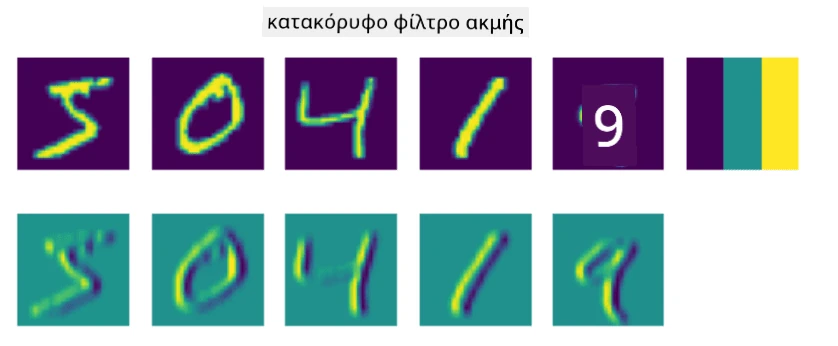
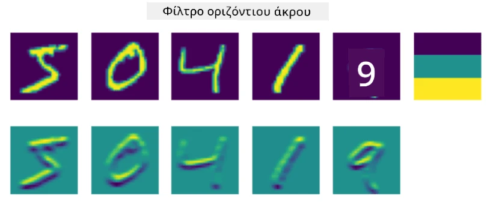
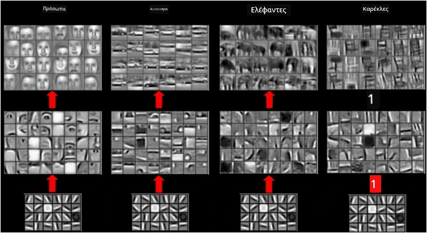
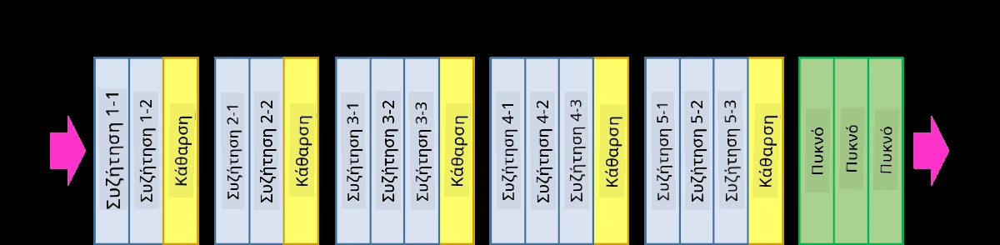

# Συνελικτικά Νευρωνικά Δίκτυα

Έχουμε δει προηγουμένως ότι τα νευρωνικά δίκτυα είναι αρκετά καλά στην επεξεργασία εικόνων, και ακόμη και ένα perceptron με μία μόνο στρώση μπορεί να αναγνωρίσει χειρόγραφα ψηφία από το σύνολο δεδομένων MNIST με ικανοποιητική ακρίβεια. Ωστόσο, το σύνολο δεδομένων MNIST είναι πολύ ιδιαίτερο, καθώς όλα τα ψηφία είναι κεντραρισμένα μέσα στην εικόνα, γεγονός που απλοποιεί την εργασία.

## [Προ-διάλεξη κουίζ](https://ff-quizzes.netlify.app/en/ai/quiz/13)

Στην πραγματική ζωή, θέλουμε να μπορούμε να αναγνωρίζουμε αντικείμενα σε μια εικόνα ανεξάρτητα από την ακριβή τους θέση μέσα σε αυτή. Η υπολογιστική όραση διαφέρει από τη γενική ταξινόμηση, επειδή όταν προσπαθούμε να βρούμε ένα συγκεκριμένο αντικείμενο στην εικόνα, σαρώνουμε την εικόνα αναζητώντας συγκεκριμένα **μοτίβα** και τους συνδυασμούς τους. Για παράδειγμα, όταν ψάχνουμε για μια γάτα, μπορεί πρώτα να αναζητήσουμε οριζόντιες γραμμές που σχηματίζουν μουστάκια, και στη συνέχεια ένας συγκεκριμένος συνδυασμός μουστακιών μπορεί να μας δείξει ότι πρόκειται για εικόνα γάτας. Η σχετική θέση και η παρουσία συγκεκριμένων μοτίβων είναι σημαντική, και όχι η ακριβής τους θέση στην εικόνα.

Για να εξάγουμε μοτίβα, θα χρησιμοποιήσουμε την έννοια των **συνελικτικών φίλτρων**. Όπως γνωρίζετε, μια εικόνα αναπαρίσταται από έναν δισδιάστατο πίνακα ή έναν τρισδιάστατο τανυστή με βάθος χρώματος. Η εφαρμογή ενός φίλτρου σημαίνει ότι παίρνουμε έναν σχετικά μικρό πίνακα **πυρήνα φίλτρου**, και για κάθε pixel στην αρχική εικόνα υπολογίζουμε τον σταθμισμένο μέσο όρο με τα γειτονικά σημεία. Μπορούμε να το δούμε σαν ένα μικρό παράθυρο που γλιστρά πάνω από ολόκληρη την εικόνα, και εξομαλύνει όλα τα pixel σύμφωνα με τα βάρη στον πίνακα πυρήνα φίλτρου.

 | 
----|----

> Εικόνα από τον Dmitry Soshnikov

Για παράδειγμα, αν εφαρμόσουμε φίλτρα κάθετης και οριζόντιας άκρης 3x3 στα ψηφία του MNIST, μπορούμε να πάρουμε επισημάνσεις (π.χ. υψηλές τιμές) όπου υπάρχουν κάθετες και οριζόντιες άκρες στην αρχική μας εικόνα. Έτσι, αυτά τα δύο φίλτρα μπορούν να χρησιμοποιηθούν για να "αναζητήσουν" άκρες. Παρομοίως, μπορούμε να σχεδιάσουμε διαφορετικά φίλτρα για να αναζητήσουμε άλλα μοτίβα χαμηλού επιπέδου:

> Εικόνα από [Leung-Malik Filter Bank](https://www.robots.ox.ac.uk/~vgg/research/texclass/filters.html)

Ωστόσο, ενώ μπορούμε να σχεδιάσουμε φίλτρα για να εξάγουμε κάποια μοτίβα χειροκίνητα, μπορούμε επίσης να σχεδιάσουμε το δίκτυο με τέτοιο τρόπο ώστε να μάθει τα μοτίβα αυτόματα. Αυτή είναι μία από τις βασικές ιδέες πίσω από τα CNN.

## Βασικές ιδέες πίσω από τα CNN

Ο τρόπος λειτουργίας των CNN βασίζεται στις εξής σημαντικές ιδέες:

* Τα συνελικτικά φίλτρα μπορούν να εξάγουν μοτίβα
* Μπορούμε να σχεδιάσουμε το δίκτυο με τέτοιο τρόπο ώστε τα φίλτρα να εκπαιδεύονται αυτόματα
* Μπορούμε να χρησιμοποιήσουμε την ίδια προσέγγιση για να βρούμε μοτίβα σε χαρακτηριστικά υψηλού επιπέδου, όχι μόνο στην αρχική εικόνα. Έτσι, η εξαγωγή χαρακτηριστικών από τα CNN λειτουργεί σε μια ιεραρχία χαρακτηριστικών, ξεκινώντας από συνδυασμούς pixel χαμηλού επιπέδου, μέχρι συνδυασμούς υψηλότερου επιπέδου τμημάτων της εικόνας.

> Εικόνα από [μια εργασία των Hislop-Lynch](https://www.semanticscholar.org/paper/Computer-vision-based-pedestrian-trajectory-Hislop-Lynch/26e6f74853fc9bbb7487b06dc2cf095d36c9021d), βασισμένη στην [έρευνά τους](https://dl.acm.org/doi/abs/10.1145/1553374.1553453)

## ✍️ Ασκήσεις: Συνελικτικά Νευρωνικά Δίκτυα

Ας συνεχίσουμε να εξερευνούμε πώς λειτουργούν τα συνελικτικά νευρωνικά δίκτυα και πώς μπορούμε να επιτύχουμε εκπαιδεύσιμα φίλτρα, δουλεύοντας μέσα από τα αντίστοιχα notebooks:

* [Convolutional Neural Networks - PyTorch](ConvNetsPyTorch.ipynb)
* [Convolutional Neural Networks - TensorFlow](ConvNetsTF.ipynb)

## Αρχιτεκτονική Πυραμίδας

Τα περισσότερα CNN που χρησιμοποιούνται για επεξεργασία εικόνας ακολουθούν τη λεγόμενη αρχιτεκτονική πυραμίδας. Η πρώτη συνελικτική στρώση που εφαρμόζεται στις αρχικές εικόνες συνήθως έχει σχετικά μικρό αριθμό φίλτρων (8-16), που αντιστοιχούν σε διαφορετικούς συνδυασμούς pixel, όπως οριζόντιες/κάθετες γραμμές ή strokes. Στο επόμενο επίπεδο, μειώνουμε τη χωρική διάσταση του δικτύου και αυξάνουμε τον αριθμό των φίλτρων, που αντιστοιχούν σε περισσότερους πιθανούς συνδυασμούς απλών χαρακτηριστικών. Με κάθε στρώση, καθώς προχωράμε προς τον τελικό ταξινομητή, οι χωρικές διαστάσεις της εικόνας μειώνονται και ο αριθμός των φίλτρων αυξάνεται.

Ως παράδειγμα, ας δούμε την αρχιτεκτονική του VGG-16, ενός δικτύου που πέτυχε ακρίβεια 92.7% στην ταξινόμηση top-5 του ImageNet το 2014:

> Εικόνα από [Researchgate](https://www.researchgate.net/figure/Vgg16-model-structure-To-get-the-VGG-NIN-model-we-replace-the-2-nd-4-th-6-th-7-th_fig2_335194493)

## Γνωστές Αρχιτεκτονικές CNN

[Συνεχίστε τη μελέτη σας για τις γνωστές αρχιτεκτονικές CNN](CNN_Architectures.md)

---

