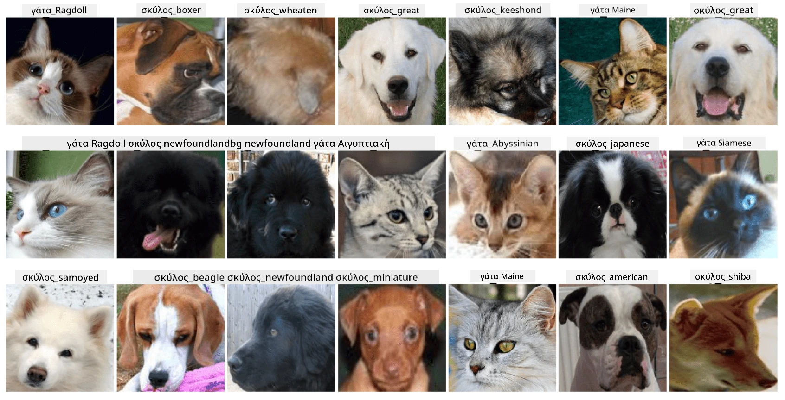

# Ταξινόμηση Προσώπων Κατοικίδιων

Εργαστηριακή Άσκηση από το [Πρόγραμμα Σπουδών AI για Αρχάριους](https://github.com/microsoft/ai-for-beginners).

## Εργασία

Φανταστείτε ότι πρέπει να αναπτύξετε μια εφαρμογή για ένα βρεφονηπιακό σταθμό κατοικίδιων για την καταγραφή όλων των κατοικίδιων. Ένα από τα εξαιρετικά χαρακτηριστικά μιας τέτοιας εφαρμογής θα ήταν η αυτόματη αναγνώριση της φυλής από μια φωτογραφία. Αυτό μπορεί να επιτευχθεί με επιτυχία χρησιμοποιώντας νευρωνικά δίκτυα.

Πρέπει να εκπαιδεύσετε ένα συνελικτικό νευρωνικό δίκτυο για να ταξινομήσετε διαφορετικές φυλές γατών και σκύλων χρησιμοποιώντας το σύνολο δεδομένων **Pet Faces**.

## Το Σύνολο Δεδομένων

Θα χρησιμοποιήσουμε το [Oxford-IIIT Pet Dataset](https://www.robots.ox.ac.uk/~vgg/data/pets/), το οποίο περιέχει εικόνες από 37 διαφορετικές φυλές σκύλων και γατών.



Για να κατεβάσετε το σύνολο δεδομένων, χρησιμοποιήστε αυτό το απόσπασμα κώδικα:

```python
!wget https://thor.robots.ox.ac.uk/~vgg/data/pets/images.tar.gz
!tar xfz images.tar.gz
!rm images.tar.gz
```

**Σημείωση:** Οι εικόνες του Oxford-IIIT Pet Dataset είναι οργανωμένες ανά όνομα αρχείου (π.χ., `Abyssinian_1.jpg`, `Bengal_2.jpg`). Το notebook περιλαμβάνει κώδικα για την οργάνωση αυτών των εικόνων σε υποκαταλόγους ανά φυλή για ευκολότερη ταξινόμηση.

## Ξεκινώντας το Notebook

Ξεκινήστε το εργαστήριο ανοίγοντας το [PetFaces.ipynb](PetFaces.ipynb)

## Συμπέρασμα

Έχετε λύσει ένα σχετικά πολύπλοκο πρόβλημα ταξινόμησης εικόνων από το μηδέν! Υπήρχαν αρκετές κατηγορίες, και παρόλα αυτά καταφέρατε να πετύχετε μια ικανοποιητική ακρίβεια! Επίσης, έχει νόημα να μετρήσετε την ακρίβεια top-k, επειδή είναι εύκολο να μπερδευτούν ορισμένες κατηγορίες που δεν είναι ξεκάθαρα διαφορετικές ακόμα και για τους ανθρώπους.

---

**Αποποίηση ευθύνης**:  
Αυτό το έγγραφο έχει μεταφραστεί χρησιμοποιώντας την υπηρεσία αυτόματης μετάφρασης [Co-op Translator](https://github.com/Azure/co-op-translator). Παρόλο που καταβάλλουμε προσπάθειες για ακρίβεια, παρακαλούμε να έχετε υπόψη ότι οι αυτόματες μεταφράσεις ενδέχεται να περιέχουν λάθη ή ανακρίβειες. Το πρωτότυπο έγγραφο στη μητρική του γλώσσα θα πρέπει να θεωρείται η αυθεντική πηγή. Για κρίσιμες πληροφορίες, συνιστάται επαγγελματική ανθρώπινη μετάφραση. Δεν φέρουμε ευθύνη για τυχόν παρεξηγήσεις ή εσφαλμένες ερμηνείες που προκύπτουν από τη χρήση αυτής της μετάφρασης.