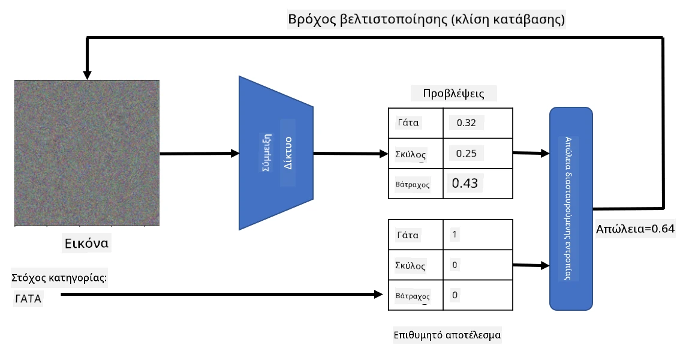

# Προεκπαιδευμένα Δίκτυα και Μεταφορά Μάθησης

Η εκπαίδευση CNNs μπορεί να απαιτήσει πολύ χρόνο και μεγάλο όγκο δεδομένων. Ωστόσο, μεγάλο μέρος του χρόνου δαπανάται για την εκμάθηση των καλύτερων φίλτρων χαμηλού επιπέδου που μπορεί να χρησιμοποιήσει ένα δίκτυο για να εξάγει μοτίβα από εικόνες. Ένα φυσικό ερώτημα που προκύπτει είναι: μπορούμε να χρησιμοποιήσουμε ένα νευρωνικό δίκτυο που έχει εκπαιδευτεί σε ένα σύνολο δεδομένων και να το προσαρμόσουμε για να ταξινομήσει διαφορετικές εικόνες χωρίς να απαιτείται πλήρης διαδικασία εκπαίδευσης;

## [Προ-διάλεξης κουίζ](https://ff-quizzes.netlify.app/en/ai/quiz/15)

Αυτή η προσέγγιση ονομάζεται **μεταφορά μάθησης** (transfer learning), επειδή μεταφέρουμε κάποια γνώση από ένα μοντέλο νευρωνικού δικτύου σε ένα άλλο. Στη μεταφορά μάθησης, συνήθως ξεκινάμε με ένα προεκπαιδευμένο μοντέλο, το οποίο έχει εκπαιδευτεί σε ένα μεγάλο σύνολο δεδομένων εικόνων, όπως το **ImageNet**. Αυτά τα μοντέλα μπορούν ήδη να εξάγουν διαφορετικά χαρακτηριστικά από γενικές εικόνες, και σε πολλές περιπτώσεις, η απλή δημιουργία ενός ταξινομητή πάνω από αυτά τα εξαγόμενα χαρακτηριστικά μπορεί να αποδώσει καλά αποτελέσματα.

> ✅ Η Μεταφορά Μάθησης είναι ένας όρος που συναντάται και σε άλλους ακαδημαϊκούς τομείς, όπως η Εκπαίδευση. Αναφέρεται στη διαδικασία λήψης γνώσης από έναν τομέα και εφαρμογής της σε έναν άλλο.

## Προεκπαιδευμένα Μοντέλα ως Εξαγωγείς Χαρακτηριστικών

Τα συνελικτικά δίκτυα που αναφέραμε στην προηγούμενη ενότητα περιείχαν έναν αριθμό επιπέδων, καθένα από τα οποία υποτίθεται ότι εξάγει κάποια χαρακτηριστικά από την εικόνα, ξεκινώντας από συνδυασμούς χαμηλού επιπέδου εικονοστοιχείων (όπως οριζόντιες/κάθετες γραμμές ή καμπύλες), μέχρι συνδυασμούς υψηλότερου επιπέδου χαρακτηριστικών, που αντιστοιχούν σε πράγματα όπως το μάτι μιας φλόγας. Εάν εκπαιδεύσουμε ένα CNN σε ένα επαρκώς μεγάλο σύνολο δεδομένων γενικών και ποικίλων εικόνων, το δίκτυο θα πρέπει να μάθει να εξάγει αυτά τα κοινά χαρακτηριστικά.

Τόσο το Keras όσο και το PyTorch περιέχουν συναρτήσεις για εύκολη φόρτωση προεκπαιδευμένων βαρών νευρωνικών δικτύων για κάποιες κοινές αρχιτεκτονικές, οι περισσότερες από τις οποίες έχουν εκπαιδευτεί σε εικόνες ImageNet. Οι πιο συχνά χρησιμοποιούμενες περιγράφονται στη σελίδα [Αρχιτεκτονικές CNN](../07-ConvNets/CNN_Architectures.md) από το προηγούμενο μάθημα. Συγκεκριμένα, μπορείτε να εξετάσετε τη χρήση ενός από τα παρακάτω:

* **VGG-16/VGG-19**, που είναι σχετικά απλά μοντέλα και προσφέρουν καλή ακρίβεια. Συχνά, η χρήση του VGG ως πρώτη προσπάθεια είναι μια καλή επιλογή για να δείτε πώς λειτουργεί η μεταφορά μάθησης.
* **ResNet**, μια οικογένεια μοντέλων που προτάθηκε από τη Microsoft Research το 2015. Έχουν περισσότερα επίπεδα και, επομένως, απαιτούν περισσότερους πόρους.
* **MobileNet**, μια οικογένεια μοντέλων με μειωμένο μέγεθος, κατάλληλα για κινητές συσκευές. Χρησιμοποιήστε τα αν έχετε περιορισμένους πόρους και μπορείτε να θυσιάσετε λίγη ακρίβεια.

Ακολουθούν δείγματα χαρακτηριστικών που εξήχθησαν από μια εικόνα γάτας από το δίκτυο VGG-16:

## Σύνολο Δεδομένων Γάτες vs. Σκύλοι

Σε αυτό το παράδειγμα, θα χρησιμοποιήσουμε ένα σύνολο δεδομένων [Γάτες και Σκύλοι](https://www.microsoft.com/download/details.aspx?id=54765&WT.mc_id=academic-77998-cacaste), το οποίο είναι πολύ κοντά σε ένα σενάριο ταξινόμησης εικόνων από την πραγματική ζωή.

## ✍️ Άσκηση: Μεταφορά Μάθησης

Ας δούμε τη μεταφορά μάθησης σε δράση στα αντίστοιχα notebooks:

* [Μεταφορά Μάθησης - PyTorch](TransferLearningPyTorch.ipynb)
* [Μεταφορά Μάθησης - TensorFlow](TransferLearningTF.ipynb)

## Οπτικοποίηση Αντιφατικής Γάτας

Ένα προεκπαιδευμένο νευρωνικό δίκτυο περιέχει διάφορα μοτίβα μέσα στον "εγκέφαλό" του, συμπεριλαμβανομένων εννοιών όπως η **ιδανική γάτα** (καθώς και ο ιδανικός σκύλος, η ιδανική ζέβρα κ.λπ.). Θα ήταν ενδιαφέρον να **οπτικοποιήσουμε αυτή την εικόνα**. Ωστόσο, αυτό δεν είναι απλό, επειδή τα μοτίβα είναι διασκορπισμένα σε όλο το βάρος του δικτύου και οργανωμένα σε ιεραρχική δομή.

Μια προσέγγιση που μπορούμε να ακολουθήσουμε είναι να ξεκινήσουμε με μια τυχαία εικόνα και στη συνέχεια να χρησιμοποιήσουμε την τεχνική **βελτιστοποίησης καθοδικής κλίσης** για να προσαρμόσουμε αυτή την εικόνα με τέτοιο τρόπο ώστε το δίκτυο να αρχίσει να πιστεύει ότι είναι γάτα.

Ωστόσο, αν το κάνουμε αυτό, θα λάβουμε κάτι που μοιάζει πολύ με τυχαίο θόρυβο. Αυτό συμβαίνει επειδή *υπάρχουν πολλοί τρόποι να κάνουμε το δίκτυο να πιστέψει ότι η είσοδος είναι γάτα*, συμπεριλαμβανομένων κάποιων που δεν έχουν οπτική λογική. Ενώ αυτές οι εικόνες περιέχουν πολλά μοτίβα τυπικά για μια γάτα, δεν υπάρχει τίποτα που να τις περιορίζει να είναι οπτικά διακριτές.

Για να βελτιώσουμε το αποτέλεσμα, μπορούμε να προσθέσουμε έναν άλλο όρο στη συνάρτηση απώλειας, που ονομάζεται **απώλεια παραλλαγής**. Είναι μια μετρική που δείχνει πόσο παρόμοια είναι τα γειτονικά εικονοστοιχεία της εικόνας. Ελαχιστοποιώντας την απώλεια παραλλαγής, η εικόνα γίνεται πιο ομαλή και απαλλάσσεται από τον θόρυβο - αποκαλύπτοντας έτσι πιο οπτικά ελκυστικά μοτίβα. Εδώ είναι ένα παράδειγμα τέτοιων "ιδανικών" εικόνων, που ταξινομούνται ως γάτα και ως ζέβρα με υψηλή πιθανότητα:

 | 
-----|-----
*Ιδανική Γάτα* | *Ιδανική Ζέβρα*

Παρόμοια προσέγγιση μπορεί να χρησιμοποιηθεί για την εκτέλεση των λεγόμενων **αντιφατικών επιθέσεων** σε ένα νευρωνικό δίκτυο. Ας υποθέσουμε ότι θέλουμε να ξεγελάσουμε ένα νευρωνικό δίκτυο και να κάνουμε έναν σκύλο να μοιάζει με γάτα. Αν πάρουμε την εικόνα ενός σκύλου, που αναγνωρίζεται από το δίκτυο ως σκύλος, μπορούμε στη συνέχεια να την τροποποιήσουμε λίγο χρησιμοποιώντας τη βελτιστοποίηση καθοδικής κλίσης, μέχρι το δίκτυο να αρχίσει να την ταξινομεί ως γάτα:

 | 
-----|-----
*Αρχική εικόνα σκύλου* | *Εικόνα σκύλου που ταξινομείται ως γάτα*

Δείτε τον κώδικα για την αναπαραγωγή των παραπάνω αποτελεσμάτων στο ακόλουθο notebook:

* [Ιδανική και Αντιφατική Γάτα - TensorFlow](AdversarialCat_TF.ipynb)

## Συμπέρασμα

Χρησιμοποιώντας τη μεταφορά μάθησης, μπορείτε να δημιουργήσετε γρήγορα έναν ταξινομητή για μια προσαρμοσμένη εργασία ταξινόμησης αντικειμένων και να επιτύχετε υψηλή ακρίβεια. Μπορείτε να δείτε ότι οι πιο σύνθετες εργασίες που επιλύουμε τώρα απαιτούν υψηλότερη υπολογιστική ισχύ και δεν μπορούν να επιλυθούν εύκολα σε CPU. Στην επόμενη ενότητα, θα προσπαθήσουμε να χρησιμοποιήσουμε μια πιο ελαφριά υλοποίηση για να εκπαιδεύσουμε το ίδιο μοντέλο χρησιμοποιώντας λιγότερους υπολογιστικούς πόρους, με αποτέλεσμα ελαφρώς χαμηλότερη ακρίβεια.

## 🚀 Πρόκληση

Στα συνοδευτικά notebooks, υπάρχουν σημειώσεις στο τέλος σχετικά με το πώς η μεταφορά γνώσης λειτουργεί καλύτερα με κάπως παρόμοια δεδομένα εκπαίδευσης (ίσως ένας νέος τύπος ζώου). Κάντε κάποια πειράματα με εντελώς νέους τύπους εικόνων για να δείτε πόσο καλά ή άσχημα αποδίδουν τα μοντέλα μεταφοράς γνώσης σας.

## [Μετά-διάλεξης κουίζ](https://ff-quizzes.netlify.app/en/ai/quiz/16)

## Ανασκόπηση & Αυτομελέτη

Διαβάστε το [TrainingTricks.md](TrainingTricks.md) για να εμβαθύνετε τη γνώση σας σχετικά με άλλους τρόπους εκπαίδευσης των μοντέλων σας.

## [Εργασία](lab/README.md)

Σε αυτό το εργαστήριο, θα χρησιμοποιήσουμε το πραγματικό σύνολο δεδομένων [Oxford-IIIT](https://www.robots.ox.ac.uk/~vgg/data/pets/) με 35 φυλές γατών και σκύλων και θα δημιουργήσουμε έναν ταξινομητή μεταφοράς μάθησης.

---

