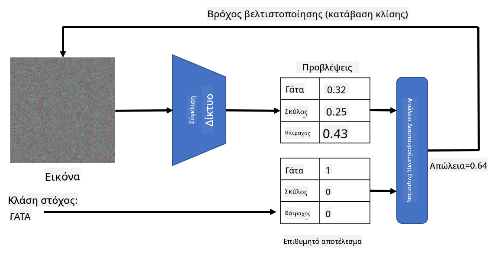

<!--
CO_OP_TRANSLATOR_METADATA:
{
  "original_hash": "717775c4050ccbffbe0c961ad8bf7bf7",
  "translation_date": "2025-08-29T08:47:46+00:00",
  "source_file": "lessons/4-ComputerVision/08-TransferLearning/README.md",
  "language_code": "el"
}
-->
# Προεκπαιδευμένα Δίκτυα και Μεταφορά Μάθησης

Η εκπαίδευση CNNs μπορεί να απαιτήσει πολύ χρόνο και μεγάλο όγκο δεδομένων. Ωστόσο, μεγάλο μέρος του χρόνου δαπανάται για την εκμάθηση των καλύτερων φίλτρων χαμηλού επιπέδου που μπορεί να χρησιμοποιήσει ένα δίκτυο για να εξάγει μοτίβα από εικόνες. Ένα φυσικό ερώτημα προκύπτει - μπορούμε να χρησιμοποιήσουμε ένα νευρωνικό δίκτυο που έχει εκπαιδευτεί σε ένα σύνολο δεδομένων και να το προσαρμόσουμε για να ταξινομήσει διαφορετικές εικόνες χωρίς να απαιτείται πλήρης διαδικασία εκπαίδευσης;

## [Pre-lecture quiz](https://red-field-0a6ddfd03.1.azurestaticapps.net/quiz/108)

Αυτή η προσέγγιση ονομάζεται **μεταφορά μάθησης**, επειδή μεταφέρουμε κάποια γνώση από ένα μοντέλο νευρωνικού δικτύου σε ένα άλλο. Στη μεταφορά μάθησης, συνήθως ξεκινάμε με ένα προεκπαιδευμένο μοντέλο, το οποίο έχει εκπαιδευτεί σε κάποιο μεγάλο σύνολο δεδομένων εικόνων, όπως το **ImageNet**. Αυτά τα μοντέλα μπορούν ήδη να εξάγουν διαφορετικά χαρακτηριστικά από γενικές εικόνες, και σε πολλές περιπτώσεις η απλή δημιουργία ενός ταξινομητή πάνω από αυτά τα εξαγόμενα χαρακτηριστικά μπορεί να δώσει καλά αποτελέσματα.

> ✅ Η Μεταφορά Μάθησης είναι ένας όρος που συναντάται και σε άλλους ακαδημαϊκούς τομείς, όπως η Εκπαίδευση. Αναφέρεται στη διαδικασία λήψης γνώσης από έναν τομέα και εφαρμογής της σε έναν άλλο.

## Προεκπαιδευμένα Μοντέλα ως Εξαγωγείς Χαρακτηριστικών

Τα συνελικτικά δίκτυα που συζητήσαμε στην προηγούμενη ενότητα περιείχαν έναν αριθμό επιπέδων, καθένα από τα οποία υποτίθεται ότι εξάγει κάποια χαρακτηριστικά από την εικόνα, ξεκινώντας από συνδυασμούς pixel χαμηλού επιπέδου (όπως οριζόντιες/κάθετες γραμμές ή κτυπήματα), μέχρι συνδυασμούς χαρακτηριστικών υψηλότερου επιπέδου, που αντιστοιχούν σε πράγματα όπως το μάτι μιας φλόγας. Εάν εκπαιδεύσουμε ένα CNN σε ένα επαρκώς μεγάλο σύνολο δεδομένων γενικών και ποικίλων εικόνων, το δίκτυο θα πρέπει να μάθει να εξάγει αυτά τα κοινά χαρακτηριστικά.

Τόσο το Keras όσο και το PyTorch περιέχουν λειτουργίες για εύκολη φόρτωση προεκπαιδευμένων βαρών νευρωνικού δικτύου για κάποιες κοινές αρχιτεκτονικές, οι περισσότερες από τις οποίες έχουν εκπαιδευτεί σε εικόνες ImageNet. Οι πιο συχνά χρησιμοποιούμενες περιγράφονται στη σελίδα [Αρχιτεκτονικές CNN](../07-ConvNets/CNN_Architectures.md) από το προηγούμενο μάθημα. Συγκεκριμένα, μπορεί να θέλετε να χρησιμοποιήσετε μία από τις παρακάτω:

* **VGG-16/VGG-19**, που είναι σχετικά απλά μοντέλα και δίνουν ακόμα καλή ακρίβεια. Συχνά η χρήση του VGG ως πρώτη προσπάθεια είναι μια καλή επιλογή για να δείτε πώς λειτουργεί η μεταφορά μάθησης.
* **ResNet**, μια οικογένεια μοντέλων που προτάθηκε από τη Microsoft Research το 2015. Έχουν περισσότερα επίπεδα και συνεπώς απαιτούν περισσότερους πόρους.
* **MobileNet**, μια οικογένεια μοντέλων με μειωμένο μέγεθος, κατάλληλα για κινητές συσκευές. Χρησιμοποιήστε τα αν έχετε περιορισμένους πόρους και μπορείτε να θυσιάσετε λίγη ακρίβεια.

Ακολουθούν δείγματα χαρακτηριστικών που εξάγονται από μια εικόνα γάτας από το δίκτυο VGG-16:

## Σύνολο Δεδομένων Γάτες vs. Σκύλοι

Σε αυτό το παράδειγμα, θα χρησιμοποιήσουμε ένα σύνολο δεδομένων [Γάτες και Σκύλοι](https://www.microsoft.com/download/details.aspx?id=54765&WT.mc_id=academic-77998-cacaste), το οποίο είναι πολύ κοντά σε ένα σενάριο ταξινόμησης εικόνων πραγματικής ζωής.

## ✍️ Άσκηση: Μεταφορά Μάθησης

Ας δούμε τη μεταφορά μάθησης σε δράση στα αντίστοιχα notebooks:

* [Μεταφορά Μάθησης - PyTorch](TransferLearningPyTorch.ipynb)
* [Μεταφορά Μάθησης - TensorFlow](TransferLearningTF.ipynb)

## Οπτικοποίηση Αντιθετικής Γάτας

Ένα προεκπαιδευμένο νευρωνικό δίκτυο περιέχει διαφορετικά μοτίβα μέσα στον *εγκέφαλό* του, συμπεριλαμβανομένων εννοιών όπως η **ιδανική γάτα** (καθώς και ιδανικός σκύλος, ιδανική ζέβρα, κ.λπ.). Θα ήταν ενδιαφέρον να **οπτικοποιήσουμε αυτή την εικόνα**. Ωστόσο, αυτό δεν είναι απλό, επειδή τα μοτίβα είναι διασκορπισμένα σε όλο το βάρος του δικτύου και οργανωμένα σε μια ιεραρχική δομή.

Μια προσέγγιση που μπορούμε να ακολουθήσουμε είναι να ξεκινήσουμε με μια τυχαία εικόνα και στη συνέχεια να χρησιμοποιήσουμε την τεχνική **βελτιστοποίησης με καθοδική κλίση** για να προσαρμόσουμε αυτή την εικόνα με τέτοιο τρόπο ώστε το δίκτυο να αρχίσει να πιστεύει ότι είναι γάτα.

Ωστόσο, αν το κάνουμε αυτό, θα λάβουμε κάτι πολύ κοντά σε τυχαίο θόρυβο. Αυτό συμβαίνει επειδή *υπάρχουν πολλοί τρόποι να κάνουμε το δίκτυο να πιστεύει ότι η εισαγόμενη εικόνα είναι γάτα*, συμπεριλαμβανομένων κάποιων που δεν έχουν νόημα οπτικά. Ενώ αυτές οι εικόνες περιέχουν πολλά μοτίβα τυπικά για μια γάτα, δεν υπάρχει τίποτα που να τις περιορίζει ώστε να είναι οπτικά διακριτές.

Για να βελτιώσουμε το αποτέλεσμα, μπορούμε να προσθέσουμε έναν άλλο όρο στη συνάρτηση απώλειας, που ονομάζεται **απώλεια παραλλαγής**. Είναι μια μέτρηση που δείχνει πόσο παρόμοια είναι τα γειτονικά pixel της εικόνας. Η ελαχιστοποίηση της απώλειας παραλλαγής κάνει την εικόνα πιο ομαλή και απαλλάσσει από τον θόρυβο - αποκαλύπτοντας έτσι πιο οπτικά ελκυστικά μοτίβα. Ακολουθεί ένα παράδειγμα τέτοιων "ιδανικών" εικόνων, που ταξινομούνται ως γάτα και ως ζέβρα με υψηλή πιθανότητα:

 | 
-----|-----
 *Ιδανική Γάτα* | *Ιδανική Ζέβρα*

Παρόμοια προσέγγιση μπορεί να χρησιμοποιηθεί για να πραγματοποιηθούν οι λεγόμενες **αντιθετικές επιθέσεις** σε ένα νευρωνικό δίκτυο. Ας υποθέσουμε ότι θέλουμε να ξεγελάσουμε ένα νευρωνικό δίκτυο και να κάνουμε έναν σκύλο να μοιάζει με γάτα. Εάν πάρουμε την εικόνα ενός σκύλου, που αναγνωρίζεται από το δίκτυο ως σκύλος, μπορούμε στη συνέχεια να την τροποποιήσουμε λίγο χρησιμοποιώντας βελτιστοποίηση με καθοδική κλίση, μέχρι το δίκτυο να αρχίσει να την ταξινομεί ως γάτα:

 | 
-----|-----
*Αρχική εικόνα σκύλου* | *Εικόνα σκύλου που ταξινομείται ως γάτα*

Δείτε τον κώδικα για την αναπαραγωγή των παραπάνω αποτελεσμάτων στο ακόλουθο notebook:

* [Ιδανική και Αντιθετική Γάτα - TensorFlow](AdversarialCat_TF.ipynb)

## Συμπέρασμα

Χρησιμοποιώντας τη μεταφορά μάθησης, μπορείτε να δημιουργήσετε γρήγορα έναν ταξινομητή για μια προσαρμοσμένη εργασία ταξινόμησης αντικειμένων και να επιτύχετε υψηλή ακρίβεια. Μπορείτε να δείτε ότι πιο σύνθετες εργασίες που λύνουμε τώρα απαιτούν υψηλότερη υπολογιστική ισχύ και δεν μπορούν να λυθούν εύκολα στη CPU. Στην επόμενη ενότητα, θα προσπαθήσουμε να χρησιμοποιήσουμε μια πιο ελαφριά υλοποίηση για να εκπαιδεύσουμε το ίδιο μοντέλο χρησιμοποιώντας χαμηλότερους υπολογιστικούς πόρους, κάτι που οδηγεί σε ελαφρώς χαμηλότερη ακρίβεια.

## 🚀 Πρόκληση

Στα συνοδευτικά notebooks, υπάρχουν σημειώσεις στο κάτω μέρος σχετικά με το πώς η μεταφορά γνώσης λειτουργεί καλύτερα με κάπως παρόμοια δεδομένα εκπαίδευσης (ίσως ένας νέος τύπος ζώου). Κάντε πειράματα με εντελώς νέους τύπους εικόνων για να δείτε πόσο καλά ή άσχημα αποδίδουν τα μοντέλα μεταφοράς γνώσης σας.

## [Post-lecture quiz](https://red-field-0a6ddfd03.1.azurestaticapps.net/quiz/208)

## Ανασκόπηση & Αυτομελέτη

Διαβάστε το [TrainingTricks.md](TrainingTricks.md) για να εμβαθύνετε τη γνώση σας σε άλλους τρόπους εκπαίδευσης των μοντέλων σας.

## [Assignment](lab/README.md)

Σε αυτό το εργαστήριο, θα χρησιμοποιήσουμε το πραγματικό σύνολο δεδομένων [Oxford-IIIT](https://www.robots.ox.ac.uk/~vgg/data/pets/) με 35 φυλές γατών και σκύλων, και θα δημιουργήσουμε έναν ταξινομητή μεταφοράς μάθησης.

---

**Αποποίηση Ευθύνης**:  
Αυτό το έγγραφο έχει μεταφραστεί χρησιμοποιώντας την υπηρεσία αυτόματης μετάφρασης [Co-op Translator](https://github.com/Azure/co-op-translator). Παρόλο που καταβάλλουμε προσπάθειες για ακρίβεια, παρακαλούμε να έχετε υπόψη ότι οι αυτόματες μεταφράσεις ενδέχεται να περιέχουν σφάλματα ή ανακρίβειες. Το πρωτότυπο έγγραφο στη μητρική του γλώσσα θα πρέπει να θεωρείται η αυθεντική πηγή. Για κρίσιμες πληροφορίες, συνιστάται επαγγελματική ανθρώπινη μετάφραση. Δεν φέρουμε ευθύνη για τυχόν παρεξηγήσεις ή εσφαλμένες ερμηνείες που προκύπτουν από τη χρήση αυτής της μετάφρασης.