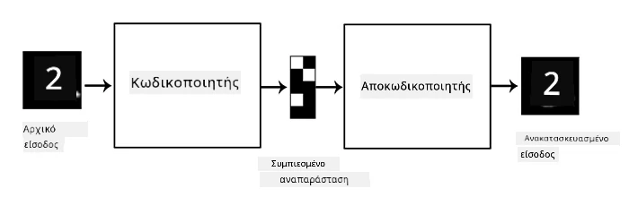
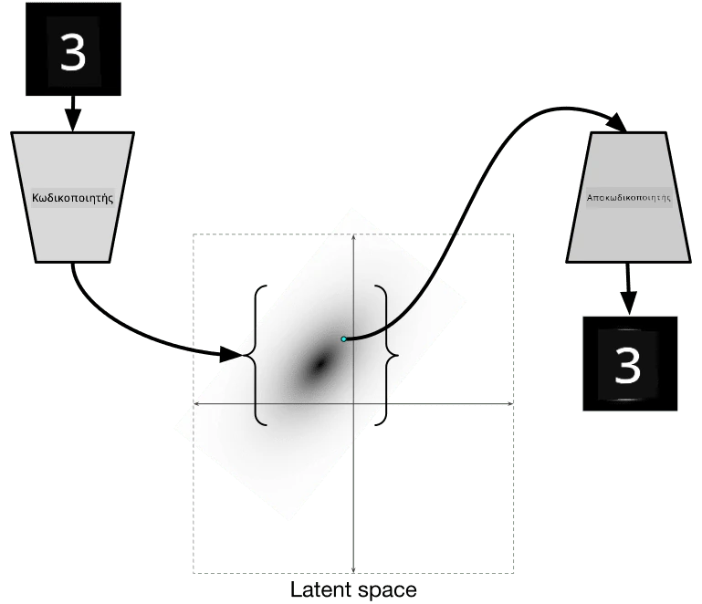

# Αυτόματοι Κωδικοποιητές

Κατά την εκπαίδευση CNNs, ένα από τα προβλήματα είναι ότι χρειαζόμαστε πολλά δεδομένα με ετικέτες. Στην περίπτωση της ταξινόμησης εικόνων, πρέπει να διαχωρίσουμε τις εικόνες σε διαφορετικές κατηγορίες, κάτι που απαιτεί χειροκίνητη προσπάθεια.

## [Προ-διάλεξης κουίζ](https://ff-quizzes.netlify.app/en/ai/quiz/17)

Ωστόσο, μπορεί να θέλουμε να χρησιμοποιήσουμε ακατέργαστα (χωρίς ετικέτες) δεδομένα για την εκπαίδευση εξαγωγέων χαρακτηριστικών CNN, κάτι που ονομάζεται **αυτοεπιβλεπόμενη μάθηση**. Αντί για ετικέτες, θα χρησιμοποιήσουμε τις εικόνες εκπαίδευσης τόσο ως είσοδο όσο και ως έξοδο του δικτύου. Η βασική ιδέα του **αυτόματου κωδικοποιητή** είναι ότι θα έχουμε ένα **δίκτυο κωδικοποιητή** που μετατρέπει την εικόνα εισόδου σε κάποιο **λανθάνοντα χώρο** (συνήθως είναι απλά ένας διάνυσμα μικρότερου μεγέθους), και στη συνέχεια ένα **δίκτυο αποκωδικοποιητή**, του οποίου ο στόχος είναι να ανακατασκευάσει την αρχική εικόνα.

> ✅ Ένας [αυτόματος κωδικοποιητής](https://wikipedia.org/wiki/Autoencoder) είναι "ένας τύπος τεχνητού νευρωνικού δικτύου που χρησιμοποιείται για να μάθει αποδοτικούς κωδικούς δεδομένων χωρίς ετικέτες."

Καθώς εκπαιδεύουμε έναν αυτόματο κωδικοποιητή για να συλλάβει όσο το δυνατόν περισσότερες πληροφορίες από την αρχική εικόνα για ακριβή ανακατασκευή, το δίκτυο προσπαθεί να βρει την καλύτερη **ενσωμάτωση** των εικόνων εισόδου για να αποτυπώσει το νόημα.

> Εικόνα από το [Keras blog](https://blog.keras.io/building-autoencoders-in-keras.html)

## Σενάρια χρήσης Αυτόματων Κωδικοποιητών

Ενώ η ανακατασκευή αρχικών εικόνων μπορεί να μην φαίνεται χρήσιμη από μόνη της, υπάρχουν μερικά σενάρια όπου οι αυτόματοι κωδικοποιητές είναι ιδιαίτερα χρήσιμοι:

* **Μείωση διάστασης εικόνων για οπτικοποίηση** ή **εκπαίδευση ενσωματώσεων εικόνων**. Συνήθως οι αυτόματοι κωδικοποιητές δίνουν καλύτερα αποτελέσματα από την PCA, επειδή λαμβάνουν υπόψη τη χωρική φύση των εικόνων και τα ιεραρχικά χαρακτηριστικά.
* **Αποθορυβοποίηση**, δηλαδή αφαίρεση θορύβου από την εικόνα. Επειδή ο θόρυβος περιέχει πολλές άχρηστες πληροφορίες, ο αυτόματος κωδικοποιητής δεν μπορεί να τον χωρέσει όλο στον σχετικά μικρό λανθάνοντα χώρο, και έτσι συλλαμβάνει μόνο το σημαντικό μέρος της εικόνας. Κατά την εκπαίδευση αποθορυβοποιητών, ξεκινάμε με αρχικές εικόνες και χρησιμοποιούμε εικόνες με τεχνητά προστιθέμενο θόρυβο ως είσοδο για τον αυτόματο κωδικοποιητή.
* **Υπερανάλυση**, αύξηση της ανάλυσης εικόνας. Ξεκινάμε με εικόνες υψηλής ανάλυσης και χρησιμοποιούμε την εικόνα με χαμηλότερη ανάλυση ως είσοδο για τον αυτόματο κωδικοποιητή.
* **Γενετικά μοντέλα**. Αφού εκπαιδεύσουμε τον αυτόματο κωδικοποιητή, το μέρος του αποκωδικοποιητή μπορεί να χρησιμοποιηθεί για τη δημιουργία νέων αντικειμένων ξεκινώντας από τυχαίους λανθάνοντες διανύσματα.

## Παραλλαγές Αυτόματων Κωδικοποιητών (VAE)

Οι παραδοσιακοί αυτόματοι κωδικοποιητές μειώνουν τη διάσταση των δεδομένων εισόδου με κάποιο τρόπο, εντοπίζοντας τα σημαντικά χαρακτηριστικά των εικόνων εισόδου. Ωστόσο, οι λανθάνοντες διανύσματα συχνά δεν έχουν πολύ νόημα. Με άλλα λόγια, αν πάρουμε το σύνολο δεδομένων MNIST ως παράδειγμα, η κατανόηση του ποιοι αριθμοί αντιστοιχούν σε διαφορετικούς λανθάνοντες διανύσματα δεν είναι εύκολη υπόθεση, επειδή κοντινοί λανθάνοντες διανύσματα δεν αντιστοιχούν απαραίτητα στους ίδιους αριθμούς.

Από την άλλη πλευρά, για την εκπαίδευση *γενετικών* μοντέλων είναι καλύτερο να έχουμε κάποια κατανόηση του λανθάνοντα χώρου. Αυτή η ιδέα μας οδηγεί στους **παραλλαγμένους αυτόματους κωδικοποιητές** (VAE).

Ο VAE είναι ένας αυτόματος κωδικοποιητής που μαθαίνει να προβλέπει τη *στατιστική κατανομή* των λανθανόντων παραμέτρων, τη λεγόμενη **λανθάνουσα κατανομή**. Για παράδειγμα, μπορεί να θέλουμε οι λανθάνοντες διανύσματα να κατανέμονται κανονικά με κάποιο μέσο zmean και τυπική απόκλιση zsigma (τόσο ο μέσος όσο και η τυπική απόκλιση είναι διανύσματα κάποιας διαστασιμότητας d). Ο κωδικοποιητής στον VAE μαθαίνει να προβλέπει αυτές τις παραμέτρους, και στη συνέχεια ο αποκωδικοποιητής παίρνει ένα τυχαίο διάνυσμα από αυτή την κατανομή για να ανακατασκευάσει το αντικείμενο.

Συνοψίζοντας:

 * Από το διάνυσμα εισόδου, προβλέπουμε `z_mean` και `z_log_sigma` (αντί να προβλέπουμε την τυπική απόκλιση απευθείας, προβλέπουμε τον λογάριθμό της)
 * Δειγματοληπτούμε ένα διάνυσμα `sample` από την κατανομή N(zmean,exp(zlog\_sigma))
 * Ο αποκωδικοποιητής προσπαθεί να αποκωδικοποιήσει την αρχική εικόνα χρησιμοποιώντας το `sample` ως διάνυσμα εισόδου

 

> Εικόνα από [αυτό το άρθρο](https://ijdykeman.github.io/ml/2016/12/21/cvae.html) του Isaak Dykeman

Οι παραλλαγμένοι αυτόματοι κωδικοποιητές χρησιμοποιούν μια σύνθετη συνάρτηση απώλειας που αποτελείται από δύο μέρη:

* **Απώλεια ανακατασκευής**, η οποία δείχνει πόσο κοντά είναι η ανακατασκευασμένη εικόνα στον στόχο (μπορεί να είναι το Μέσο Τετραγωνικό Σφάλμα, ή MSE). Είναι η ίδια συνάρτηση απώλειας όπως στους κανονικούς αυτόματους κωδικοποιητές.
* **Απώλεια KL**, η οποία διασφαλίζει ότι οι κατανομές των λανθανόντων μεταβλητών παραμένουν κοντά στην κανονική κατανομή. Βασίζεται στην έννοια της [απόκλισης Kullback-Leibler](https://www.countbayesie.com/blog/2017/5/9/kullback-leibler-divergence-explained) - μια μέτρηση για την εκτίμηση του πόσο παρόμοιες είναι δύο στατιστικές κατανομές.

Ένα σημαντικό πλεονέκτημα των VAEs είναι ότι μας επιτρέπουν να δημιουργούμε νέες εικόνες σχετικά εύκολα, επειδή γνωρίζουμε από ποια κατανομή να δειγματοληπτήσουμε λανθάνοντες διανύσματα. Για παράδειγμα, αν εκπαιδεύσουμε έναν VAE με 2D λανθάνον διάνυσμα στο MNIST, μπορούμε στη συνέχεια να μεταβάλλουμε τα συστατικά του λανθάνοντος διανύσματος για να πάρουμε διαφορετικούς αριθμούς:

> Εικόνα από τον [Dmitry Soshnikov](http://soshnikov.com)

Παρατηρήστε πώς οι εικόνες συγχωνεύονται μεταξύ τους, καθώς αρχίζουμε να παίρνουμε λανθάνοντες διανύσματα από διαφορετικά μέρη του λανθάνοντος χώρου παραμέτρων. Μπορούμε επίσης να οπτικοποιήσουμε αυτόν τον χώρο σε 2D:

 

> Εικόνα από τον [Dmitry Soshnikov](http://soshnikov.com)

## ✍️ Ασκήσεις: Αυτόματοι Κωδικοποιητές

Μάθετε περισσότερα για τους αυτόματους κωδικοποιητές στα παρακάτω σημειωματάρια:

* [Αυτόματοι Κωδικοποιητές στο TensorFlow](AutoencodersTF.ipynb)
* [Αυτόματοι Κωδικοποιητές στο PyTorch](AutoEncodersPyTorch.ipynb)

## Ιδιότητες Αυτόματων Κωδικοποιητών

* **Ειδικά για δεδομένα** - λειτουργούν καλά μόνο με τον τύπο εικόνων που έχουν εκπαιδευτεί. Για παράδειγμα, αν εκπαιδεύσουμε ένα δίκτυο υπερανάλυσης σε λουλούδια, δεν θα λειτουργήσει καλά σε πορτρέτα. Αυτό συμβαίνει επειδή το δίκτυο μπορεί να παράγει εικόνα υψηλότερης ανάλυσης λαμβάνοντας λεπτομέρειες από χαρακτηριστικά που έμαθε από το σύνολο δεδομένων εκπαίδευσης.
* **Με απώλειες** - η ανακατασκευασμένη εικόνα δεν είναι ίδια με την αρχική εικόνα. Η φύση της απώλειας καθορίζεται από τη *συνάρτηση απώλειας* που χρησιμοποιείται κατά την εκπαίδευση.
* Λειτουργούν με **δεδομένα χωρίς ετικέτες**

## [Μετά-διάλεξης κουίζ](https://ff-quizzes.netlify.app/en/ai/quiz/18)

## Συμπέρασμα

Σε αυτό το μάθημα, μάθατε για τους διάφορους τύπους αυτόματων κωδικοποιητών που είναι διαθέσιμοι στον επιστήμονα AI. Μάθατε πώς να τους κατασκευάζετε και πώς να τους χρησιμοποιείτε για την ανακατασκευή εικόνων. Επίσης, μάθατε για τους VAE και πώς να τους χρησιμοποιείτε για τη δημιουργία νέων εικόνων.

## 🚀 Πρόκληση

Σε αυτό το μάθημα, μάθατε για τη χρήση αυτόματων κωδικοποιητών για εικόνες. Αλλά μπορούν επίσης να χρησιμοποιηθούν για μουσική! Δείτε το έργο [MusicVAE](https://magenta.tensorflow.org/music-vae) του Magenta, το οποίο χρησιμοποιεί αυτόματους κωδικοποιητές για να μάθει να ανακατασκευάζει μουσική. Κάντε μερικά [πειράματα](https://colab.research.google.com/github/magenta/magenta-demos/blob/master/colab-notebooks/Multitrack_MusicVAE.ipynb) με αυτήν τη βιβλιοθήκη για να δείτε τι μπορείτε να δημιουργήσετε.

## [Μετά-διάλεξης κουίζ](https://ff-quizzes.netlify.app/en/ai/quiz/16)

## Ανασκόπηση & Αυτομελέτη

Για αναφορά, διαβάστε περισσότερα για τους αυτόματους κωδικοποιητές στις παρακάτω πηγές:

* [Κατασκευή Αυτόματων Κωδικοποιητών στο Keras](https://blog.keras.io/building-autoencoders-in-keras.html)
* [Άρθρο στο NeuroHive](https://neurohive.io/ru/osnovy-data-science/variacionnyj-avtojenkoder-vae/)
* [Επεξήγηση Παραλλαγμένων Αυτόματων Κωδικοποιητών](https://kvfrans.com/variational-autoencoders-explained/)
* [Υπό όρους Παραλλαγμένοι Αυτόματοι Κωδικοποιητές](https://ijdykeman.github.io/ml/2016/12/21/cvae.html)

## Εργασία

Στο τέλος του [αυτού του σημειωματάριου χρησιμοποιώντας TensorFlow](AutoencodersTF.ipynb), θα βρείτε μια 'εργασία' - χρησιμοποιήστε την ως την εργασία σας.

---

