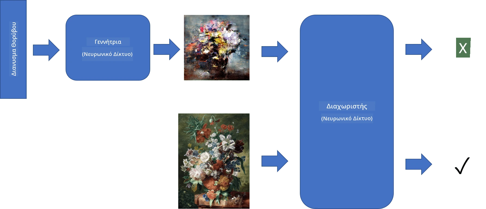
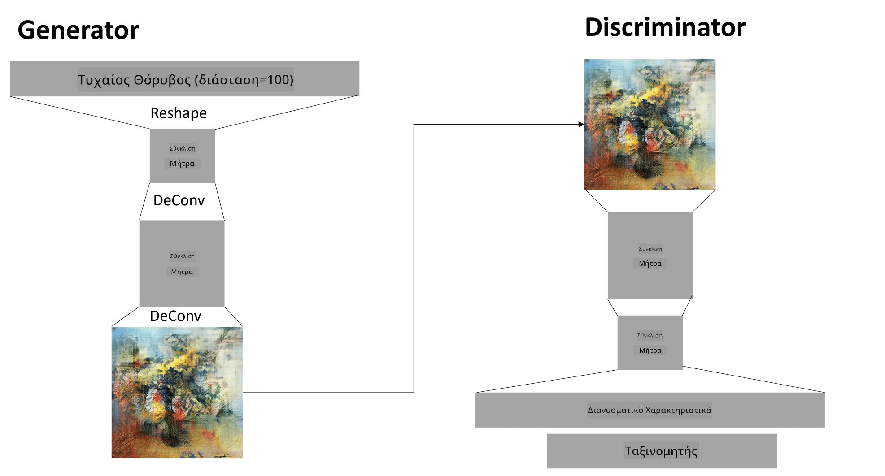

# Γενετικοί Ανταγωνιστικοί Δίκτυα

Στην προηγούμενη ενότητα, μάθαμε για τα **γενετικά μοντέλα**: μοντέλα που μπορούν να δημιουργήσουν νέες εικόνες παρόμοιες με αυτές του συνόλου εκπαίδευσης. Το VAE ήταν ένα καλό παράδειγμα γενετικού μοντέλου.

## [Προ-διάλεξη κουίζ](https://ff-quizzes.netlify.app/en/ai/quiz/19)

Ωστόσο, αν προσπαθήσουμε να δημιουργήσουμε κάτι πραγματικά ουσιαστικό, όπως έναν πίνακα σε λογική ανάλυση, με το VAE, θα δούμε ότι η εκπαίδευση δεν συγκλίνει καλά. Για αυτήν την περίπτωση χρήσης, πρέπει να μάθουμε για μια άλλη αρχιτεκτονική που στοχεύει ειδικά στα γενετικά μοντέλα - τα **Γενετικά Ανταγωνιστικά Δίκτυα**, ή GANs.

Η βασική ιδέα ενός GAN είναι να έχουμε δύο νευρωνικά δίκτυα που θα εκπαιδεύονται το ένα ενάντια στο άλλο:

> Εικόνα από [Dmitry Soshnikov](http://soshnikov.com)

> ✅ Λίγο λεξιλόγιο:
> * **Generator** είναι ένα δίκτυο που λαμβάνει έναν τυχαίο διάνυσμα και παράγει την εικόνα ως αποτέλεσμα.
> * **Discriminator** είναι ένα δίκτυο που λαμβάνει μια εικόνα και πρέπει να καθορίσει αν είναι πραγματική εικόνα (από το σύνολο εκπαίδευσης) ή αν δημιουργήθηκε από τον generator. Ουσιαστικά είναι ένας ταξινομητής εικόνων.

### Discriminator

Η αρχιτεκτονική του discriminator δεν διαφέρει από ένα συνηθισμένο δίκτυο ταξινόμησης εικόνων. Στην απλούστερη περίπτωση μπορεί να είναι ένας πλήρως συνδεδεμένος ταξινομητής, αλλά πιθανότατα θα είναι ένα [συνελικτικό δίκτυο](../07-ConvNets/README.md).

> ✅ Ένα GAN βασισμένο σε συνελικτικά δίκτυα ονομάζεται [DCGAN](https://arxiv.org/pdf/1511.06434.pdf)

Ένας CNN discriminator αποτελείται από τα εξής επίπεδα: αρκετές συνελικτικές+συγκεντρωτικές λειτουργίες (με μειούμενο χωρικό μέγεθος) και ένα ή περισσότερα πλήρως συνδεδεμένα επίπεδα για να δημιουργηθεί ο "διανυσμα χαρακτηριστικών", τελικός δυαδικός ταξινομητής.

> ✅ Η "συγκέντρωση" σε αυτό το πλαίσιο είναι μια τεχνική που μειώνει το μέγεθος της εικόνας. "Τα επίπεδα συγκέντρωσης μειώνουν τις διαστάσεις των δεδομένων συνδυάζοντας τις εξόδους ομάδων νευρώνων σε ένα επίπεδο σε έναν μόνο νευρώνα στο επόμενο επίπεδο." - [πηγή](https://wikipedia.org/wiki/Convolutional_neural_network#Pooling_layers)

### Generator

Ο Generator είναι λίγο πιο περίπλοκος. Μπορείτε να τον θεωρήσετε ως έναν αντίστροφο discriminator. Ξεκινώντας από έναν λανθάνοντα διάνυσμα (αντί για έναν διανυσμα χαρακτηριστικών), έχει ένα πλήρως συνδεδεμένο επίπεδο για να το μετατρέψει στο απαιτούμενο μέγεθος/σχήμα, ακολουθούμενο από αποσυνελικτικές λειτουργίες+αναβάθμιση. Αυτό είναι παρόμοιο με το *decoder* μέρος του [autoencoder](../09-Autoencoders/README.md).

> ✅ Επειδή το συνελικτικό επίπεδο υλοποιείται ως γραμμικό φίλτρο που διατρέχει την εικόνα, η αποσυνελικτική λειτουργία είναι ουσιαστικά παρόμοια με τη συνελικτική και μπορεί να υλοποιηθεί χρησιμοποιώντας την ίδια λογική επιπέδου.

> Εικόνα από [Dmitry Soshnikov](http://soshnikov.com)

### Εκπαίδευση του GAN

Τα GANs ονομάζονται **ανταγωνιστικά** επειδή υπάρχει συνεχής ανταγωνισμός μεταξύ του generator και του discriminator. Κατά τη διάρκεια αυτού του ανταγωνισμού, τόσο ο generator όσο και ο discriminator βελτιώνονται, με αποτέλεσμα το δίκτυο να μαθαίνει να παράγει όλο και καλύτερες εικόνες.

Η εκπαίδευση γίνεται σε δύο στάδια:

* **Εκπαίδευση του discriminator**. Αυτή η εργασία είναι αρκετά απλή: δημιουργούμε μια παρτίδα εικόνων από τον generator, τις επισημαίνουμε με 0, που αντιστοιχεί σε ψεύτικες εικόνες, και παίρνουμε μια παρτίδα εικόνων από το σύνολο εισόδου (με ετικέτα 1, πραγματική εικόνα). Υπολογίζουμε κάποια *απώλεια του discriminator* και εκτελούμε backprop.
* **Εκπαίδευση του generator**. Αυτό είναι λίγο πιο περίπλοκο, επειδή δεν γνωρίζουμε άμεσα την αναμενόμενη έξοδο για τον generator. Παίρνουμε ολόκληρο το δίκτυο GAN που αποτελείται από έναν generator ακολουθούμενο από έναν discriminator, το τροφοδοτούμε με τυχαίους διανύσματα και περιμένουμε το αποτέλεσμα να είναι 1 (που αντιστοιχεί σε πραγματικές εικόνες). Στη συνέχεια, παγώνουμε τις παραμέτρους του discriminator (δεν θέλουμε να εκπαιδευτεί σε αυτό το βήμα) και εκτελούμε backprop.

Κατά τη διάρκεια αυτής της διαδικασίας, οι απώλειες του generator και του discriminator δεν μειώνονται σημαντικά. Στην ιδανική περίπτωση, θα πρέπει να ταλαντεύονται, υποδηλώνοντας ότι και τα δύο δίκτυα βελτιώνουν την απόδοσή τους.

## ✍️ Ασκήσεις: GANs

* [GAN Notebook σε TensorFlow/Keras](GANTF.ipynb)
* [GAN Notebook σε PyTorch](GANPyTorch.ipynb)

### Προβλήματα με την εκπαίδευση των GANs

Τα GANs είναι γνωστά για τη δυσκολία τους στην εκπαίδευση. Εδώ είναι μερικά προβλήματα:

* **Κατάρρευση Μοντέλου**. Με αυτόν τον όρο εννοούμε ότι ο generator μαθαίνει να παράγει μία επιτυχημένη εικόνα που ξεγελά τον discriminator, και όχι μια ποικιλία διαφορετικών εικόνων.
* **Ευαισθησία στις υπερπαραμέτρους**. Συχνά μπορεί να δείτε ότι ένα GAN δεν συγκλίνει καθόλου, και ξαφνικά μια μείωση στον ρυθμό εκμάθησης οδηγεί σε σύγκλιση.
* Διατήρηση της **ισορροπίας** μεταξύ του generator και του discriminator. Σε πολλές περιπτώσεις η απώλεια του discriminator μπορεί να πέσει στο μηδέν σχετικά γρήγορα, γεγονός που οδηγεί στο να μην μπορεί ο generator να εκπαιδευτεί περαιτέρω. Για να ξεπεραστεί αυτό, μπορούμε να δοκιμάσουμε να ορίσουμε διαφορετικούς ρυθμούς εκμάθησης για τον generator και τον discriminator ή να παραλείψουμε την εκπαίδευση του discriminator αν η απώλεια είναι ήδη πολύ χαμηλή.
* Εκπαίδευση για **υψηλή ανάλυση**. Αντικατοπτρίζοντας το ίδιο πρόβλημα όπως με τους autoencoders, αυτό το πρόβλημα προκαλείται επειδή η ανακατασκευή πολλών επιπέδων συνελικτικού δικτύου οδηγεί σε τεχνουργήματα. Αυτό το πρόβλημα συνήθως λύνεται με τη λεγόμενη **προοδευτική ανάπτυξη**, όπου πρώτα εκπαιδεύονται λίγα επίπεδα σε εικόνες χαμηλής ανάλυσης και στη συνέχεια "ξεκλειδώνονται" ή προστίθενται επίπεδα. Μια άλλη λύση θα ήταν η προσθήκη επιπλέον συνδέσεων μεταξύ των επιπέδων και η εκπαίδευση πολλών αναλύσεων ταυτόχρονα - δείτε αυτήν την [εργασία Multi-Scale Gradient GANs](https://arxiv.org/abs/1903.06048) για λεπτομέρειες.

## Μεταφορά Στυλ

Τα GANs είναι ένας εξαιρετικός τρόπος για τη δημιουργία καλλιτεχνικών εικόνων. Μια άλλη ενδιαφέρουσα τεχνική είναι η λεγόμενη **μεταφορά στυλ**, η οποία παίρνει μία **εικόνα περιεχομένου** και την ανασχεδιάζει σε διαφορετικό στυλ, εφαρμόζοντας φίλτρα από μία **εικόνα στυλ**.

Ο τρόπος που λειτουργεί είναι ο εξής:
* Ξεκινάμε με μια τυχαία εικόνα θορύβου (ή με μια εικόνα περιεχομένου, αλλά για λόγους κατανόησης είναι ευκολότερο να ξεκινήσουμε από τυχαίο θόρυβο).
* Ο στόχος μας θα είναι να δημιουργήσουμε μια εικόνα που θα είναι κοντά τόσο στην εικόνα περιεχομένου όσο και στην εικόνα στυλ. Αυτό θα καθοριστεί από δύο συναρτήσεις απώλειας:
   - **Απώλεια περιεχομένου** υπολογίζεται βάσει των χαρακτηριστικών που εξάγονται από το CNN σε ορισμένα επίπεδα από την τρέχουσα εικόνα και την εικόνα περιεχομένου.
   - **Απώλεια στυλ** υπολογίζεται μεταξύ της τρέχουσας εικόνας και της εικόνας στυλ με έξυπνο τρόπο χρησιμοποιώντας πίνακες Gram (περισσότερες λεπτομέρειες στο [παράδειγμα notebook](StyleTransfer.ipynb)).
* Για να κάνουμε την εικόνα πιο ομαλή και να αφαιρέσουμε τον θόρυβο, εισάγουμε επίσης **Απώλεια παραλλαγής**, η οποία υπολογίζει τη μέση απόσταση μεταξύ γειτονικών pixel.
* Ο κύριος βρόχος βελτιστοποίησης προσαρμόζει την τρέχουσα εικόνα χρησιμοποιώντας την κατάβαση κλίσης (ή κάποιον άλλο αλγόριθμο βελτιστοποίησης) για να ελαχιστοποιήσει τη συνολική απώλεια, η οποία είναι ένα σταθμισμένο άθροισμα όλων των απωλειών.

## ✍️ Παράδειγμα: [Μεταφορά Στυλ](StyleTransfer.ipynb)

## [Μετά-διάλεξη κουίζ](https://ff-quizzes.netlify.app/en/ai/quiz/20)

## Συμπέρασμα

Σε αυτό το μάθημα, μάθατε για τα GANs και πώς να τα εκπαιδεύετε. Μάθατε επίσης για τις ειδικές προκλήσεις που μπορεί να αντιμετωπίσει αυτός ο τύπος Νευρωνικού Δικτύου και κάποιες στρατηγικές για να τις ξεπεράσετε.

## 🚀 Πρόκληση

Δοκιμάστε το [Style Transfer notebook](StyleTransfer.ipynb) χρησιμοποιώντας τις δικές σας εικόνες.

## Ανασκόπηση & Αυτομελέτη

Για αναφορά, διαβάστε περισσότερα για τα GANs σε αυτούς τους πόρους:

* Marco Pasini, [10 Lessons I Learned Training GANs for one Year](https://towardsdatascience.com/10-lessons-i-learned-training-generative-adversarial-networks-gans-for-a-year-c9071159628)
* [StyleGAN](https://en.wikipedia.org/wiki/StyleGAN), μια αρχιτεκτονική GAN που θεωρείται πρότυπο
* [Creating Generative Art using GANs on Azure ML](https://soshnikov.com/scienceart/creating-generative-art-using-gan-on-azureml/)

## Εργασία

Επισκεφθείτε ξανά ένα από τα δύο notebooks που σχετίζονται με αυτό το μάθημα και εκπαιδεύστε το GAN στις δικές σας εικόνες. Τι μπορείτε να δημιουργήσετε;

---

