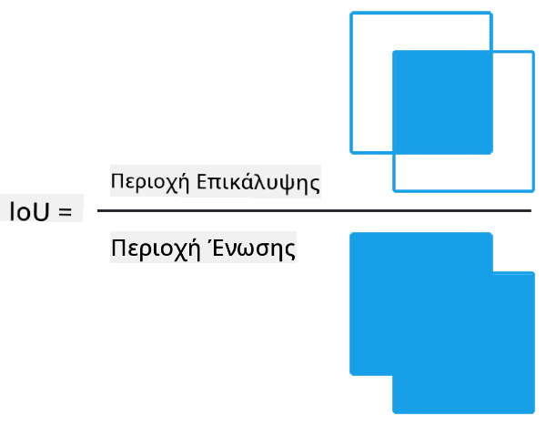
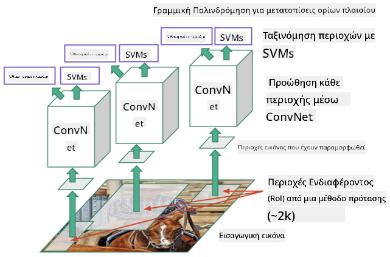
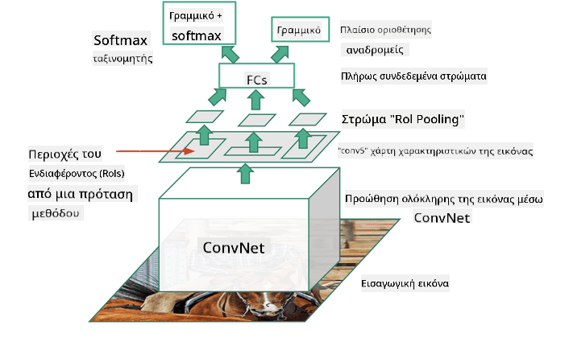
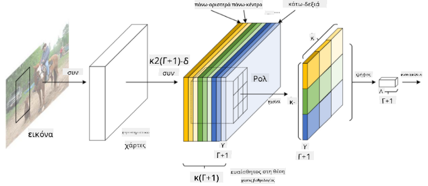

<!--
CO_OP_TRANSLATOR_METADATA:
{
  "original_hash": "d85c8b08f6d1b48fd7f35b99f93c1138",
  "translation_date": "2025-08-29T08:52:43+00:00",
  "source_file": "lessons/4-ComputerVision/11-ObjectDetection/README.md",
  "language_code": "el"
}
-->
# Ανίχνευση Αντικειμένων

Τα μοντέλα ταξινόμησης εικόνων που έχουμε εξετάσει μέχρι τώρα λαμβάνουν μια εικόνα και παράγουν ένα κατηγορηματικό αποτέλεσμα, όπως η κατηγορία 'αριθμός' σε ένα πρόβλημα MNIST. Ωστόσο, σε πολλές περιπτώσεις δεν θέλουμε απλώς να γνωρίζουμε ότι μια εικόνα απεικονίζει αντικείμενα - θέλουμε να μπορούμε να προσδιορίσουμε την ακριβή τους θέση. Αυτό ακριβώς είναι το νόημα της **ανίχνευσης αντικειμένων**.

## [Pre-lecture quiz](https://red-field-0a6ddfd03.1.azurestaticapps.net/quiz/111)

> Εικόνα από [YOLO v2 web site](https://pjreddie.com/darknet/yolov2/)

## Μια Αφελής Προσέγγιση για Ανίχνευση Αντικειμένων

Ας υποθέσουμε ότι θέλουμε να βρούμε μια γάτα σε μια εικόνα. Μια πολύ αφελής προσέγγιση για την ανίχνευση αντικειμένων θα ήταν η εξής:

1. Διαχωρίστε την εικόνα σε έναν αριθμό πλακιδίων.
2. Εκτελέστε ταξινόμηση εικόνας σε κάθε πλακίδιο.
3. Τα πλακίδια που παράγουν αρκετά υψηλή ενεργοποίηση μπορούν να θεωρηθούν ότι περιέχουν το αντικείμενο που αναζητούμε.

> *Εικόνα από [Exercise Notebook](ObjectDetection-TF.ipynb)*

Ωστόσο, αυτή η προσέγγιση απέχει πολύ από το ιδανικό, καθώς επιτρέπει στον αλγόριθμο να εντοπίσει το πλαίσιο του αντικειμένου πολύ αόριστα. Για πιο ακριβή εντοπισμό, πρέπει να εκτελέσουμε κάποιο είδος **παλινδρόμησης** για να προβλέψουμε τις συντεταγμένες των πλαισίων - και για αυτό, χρειαζόμαστε συγκεκριμένα σύνολα δεδομένων.

## Παλινδρόμηση για Ανίχνευση Αντικειμένων

[Αυτό το άρθρο](https://towardsdatascience.com/object-detection-with-neural-networks-a4e2c46b4491) παρέχει μια εξαιρετική εισαγωγή στην ανίχνευση σχημάτων.

## Σύνολα Δεδομένων για Ανίχνευση Αντικειμένων

Μπορεί να συναντήσετε τα ακόλουθα σύνολα δεδομένων για αυτήν την εργασία:

* [PASCAL VOC](http://host.robots.ox.ac.uk/pascal/VOC/) - 20 κατηγορίες
* [COCO](http://cocodataset.org/#home) - Common Objects in Context. 80 κατηγορίες, πλαίσια και μάσκες τμηματοποίησης

## Μετρικές Ανίχνευσης Αντικειμένων

### Intersection over Union

Ενώ για την ταξινόμηση εικόνων είναι εύκολο να μετρήσουμε πόσο καλά αποδίδει ο αλγόριθμος, για την ανίχνευση αντικειμένων πρέπει να μετρήσουμε τόσο την ορθότητα της κατηγορίας όσο και την ακρίβεια της προβλεπόμενης θέσης του πλαισίου. Για το τελευταίο, χρησιμοποιούμε τη λεγόμενη **Intersection over Union** (IoU), η οποία μετρά πόσο καλά επικαλύπτονται δύο πλαίσια (ή δύο αυθαίρετες περιοχές).

> *Εικόνα 2 από [αυτό το εξαιρετικό άρθρο για το IoU](https://pyimagesearch.com/2016/11/07/intersection-over-union-iou-for-object-detection/)*

Η ιδέα είναι απλή - διαιρούμε την περιοχή της τομής μεταξύ δύο σχημάτων με την περιοχή της ένωσής τους. Για δύο πανομοιότυπες περιοχές, το IoU θα είναι 1, ενώ για εντελώς ασύνδετες περιοχές θα είναι 0. Σε άλλες περιπτώσεις, θα κυμαίνεται από 0 έως 1. Συνήθως λαμβάνουμε υπόψη μόνο εκείνα τα πλαίσια για τα οποία το IoU είναι πάνω από μια συγκεκριμένη τιμή.

### Average Precision

Ας υποθέσουμε ότι θέλουμε να μετρήσουμε πόσο καλά αναγνωρίζεται μια δεδομένη κατηγορία αντικειμένων $C$. Για να το μετρήσουμε, χρησιμοποιούμε τη μετρική **Average Precision**, η οποία υπολογίζεται ως εξής:

1. Εξετάστε την καμπύλη Precision-Recall που δείχνει την ακρίβεια ανάλογα με την τιμή κατωφλίου ανίχνευσης (από 0 έως 1).
2. Ανάλογα με το κατώφλι, θα εντοπιστούν περισσότερα ή λιγότερα αντικείμενα στην εικόνα, και θα προκύψουν διαφορετικές τιμές ακρίβειας και ανάκλησης.
3. Η καμπύλη θα μοιάζει με αυτήν:

> *Εικόνα από [NeuroWorkshop](http://github.com/shwars/NeuroWorkshop)*

Η μέση ακρίβεια για μια δεδομένη κατηγορία $C$ είναι η περιοχή κάτω από αυτήν την καμπύλη. Πιο συγκεκριμένα, ο άξονας Recall συνήθως διαιρείται σε 10 μέρη, και η ακρίβεια υπολογίζεται ως μέσος όρος σε όλα αυτά τα σημεία:

$$
AP = {1\over11}\sum_{i=0}^{10}\mbox{Precision}(\mbox{Recall}={i\over10})
$$

### AP και IoU

Θα εξετάσουμε μόνο εκείνες τις ανιχνεύσεις για τις οποίες το IoU είναι πάνω από μια συγκεκριμένη τιμή. Για παράδειγμα, στο σύνολο δεδομένων PASCAL VOC συνήθως $\mbox{IoU Threshold} = 0.5$, ενώ στο COCO το AP μετράται για διαφορετικές τιμές του $\mbox{IoU Threshold}$.

> *Εικόνα από [NeuroWorkshop](http://github.com/shwars/NeuroWorkshop)*

### Mean Average Precision - mAP

Η κύρια μετρική για την ανίχνευση αντικειμένων ονομάζεται **Mean Average Precision**, ή **mAP**. Είναι η τιμή της Μέσης Ακρίβειας, μέσος όρος σε όλες τις κατηγορίες αντικειμένων, και μερικές φορές επίσης πάνω από το $\mbox{IoU Threshold}$. Η διαδικασία υπολογισμού του **mAP** περιγράφεται λεπτομερώς
[σε αυτό το άρθρο](https://medium.com/@timothycarlen/understanding-the-map-evaluation-metric-for-object-detection-a07fe6962cf3)), καθώς και [εδώ με δείγματα κώδικα](https://gist.github.com/tarlen5/008809c3decf19313de216b9208f3734).

## Διαφορετικές Προσεγγίσεις Ανίχνευσης Αντικειμένων

Υπάρχουν δύο ευρείες κατηγορίες αλγορίθμων ανίχνευσης αντικειμένων:

* **Δίκτυα Πρότασης Περιοχών** (R-CNN, Fast R-CNN, Faster R-CNN). Η βασική ιδέα είναι να δημιουργηθούν **Περιοχές Ενδιαφέροντος** (ROI) και να εκτελεστεί CNN πάνω τους, αναζητώντας μέγιστη ενεργοποίηση. Είναι κάπως παρόμοιο με την αφελή προσέγγιση, με τη διαφορά ότι οι ROI δημιουργούνται με πιο έξυπνο τρόπο. Ένα από τα κύρια μειονεκτήματα αυτών των μεθόδων είναι ότι είναι αργές, επειδή απαιτούν πολλές περάσεις του ταξινομητή CNN πάνω στην εικόνα.
* **Μέθοδοι Μιας Περάσματος** (YOLO, SSD, RetinaNet). Σε αυτές τις αρχιτεκτονικές σχεδιάζουμε το δίκτυο να προβλέπει τόσο τις κατηγορίες όσο και τις ROI σε μία μόνο διέλευση.

### R-CNN: CNN Βασισμένο σε Περιοχές

Το [R-CNN](http://islab.ulsan.ac.kr/files/announcement/513/rcnn_pami.pdf) χρησιμοποιεί [Selective Search](http://www.huppelen.nl/publications/selectiveSearchDraft.pdf) για να δημιουργήσει ιεραρχική δομή περιοχών ROI, οι οποίες στη συνέχεια περνούν από εξαγωγείς χαρακτηριστικών CNN και ταξινομητές SVM για να προσδιορίσουν την κατηγορία του αντικειμένου, και γραμμική παλινδρόμηση για να προσδιορίσουν τις συντεταγμένες του *πλαισίου*. [Επίσημο Άρθρο](https://arxiv.org/pdf/1506.01497v1.pdf)

> *Εικόνα από van de Sande et al. ICCV’11*

> *Εικόνες από [αυτό το άρθρο](https://towardsdatascience.com/r-cnn-fast-r-cnn-faster-r-cnn-yolo-object-detection-algorithms-36d53571365e)*

### F-RCNN - Fast R-CNN

Αυτή η προσέγγιση είναι παρόμοια με το R-CNN, αλλά οι περιοχές ορίζονται αφού έχουν εφαρμοστεί οι στρώσεις συνελικτικής.

> Εικόνα από [το Επίσημο Άρθρο](https://www.cv-foundation.org/openaccess/content_iccv_2015/papers/Girshick_Fast_R-CNN_ICCV_2015_paper.pdf), [arXiv](https://arxiv.org/pdf/1504.08083.pdf), 2015

### Faster R-CNN

Η βασική ιδέα αυτής της προσέγγισης είναι να χρησιμοποιηθεί ένα νευρωνικό δίκτυο για να προβλέψει τις ROI - το λεγόμενο *Region Proposal Network*. [Άρθρο](https://arxiv.org/pdf/1506.01497.pdf), 2016

> Εικόνα από [το επίσημο άρθρο](https://arxiv.org/pdf/1506.01497.pdf)

### R-FCN: Δίκτυο Πλήρως Συνελικτικό Βασισμένο σε Περιοχές

Αυτός ο αλγόριθμος είναι ακόμα πιο γρήγορος από το Faster R-CNN. Η βασική ιδέα είναι η εξής:

1. Εξάγουμε χαρακτηριστικά χρησιμοποιώντας ResNet-101.
1. Τα χαρακτηριστικά επεξεργάζονται από **Position-Sensitive Score Map**. Κάθε αντικείμενο από $C$ κατηγορίες διαιρείται σε $k\times k$ περιοχές, και εκπαιδεύουμε για να προβλέψουμε μέρη αντικειμένων.
1. Για κάθε μέρος από τις $k\times k$ περιοχές, όλα τα δίκτυα ψηφίζουν για τις κατηγορίες αντικειμένων, και η κατηγορία αντικειμένου με τη μέγιστη ψήφο επιλέγεται.

> Εικόνα από [επίσημο άρθρο](https://arxiv.org/abs/1605.06409)

### YOLO - You Only Look Once

Το YOLO είναι ένας αλγόριθμος πραγματικού χρόνου μιας διέλευσης. Η βασική ιδέα είναι η εξής:

 * Η εικόνα διαιρείται σε $S\times S$ περιοχές.
 * Για κάθε περιοχή, **CNN** προβλέπει $n$ πιθανά αντικείμενα, τις συντεταγμένες του *πλαισίου* και την *εμπιστοσύνη*=*πιθανότητα* * IoU.

 

> Εικόνα από [επίσημο άρθρο](https://arxiv.org/abs/1506.02640)

### Άλλοι Αλγόριθμοι

* RetinaNet: [επίσημο άρθρο](https://arxiv.org/abs/1708.02002)
   - [Υλοποίηση PyTorch στο Torchvision](https://pytorch.org/vision/stable/_modules/torchvision/models/detection/retinanet.html)
   - [Υλοποίηση Keras](https://github.com/fizyr/keras-retinanet)
   - [Ανίχνευση Αντικειμένων με RetinaNet](https://keras.io/examples/vision/retinanet/) στα δείγματα Keras
* SSD (Single Shot Detector): [επίσημο άρθρο](https://arxiv.org/abs/1512.02325)

## ✍️ Ασκήσεις: Ανίχνευση Αντικειμένων

Συνεχίστε τη μάθησή σας στο ακόλουθο σημειωματάριο:

[ObjectDetection.ipynb](ObjectDetection.ipynb)

## Συμπέρασμα

Σε αυτό το μάθημα κάνατε μια γρήγορη περιήγηση σε όλους τους διάφορους τρόπους με τους οποίους μπορεί να επιτευχθεί η ανίχνευση αντικειμένων!

## 🚀 Πρόκληση

Διαβάστε αυτά τα άρθρα και σημειωματάρια σχετικά με το YOLO και δοκιμάστε τα μόνοι σας:

* [Καλό άρθρο](https://www.analyticsvidhya.com/blog/2018/12/practical-guide-object-detection-yolo-framewor-python/) που περιγράφει το YOLO
 * [Επίσημος ιστότοπος](https://pjreddie.com/darknet/yolo/)
 * Yolo: [Υλοποίηση Keras](https://github.com/experiencor/keras-yolo2), [σημειωματάριο βήμα-βήμα](https://github.com/experiencor/basic-yolo-keras/blob/master/Yolo%20Step-by-Step.ipynb)
 * Yolo v2: [Υλοποίηση Keras](https://github.com/experiencor/keras-yolo2), [σημειωματάριο βήμα-βήμα](https://github.com/experiencor/keras-yolo2/blob/master/Yolo%20Step-by-Step.ipynb)

## [Post-lecture quiz](https://red-field-0a6ddfd03.1.azurestaticapps.net/quiz/211)

## Ανασκόπηση & Αυτομελέτη

* [Ανίχνευση Αντικειμένων](https://tjmachinelearning.com/lectures/1718/obj/) από τον Nikhil Sardana
* [Μια καλή σύγκριση αλγορίθμων ανίχνευσης αντικειμένων](https://lilianweng.github.io/lil-log/2018/12/27/object-detection-part-4.html)
* [Ανασκόπηση Αλγορίθμων Βαθιάς Μάθησης για Ανίχνευση Αντικειμένων](https://medium.com/comet-app/review-of-deep-learning-algorithms-for-object-detection-c1f3d437b852)
* [Εισαγωγή βήμα-βήμα στους βασικούς αλγορίθμους ανίχνευσης αντικειμένων](https://www.analyticsvidhya.com/blog/2018/10/a-step-by-step-introduction-to-the-basic-object-detection-algorithms-part-1/)
* [Υλοποίηση του Faster R-CNN σε Python για Ανίχνευση Αντικειμένων](https://www.analyticsvidhya.com/blog/2018/11/implementation-faster-r-cnn-python-object-detection/)

## [Assignment: Ανίχνευση Αντικειμένων](lab/README.md)

---

**Αποποίηση Ευθύνης**:  
Αυτό το έγγραφο έχει μεταφραστεί χρησιμοποιώντας την υπηρεσία αυτόματης μετάφρασης [Co-op Translator](https://github.com/Azure/co-op-translator). Παρόλο που καταβάλλουμε προσπάθειες για ακρίβεια, παρακαλούμε να έχετε υπόψη ότι οι αυτόματες μεταφράσεις ενδέχεται να περιέχουν σφάλματα ή ανακρίβειες. Το πρωτότυπο έγγραφο στη μητρική του γλώσσα θα πρέπει να θεωρείται η αυθεντική πηγή. Για κρίσιμες πληροφορίες, συνιστάται επαγγελματική ανθρώπινη μετάφραση. Δεν φέρουμε ευθύνη για τυχόν παρεξηγήσεις ή εσφαλμένες ερμηνείες που προκύπτουν από τη χρήση αυτής της μετάφρασης.