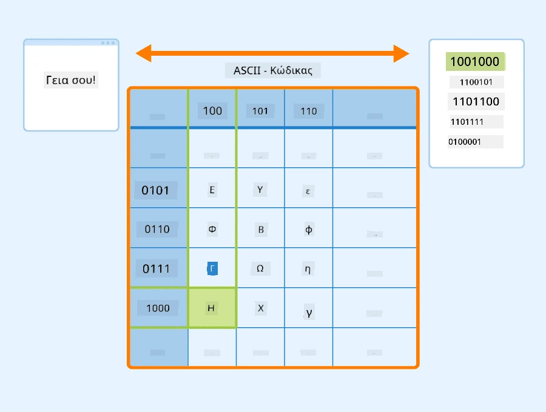
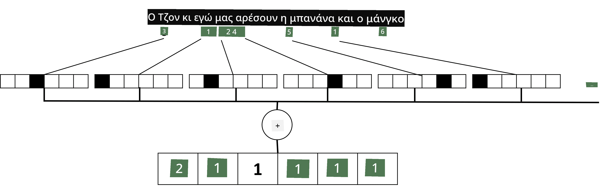

# Αναπαράσταση Κειμένου ως Τετραγωνικά Πίνακες

## [Προ-μάθημα κουίζ](https://ff-quizzes.netlify.app/en/ai/quiz/25)

## Κατηγοριοποίηση Κειμένου

Στο πρώτο μέρος αυτής της ενότητας, θα επικεντρωθούμε στην εργασία της **κατηγοριοποίησης κειμένου**. Θα χρησιμοποιήσουμε το Dataset [AG News](https://www.kaggle.com/amananandrai/ag-news-classification-dataset), το οποίο περιέχει άρθρα ειδήσεων όπως το παρακάτω:

* Κατηγορία: Επιστήμη/Τεχνολογία
* Τίτλος: Ky. Company Wins Grant to Study Peptides (AP)
* Σώμα: AP - Μια εταιρεία που ιδρύθηκε από έναν ερευνητή χημείας στο Πανεπιστήμιο του Louisville κέρδισε μια επιχορήγηση για να αναπτύξει...

Ο στόχος μας θα είναι να ταξινομήσουμε το άρθρο ειδήσεων σε μία από τις κατηγορίες βάσει του κειμένου.

## Αναπαράσταση κειμένου

Αν θέλουμε να λύσουμε εργασίες Επεξεργασίας Φυσικής Γλώσσας (NLP) με νευρωνικά δίκτυα, χρειαζόμαστε έναν τρόπο να αναπαραστήσουμε το κείμενο ως τετραγωνικούς πίνακες. Οι υπολογιστές ήδη αναπαριστούν τους χαρακτήρες κειμένου ως αριθμούς που αντιστοιχούν σε γραμματοσειρές στην οθόνη σας χρησιμοποιώντας κωδικοποιήσεις όπως ASCII ή UTF-8.

> [Πηγή εικόνας](https://www.seobility.net/en/wiki/ASCII)

Ως άνθρωποι, κατανοούμε τι **αντιπροσωπεύει** κάθε γράμμα και πώς όλοι οι χαρακτήρες συνδυάζονται για να σχηματίσουν τις λέξεις μιας πρότασης. Ωστόσο, οι υπολογιστές από μόνοι τους δεν έχουν τέτοια κατανόηση, και το νευρωνικό δίκτυο πρέπει να μάθει τη σημασία κατά τη διάρκεια της εκπαίδευσης.

Επομένως, μπορούμε να χρησιμοποιήσουμε διαφορετικές προσεγγίσεις για την αναπαράσταση του κειμένου:

* **Αναπαράσταση σε επίπεδο χαρακτήρα**, όπου αναπαριστούμε το κείμενο αντιμετωπίζοντας κάθε χαρακτήρα ως αριθμό. Δεδομένου ότι έχουμε *C* διαφορετικούς χαρακτήρες στο σώμα κειμένου μας, η λέξη *Hello* θα αναπαριστάται από έναν πίνακα 5x*C*. Κάθε γράμμα θα αντιστοιχεί σε μια στήλη του πίνακα με one-hot κωδικοποίηση.
* **Αναπαράσταση σε επίπεδο λέξης**, όπου δημιουργούμε ένα **λεξικό** όλων των λέξεων στο κείμενό μας και στη συνέχεια αναπαριστούμε τις λέξεις χρησιμοποιώντας one-hot κωδικοποίηση. Αυτή η προσέγγιση είναι κάπως καλύτερη, επειδή κάθε γράμμα από μόνο του δεν έχει μεγάλη σημασία, και έτσι χρησιμοποιώντας υψηλότερες εννοιολογικές έννοιες - λέξεις - απλοποιούμε την εργασία για το νευρωνικό δίκτυο. Ωστόσο, λόγω του μεγάλου μεγέθους του λεξικού, πρέπει να αντιμετωπίσουμε υψηλής διάστασης αραιούς πίνακες.

Ανεξάρτητα από την αναπαράσταση, πρώτα πρέπει να μετατρέψουμε το κείμενο σε μια ακολουθία **tokens**, όπου κάθε token είναι είτε ένας χαρακτήρας, μια λέξη ή μερικές φορές ακόμα και μέρος μιας λέξης. Στη συνέχεια, μετατρέπουμε το token σε έναν αριθμό, συνήθως χρησιμοποιώντας **λεξικό**, και αυτός ο αριθμός μπορεί να τροφοδοτηθεί σε ένα νευρωνικό δίκτυο χρησιμοποιώντας one-hot κωδικοποίηση.

## N-Grams

Στη φυσική γλώσσα, η ακριβής σημασία των λέξεων μπορεί να καθοριστεί μόνο στο πλαίσιο. Για παράδειγμα, οι σημασίες των *νευρωνικό δίκτυο* και *δίκτυο ψαρέματος* είναι εντελώς διαφορετικές. Ένας από τους τρόπους να το λάβουμε υπόψη είναι να χτίσουμε το μοντέλο μας πάνω σε ζεύγη λέξεων και να θεωρήσουμε τα ζεύγη λέξεων ως ξεχωριστά tokens λεξικού. Με αυτόν τον τρόπο, η πρόταση *Μου αρέσει να πηγαίνω για ψάρεμα* θα αναπαριστάται από την ακόλουθη ακολουθία tokens: *Μου αρέσει*, *αρέσει να*, *να πηγαίνω*, *πηγαίνω για ψάρεμα*. Το πρόβλημα με αυτήν την προσέγγιση είναι ότι το μέγεθος του λεξικού αυξάνεται σημαντικά, και συνδυασμοί όπως *πηγαίνω για ψάρεμα* και *πηγαίνω για ψώνια* παρουσιάζονται από διαφορετικά tokens, τα οποία δεν μοιράζονται καμία εννοιολογική ομοιότητα παρά το ίδιο ρήμα.

Σε ορισμένες περιπτώσεις, μπορούμε να εξετάσουμε τη χρήση tri-grams -- συνδυασμών τριών λέξεων -- επίσης. Έτσι, η προσέγγιση αυτή συχνά ονομάζεται **n-grams**. Επίσης, έχει νόημα να χρησιμοποιούμε n-grams με αναπαράσταση σε επίπεδο χαρακτήρα, όπου τα n-grams θα αντιστοιχούν περίπου σε διαφορετικές συλλαβές.

## Bag-of-Words και TF/IDF

Όταν λύνουμε εργασίες όπως η κατηγοριοποίηση κειμένου, πρέπει να μπορούμε να αναπαραστήσουμε το κείμενο με έναν σταθερού μεγέθους πίνακα, τον οποίο θα χρησιμοποιήσουμε ως είσοδο στον τελικό πυκνό ταξινομητή. Ένας από τους απλούστερους τρόπους να το κάνουμε αυτό είναι να συνδυάσουμε όλες τις ατομικές αναπαραστάσεις λέξεων, π.χ. προσθέτοντάς τες. Αν προσθέσουμε τις one-hot κωδικοποιήσεις κάθε λέξης, θα καταλήξουμε με έναν πίνακα συχνοτήτων, που δείχνει πόσες φορές εμφανίζεται κάθε λέξη μέσα στο κείμενο. Αυτή η αναπαράσταση του κειμένου ονομάζεται **bag of words** (BoW).

> Εικόνα από τον συγγραφέα

Ένα BoW ουσιαστικά αναπαριστά ποιες λέξεις εμφανίζονται στο κείμενο και σε ποιες ποσότητες, κάτι που μπορεί πράγματι να είναι μια καλή ένδειξη για το τι αφορά το κείμενο. Για παράδειγμα, ένα άρθρο ειδήσεων για την πολιτική είναι πιθανό να περιέχει λέξεις όπως *πρόεδρος* και *χώρα*, ενώ μια επιστημονική δημοσίευση θα έχει κάτι όπως *επιταχυντής*, *ανακαλύφθηκε*, κλπ. Έτσι, οι συχνότητες λέξεων μπορούν σε πολλές περιπτώσεις να είναι μια καλή ένδειξη του περιεχομένου του κειμένου.

Το πρόβλημα με το BoW είναι ότι ορισμένες κοινές λέξεις, όπως *και*, *είναι*, κλπ., εμφανίζονται στα περισσότερα κείμενα και έχουν τις υψηλότερες συχνότητες, καλύπτοντας τις λέξεις που είναι πραγματικά σημαντικές. Μπορούμε να μειώσουμε τη σημασία αυτών των λέξεων λαμβάνοντας υπόψη τη συχνότητα με την οποία εμφανίζονται σε ολόκληρη τη συλλογή εγγράφων. Αυτή είναι η βασική ιδέα πίσω από την προσέγγιση TF/IDF, η οποία καλύπτεται πιο λεπτομερώς στα σημειωματάρια που επισυνάπτονται σε αυτό το μάθημα.

Ωστόσο, καμία από αυτές τις προσεγγίσεις δεν μπορεί να λάβει πλήρως υπόψη τη **σημασιολογία** του κειμένου. Χρειαζόμαστε πιο ισχυρά μοντέλα νευρωνικών δικτύων για να το κάνουμε αυτό, τα οποία θα συζητήσουμε αργότερα σε αυτή την ενότητα.

## ✍️ Ασκήσεις: Αναπαράσταση Κειμένου

Συνεχίστε τη μάθησή σας στα παρακάτω σημειωματάρια:

* [Αναπαράσταση Κειμένου με PyTorch](TextRepresentationPyTorch.ipynb)
* [Αναπαράσταση Κειμένου με TensorFlow](TextRepresentationTF.ipynb)

## Συμπέρασμα

Μέχρι στιγμής, έχουμε μελετήσει τεχνικές που μπορούν να προσθέσουν βάρος συχνότητας σε διαφορετικές λέξεις. Ωστόσο, δεν είναι σε θέση να αναπαραστήσουν τη σημασία ή τη σειρά. Όπως είπε ο διάσημος γλωσσολόγος J. R. Firth το 1935, "Η πλήρης σημασία μιας λέξης είναι πάντα συμφραζόμενη, και καμία μελέτη της σημασίας εκτός του συμφραζομένου δεν μπορεί να ληφθεί σοβαρά." Θα μάθουμε αργότερα στο μάθημα πώς να συλλάβουμε συμφραζόμενες πληροφορίες από το κείμενο χρησιμοποιώντας μοντελοποίηση γλώσσας.

## 🚀 Πρόκληση

Δοκιμάστε μερικές άλλες ασκήσεις χρησιμοποιώντας bag-of-words και διαφορετικά μοντέλα δεδομένων. Μπορεί να εμπνευστείτε από αυτόν τον [διαγωνισμό στο Kaggle](https://www.kaggle.com/competitions/word2vec-nlp-tutorial/overview/part-1-for-beginners-bag-of-words)

## [Μετά το μάθημα κουίζ](https://ff-quizzes.netlify.app/en/ai/quiz/26)

## Ανασκόπηση & Αυτομελέτη

Εξασκήστε τις δεξιότητές σας με τεχνικές ενσωμάτωσης κειμένου και bag-of-words στο [Microsoft Learn](https://docs.microsoft.com/learn/modules/intro-natural-language-processing-pytorch/?WT.mc_id=academic-77998-cacaste)

## [Εργασία: Σημειωματάρια](assignment.md)

---

