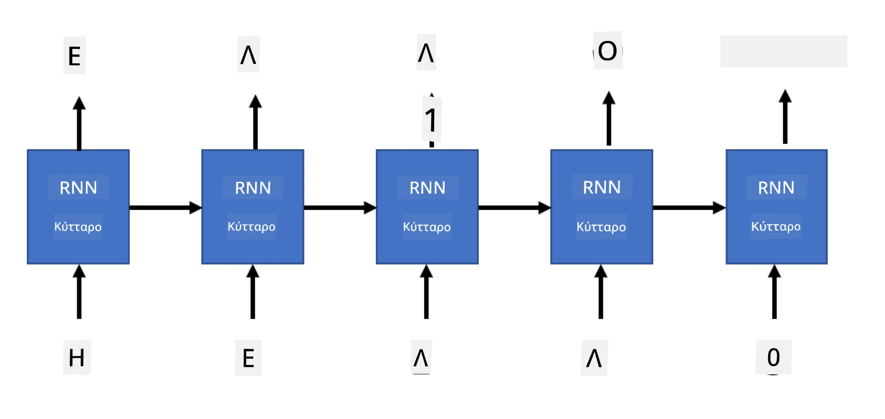

# Γενετικά Δίκτυα

## [Προ-διάλεξης κουίζ](https://ff-quizzes.netlify.app/en/ai/quiz/33)

Τα Επαναληπτικά Νευρωνικά Δίκτυα (RNNs) και οι παραλλαγές τους με πύλες, όπως τα Long Short Term Memory Cells (LSTMs) και Gated Recurrent Units (GRUs), παρέχουν έναν μηχανισμό για τη μοντελοποίηση γλώσσας, καθώς μπορούν να μάθουν τη σειρά των λέξεων και να προβλέψουν την επόμενη λέξη σε μια ακολουθία. Αυτό μας επιτρέπει να χρησιμοποιούμε τα RNNs για **γενετικές εργασίες**, όπως η απλή δημιουργία κειμένου, η μηχανική μετάφραση και ακόμη και η περιγραφή εικόνων.

> ✅ Σκεφτείτε όλες τις φορές που έχετε επωφεληθεί από γενετικές εργασίες, όπως η ολοκλήρωση κειμένου καθώς πληκτρολογείτε. Κάντε μια έρευνα για τις αγαπημένες σας εφαρμογές για να δείτε αν χρησιμοποίησαν RNNs.

Στην αρχιτεκτονική RNN που συζητήσαμε στην προηγούμενη ενότητα, κάθε μονάδα RNN παρήγαγε την επόμενη κρυφή κατάσταση ως έξοδο. Ωστόσο, μπορούμε επίσης να προσθέσουμε μια άλλη έξοδο σε κάθε επαναληπτική μονάδα, η οποία θα μας επιτρέψει να παράγουμε μια **ακολουθία** (ίση σε μήκος με την αρχική ακολουθία). Επιπλέον, μπορούμε να χρησιμοποιήσουμε μονάδες RNN που δεν δέχονται είσοδο σε κάθε βήμα, αλλά λαμβάνουν μόνο έναν αρχικό διανυσματικό κατάσταση και στη συνέχεια παράγουν μια ακολουθία εξόδων.

Αυτό επιτρέπει διαφορετικές νευρωνικές αρχιτεκτονικές, όπως φαίνεται στην παρακάτω εικόνα:


> Εικόνα από το blog post [Unreasonable Effectiveness of Recurrent Neural Networks](http://karpathy.github.io/2015/05/21/rnn-effectiveness/) του [Andrej Karpaty](http://karpathy.github.io/)

* **Ένα-προς-ένα** είναι ένα παραδοσιακό νευρωνικό δίκτυο με μία είσοδο και μία έξοδο
* **Ένα-προς-πολλά** είναι μια γενετική αρχιτεκτονική που δέχεται μία τιμή εισόδου και παράγει μια ακολουθία εξόδων. Για παράδειγμα, αν θέλουμε να εκπαιδεύσουμε ένα δίκτυο **περιγραφής εικόνας** που θα παράγει μια κειμενική περιγραφή μιας εικόνας, μπορούμε να δώσουμε την εικόνα ως είσοδο, να την περάσουμε μέσα από ένα CNN για να αποκτήσουμε την κρυφή της κατάσταση και στη συνέχεια να έχουμε μια επαναληπτική αλυσίδα που θα παράγει την περιγραφή λέξη προς λέξη.
* **Πολλά-προς-ένα** αντιστοιχεί στις αρχιτεκτονικές RNN που περιγράψαμε στην προηγούμενη ενότητα, όπως η ταξινόμηση κειμένου.
* **Πολλά-προς-πολλά**, ή **ακολουθία-προς-ακολουθία**, αντιστοιχεί σε εργασίες όπως η **μηχανική μετάφραση**, όπου έχουμε πρώτα ένα RNN που συλλέγει όλες τις πληροφορίες από την ακολουθία εισόδου στην κρυφή κατάσταση και μια άλλη αλυσίδα RNN που ξετυλίγει αυτή την κατάσταση στην ακολουθία εξόδου.

Σε αυτή την ενότητα, θα επικεντρωθούμε σε απλά γενετικά μοντέλα που μας βοηθούν να δημιουργούμε κείμενο. Για απλότητα, θα χρησιμοποιήσουμε το επίπεδο χαρακτήρων για την τοκενοποίηση.

Θα εκπαιδεύσουμε αυτό το RNN να δημιουργεί κείμενο βήμα προς βήμα. Σε κάθε βήμα, θα πάρουμε μια ακολουθία χαρακτήρων μήκους `nchars` και θα ζητήσουμε από το δίκτυο να παράγει τον επόμενο χαρακτήρα εξόδου για κάθε χαρακτήρα εισόδου:



Κατά τη δημιουργία κειμένου (κατά την πρόβλεψη), ξεκινάμε με κάποιο **προτροπή**, η οποία περνά μέσα από τα RNN cells για να δημιουργήσει την ενδιάμεση κατάσταση, και στη συνέχεια από αυτή την κατάσταση ξεκινά η δημιουργία. Παράγουμε έναν χαρακτήρα τη φορά και περνάμε την κατάσταση και τον παραγόμενο χαρακτήρα σε άλλο RNN cell για να δημιουργήσουμε τον επόμενο, μέχρι να δημιουργήσουμε αρκετούς χαρακτήρες.


> Εικόνα από τον συγγραφέα

## ✍️ Ασκήσεις: Γενετικά Δίκτυα

Συνεχίστε τη μάθησή σας στα παρακάτω notebooks:

* [Γενετικά Δίκτυα με PyTorch](GenerativePyTorch.ipynb)
* [Γενετικά Δίκτυα με TensorFlow](GenerativeTF.ipynb)

## Μαλακή δημιουργία κειμένου και θερμοκρασία

Η έξοδος κάθε RNN cell είναι μια κατανομή πιθανότητας χαρακτήρων. Αν πάντα επιλέγουμε τον χαρακτήρα με την υψηλότερη πιθανότητα ως τον επόμενο χαρακτήρα στο παραγόμενο κείμενο, το κείμενο συχνά μπορεί να "κυκλώνεται" μεταξύ των ίδιων ακολουθιών χαρακτήρων ξανά και ξανά, όπως σε αυτό το παράδειγμα:

```
today of the second the company and a second the company ...
```

Ωστόσο, αν κοιτάξουμε την κατανομή πιθανότητας για τον επόμενο χαρακτήρα, μπορεί να είναι ότι η διαφορά μεταξύ μερικών υψηλότερων πιθανότητων δεν είναι μεγάλη, π.χ. ένας χαρακτήρας μπορεί να έχει πιθανότητα 0.2, άλλος - 0.19, κλπ. Για παράδειγμα, όταν ψάχνουμε τον επόμενο χαρακτήρα στην ακολουθία '*play*', ο επόμενος χαρακτήρας μπορεί εξίσου να είναι είτε κενό είτε **e** (όπως στη λέξη *player*).

Αυτό μας οδηγεί στο συμπέρασμα ότι δεν είναι πάντα "δίκαιο" να επιλέγουμε τον χαρακτήρα με την υψηλότερη πιθανότητα, επειδή η επιλογή του δεύτερου υψηλότερου μπορεί ακόμα να μας οδηγήσει σε νόημα κείμενο. Είναι πιο σοφό να **δειγματοληπτούμε** χαρακτήρες από την κατανομή πιθανότητας που δίνεται από την έξοδο του δικτύου. Μπορούμε επίσης να χρησιμοποιήσουμε μια παράμετρο, **θερμοκρασία**, που θα εξομαλύνει την κατανομή πιθανότητας, αν θέλουμε να προσθέσουμε περισσότερη τυχαιότητα, ή να την κάνουμε πιο απότομη, αν θέλουμε να παραμείνουμε περισσότερο στους χαρακτήρες με την υψηλότερη πιθανότητα.

Εξερευνήστε πώς αυτή η μαλακή δημιουργία κειμένου υλοποιείται στα notebooks που συνδέονται παραπάνω.

## Συμπέρασμα

Ενώ η δημιουργία κειμένου μπορεί να είναι χρήσιμη από μόνη της, τα κύρια οφέλη προέρχονται από την ικανότητα να δημιουργούμε κείμενο χρησιμοποιώντας RNNs από κάποιο αρχικό διανυσματικό χαρακτηριστικό. Για παράδειγμα, η δημιουργία κειμένου χρησιμοποιείται ως μέρος της μηχανικής μετάφρασης (ακολουθία-προς-ακολουθία, σε αυτή την περίπτωση ο διανυσματικός κατάσταση από τον *encoder* χρησιμοποιείται για να δημιουργήσει ή να *αποκωδικοποιήσει* το μεταφρασμένο μήνυμα), ή για τη δημιουργία κειμενικής περιγραφής μιας εικόνας (σε αυτή την περίπτωση ο διανυσματικός χαρακτηριστικό προέρχεται από τον εξαγωγέα CNN).

## 🚀 Πρόκληση

Πάρτε μερικά μαθήματα στο Microsoft Learn για αυτό το θέμα

* Δημιουργία Κειμένου με [PyTorch](https://docs.microsoft.com/learn/modules/intro-natural-language-processing-pytorch/6-generative-networks/?WT.mc_id=academic-77998-cacaste)/[TensorFlow](https://docs.microsoft.com/learn/modules/intro-natural-language-processing-tensorflow/5-generative-networks/?WT.mc_id=academic-77998-cacaste)

## [Μετά-διάλεξης κουίζ](https://ff-quizzes.netlify.app/en/ai/quiz/34)

## Ανασκόπηση & Αυτομελέτη

Ακολουθούν μερικά άρθρα για να επεκτείνετε τις γνώσεις σας

* Διαφορετικές προσεγγίσεις για τη δημιουργία κειμένου με Markov Chain, LSTM και GPT-2: [blog post](https://towardsdatascience.com/text-generation-gpt-2-lstm-markov-chain-9ea371820e1e)
* Παράδειγμα δημιουργίας κειμένου στην [τεκμηρίωση Keras](https://keras.io/examples/generative/lstm_character_level_text_generation/)

## [Εργασία](lab/README.md)

Έχουμε δει πώς να δημιουργούμε κείμενο χαρακτήρα προς χαρακτήρα. Στο εργαστήριο, θα εξερευνήσετε τη δημιουργία κειμένου σε επίπεδο λέξεων.

---

