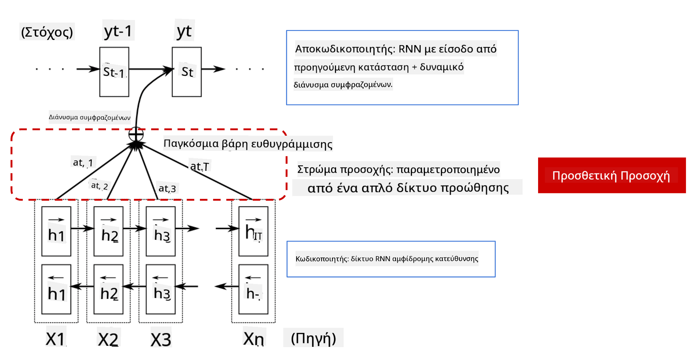

<!--
CO_OP_TRANSLATOR_METADATA:
{
  "original_hash": "7e617f0b8de85a43957a853aba09bfeb",
  "translation_date": "2025-08-29T09:19:32+00:00",
  "source_file": "lessons/5-NLP/18-Transformers/README.md",
  "language_code": "el"
}
-->
# Μηχανισμοί Προσοχής και Μετασχηματιστές

## [Προ-διάλεξης κουίζ](https://ff-quizzes.netlify.app/en/ai/quiz/35)

Ένα από τα πιο σημαντικά προβλήματα στον τομέα της Επεξεργασίας Φυσικής Γλώσσας (NLP) είναι η **μετάφραση μηχανής**, μια βασική εργασία που υποστηρίζει εργαλεία όπως το Google Translate. Σε αυτή την ενότητα, θα επικεντρωθούμε στη μετάφραση μηχανής ή, γενικότερα, σε οποιαδήποτε εργασία *ακολουθίας-προς-ακολουθία* (η οποία ονομάζεται επίσης **μετατροπή προτάσεων**).

Με τα RNNs, η ακολουθία-προς-ακολουθία υλοποιείται από δύο επαναλαμβανόμενα δίκτυα, όπου το ένα δίκτυο, ο **κωδικοποιητής** (encoder), συμπυκνώνει μια εισαγόμενη ακολουθία σε μια κρυφή κατάσταση, ενώ το άλλο δίκτυο, ο **αποκωδικοποιητής** (decoder), ξεδιπλώνει αυτή την κρυφή κατάσταση σε ένα μεταφρασμένο αποτέλεσμα. Υπάρχουν όμως κάποια προβλήματα με αυτή την προσέγγιση:

* Η τελική κατάσταση του δικτύου κωδικοποιητή δυσκολεύεται να θυμηθεί την αρχή μιας πρότασης, προκαλώντας χαμηλή ποιότητα του μοντέλου για μεγάλες προτάσεις.
* Όλες οι λέξεις σε μια ακολουθία έχουν την ίδια επίδραση στο αποτέλεσμα. Στην πραγματικότητα, όμως, συγκεκριμένες λέξεις στην εισαγόμενη ακολουθία συχνά έχουν μεγαλύτερη επίδραση στις διαδοχικές εξόδους από άλλες.

Οι **Μηχανισμοί Προσοχής** παρέχουν έναν τρόπο να δίνεται βάρος στο συμφραζόμενο αντίκτυπο κάθε εισαγόμενου διανύσματος σε κάθε πρόβλεψη εξόδου του RNN. Αυτό υλοποιείται δημιουργώντας συντομεύσεις μεταξύ των ενδιάμεσων καταστάσεων του εισαγόμενου RNN και του εξερχόμενου RNN. Με αυτόν τον τρόπο, κατά τη δημιουργία του συμβόλου εξόδου yt, λαμβάνουμε υπόψη όλες τις κρυφές καταστάσεις εισόδου hi, με διαφορετικούς συντελεστές βάρους αt,i.

> Το μοντέλο κωδικοποιητή-αποκωδικοποιητή με μηχανισμό πρόσθετης προσοχής στο [Bahdanau et al., 2015](https://arxiv.org/pdf/1409.0473.pdf), από [αυτή την ανάρτηση](https://lilianweng.github.io/lil-log/2018/06/24/attention-attention.html)

Ο πίνακας προσοχής {αi,j} αντιπροσωπεύει τον βαθμό στον οποίο συγκεκριμένες λέξεις εισόδου επηρεάζουν τη δημιουργία μιας δεδομένης λέξης στην ακολουθία εξόδου. Παρακάτω είναι ένα παράδειγμα ενός τέτοιου πίνακα:

> Εικόνα από [Bahdanau et al., 2015](https://arxiv.org/pdf/1409.0473.pdf) (Εικ.3)

Οι μηχανισμοί προσοχής είναι υπεύθυνοι για μεγάλο μέρος της τρέχουσας ή σχεδόν τρέχουσας κατάστασης της τέχνης στο NLP. Ωστόσο, η προσθήκη προσοχής αυξάνει σημαντικά τον αριθμό των παραμέτρων του μοντέλου, κάτι που οδήγησε σε προβλήματα κλιμάκωσης με τα RNNs. Ένας βασικός περιορισμός της κλιμάκωσης των RNNs είναι ότι η επαναληπτική φύση των μοντέλων καθιστά δύσκολη την ομαδοποίηση και την παραλληλοποίηση της εκπαίδευσης. Σε ένα RNN, κάθε στοιχείο μιας ακολουθίας πρέπει να επεξεργαστεί με σειριακή σειρά, κάτι που σημαίνει ότι δεν μπορεί να παραλληλοποιηθεί εύκολα.

> Εικόνα από [το Blog της Google](https://research.googleblog.com/2016/09/a-neural-network-for-machine.html)

Η υιοθέτηση μηχανισμών προσοχής σε συνδυασμό με αυτόν τον περιορισμό οδήγησε στη δημιουργία των πλέον κορυφαίων μοντέλων Μετασχηματιστών που γνωρίζουμε και χρησιμοποιούμε σήμερα, όπως το BERT και το Open-GPT3.

## Μοντέλα Μετασχηματιστών

Μία από τις κύριες ιδέες πίσω από τους μετασχηματιστές είναι να αποφευχθεί η σειριακή φύση των RNNs και να δημιουργηθεί ένα μοντέλο που να μπορεί να παραλληλοποιηθεί κατά την εκπαίδευση. Αυτό επιτυγχάνεται με την υλοποίηση δύο ιδεών:

* κωδικοποίηση θέσης
* χρήση μηχανισμού αυτοπροσοχής για την ανίχνευση μοτίβων αντί για RNNs (ή CNNs) (γι' αυτό το άρθρο που εισάγει τους μετασχηματιστές ονομάζεται *[Attention is all you need](https://arxiv.org/abs/1706.03762)*)

### Κωδικοποίηση/Ενσωμάτωση Θέσης

Η ιδέα της κωδικοποίησης θέσης είναι η εξής:  
1. Όταν χρησιμοποιούμε RNNs, η σχετική θέση των τοκενών αντιπροσωπεύεται από τον αριθμό των βημάτων και, επομένως, δεν χρειάζεται να αναπαρασταθεί ρητά.  
2. Ωστόσο, όταν μεταβαίνουμε στην προσοχή, πρέπει να γνωρίζουμε τις σχετικές θέσεις των τοκενών μέσα σε μια ακολουθία.  
3. Για να αποκτήσουμε κωδικοποίηση θέσης, προσθέτουμε στην ακολουθία των τοκενών μια ακολουθία θέσεων τοκενών (δηλαδή, μια ακολουθία αριθμών 0,1, ...).  
4. Στη συνέχεια, συνδυάζουμε τη θέση του τοκεν με ένα διανυσματικό ενσωμάτωμα τοκεν. Για να μετατρέψουμε τη θέση (ακέραιος αριθμός) σε διάνυσμα, μπορούμε να χρησιμοποιήσουμε διαφορετικές προσεγγίσεις:

* Εκπαιδεύσιμο ενσωμάτωμα, παρόμοιο με το ενσωμάτωμα τοκεν. Αυτή είναι η προσέγγιση που εξετάζουμε εδώ. Εφαρμόζουμε επίπεδα ενσωμάτωσης τόσο στα τοκεν όσο και στις θέσεις τους, με αποτέλεσμα διανύσματα ενσωμάτωσης των ίδιων διαστάσεων, τα οποία στη συνέχεια προσθέτουμε.
* Σταθερή συνάρτηση κωδικοποίησης θέσης, όπως προτάθηκε στο αρχικό άρθρο.

> Εικόνα από τον συγγραφέα

Το αποτέλεσμα που λαμβάνουμε με την ενσωμάτωση θέσης περιλαμβάνει τόσο το αρχικό τοκεν όσο και τη θέση του μέσα σε μια ακολουθία.

### Μηχανισμός Αυτοπροσοχής με Πολλαπλές Κεφαλές

Στη συνέχεια, πρέπει να ανιχνεύσουμε κάποια μοτίβα μέσα στην ακολουθία μας. Για να το κάνουμε αυτό, οι μετασχηματιστές χρησιμοποιούν έναν μηχανισμό **αυτοπροσοχής**, ο οποίος είναι ουσιαστικά προσοχή που εφαρμόζεται στην ίδια ακολουθία ως είσοδος και έξοδος. Η εφαρμογή αυτοπροσοχής μας επιτρέπει να λαμβάνουμε υπόψη το **συμφραζόμενο** μέσα στην πρόταση και να βλέπουμε ποιες λέξεις σχετίζονται μεταξύ τους. Για παράδειγμα, μας επιτρέπει να βλέπουμε ποιες λέξεις αναφέρονται από αντωνυμίες, όπως *αυτό*, και να λαμβάνουμε υπόψη το συμφραζόμενο:

> Εικόνα από το [Blog της Google](https://research.googleblog.com/2017/08/transformer-novel-neural-network.html)

Στους μετασχηματιστές, χρησιμοποιούμε **Προσοχή με Πολλαπλές Κεφαλές** για να δώσουμε στο δίκτυο τη δυνατότητα να ανιχνεύει διάφορους τύπους εξαρτήσεων, π.χ. σχέσεις λέξεων μακράς ή βραχείας διάρκειας, συσχετίσεις αντωνυμιών κ.λπ.

[Notebook TensorFlow](TransformersTF.ipynb) περιέχει περισσότερες λεπτομέρειες για την υλοποίηση των επιπέδων μετασχηματιστών.

### Προσοχή Κωδικοποιητή-Αποκωδικοποιητή

Στους μετασχηματιστές, η προσοχή χρησιμοποιείται σε δύο σημεία:

* Για την ανίχνευση μοτίβων μέσα στο κείμενο εισόδου μέσω αυτοπροσοχής.
* Για την εκτέλεση μετάφρασης ακολουθιών - είναι το επίπεδο προσοχής μεταξύ κωδικοποιητή και αποκωδικοποιητή.

Η προσοχή κωδικοποιητή-αποκωδικοποιητή είναι πολύ παρόμοια με τον μηχανισμό προσοχής που χρησιμοποιείται στα RNNs, όπως περιγράφηκε στην αρχή αυτής της ενότητας. Αυτό το κινούμενο διάγραμμα εξηγεί τον ρόλο της προσοχής κωδικοποιητή-αποκωδικοποιητή.

Δεδομένου ότι κάθε θέση εισόδου αντιστοιχίζεται ανεξάρτητα σε κάθε θέση εξόδου, οι μετασχηματιστές μπορούν να παραλληλοποιηθούν καλύτερα από τα RNNs, κάτι που επιτρέπει τη δημιουργία πολύ μεγαλύτερων και πιο εκφραστικών γλωσσικών μοντέλων. Κάθε κεφαλή προσοχής μπορεί να χρησιμοποιηθεί για να μάθει διαφορετικές σχέσεις μεταξύ λέξεων, βελτιώνοντας τις εργασίες Επεξεργασίας Φυσικής Γλώσσας.

## BERT

Το **BERT** (Bidirectional Encoder Representations from Transformers) είναι ένα πολύ μεγάλο πολυεπίπεδο δίκτυο μετασχηματιστών με 12 επίπεδα για το *BERT-base* και 24 για το *BERT-large*. Το μοντέλο εκπαιδεύεται αρχικά σε ένα μεγάλο σώμα κειμένου (WikiPedia + βιβλία) χρησιμοποιώντας μη επιβλεπόμενη εκπαίδευση (πρόβλεψη καλυμμένων λέξεων σε μια πρόταση). Κατά τη διάρκεια της αρχικής εκπαίδευσης, το μοντέλο απορροφά σημαντικά επίπεδα κατανόησης της γλώσσας, τα οποία μπορούν στη συνέχεια να αξιοποιηθούν με άλλα σύνολα δεδομένων μέσω προσαρμογής. Αυτή η διαδικασία ονομάζεται **μεταφορά μάθησης**.

> Εικόνα [πηγή](http://jalammar.github.io/illustrated-bert/)

## ✍️ Ασκήσεις: Μετασχηματιστές

Συνεχίστε τη μάθησή σας στα παρακάτω notebooks:

* [Μετασχηματιστές σε PyTorch](TransformersPyTorch.ipynb)
* [Μετασχηματιστές σε TensorFlow](TransformersTF.ipynb)

## Συμπέρασμα

Σε αυτό το μάθημα μάθατε για τους Μετασχηματιστές και τους Μηχανισμούς Προσοχής, όλα απαραίτητα εργαλεία στο κουτί εργαλείων του NLP. Υπάρχουν πολλές παραλλαγές αρχιτεκτονικών Μετασχηματιστών, όπως το BERT, το DistilBERT, το BigBird, το OpenGPT3 και άλλα, που μπορούν να προσαρμοστούν. Το [πακέτο HuggingFace](https://github.com/huggingface/) παρέχει αποθετήριο για την εκπαίδευση πολλών από αυτές τις αρχιτεκτονικές τόσο με PyTorch όσο και με TensorFlow.

## 🚀 Πρόκληση

## [Μετά-διάλεξης κουίζ](https://ff-quizzes.netlify.app/en/ai/quiz/36)

## Ανασκόπηση & Αυτομελέτη

* [Ανάρτηση στο blog](https://mchromiak.github.io/articles/2017/Sep/12/Transformer-Attention-is-all-you-need/), που εξηγεί το κλασικό άρθρο [Attention is all you need](https://arxiv.org/abs/1706.03762) για τους μετασχηματιστές.
* [Μια σειρά από αναρτήσεις στο blog](https://towardsdatascience.com/transformers-explained-visually-part-1-overview-of-functionality-95a6dd460452) για τους μετασχηματιστές, που εξηγούν την αρχιτεκτονική με λεπτομέρεια.

## [Εργασία](assignment.md)

---

**Αποποίηση Ευθύνης**:  
Αυτό το έγγραφο έχει μεταφραστεί χρησιμοποιώντας την υπηρεσία αυτόματης μετάφρασης [Co-op Translator](https://github.com/Azure/co-op-translator). Παρόλο που καταβάλλουμε προσπάθειες για ακρίβεια, παρακαλούμε να έχετε υπόψη ότι οι αυτόματες μεταφράσεις ενδέχεται να περιέχουν σφάλματα ή ανακρίβειες. Το πρωτότυπο έγγραφο στη μητρική του γλώσσα θα πρέπει να θεωρείται η αυθεντική πηγή. Για κρίσιμες πληροφορίες, συνιστάται επαγγελματική ανθρώπινη μετάφραση. Δεν φέρουμε ευθύνη για τυχόν παρεξηγήσεις ή εσφαλμένες ερμηνείες που προκύπτουν από τη χρήση αυτής της μετάφρασης.