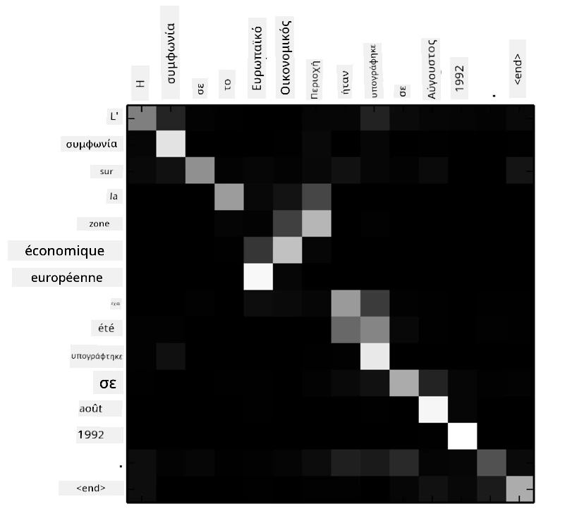
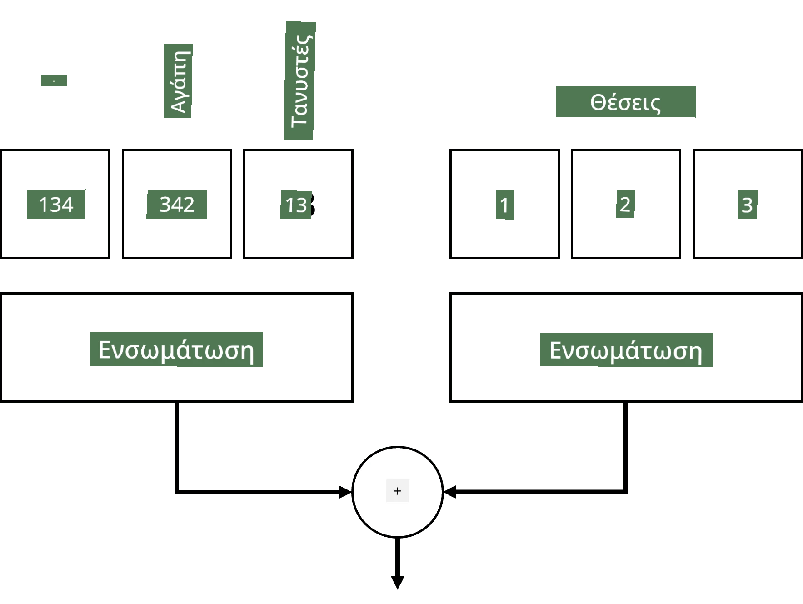
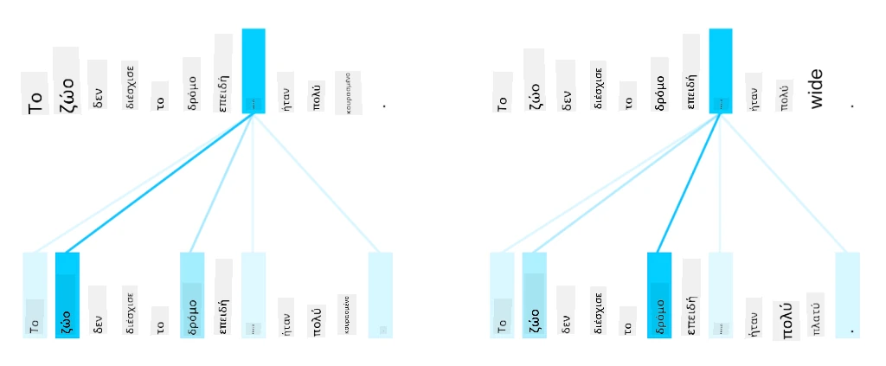
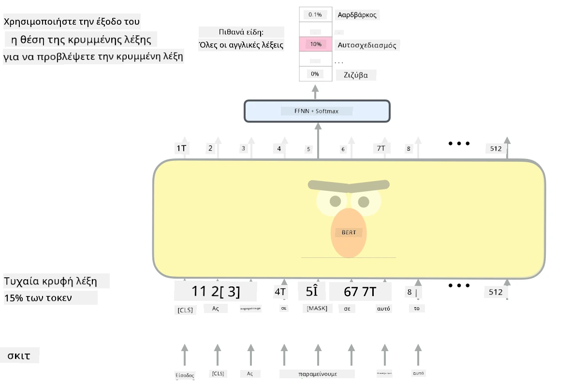

# Μηχανισμοί Προσοχής και Transformers

## [Προ-διάλεξης κουίζ](https://ff-quizzes.netlify.app/en/ai/quiz/35)

Ένα από τα πιο σημαντικά προβλήματα στον τομέα της Επεξεργασίας Φυσικής Γλώσσας (NLP) είναι η **μετάφραση μηχανής**, μια βασική εργασία που υποστηρίζει εργαλεία όπως το Google Translate. Σε αυτή την ενότητα, θα επικεντρωθούμε στη μετάφραση μηχανής ή, γενικότερα, σε οποιαδήποτε εργασία *ακολουθίας-προς-ακολουθία* (η οποία ονομάζεται επίσης **μετατροπή πρότασης**).

Με τα RNNs, η ακολουθία-προς-ακολουθία υλοποιείται από δύο επαναλαμβανόμενα δίκτυα, όπου το ένα δίκτυο, ο **encoder**, συμπιέζει μια εισαγωγική ακολουθία σε μια κρυφή κατάσταση, ενώ το άλλο δίκτυο, ο **decoder**, ξεδιπλώνει αυτή την κρυφή κατάσταση σε ένα μεταφρασμένο αποτέλεσμα. Υπάρχουν μερικά προβλήματα με αυτή την προσέγγιση:

* Η τελική κατάσταση του encoder δυσκολεύεται να θυμηθεί την αρχή μιας πρότασης, προκαλώντας χαμηλή ποιότητα του μοντέλου για μεγάλες προτάσεις.
* Όλες οι λέξεις σε μια ακολουθία έχουν την ίδια επίδραση στο αποτέλεσμα. Στην πραγματικότητα, όμως, συγκεκριμένες λέξεις στην εισαγωγική ακολουθία συχνά έχουν μεγαλύτερη επίδραση στις επόμενες εξόδους από άλλες.

Οι **Μηχανισμοί Προσοχής** παρέχουν έναν τρόπο να δίνεται βάρος στην επίδραση κάθε εισαγωγικού διανύσματος στο κάθε αποτέλεσμα πρόβλεψης του RNN. Αυτό υλοποιείται δημιουργώντας συντομεύσεις μεταξύ των ενδιάμεσων καταστάσεων του εισαγωγικού RNN και του εξαγωγικού RNN. Με αυτόν τον τρόπο, κατά τη δημιουργία του εξαγωγικού συμβόλου yt, λαμβάνουμε υπόψη όλες τις κρυφές καταστάσεις εισόδου hi, με διαφορετικούς συντελεστές βάρους &alpha;t,i.

> Το μοντέλο encoder-decoder με μηχανισμό πρόσθετης προσοχής στο [Bahdanau et al., 2015](https://arxiv.org/pdf/1409.0473.pdf), από [αυτό το blog post](https://lilianweng.github.io/lil-log/2018/06/24/attention-attention.html)

Ο πίνακας προσοχής {&alpha;i,j} αντιπροσωπεύει τον βαθμό στον οποίο συγκεκριμένες λέξεις εισόδου συμβάλλουν στη δημιουργία μιας δεδομένης λέξης στην εξαγωγική ακολουθία. Παρακάτω είναι ένα παράδειγμα ενός τέτοιου πίνακα:

> Εικόνα από [Bahdanau et al., 2015](https://arxiv.org/pdf/1409.0473.pdf) (Fig.3)

Οι μηχανισμοί προσοχής είναι υπεύθυνοι για μεγάλο μέρος της τρέχουσας ή σχεδόν τρέχουσας κατάστασης της τέχνης στο NLP. Ωστόσο, η προσθήκη προσοχής αυξάνει σημαντικά τον αριθμό των παραμέτρων του μοντέλου, κάτι που οδήγησε σε προβλήματα κλιμάκωσης με τα RNNs. Ένας βασικός περιορισμός της κλιμάκωσης των RNNs είναι ότι η επαναλαμβανόμενη φύση των μοντέλων καθιστά δύσκολη την ομαδοποίηση και την παράλληλη εκπαίδευση. Σε ένα RNN, κάθε στοιχείο μιας ακολουθίας πρέπει να επεξεργαστεί με τη σειρά, πράγμα που σημαίνει ότι δεν μπορεί να παραλληλιστεί εύκολα.

> Εικόνα από [το Blog της Google](https://research.googleblog.com/2016/09/a-neural-network-for-machine.html)

Η υιοθέτηση μηχανισμών προσοχής σε συνδυασμό με αυτόν τον περιορισμό οδήγησε στη δημιουργία των πλέον κορυφαίων μοντέλων Transformer που γνωρίζουμε και χρησιμοποιούμε σήμερα, όπως το BERT και το Open-GPT3.

## Μοντέλα Transformer

Μία από τις βασικές ιδέες πίσω από τους transformers είναι να αποφευχθεί η σειριακή φύση των RNNs και να δημιουργηθεί ένα μοντέλο που μπορεί να παραλληλιστεί κατά την εκπαίδευση. Αυτό επιτυγχάνεται με την υλοποίηση δύο ιδεών:

* κωδικοποίηση θέσης
* χρήση μηχανισμού αυτοπροσοχής για την ανίχνευση μοτίβων αντί για RNNs (ή CNNs) (γι' αυτό το άρθρο που εισάγει τους transformers ονομάζεται *[Attention is all you need](https://arxiv.org/abs/1706.03762)*)

### Κωδικοποίηση/Ενσωμάτωση Θέσης

Η ιδέα της κωδικοποίησης θέσης είναι η εξής:  
1. Όταν χρησιμοποιούμε RNNs, η σχετική θέση των tokens αντιπροσωπεύεται από τον αριθμό των βημάτων και, επομένως, δεν χρειάζεται να εκπροσωπηθεί ρητά.  
2. Ωστόσο, όταν μεταβαίνουμε στην προσοχή, πρέπει να γνωρίζουμε τις σχετικές θέσεις των tokens μέσα σε μια ακολουθία.  
3. Για να αποκτήσουμε κωδικοποίηση θέσης, ενισχύουμε την ακολουθία των tokens με μια ακολουθία θέσεων των tokens στην ακολουθία (δηλαδή, μια ακολουθία αριθμών 0,1, ...).  
4. Στη συνέχεια, αναμειγνύουμε τη θέση του token με έναν ενσωματωμένο διανύσμα token. Για να μετατρέψουμε τη θέση (ακέραιο) σε διάνυσμα, μπορούμε να χρησιμοποιήσουμε διαφορετικές προσεγγίσεις:

* Εκπαιδεύσιμη ενσωμάτωση, παρόμοια με την ενσωμάτωση token. Αυτή είναι η προσέγγιση που εξετάζουμε εδώ. Εφαρμόζουμε επίπεδα ενσωμάτωσης τόσο στα tokens όσο και στις θέσεις τους, με αποτέλεσμα διανύσματα ενσωμάτωσης των ίδιων διαστάσεων, τα οποία στη συνέχεια προσθέτουμε.
* Σταθερή συνάρτηση κωδικοποίησης θέσης, όπως προτείνεται στο αρχικό άρθρο.

> Εικόνα από τον συγγραφέα

Το αποτέλεσμα που λαμβάνουμε με την ενσωμάτωση θέσης ενσωματώνει τόσο το αρχικό token όσο και τη θέση του μέσα σε μια ακολουθία.

### Πολυκέφαλη Αυτοπροσοχή

Στη συνέχεια, πρέπει να ανιχνεύσουμε κάποια μοτίβα μέσα στην ακολουθία μας. Για να το κάνουμε αυτό, οι transformers χρησιμοποιούν έναν μηχανισμό **αυτοπροσοχής**, που είναι ουσιαστικά προσοχή εφαρμοσμένη στην ίδια ακολουθία ως είσοδος και έξοδος. Η εφαρμογή αυτοπροσοχής μας επιτρέπει να λαμβάνουμε υπόψη το **πλαίσιο** μέσα στην πρόταση και να βλέπουμε ποιες λέξεις σχετίζονται μεταξύ τους. Για παράδειγμα, μας επιτρέπει να δούμε ποιες λέξεις αναφέρονται από συνυποδηλώσεις, όπως *αυτό*, και να λαμβάνουμε υπόψη το πλαίσιο:

> Εικόνα από το [Blog της Google](https://research.googleblog.com/2017/08/transformer-novel-neural-network.html)

Στους transformers, χρησιμοποιούμε **Πολυκέφαλη Προσοχή** για να δώσουμε στο δίκτυο τη δυνατότητα να ανιχνεύει διάφορους τύπους εξαρτήσεων, π.χ. σχέσεις λέξεων μακροπρόθεσμες έναντι βραχυπρόθεσμων, συνυποδηλώσεις έναντι άλλων, κ.λπ.

[Notebook TensorFlow](TransformersTF.ipynb) περιέχει περισσότερες λεπτομέρειες για την υλοποίηση των επιπέδων transformer.

### Προσοχή Encoder-Decoder

Στους transformers, η προσοχή χρησιμοποιείται σε δύο σημεία:

* Για την ανίχνευση μοτίβων μέσα στο κείμενο εισόδου χρησιμοποιώντας αυτοπροσοχή.
* Για την εκτέλεση μετάφρασης ακολουθίας - είναι το επίπεδο προσοχής μεταξύ encoder και decoder.

Η προσοχή encoder-decoder είναι πολύ παρόμοια με τον μηχανισμό προσοχής που χρησιμοποιείται στα RNNs, όπως περιγράφεται στην αρχή αυτής της ενότητας. Αυτό το κινούμενο διάγραμμα εξηγεί τον ρόλο της προσοχής encoder-decoder.

Δεδομένου ότι κάθε θέση εισόδου αντιστοιχίζεται ανεξάρτητα σε κάθε θέση εξόδου, οι transformers μπορούν να παραλληλιστούν καλύτερα από τα RNNs, κάτι που επιτρέπει πολύ μεγαλύτερα και πιο εκφραστικά γλωσσικά μοντέλα. Κάθε κεφαλή προσοχής μπορεί να χρησιμοποιηθεί για να μάθει διαφορετικές σχέσεις μεταξύ λέξεων, βελτιώνοντας τις εργασίες Επεξεργασίας Φυσικής Γλώσσας.

## BERT

Το **BERT** (Bidirectional Encoder Representations from Transformers) είναι ένα πολύ μεγάλο πολυεπίπεδο δίκτυο transformer με 12 επίπεδα για το *BERT-base* και 24 για το *BERT-large*. Το μοντέλο εκπαιδεύεται αρχικά σε ένα μεγάλο σώμα δεδομένων κειμένου (WikiPedia + βιβλία) χρησιμοποιώντας μη επιβλεπόμενη εκπαίδευση (πρόβλεψη λέξεων που έχουν καλυφθεί σε μια πρόταση). Κατά τη διάρκεια της αρχικής εκπαίδευσης, το μοντέλο απορροφά σημαντικά επίπεδα κατανόησης της γλώσσας, τα οποία μπορούν στη συνέχεια να αξιοποιηθούν με άλλα σύνολα δεδομένων μέσω της προσαρμογής. Αυτή η διαδικασία ονομάζεται **μεταφορά μάθησης**.

> Εικόνα [πηγή](http://jalammar.github.io/illustrated-bert/)

## ✍️ Ασκήσεις: Transformers

Συνεχίστε τη μάθησή σας στα παρακάτω notebooks:

* [Transformers σε PyTorch](TransformersPyTorch.ipynb)
* [Transformers σε TensorFlow](TransformersTF.ipynb)

## Συμπέρασμα

Σε αυτό το μάθημα μάθατε για τους Transformers και τους Μηχανισμούς Προσοχής, όλα βασικά εργαλεία στο NLP. Υπάρχουν πολλές παραλλαγές αρχιτεκτονικών Transformer, όπως BERT, DistilBERT, BigBird, OpenGPT3 και άλλα, που μπορούν να προσαρμοστούν. Το [πακέτο HuggingFace](https://github.com/huggingface/) παρέχει αποθετήριο για την εκπαίδευση πολλών από αυτές τις αρχιτεκτονικές με PyTorch και TensorFlow.

## 🚀 Πρόκληση

## [Μετά-διάλεξης κουίζ](https://ff-quizzes.netlify.app/en/ai/quiz/36)

## Ανασκόπηση & Αυτομελέτη

* [Blog post](https://mchromiak.github.io/articles/2017/Sep/12/Transformer-Attention-is-all-you-need/), που εξηγεί το κλασικό άρθρο [Attention is all you need](https://arxiv.org/abs/1706.03762) για τους transformers.
* [Μια σειρά από blog posts](https://towardsdatascience.com/transformers-explained-visually-part-1-overview-of-functionality-95a6dd460452) για τους transformers, που εξηγούν την αρχιτεκτονική με λεπτομέρεια.

## [Εργασία](assignment.md)

---

