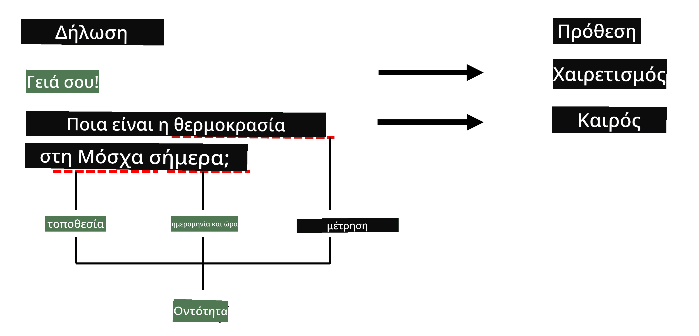

# Αναγνώριση Ονομαστικών Οντοτήτων

Μέχρι τώρα, έχουμε επικεντρωθεί κυρίως σε μία εργασία NLP - την ταξινόμηση. Ωστόσο, υπάρχουν και άλλες εργασίες NLP που μπορούν να επιτευχθούν με νευρωνικά δίκτυα. Μία από αυτές τις εργασίες είναι η **[Αναγνώριση Ονομαστικών Οντοτήτων](https://wikipedia.org/wiki/Named-entity_recognition)** (NER), η οποία ασχολείται με την αναγνώριση συγκεκριμένων οντοτήτων μέσα σε κείμενο, όπως τοποθεσίες, ονόματα προσώπων, χρονικά διαστήματα, χημικές φόρμουλες και άλλα.

## [Προ-διάλεξης κουίζ](https://ff-quizzes.netlify.app/en/ai/quiz/37)

## Παράδειγμα Χρήσης NER

Ας υποθέσουμε ότι θέλετε να αναπτύξετε ένα chatbot φυσικής γλώσσας, παρόμοιο με το Amazon Alexa ή το Google Assistant. Ο τρόπος που λειτουργούν τα έξυπνα chatbots είναι να *κατανοούν* τι θέλει ο χρήστης, κάνοντας ταξινόμηση κειμένου στη φράση εισόδου. Το αποτέλεσμα αυτής της ταξινόμησης είναι η λεγόμενη **πρόθεση**, η οποία καθορίζει τι πρέπει να κάνει το chatbot.

> Εικόνα από τον συγγραφέα

Ωστόσο, ο χρήστης μπορεί να παρέχει κάποιες παραμέτρους ως μέρος της φράσης. Για παράδειγμα, όταν ζητάει τον καιρό, μπορεί να καθορίσει μια τοποθεσία ή μια ημερομηνία. Το bot πρέπει να είναι σε θέση να κατανοήσει αυτές τις οντότητες και να συμπληρώσει τα πεδία παραμέτρων ανάλογα πριν εκτελέσει τη δράση. Εδώ ακριβώς έρχεται η NER.

> ✅ Ένα άλλο παράδειγμα θα μπορούσε να είναι [η ανάλυση επιστημονικών ιατρικών άρθρων](https://soshnikov.com/science/analyzing-medical-papers-with-azure-and-text-analytics-for-health/). Ένα από τα κύρια πράγματα που πρέπει να αναζητήσουμε είναι συγκεκριμένοι ιατρικοί όροι, όπως ασθένειες και ιατρικές ουσίες. Ενώ ένας μικρός αριθμός ασθενειών μπορεί πιθανώς να εξαχθεί με αναζήτηση υποσυμβολοσειρών, πιο σύνθετες οντότητες, όπως χημικές ενώσεις και ονόματα φαρμάκων, χρειάζονται μια πιο σύνθετη προσέγγιση.

## NER ως Ταξινόμηση Συμβόλων

Τα μοντέλα NER είναι ουσιαστικά **μοντέλα ταξινόμησης συμβόλων**, επειδή για κάθε ένα από τα σύμβολα εισόδου πρέπει να αποφασίσουμε αν ανήκει σε μια οντότητα ή όχι, και αν ανήκει - σε ποια κατηγορία οντότητας.

Ας δούμε τον παρακάτω τίτλο άρθρου:

**Tricuspid valve regurgitation** και **lithium carbonate** **toxicity** σε νεογέννητο βρέφος.

Οι οντότητες εδώ είναι:

* Το Tricuspid valve regurgitation είναι ασθένεια (`DIS`)
* Το Lithium carbonate είναι χημική ουσία (`CHEM`)
* Το Toxicity είναι επίσης ασθένεια (`DIS`)

Παρατηρήστε ότι μία οντότητα μπορεί να εκτείνεται σε πολλά σύμβολα. Και, όπως σε αυτή την περίπτωση, πρέπει να διακρίνουμε μεταξύ δύο συνεχόμενων οντοτήτων. Έτσι, είναι συνηθισμένο να χρησιμοποιούμε δύο κατηγορίες για κάθε οντότητα - μία που καθορίζει το πρώτο σύμβολο της οντότητας (συχνά χρησιμοποιείται το πρόθεμα `B-`, για **αρχή**), και μία άλλη για τη συνέχεια της οντότητας (`I-`, για **εσωτερικό σύμβολο**). Χρησιμοποιούμε επίσης το `O` ως κατηγορία για να εκπροσωπήσουμε όλα τα **άλλα** σύμβολα. Αυτή η επισήμανση συμβόλων ονομάζεται [BIO tagging](https://en.wikipedia.org/wiki/Inside%E2%80%93outside%E2%80%93beginning_(tagging)) (ή IOB). Όταν επισημανθεί, ο τίτλος μας θα μοιάζει με αυτό:

Σύμβολο | Ετικέτα
--------|--------
Tricuspid | B-DIS
valve | I-DIS
regurgitation | I-DIS
and | O
lithium | B-CHEM
carbonate | I-CHEM
toxicity | B-DIS
in | O
a | O
newborn | O
infant | O
. | O

Επειδή πρέπει να δημιουργήσουμε μια αντιστοιχία ένα προς ένα μεταξύ συμβόλων και κατηγοριών, μπορούμε να εκπαιδεύσουμε ένα δεξιότερο **πολλά-προς-πολλά** μοντέλο νευρωνικού δικτύου από αυτή την εικόνα:

> *Εικόνα από [αυτό το άρθρο](http://karpathy.github.io/2015/05/21/rnn-effectiveness/) του [Andrej Karpathy](http://karpathy.github.io/). Τα μοντέλα ταξινόμησης συμβόλων NER αντιστοιχούν στην αρχιτεκτονική του δικτύου που βρίσκεται δεξιά στην εικόνα.*

## Εκπαίδευση Μοντέλων NER

Επειδή ένα μοντέλο NER είναι ουσιαστικά ένα μοντέλο ταξινόμησης συμβόλων, μπορούμε να χρησιμοποιήσουμε RNNs που ήδη γνωρίζουμε για αυτή την εργασία. Σε αυτή την περίπτωση, κάθε μπλοκ του επαναλαμβανόμενου δικτύου θα επιστρέφει το ID του συμβόλου. Το παρακάτω παράδειγμα notebook δείχνει πώς να εκπαιδεύσετε ένα LSTM για ταξινόμηση συμβόλων.

## ✍️ Παράδειγμα Notebooks: NER

Συνεχίστε τη μάθησή σας στο παρακάτω notebook:

* [NER με TensorFlow](NER-TF.ipynb)

## Συμπέρασμα

Ένα μοντέλο NER είναι ένα **μοντέλο ταξινόμησης συμβόλων**, που σημαίνει ότι μπορεί να χρησιμοποιηθεί για την εκτέλεση ταξινόμησης συμβόλων. Αυτή είναι μια πολύ κοινή εργασία στο NLP, βοηθώντας στην αναγνώριση συγκεκριμένων οντοτήτων μέσα σε κείμενο, όπως τοποθεσίες, ονόματα, ημερομηνίες και άλλα.

## 🚀 Πρόκληση

Ολοκληρώστε την εργασία που συνδέεται παρακάτω για να εκπαιδεύσετε ένα μοντέλο αναγνώρισης ονομαστικών οντοτήτων για ιατρικούς όρους και δοκιμάστε το σε διαφορετικό σύνολο δεδομένων.

## [Μετα-διάλεξης κουίζ](https://ff-quizzes.netlify.app/en/ai/quiz/38)

## Ανασκόπηση & Αυτοδιδασκαλία

Διαβάστε το άρθρο [The Unreasonable Effectiveness of Recurrent Neural Networks](http://karpathy.github.io/2015/05/21/rnn-effectiveness/) και ακολουθήστε την ενότητα Περαιτέρω Ανάγνωση σε αυτό το άρθρο για να εμβαθύνετε τις γνώσεις σας.

## [Εργασία](lab/README.md)

Στην εργασία αυτής της ενότητας, θα πρέπει να εκπαιδεύσετε ένα μοντέλο αναγνώρισης ιατρικών οντοτήτων. Μπορείτε να ξεκινήσετε με την εκπαίδευση ενός μοντέλου LSTM όπως περιγράφεται σε αυτή την ενότητα και να προχωρήσετε στη χρήση του μοντέλου BERT transformer. Διαβάστε [τις οδηγίες](lab/README.md) για να λάβετε όλες τις λεπτομέρειες.

---

